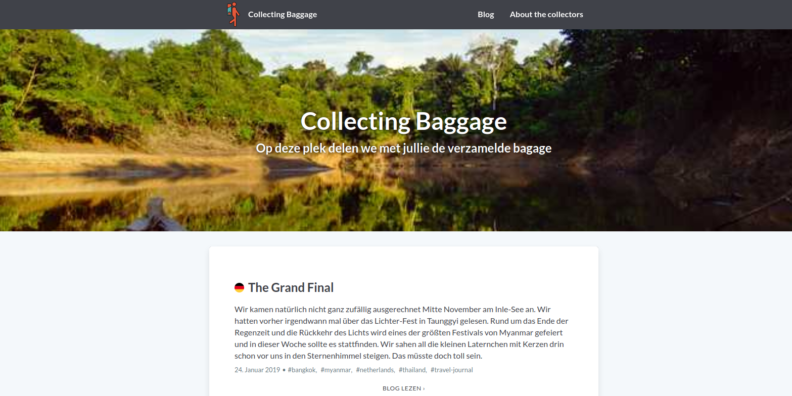

[](https://app.netlify.com/sites/collectingbaggage/deploys)


# collecting baggage blog
[Website](https://collectingbaggage.netlify.app)

The content was previously published on https://www.collectingbaggage.nl.

This blog is based on the gatsby starter [Morning Dew](https://github.com/maxpou/gatsby-starter-morning-dew).





## Installation

* with Gatsby-cli: 
  
```bash
npm install --global gatsby-cli
gatsby new gatsby-blog https://github.com/collectingbaggage/gatsby-multi.git
```

* without Gatsby-cli

```bash
git clone my-site git@github.com:collectingbaggage/gatsby-multi.git
cd my-site
npm install
```

Then run `gatsby develop` or `npm run develop` to try it locally.
