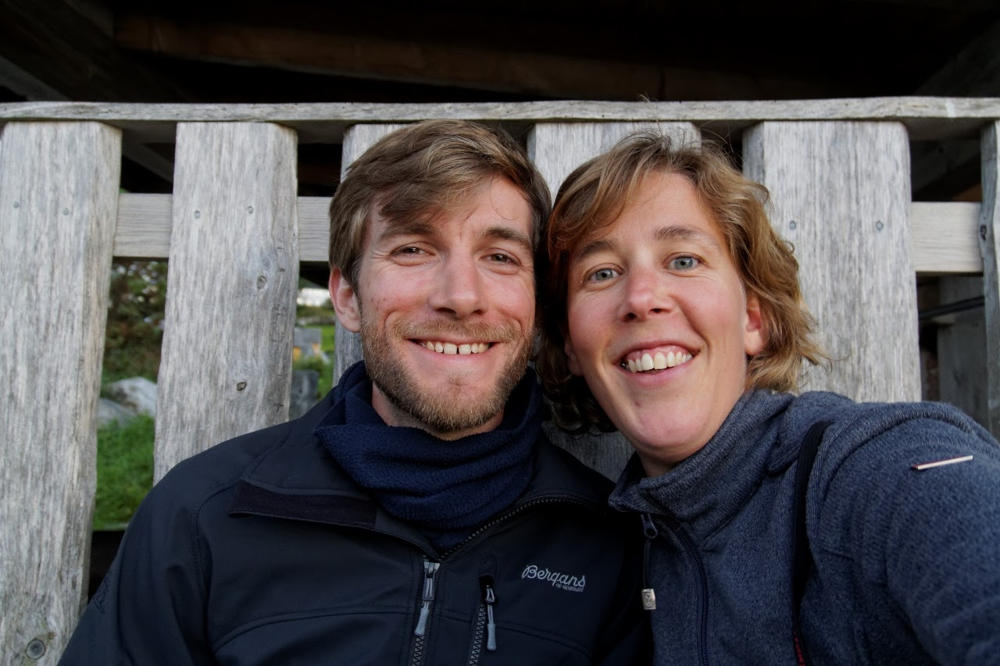

Vancouver airport, bagageband 10, september 2012: na een urenlange vlucht trekt Freke haar backpack van de band en zet hem met een plof naast de groene backpack van, op het oog, ook een soloreiziger. Malte is eigenlijk nog te moe voor enige zinnige conversatie, maar goed. Hij wil best de volgende dag afspreken in Downtown Vancouver voor een rondje door de stad.

Wat toen als soloreis begon is dat nooit echt geworden. Meer dan vijf jaar later zijn we nog steeds samen. We raakten verslaafd aan het verzamelen van bagage, in de vorm van herinneringen, ervaringen en een enkele souvenir. In december 2017 barstte onze grootste verzamelwoede tot nu toe los: een wereldreis langs Zuid-Amerika, Australië en Zuidoost-Azië.

---

Flughafen Vancouver, Gepäckband 10, September 2012: nach einem stundenlangen Flug über den Atlantik hievt Freke ihren Rucksack vom Band und setzt ihn geschmeidig neben den grünen Rucksack von einem dem Anschein nach anderen Alleinreisenden. Malte ist zwar eigentlich viel zu müde für ein anregendes Gespräch, aber naja. Er lässt sich dann doch gerne dazu überreden, um sich am nächsten Morgen zu einer Erkundungstour durch Downtown Vancouver zu verabreden.

Was damals als Alleinreise anfing, ist nie eine solche geworden. Mehr als fünf Jahre danach sind wir immer noch zusammen. Wir sind der Sucht verfallen, um stets mehr Gepäck zu versammeln — Gepäck in Form von Erinnerungen, Erfahrungen und dem ein oder anderen Souvenir. Im Dezember 2017 begann dann unsere bis dahin größte Sammelwut: Eine Weltreise durch Südamerika, Australien und Südostasien.

