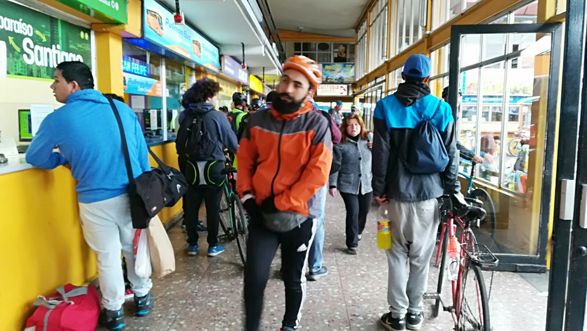

Der Wurstfachverkäufer beim Schlachter schaut uns skeptisch an. Er hält das kleine Beutelchen mit Hackfleisch in die Luft. „Wirklich nur 150 Gramm? Seid ihr sicher?“. Ja, wir sind uns sicher. Wir laufen nach draußen, aber natürlich nicht ohne unser „boleta“.

Wir befinden uns in Chile und unser Schlachtereierlebnis fasst gleich zwei wichtige Bräuche des Landes zusammen. Chile ist ein Fleischland. Wer zu wenig Hackfleisch kauft, wird zurecht schräg angeschaut. Und man verlässt einen Laden niemals, aber auch wirklich niemals, ohne einen handschriftlich geschriebenen Bon („boleta“ ist jetzt schon eins der wichtigsten spanischen Wörtern, die wir bisher gelernt haben). Beim Bäcker nebenan wurde es noch verrückter: man bestellt ein Brötchen, die Verkäuferin schreibt den Preis sorgfältig auf den Bon, welchen man zum Kassierer in der Ecke trägt, bezahlt, zurück läuft zur Verkäuferin und endlich sein Brötchen ausgehändigt bekommt. Natürlich muss man einen der zwei Bons mitnehmen. Ob man sich jetzt zum Abholen auch wieder in der Schlange anstellen muss, müssen wir noch herausfinden.

Das Flugzeug vom letzten Beitrag hat uns tatsächlich sicher nach Santiago gebracht (übrigens ein ziemlich langweiliger, langer Flug… das spektakulärste waren die Fenster, dessen Gläser sich elektrisch verdunkeln lassen). Wir sind gleich mit dem Bus weiter gefahren nach Valparaíso, eine Stadt mit geschätzten 400.000 Einwohnern ungefähr eineinhalb Stunden von Santiago entfernt. Zu Zeiten des kalifornischen Goldrauschs war Valparaíso eine bedeutende Hafenstadt, aber durch die Eröffnung des Panamakanals und dem ein oder anderen Erdbeben, sieht sie heute doch etwas zerfallen aus. Der Bettler, der vor unserem Stadtrundgang noch eben guckt, ob er sich von den reichen Touristen nicht noch sein Abendbrot erbetteln kann, daran aber scheitert, bestätigt das Bild: kurzerhand liegt alle Kleidung auf dem Boden. Der nun nackte Bettler probiert‘s nochmal, aber die Chilenische Polizei findet das dann auch nicht mehr so witzig.

Nagut, Valparaíso ist also ein wenig harsch, ist aber vor allem bekannt für die hübschen Graffiti und Mauergemälde. Diese sind auf vielen Gebäuden zu finden, nicht nur auf alten, zerfallenen, aber auch auf Hotels und Privathäusern (dann meistens als Auftragsarbeit). Einige Gebäude sind eigentlich nicht viel mehr als Ruinen, dadurch unbewohnbar und hässlich, was netterweise durch die UNESCO instand gehalten wird. Leider werden nicht die Gebäude instand gehalten, sondern der Zustand in dem sie sich nun befinden. Durch die strengen Richtlinien, die man als Kulturerbe erbt, ist es den meisten Besitzern dieser Häuser unmöglich sie zu renovieren. Es fehlt einfach am Geld, um die ursprünglichen Materialien zu benutzen, welche dann nebenbei auch noch nicht mal erdbebensicher wären. So viel zum Thema Denkmalschutz...

Nichtsdestotrotz gefällt uns die Mischung aus hübsch und hässlich prima. Ein ehemaliger Einwohner von Valparaíso dachte wohl ähnlich hierüber. Der berühmte Dichter und Politiker Pablo Neruda baute hier eines seiner drei Häuser und sammelte da unter anderem ein Karussellpferd, baute seine eigene Bar und sorgte dafür, dass er von seinem Arbeitszimmer aus, die komplette Stadt übersehen konnte. Ein extravaganter Kerl, so unsere Schlussfolgerung, für den jeden Tag ein Festtag war (sprichwörtlich und wortwörtlich).

Im Hostel war auch Fiesta. Die etwas jüngeren Hostelgäste konnten das etwas besser als wir. Aber wir hatten trotzdem unseren Spaß mit Bierchen auf der Dachterrasse zwischen den „gemäßigteren“ Reisenden. Wir sind überrascht, wie viele Nationalitäten wir bisher entgegengekommen sind. Viel diverser als auf anderen Reisen. Also nicht nur Deutsche, Holländer und Franzosen, sondern auch Italiener, Amerikaner, Chilenen und Argentinier. Ab und zu können wir uns in spanischer Konversation üben, aber das chilenische Spanisch kommt uns häufig noch Spanisch vor. Die Chilenen sind Künstler im nuscheln, Konsonanten verschlucken und schnell sprechen. Freke hat am Schalter an der Busstation ihr bestes gegeben, um zu erklären, dass wir unser Ticket umtauschen wollten für einen früheren Bus. Der Mann hinter der Glasscheibe grinste uns ungefähr zwei Minuten lang an, bevor er uns wissen ließ, dass er eigentlich auch ziemlich gut Englisch sprach.

Unser Busticket wollten wir übrigens umtauschen, weil die Autobahn nach Santiago komplett gesperrt war und wir doch ganz gerne rechtzeitig für unseren Flug nach Punta Arenas am Flughafen sein wollten. Die Autobahn wird jedes Jahr am 8. Dezember durch hunderte oder vielleicht tausende Fahrradfahrer bevölkert, die zu Ehren der unbefleckten Empfängnis Marias zwischen Santiago und Valparaíso pilgern. Wir zweifeln allerdings an der religiösen Motivation der meisten Fahrradfahrer und glauben, dass sie eher die Chance für eine schöne Fahrradtour an diesem Feiertag ergreifen. Dennoch dachten wir, dass wir das auch können. Samstag, inzwischen in Punta Arenas angekommen, liehen wir uns Fahrräder aus, um Richtung „Reserva Forestal Magallanes“ zu fahren – ein kleines Naturreservat 9km von der Stadt, 9km bergauf wohlgemerkt. Freke bereute unsere Entscheidung ziemlich schnell; der Rückweg war deutlich angenehmer und schneller. Wo ist das E-Bike, wenn man es mal braucht?

Im Reservat selbst wanderten wir zu einem Aussichtspunkt oben auf dem Berg, der uns den Hinweg vergessen ließ. Zur Belohnung gab es die Aussicht auf Punta Arenas, die Gewässer der Magellanstraße und das dahinter liegende Feuerland. „It is the end of the world as we know it“, denn jenseits der Hügel am Horizont liegt nur noch das kalte Eis der Antarktis. Okay, wir schummeln hier ein bisschen: Dazwischen liegen noch ein paar Inseln, aber das Festland hört hier wirklich auf. Echt jetzt.

