De man die deze donderdag het vlees verkoopt, kijkt ons sceptisch aan. Hij houdt een klein zakje gehakt omhoog. Slechts 150 gram, weten we het zeker? Ja, we weten het zeker. We lopen de winkel uit, uiteraard niet zonder onze ‘boleta’.

\[caption id="attachment\_142" align="alignleft" width="217"\] La boleta\[/caption\]

We zijn in Chili en deze slagerij vat twee belangrijke zaken van dit land al goed samen. Het is een vleesland, dus wie weinig gehakt koopt, wordt vreemd aangekeken. En je zult nooit of te nimmer een winkel verlaten zonder je handgeschreven bonnetje (boleta is al een van de belangrijkste Spaanse woorden die we hier tot nu toe geleerd hebben).

In een bakkerij beleefden we ons voorlopige hoogtepunt: je bestelt er je broodjes, ze schrijven dat op een bonnetje, dat moet je zelf bij een kassahokje afgeven om te betalen, waarna je met twee bonnetjes terugkomt bij de dame bij wie je oorspronkelijk al je broodjes had besteld. Dan krijg je je broodjes, en uiteraard moet je een van die twee boleta’s houden.

Het vliegtuig dat jullie in het vorige blog konden zien, heeft ons inderdaad veilig naar Santiago gebracht. Het was een lange, saaie vlucht waar we zoveel mogelijk geslapen hebben. Het spectaculairste was het raam, die elektrisch verduisterd konden worden.

We zijn meteen doorgereisd naar Valparaíso, een stad van zo’n 400.000 inwoners op anderhalf uur rijden van Santiago. Een belangrijke havenstad in de tijd van de Californische goudkoorts, maar na de opening van het Panamakanaal en een heftige aardbeving of twee in verval geraakt. Een bedelaar, die vlak voor onze stadswandeling nog even probeert zijn avondeten bij de rijke toeristen samen te bedelen maar daarin faalt, bevestigt het beeld: in een ommezien ligt er een hoopje kleren op de grond. De nu naakte bedelaar probeert het nogmaals, maar de Chileense politie vindt het dan ook niet grappig meer.

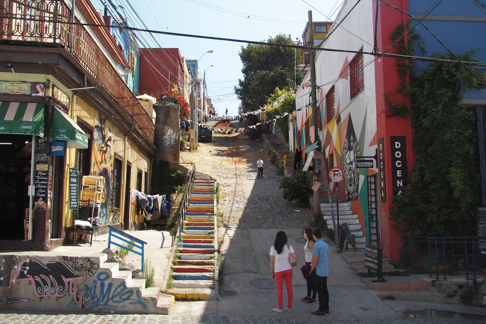

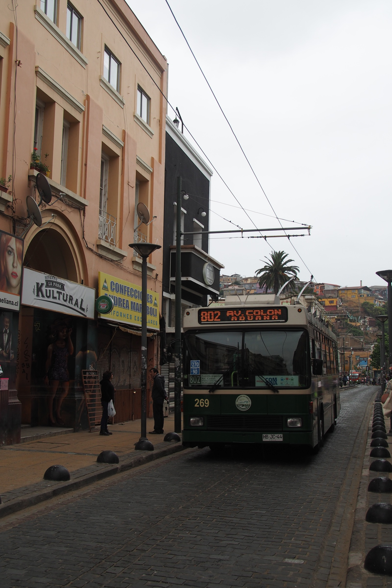
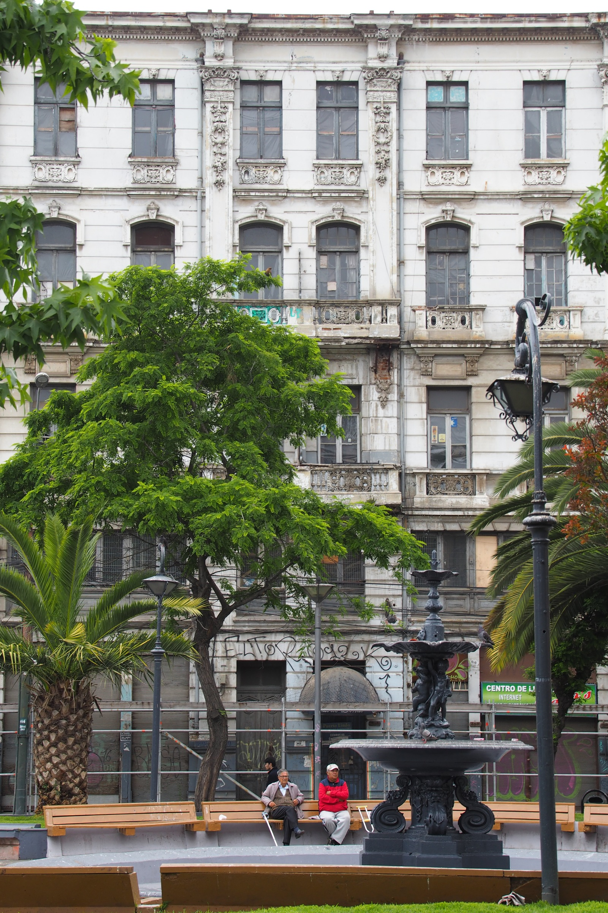
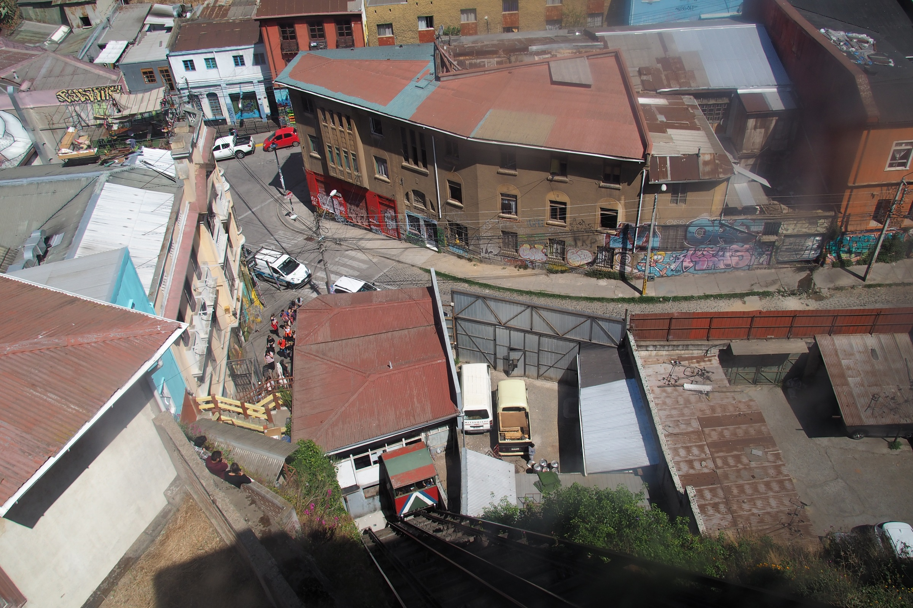

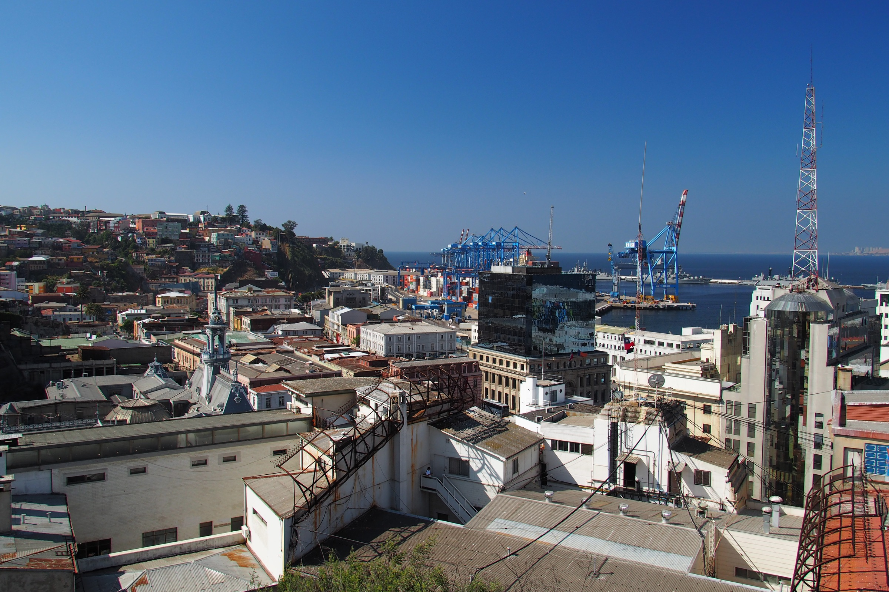

Valparaíso heeft dus een rauw randje, maar is vooral bekend van z’n mooie muurschilderingen. Die zijn op veel gebouwen te vinden, niet alleen op oude, vervallen panden maar ook op hotels en privéhuizen (meestal in opdracht). Relatief veel gebouwen zijn eigenlijk niet veel meer dan ruïnes en daardoor onbewoonbaar en lelijk, en dat wordt ironisch genoeg door de UNESCO zo in stand gehouden. Door de strenge richtlijnen voor cultureel erfgoed is het voor de meeste huizenbezitters onmogelijk hun woning te renoveren. Er is gewoon geen geld om de oorspronkelijke materialen te hergebruiken, wat bovendien niet eens aardbevingbestendig zou zijn.

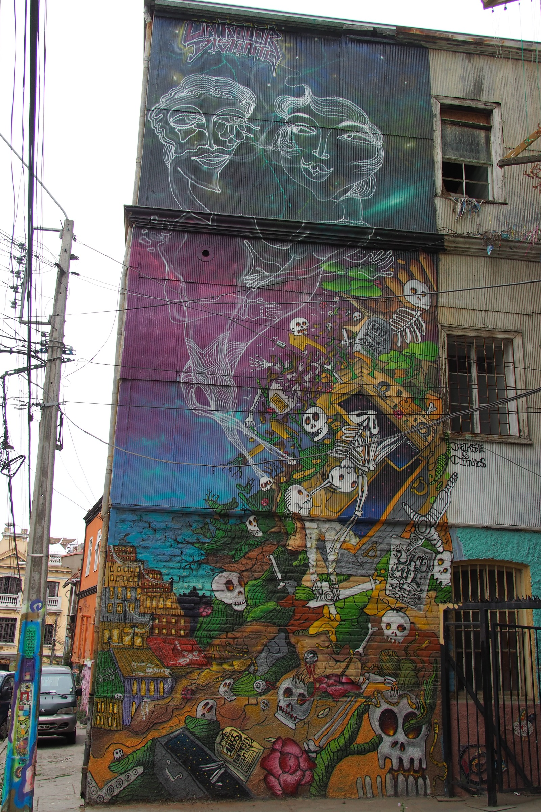

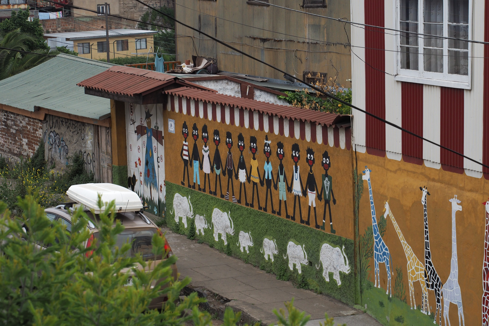

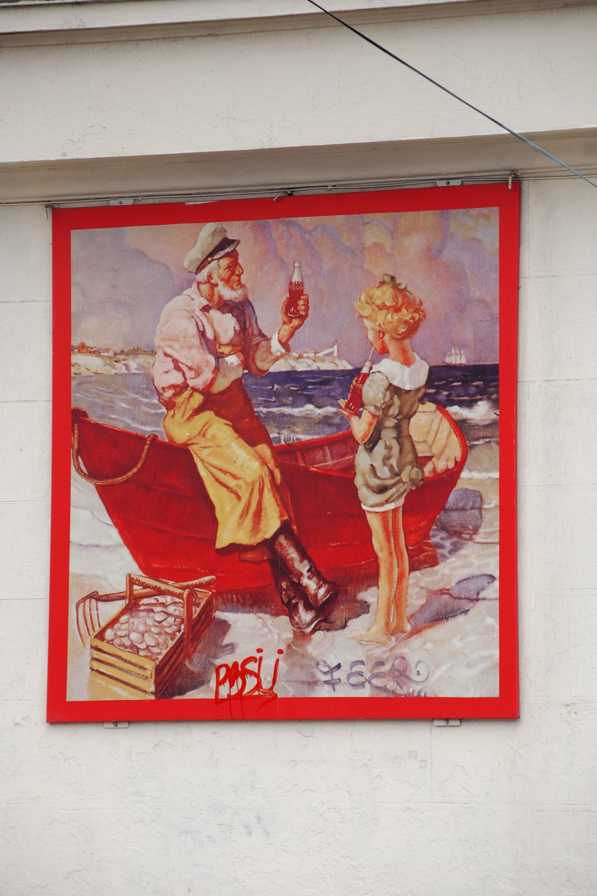

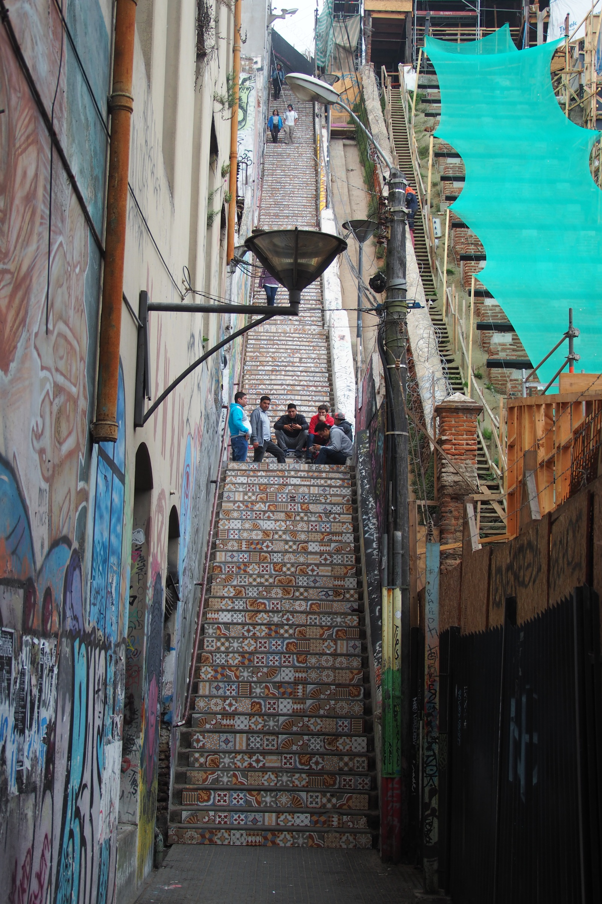

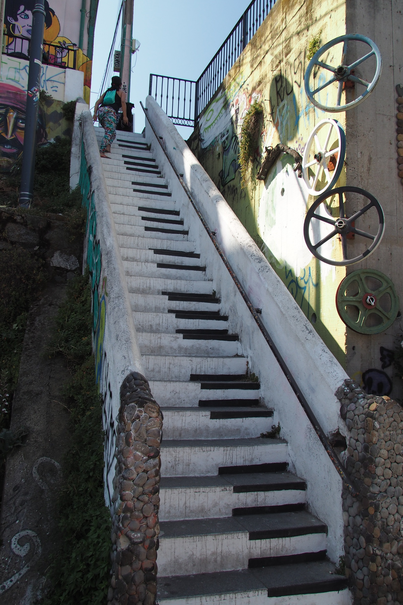

De stad, met dus een mooi en een lelijk gezicht, bevalt ons echter prima. Een oud-inwoner van Valparaíso dacht er hetzelfde over. De beroemde dichter en politicus Pablo Neruda bouwde hier een van zijn drie huizen en verzamelde daar onder meer een draaimolen-paard, installeerde er z’n eigen bar en zorgde ervoor dat hij vanuit zijn schrijfkamer de hele stad kon overzien. Een extravagante kerel, concludeerden wij, die er elke dag een feestje van maakte (letterlijk en figuurlijk).

In het hostel maakten wij er ook een bescheiden feestje van. Sommige jongere hostelgasten waren daar beter in, in de klassieke betekenis van een feestje bouwen dan. Maar wij vermaakten ons ook prima op onze eigen manier: met een biertje op het dakterras en gezellige medereizigers. Het verrast ons hoeveel nationaliteiten we ondertussen zijn tegengekomen. Voor een keer niet alleen Duitsers, Nederlanders en Engelsen, maar ook Italianen, Amerikanen, Chilenen en Argentijnen.

Af en toe oefenen we ons Spaans, maar het is nog worstelen met de Chilenen, die erom bekend staan de Spaanse taal het meest te verhaspelen en het snelst te praten. Freke deed nog wel zo haar best aan de balie van het busstation om een reeds gekocht ticket toch om te ruilen voor een vroegere bus, tot de man achter het glas na een minuut of twee hakkelen met een minzame grijns liet weten dat hij ook best Engels kon.

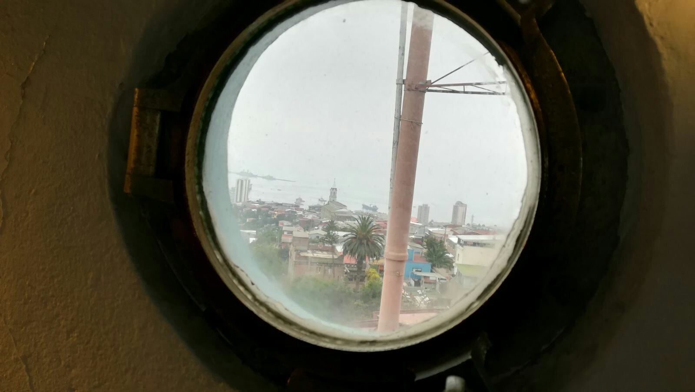

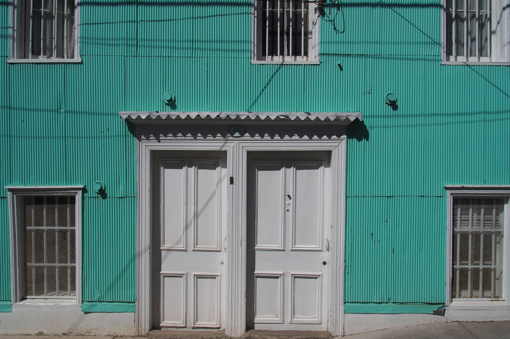

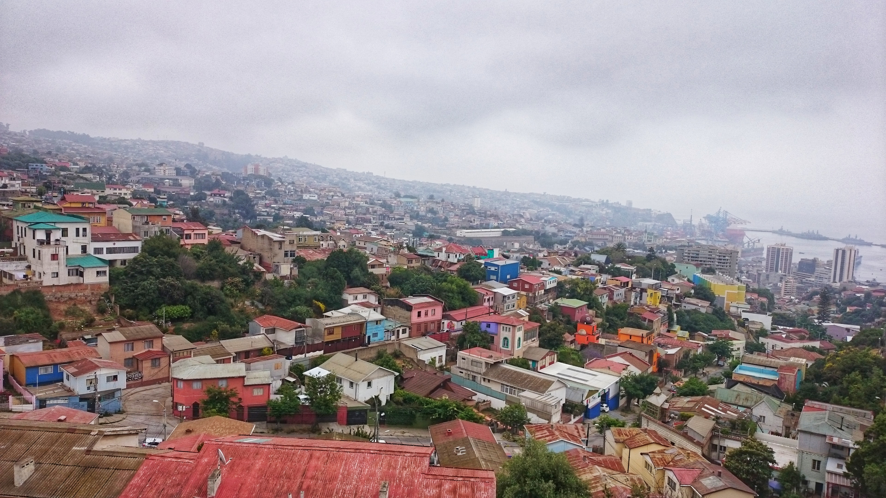

Dat busticket moest overigens geruild worden, want we wilden, ondanks dat de snelweg naar Santiago geheel gesloten was, toch graag op tijd zijn voor onze vlucht naar Punta Arenas (Patagonië). De snelweg was vrijdag 8 december het domein van honderden, misschien wel duizenden fietsers, op pelgrimstocht ter ere van de onbevlekte ontvangenis door Maria. Althans… We twijfelden enigszins aan de hoeveelheid mensen die daadwerkelijk om religieuze redenen op pad gingen of gewoon profiteerden van een kans om een mooie fietstocht op de snelweg te maken.

En toch, wij dachten, dat kunnen wij ook. Op zaterdag, inmiddels in Punta Arenas, huurden wij een fiets om richting het Reserva Forestal Magallanes te gaan, een klein natuurreservaat zo’n 9 kilometer bergop. Freke had er al snel spijt van: de terugweg was duidelijk leuker. Waar is de elektrische fiets als je hem nodig hebt?

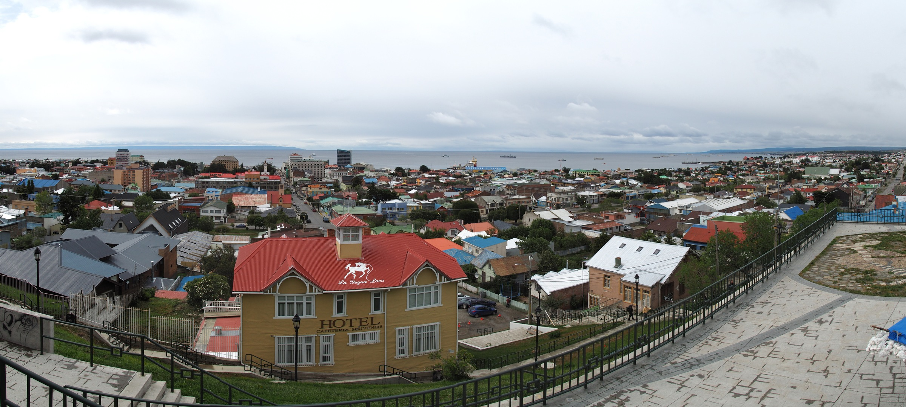

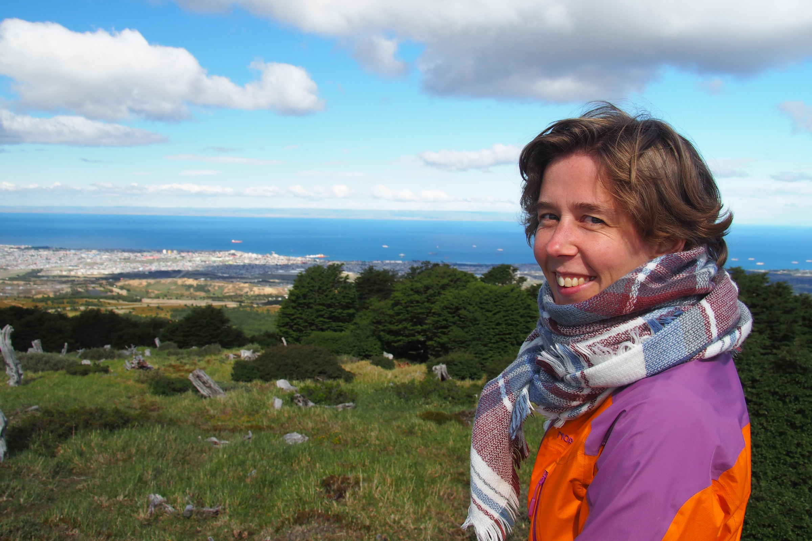

In het bos wandelden we naar een prachtig uitzichtpunt dat veel goed maakte. Het keek uit over Punta Arenas, het water van de Straat Magellaan, en Vuurland wat erachter ligt. It is the end of the world as we know it, want daarachter rest slechts ijs op Antarctica (oke, we smokkelen een beetje, want er liggen nog heel wat eilanden tussen. Maar het vasteland eindigt toch echt hier. Heus).

\[caption id="attachment\_187" align="aligncenter" width="900"\] Punta Arenas and the Magellan Street\[/caption\]
