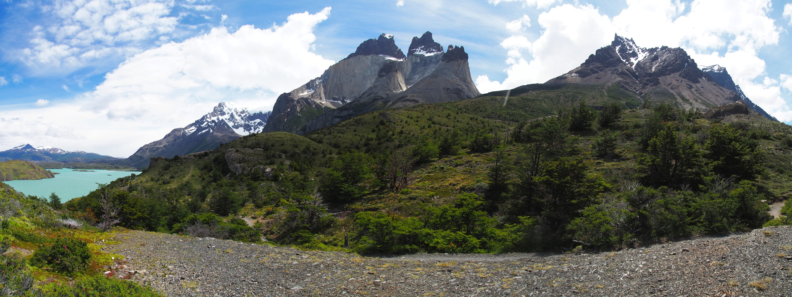

Der Wecker geht an diesem Morgen schon um sechs Uhr. Wir wollen den frühen Bus zum Torres del Paine Nationalpark nehmen. Hier werden wir drei Tage lang einen Teil des „W“ wandern, einer beliebten Mehrtageswanderroute quer durch den Park. Leider müssen wir uns auf einen Teil des Ws beschränken, da wegen der Beliebtheit (und der derzeitigen Hochsaison) beinahe keine Übernachtungsplätze mehr zu kriegen sind. Den linken Abschnitt des Ws lassen wir also weg und laufen stattdessen ein „µ“.

An der Busstation herrscht ein wenig Chaos. Unsere Busgesellschaft hat mehrere Busse. Wer mit großem Rucksack kommt, muss in den großen Bus. Tagesgepäck in den kleinen. Einfacher gesagt als getan. Nach ein bisschen hin und her sitzen wir am Ende im großen Bus. Mit Tagesrucksack. Auch gut, weil der fährt zuerst los.

Nach eineinhalb Stunden Fahrt durch die Pampa entlang Herden von Guanacos kommen wir beim Parkeingang an. Hier muss sich jeder registrieren und Eintritt bezahlen. Hatten wir schon erwähnt, dass Hochsaison ist? Zusammen mit den Wanderern der anderen zehn Turibussen stellen wir uns brav in der enormen Schlange vor dem Häuschen an. Das dauert hier jetzt also erst mal ein bisschen, aber die Sonne scheint. Es dauert vor allem so lange, weil alle zum Schutz der Natur einen Informationsfilm gucken müssen, der erklärt, dass man den Wald nicht in Brand stecken darf. Nachdem wir bezahlt haben mogeln wir uns heimlich in die Schlange, die den Film schon geschaut hat. Fünf Minuten kostbare Lebenszeit gespart… Mit dem Shuttle-Bus geht‘s weiter zum Anfangspunkt der Wanderung.

\[caption id="attachment\_207" align="aligncenter" width="300"\] En route in Torres del Paine\[/caption\]

Am ersten Tag gleich das Highlight des Parks: Los Torres. Nach etwa dreieinhalb Stunden bergauf erreichen wir den kleinen Gletschersee, umringt von stachligen, beinahe senkrechten Gipfeln. Wir haben Glück mit dem Wetter. Die Sonne scheint, es sind beinahe keine Wolken zu sehen und so können wir auch tatsächlich alle Gipfel sehen. Oben liegt noch ein bisschen Schnee, der Wind ist eisig, aber der Anblick großartig.

\[caption id="attachment\_208" align="aligncenter" width="900"\] Las torres\[/caption\]

Weil wir den Aufstieg zum Torres doch gut machbar fanden, beschlossen wir am nächsten Morgen früh aufzustehen, um dort den Sonnenaufgang zu erleben. Um 3 Uhr nachts klingelt der Wecker und wir hoffen heimlich, dass es bewölkt ist und wir weiter schlafen können. Der Himmel ist sternenklar. Schade... Aufstehen, Müsliriegel, Zähne putzen und los. Mit der Stirnlampe durch die Düsternis. Wir kennen den Weg vom Vortag und so erreichen wir den See im Rekordtempo nach eineinhalb Stunden. Hinter uns wird es schon hell. Wir verkriechen uns hinter einen Felsen, vom Wind geschützt, knabbern am Schokoriegel und warten auf die versprochenen roten Sonnenstrahlen. Es ist halb sechs, jetzt sollte die Sonne aufgehen. Das tut sie auch, aber leider hinter Wolken. Das Farbenspektakel am gegenüberliegenden Berg bleibt aus. Es wird einfach nur hell. Umsonst gequält… Trotzallem ist der Anblick ist wundervoll.

Der zweite Tag erweist sich als anstrengender als gedacht. Der wenige Schlaf und die frühzeitige Wandertour zollen ihren Tribut. Der Weg führt entlang des türkisen Lago Nordenskjöla durch Heidefelder. Es ist etwas bewölkter als gestern und die meisten Gipfel sind in Wolken gehüllt. Zwischendurch scheint die Sonne. Am Ende des Tages frischt der Wind auf. Heftige Windböen wühlen den See auf und sprühen uns das Wasser ins Gesicht. Wir sind froh, dass wir nur einen kleinen Rucksack tragen müssen. Den ein oder anderen schwerbepackten Wanderer zwingen die Böen in die Knie oder vom Pfad ab. Am Zeltplatz angekommen, wird schnell heiß geduscht, Reispfanne gekocht und ab in die Heia.

Tag drei steht im Zeichen von Wasser. Der größte Teil kommt dieses Mal von oben. Im sanften Regen laufen wir los. Wegen des Regens, der schweren Beine und Frekes Knieschmerzen am Vortag, hatten wir eigentlich beschlossen den anstrengenden Abstecher ins Valle Francés auszulassen. Aber bei der Abzweigung entscheiden wir uns spontan um und laufen zum ersten Aussichtspunkt. Der Weg zum zweiten war wegen des Wetters schon gesperrt. Obwohl der größte Teil der Aussicht in den Wolken verborgen bleibt, bekommen wir doch einen guten Eindruck von den umliegenden Bergen und Gletschern. Der eine, den wir sehen können, lässt auch noch von sich hören als ein großer Brocken Eis mit Krawall vom Hang donnert.

Nach ein paar weiteren Stunden – es hörte irgendwann auch wieder auf zu regnen – erreichen wir Paine Grande, der Campingplatz/Berghütte, die wir nicht buchen konnten. Von hier bringt uns der Katamaran zurück zum Ausgangspunkt, wo wir noch eine Stunde im Café auf den Bus warten. Zurück in Puerto Natales ist gerade noch genug Zeit für Instantnoodles, ein paar Knackwürstchen und eine Dusche. Geschafft.

