De wekker gaat deze dinsdagochtend al om zes uur. We willen de vroege bus naar Torres del Paine National Park nemen, waar we drie dagen lang een deel van de ,W‘ wandelen, een populaire meerdaagse wandelroute dwars door het park. We moeten ons helaas beperken tot een deel van de W, omdat er juist door die populariteit (en het hoogseizoen) bijna geen overnachtingsplekken meer te krijgen waren. Eigenlijk lopen we daarom een ‚µ‘.

Bij het busstation heerst een kleine chaos. Onze busmaatschappij heeft meerdere bussen. Wie met grote backpack komt, moet in de grote bus, diegenen met een kleine dagrugzak in de kleine bus. Makkelijker gezegd dan gedaan. Na wat getouwtrek zitten we uiteindelijk in de grote bus. Met dagrugzak. Ook goed, want die gaat als eerste weg.

Na anderhalf uur door de pampa, aangestaard door een aantal guanaco’s (een soort lama’s) langs de weg, komen we bij de parkingang aan. Hier moet iedereen zich registreren en de entree betalen. Hadden we al gezegd dat het hoogseizoen is? Samen met de wandelaars uit de andere tien tourbussen stellen we ons braaf op in de enorme rij. Het duurt vooral zo lang omdat iedereen een informatievideo moet kijken die je vertelt dat je het bos niet in brand mag steken. We smokkelen ons echter stiekem in de rij die de film al gezien heeft. Vijf minuten van kostbare levenstijd bespaard… In een shuttlebus gaat het verder naar het echte beginpunt van de wandeling.

\[caption id="attachment\_207" align="aligncenter" width="300"\][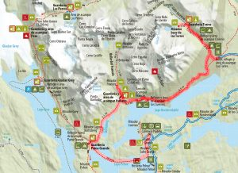](https://collectingbaggage.nl/wp-content/uploads/2017/12/map_torres.jpg) En route in Torres del Paine\[/caption\]

Op de eerste dag lopen we direct naar het hoogtepunt van het park: los Torres. Na ongeveer 3,5 uur bergop bereiken we een klein gletsjermeer, omringd door stekelijke, bijna kaarsrechte pieken. We hebben geluk met het weer. De zon schijnt, er is bijna geen wolkje aan de lucht en dus kunnen we daadwerkelijk alle pieken zien. Bovenop ligt nog een beetje sneeuw, de wind is ijskoud, maar het uitzicht geweldig.

\[caption id="attachment\_208" align="aligncenter" width="900"\]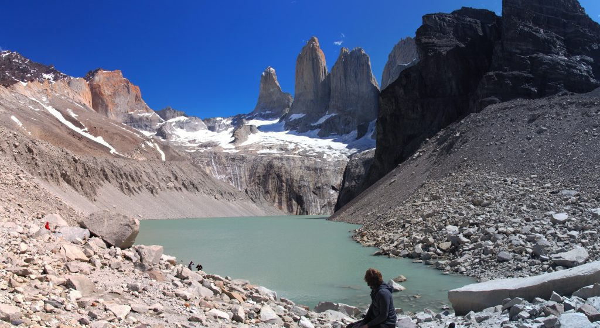 Las torres\[/caption\]

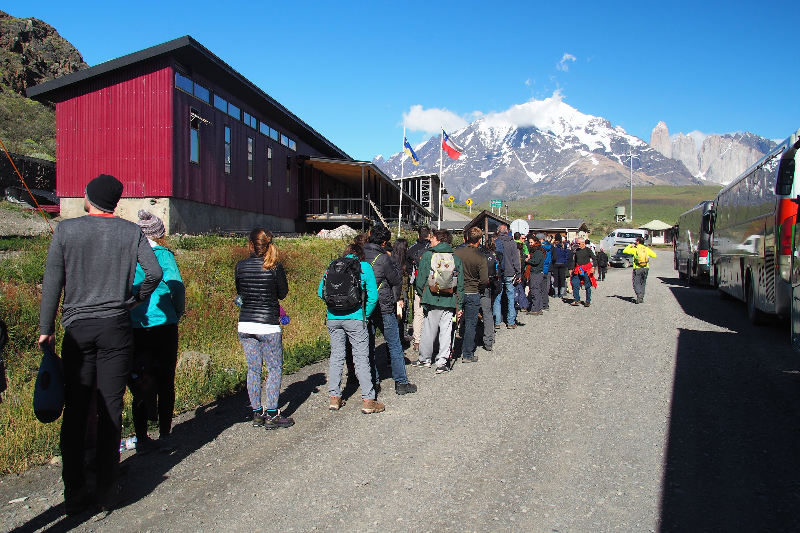
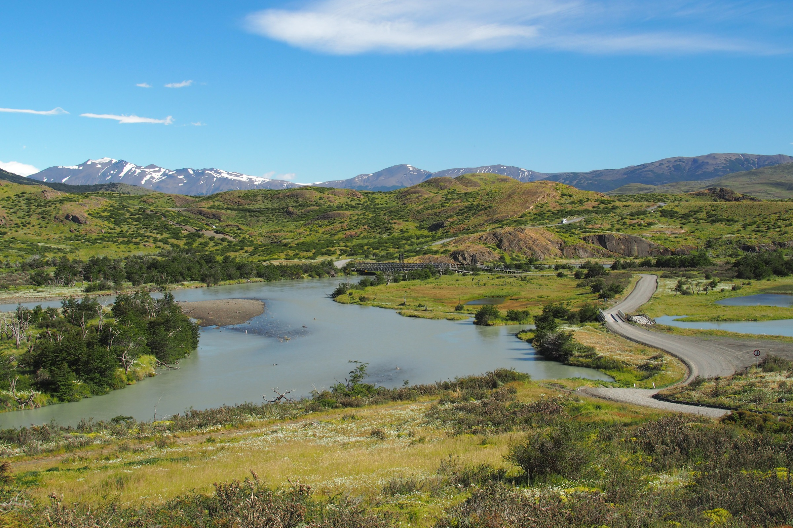
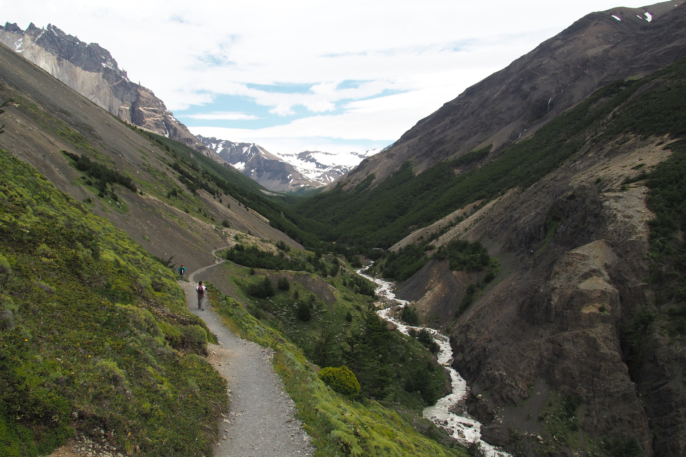
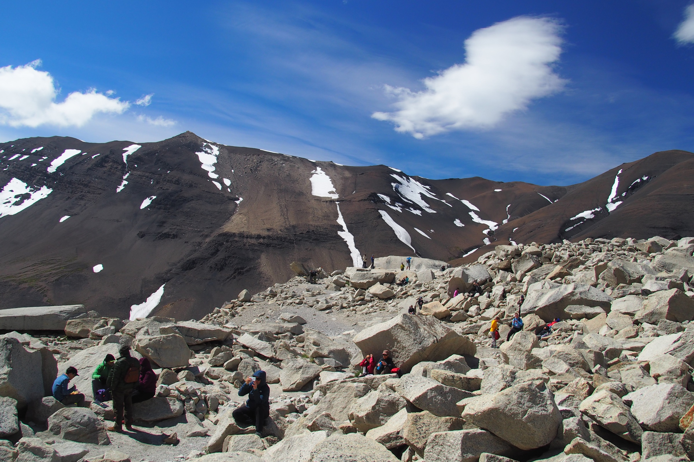

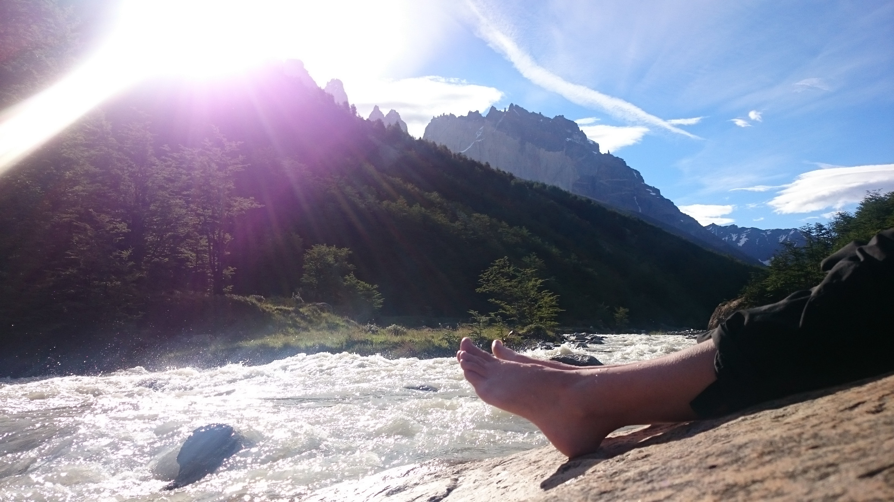
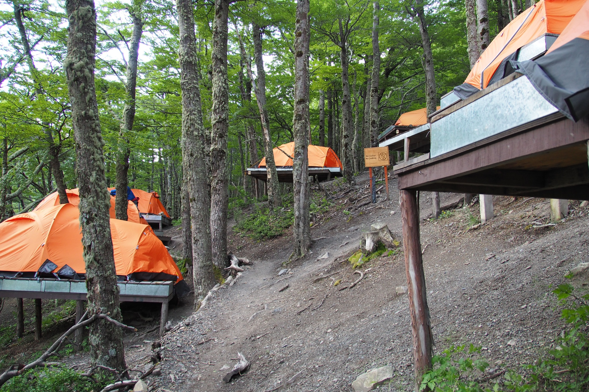

Omdat we de klim naar de Torres toch goed te doen vonden, besluiten we de volgende morgen vroeg op te staan om daar de zonsopgang te beleven. Om 3 uur gaat de wekker en stiekem hopen we dat het bewolkt is en we verder mogen slapen. Maar de sterren aan de hemel zijn goed te zien. Jammer… Toch opstaan, snel een mueslireep eten en gaan, met de koplamp op door de duisternis. We kennen de weg al van de dag ervoor en dus bereiken we de top in recordtempo na anderhalf uur. Achter ons wordt het al lichter. We kruipen achter een grote rots, uit de wind, en wachten al knabbelend op een chocoladereep op de beloofde rode zonnestralen. Het is half zes, en dus moet de zon bijna opkomen. Dat doet ze ook, maar helaas achter de wolken. Het kleurenspektakel op de tegenoverliggende berg blijft uit. We hebben onszelf tevergeefs zo gekweld door vroeg op te staan, maar het uitzicht is nog steeds mooi.

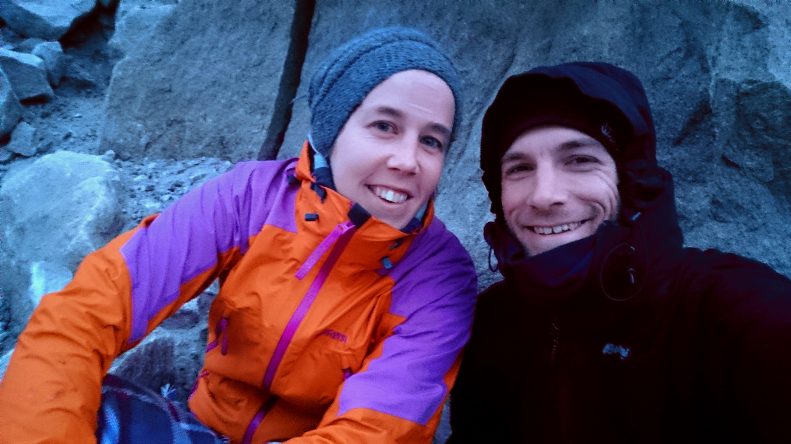

De tweede dag blijkt moeilijker dan gedacht. De weinige slaap en de wandeltocht tijdens het ochtendgloren betalen hun tol. De weg voert langs het turquoise Lago Nordenskjöla door heidevelden. Het is iets bewolkter dan gisteren en de meeste bergtoppen zijn in wolken gehuld, maar de zon schijnt tussendoor ook uitbundig. Aan het einde van de dag steekt een frisse wind op. Heftige windstoten trekken over het meer en smijten het water als een sproeidouche over ons heen. We zijn blij dat we slechts een kleine dagrugzak dragen. Een paar zwaarbepakte wandelaars voor ons worden door de windvlagen op hun knieën gedwongen of van het pad afgewaaid. Bij de camping aangekomen douchen we snel (warm!), koken we ons rijstpannetje en duiken we snel het bed in.

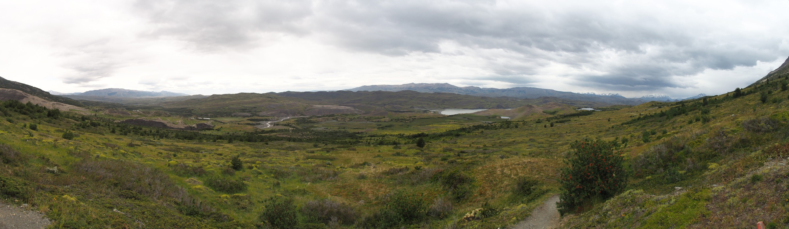

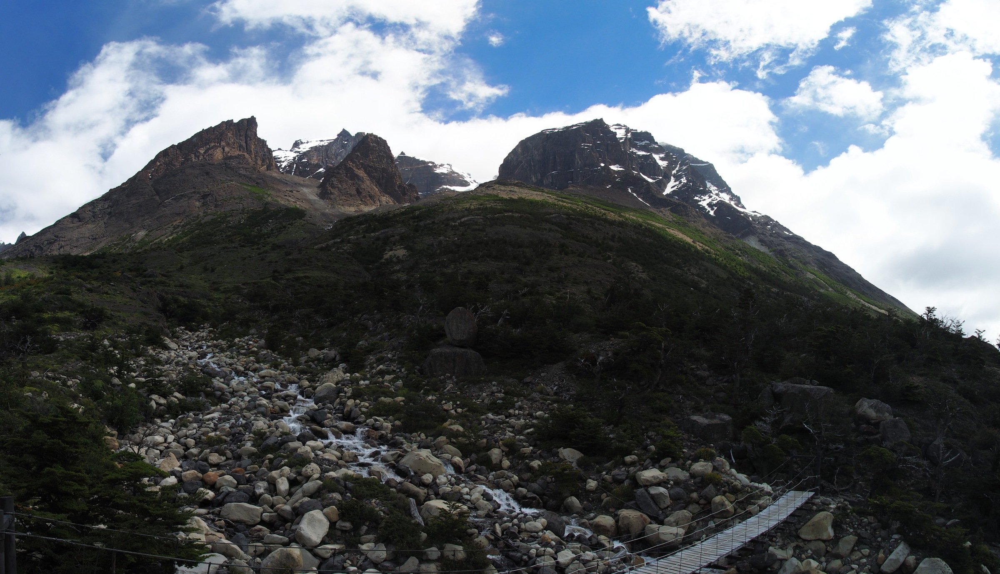

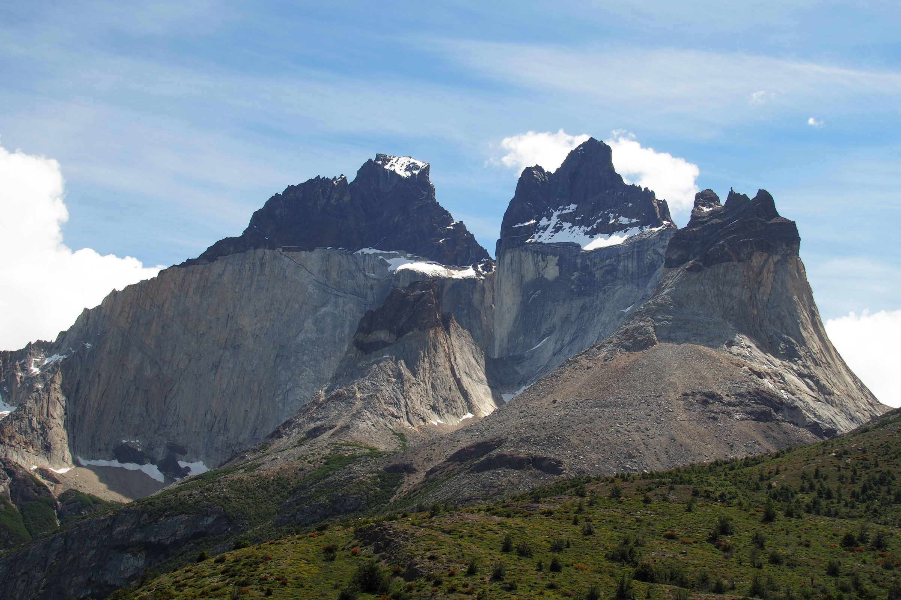
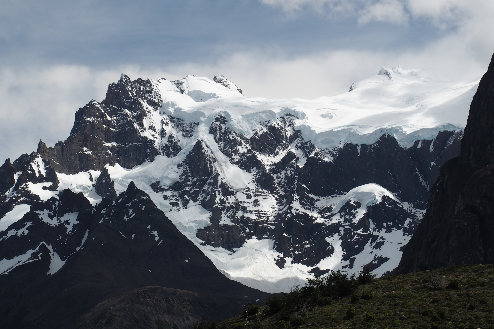

Dag drie staat in het teken van water. Het grootste deel komt deze keer van boven. Het regent licht als we vertrekken. Vanwege de regen, de zware benen en Freke’s pijn in de knie de dag ervoor, hadden we eigenlijk besloten de zware klim naar de Vallei Francés niet te doen. Maar bij de afsplitsing komen we daar spontaan op terug en lopen naar het eerste uitzichtpunt. Het pad naar het tweede uitzichtpunt was vanwege het weer al afgesloten. Hoewel het grootste deel van het uitzicht in de wolken verborgen blijft, kregen we toch een goede indruk van de omliggende bergen en gletsjers. De ene die we goed kunnen zien, laat ook nog van zich horen als er met donderend geraas een pak sneeuw naar beneden valt. Een paar uur later, als het inmiddels gestopt is met regenen, bereiken we Paine Grande, de camping/berghut die we niet konden boeken. Vanaf hier brengt een catamaran ons over het meer, waar we in een café nog een uur wachten op de bus. Terug in Puerto Natales is er nog net genoeg tijd over voor een instant-noodles, een paar knakworsten en een douche. Het is ons gelukt.

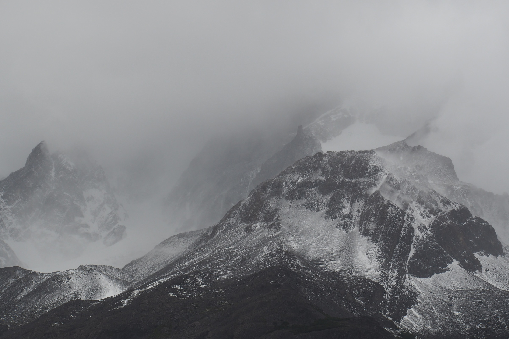
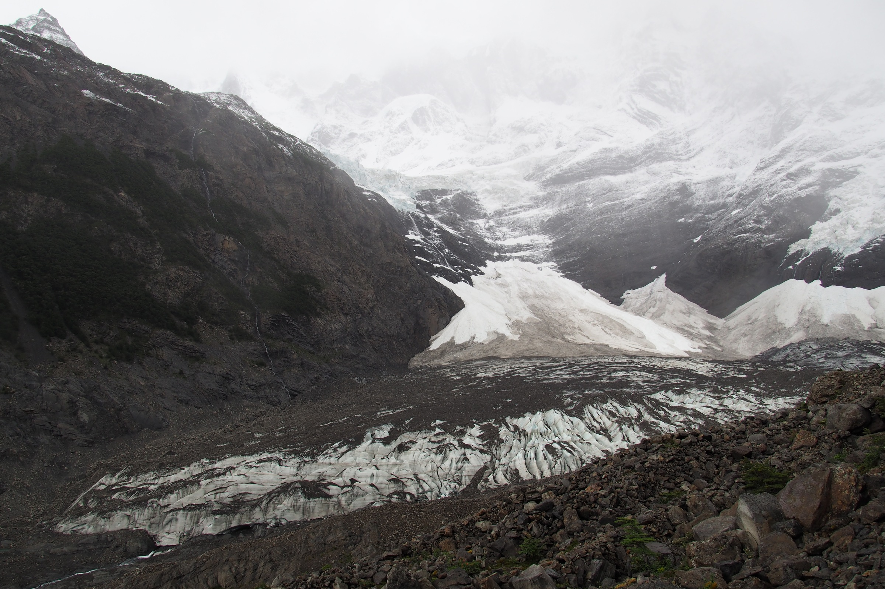

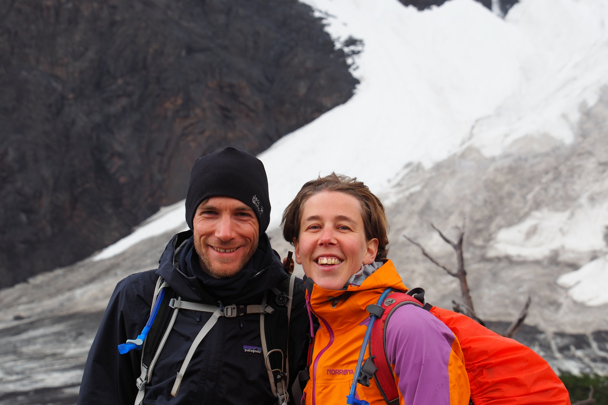

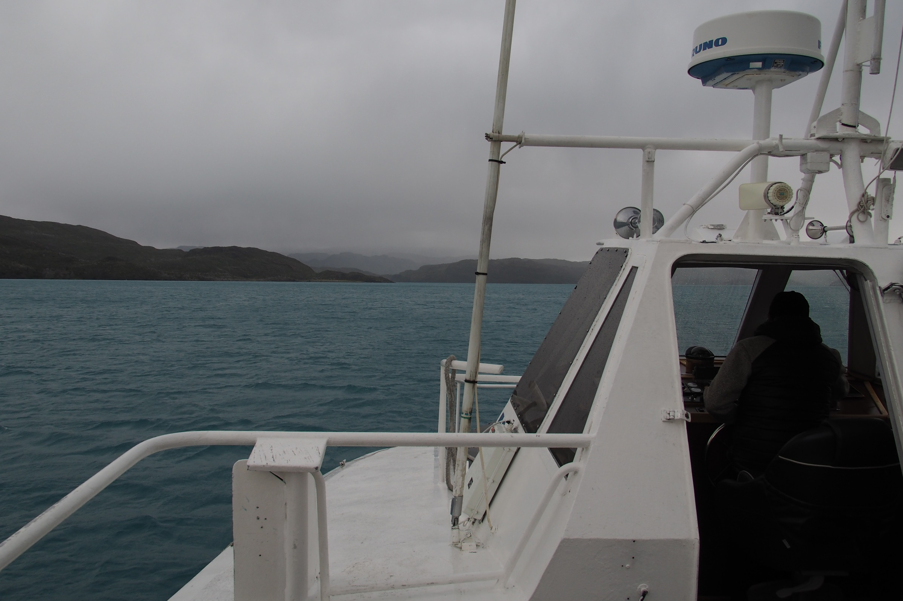

