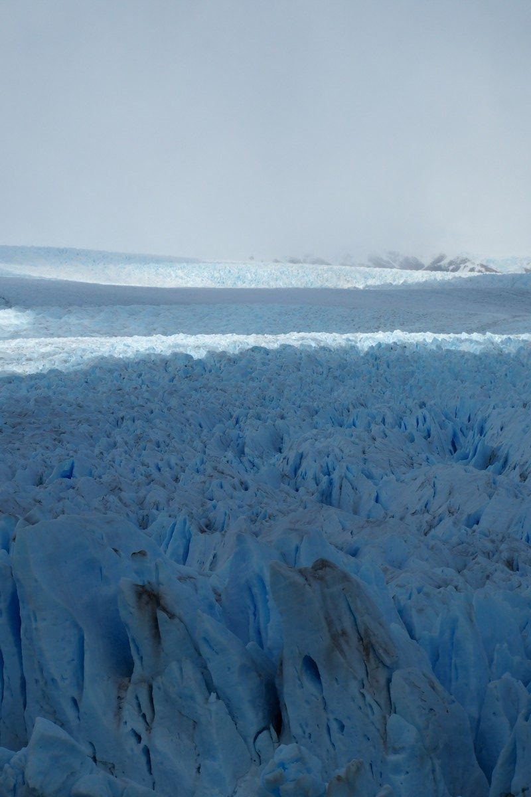
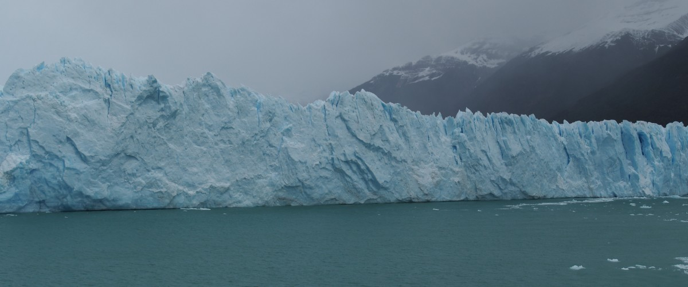
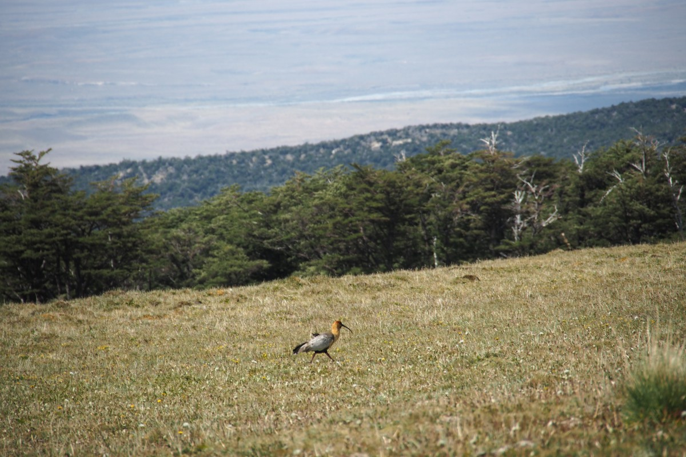
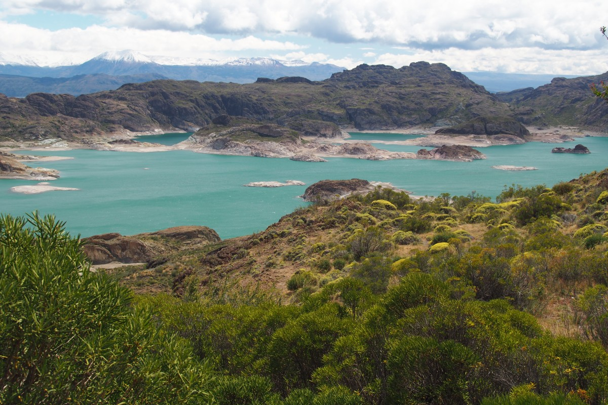
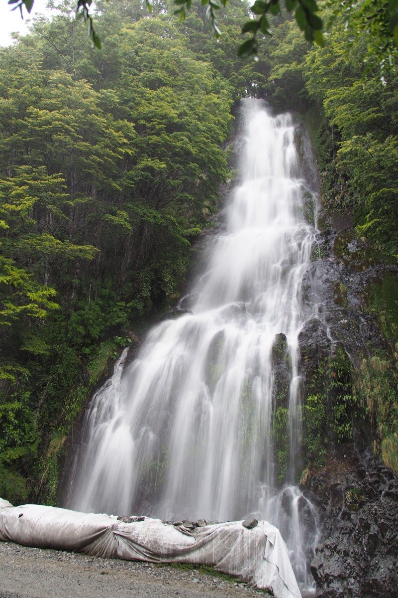

Das Phänomen des Inselhopsens ist bekannt: Von der einen Insel zur nächsten reisen. Wir leiten einen neuen Trend ein: Das Länderhopsen, vom einen Land ins andere und wieder zurück. Inzwischen waren wir nämlich in Argentinien, sind aber schon wieder zurück in Chile und werden in naher Zukunft wahrscheinlich nochmal nach Argentinien reisen nur um danach wieder nach Chile zurückzukehren.

Aber das liegt in der Zukunft. Erstmal zurück nach Chile, wo wir das letzte Mal stehen geblieben sind. Nach der kilometerlangen (50 um genau zu sein) Wanderung in Torres del Paine, nahmen wir den Bus nach El Calafate. Nach gerade mal einer halben Stunde tauchte der Grenzübergang auf. Erst der von Chile, dann ein Stück Niemandsland, und dahinter bekamen wir in einem kleinen Zollhäuschen unsere argentinischen Stempel in den Pass.

Während die patagonische Pampa an uns vorbeisaust, schauen wir einen spanischen Film (mit englischen Untertiteln) zum Üben unserer Sprachkenntnisse. Hier in der Pampa wächst nichts höher als 30cm. Alles was den Kopf zu weit herausstreckt wird gnadenlos durch den harten Wind bestraft, der hier kontinuierlich weht. So hart, dass es in Deutschland hierfür eine Unwetterwarnung geben würde. Die eisige Luft, die von den weiten Eisflächen in den Bergen rübergeweht kommt, stellt sich schnell als der rote Faden heraus, der sich durch all unsere Abenteuer in den Anden ziehen wird.

### El Calafate

El Calafate präsentiert sich als sonniger, touristischer, aber einladender Ort am Ufer des superblauen Lago Argentina. Anziehungspunkt für Touristen ist der Gletscher Perito Moreno, benannt nach einem argentinischen Wissenschaftler, auf den hier alle ganz stolz sind. Dank seines Wissens und seiner Hilfe beim Ziehen der Grenze zu Chile, hat Argentinien nämlich etliche Hektare Land gewinnen können. Im Glaciarium (Gletschermuseum) ist ihm ein eigenes Austellungseckchen geweiht. Dort lernten wir, dass Moreno seinen Gletscher im Jahre 1886 nicht beschrieben hat (was er sonst noch so nicht getan hat in diesem Jahr, bleibt ein Rätsel).

Der Gletscher ist tatsächlich spektakulär. So einen Gletscher hatten wir bisher noch nicht gesehen. Die Gletscherzunge streckt sich in einen See aus, in dem glitzernd blaues Eis schwimmt. Von der Zungenspitze brechen regelmäßig (mehrere Male per Tag) riesige Eisblöcke ab. Wir sahen kleinere Stückchen mit Schnee, aber auch tonnenschwere Eisberge abbrechen und mit lauten Knall ins Wasser fallen. Der Perito Moreno Gletscher ist einer der wenigen stabilen Gletschern. Er schiebt sich täglich ungefähr zwei Meter nach vorne und diese zwei Meter brechen also jeden Tag ab. Momentan erreicht ein Stückchen das gegenüberliegende Festland, was uns ermöglicht, das Eis von nächster Nähe zu betrachten. Schlussendlich türmt sich das Eis hier auf, wird dann später eine Eisbrücke bilden, die spektakulär zusammenbricht. Dann befindet sich das Ende wieder im Wasser, um von dort langsam wieder Richtung Land zu wachsen.

Per Bus geht es von El Calafate weiter zu unserem nächsten Ziel, El Chaltén. Wiederum durch die Pampa, ab und zu eine einsame Estancia (Bauernhof). Einige Menschen wohnen hier wirklich ab vom Schuss und wortwörtlich in der Pampa. Die Fahrt war bis El Chaltén sonnig, beim Aussteigen hängen aber Regenwolken über dem Ort. Das Klima kann sich hier jeden Kilometer verändern. In den Bergen regnet es viel, aber dort, wo sie enden und in die Steppe übergehen, herrscht Dörre.

### El Chaltén

El Chaltén ist die selbsternannte Wanderhauptstadt von Argentinien. Der Höhepunkt ist eine Wanderung zum Fuße des Mount Fitz Roy, einer der bekanntesten Berge von Patagonien. Ein bisschen Glück muss man allerdings mitbringen, denn der Gipfel ist nur ein paar Mal pro Monat nicht hinter dicken Wolken versteckt. Wir hatten unser Glück rechtzeitig bestellt. So konnten unseren Besuch so abstimmen, dass wir in jedem Fall einen Sonnentag haben sollten. Wir sind dann jedoch nicht zum Fitz Roy gelaufen, sondern nach einem anderen Aussichtspunkt, dem Lomo del Pliegue Tumbado, mit Panoramasicht in alle Richtungen. Ein bisschen müde – der Torres del Paine saß uns noch in den Beinen – trotteten wir den Berg hinauf. Doch der wollte uns nicht mal einfach so, mir nichts, dir nichts nach oben lassen. Harter Wind blies uns entgegen und regelmäßig vom Weg. Zähne zusammen beißen und durch. Oben angekommen kam die Belohnung, wenn auch zähneknirschend: Eine prächtige Aussicht, aber der eisige Gletscherwind zwang uns relativ schnell wieder auf den Rückweg.

 

Etwa genauso erging es uns am nächsten Tag als wir nun doch Richtung Fitz Roy liefen. Diese Wanderung brachte uns durch ein kilometerbreites Tal. Ein Tal, dass in jedem anderen Land wenigstens eine Straße hätte oder sogar ein Dorf oder eine Stadt. Hier im dünn besiedelten Patagonien hingegen, gibt es weder noch. Der letzte Kilometer zum Aussichtspunkt, dem Laguna de los Tres, ging steil nach oben. Wir brauchten hierfür entsprechend eine ganze Stunde, nur um ganz oben mal wieder weggeblasen zu werden und, zur Abwechslung, auch noch weggeregnet zu werden. Fitz Roy erschien uns heute leider nicht, er blieb hinter den Wolken verborgen. Aber egal, gejammert wird hier nicht.

 

Mit diesen beiden Wanderungen hatten wir schon wieder 40km auf dem Buckel und darum ließen wir es danach etwas ruhiger angehen, während wir auf die Abfahrt unseres Nachtbusses warteten. Dies sollte unsere erste Erfahrung mit Nachtbussen auf diesem Kontinent werden und ein bisschen freuten wir uns darauf. Die Busse hier kommen in verschiedenen Klassen, unter anderem als semi-cama (Halbbett) und cama (Vollbett), wo der Stuhl weiter nach hinten geklappt werden kann als normalerweise oder sogar ganz platt. Uns wurde zwar semi-cama versprochen, aber beim Einsteigen war schnell deutlich, dass dies ein stinknormaler Reisebus mit normalen Stühlen war, der uns in zehn (schlussendlich zwölf) Stunden nach Los Antiguos bringen sollte. Wie gesagt, gejammert wird hier nicht. Immerhin war der Bus nur halb gefüllt, so dass jeder zwei Stühle in Anspruch nehmen konnte. Einzig und allein die 60km lange Baustelle, in der der Asphalt noch gelegt werden musste und die unseren Bus daran hinderte, über eine Höchstgeschwindigkeit von 20km/h hinauszukommen, machte das Schlafen streckenweise etwas mühsam.

### Los Antiguos

Einigermaßen ausgeruht kamen wir morgens in Los Antiguos an. Ein Dorf mit einigen Tausend Einwohnern (inklusive Restaurant, das von einem Argentinier mit niederländischen Wurzeln betrieben wird und wo wir abends ein leckeres argentinisches Steak bestellten). Kurz nach der Ankunft ging es schon gleich weiter: Ein Allradwagen sollte uns zu den Cueva de las Manos bringen. Die Cueva (Höhle), besser gesagt, die mehrere hundert Meter breite Bergwand mit einer Höhle, umfasst insgesamt 1229 Handabdrücke aus prähistorischer Zeit.

Die Cueva de las Manos ist UNESCO-Welterbestätte und in der Tat beeindruckend. Die Handnegative sind zwischen 13000 und 9500 Jahre alt und wurden in rot, gelb, weiß und schwarz gemalt. Bis auf einige Ausnahmen sind die Hände linke Hände, wahrscheinlich weil die Maler Rechtshänder waren. Aus unbekanntem Grund findet sich auch eine Hand mit sechs Fingern. Außerdem malten sie Guanacos (eine Lama-Art), Gürteltiere, Eidechsen und Pumas, und verschiedene Jagdstrategien.

Guanacos sahen an diesem Tag sowohl gemalt, als auch lebend und tot. Vor allem junge und alte Tiere verheddern sich häufig in den Zäunen entlang der Straßen. Die Skelette bleiben noch Jahre in der trockenen Luft hängen. Wir sichten auch einen Nandu (Strauß) und einen grauen Fuchs. Ein argentinisches Paar, das mit uns auf Tour war („wir kommen hier aus der Ecke“, etwa 600km entfernt…), weihte uns in die Tradition des Mate-Tees ein. Diesen trinkt man fast immer in der Gruppe, wobei der Becher mit Strohhalm rumgereicht wird. Wer an der Reihe ist, trinkt den Becher leer, dann wird mit neuem Wasser aufgefüllt. Mate hält ähnlich wie Kaffee und schwarzer Tee wach, ist aber ein wenig bitter und nicht jedermanns Sache.

### Chile Chico nach Caleta Tortel

Bis hier verlief unsere Reise ziemlich glatt. In Los Antigous, das an der Grenze mit Chile liegt, begonnen die Herausforderungen. Wir wollten nämlich hier die Grenze überqueren, aber es gibt keinen öffentlichen Nahverkehr. Wir wussten auch nicht so genau, wie wir aus Chile Chico, der ersten Stadt auf chilenischer Seite, weiter nach Puerto Río Tranquilo kommen konnten, wo wir an diesem Tag hin wollten. Weder das allwissende Internetz, noch die Menschen beim Fahrkartenschalter, und nicht mal unsere Herbergsmutter konnten uns mit nützlicher Information versorgen. So liefen wir einfach mal los Richtung Grenze.

Mit unseren Rucksäcken auf dem Buckel und vor der Brust liefen wir raus aus Los Antiguos. Zwischendurch den Daumen raus in der Hoffnung, dass eines der vorbeisausenden Autos uns mitnehmen würde. Kurz vor dem argentinischen Grenzposten, hielt der Toyota eines chilenisch-argentinischen Ehepaars neben uns. Als ob es die normalste Sache der Welt sei, stiegen sie aus, um unsere Rücksäcke im Kofferraum zu verstauen. Es ist in der Tat auch eine sehr gängige Art und Weise in dieser Region um von A nach B zu kommen, ganz besonders bei diesem Grenzübergang. Das Ehepaar lotste uns durch den Zoll, wobei vor allem die Chilenen scheinbar eine besondere Freude daran haben, einem das Leben unnötig kompliziert zu machen. Sie beschützen ihre Grenze sorgfältig und alles Gepäck wird kontrolliert. Allerdings suchen sie keine Drogen, sondern Obst und Gemüse aus Angst, dass sich Krankheiten und ausländische Pflanzensorten ausbreiten. Das klinkt erstmal komisch, es ist doch eine Landesgrenze auf dem Festland? Aber das ganze ist nicht ganz unlogisch, da Chile durch die Anden im Osten und die Atacama-Wüste in Norden relativ isoliert ist vom Rest des Kontinents.

In Chile Chico angekommen schien es doch einen Bus zu geben, der uns jedenfalls in die richtige Richtung bringen könnte. Die übrigen 50km müssten wir dann per Anhalten zurücklegen, was kein Problem sei, sagte man uns. Entlang der Carretera Austral, einer wichtigen Nord-Süd-Verbindungsstraße in diesem Teil von Chile, wird viel per Anhalter gereist. Grund hierfür ist der äußerst beschränkte und zugleich unzuverlässige Nahverkehr (was wir später noch öfter merken würden).

Der Bus war unser Plan B und wir beschlossen, es erstmal mit dem Daumen zu probieren. Wir liefen zum Stadtrand, dort wo der Asphalt aufhört, und bevor wir überhaupt den Daumen ausstrecken konnten, wurden wir gefragt, was wir suchten und wo wir hin wollten. Die freundlichen Frager stellten sich als Jurjen und Chantal vor, einem holländischen Pärchen aus Ede in unserem Alter. Die beiden reisten in ihrem Allrad-Wohnwagen für sieben Wochen durch Patagonien und nahmen uns gerne mit. Wir merkten schnell, dass wir auf einer Wellenlänge lagen, und beschlossen mit ihnen mitzufahren nach Caleta Tortel, das viel weiter im Süden lag als wir je ohne Auto erreichen hätten können. Insgesamt genossen wir drei Tage in ihrer Gesellschaft und auf ihrer Rückbank.

Die Route von Chile Chico brachte uns zuerst entlang des riesigen Sees Lago General Carrera (oder auf der argentinischen Seite: Lago Buenos Aires), dem zweitgrößten See in Südamerika. Rundum den See reichen die schneebedeckten Gipfel der Anden bis in die Wolken. Traumhafte Panoramas zwangen uns zu regelmäßigen Fotopausen. Weiter im Süden verändert sich die Landschaft mehr und mehr in ein Fjordgebiet mit Regenwald, aber weiterhin umringt von Bergkämmen.

Auf der „Straße“ nach Tortel sucht man vergebens nach Asphalt. Nach 300km Schotterpiste fühlt man sich dann wirklich wie am Ende der Welt. Tortel liegt an einem Fjord und hat selbst keine Straßen, sondern ausschließlich Holzstege für Fußgänger (und Streunerhunde). Die einziger Art der Fortbewegung ist also laufen oder Boot fahren. Zum Glück ist das Dorf klein und es dauert nicht länger als eine halbe Stunde von der einen Seite zur anderen. Nachdem wir noch den fangfrischen Fisch probiert hatten (ja, sogar Freke), tauchten wir in unser etwas zu kaltes Bett. Die meisten Häuser haben hier lediglich einen Holzofen, der gleichzeitig als Heizung und Herd dient. Da der aber meistens in der Küche steht, wird nicht viel mehr als die Küche warm.

Am nächsten Morgen dachten wir, es sei schön, um noch eben eine Runde um das Dorf zu drehen. Der kleine Anstieg auf den Hügel hinter dem Dorf erwies sich zwar als steiler als erwartet, aber wir sind ja inzwischen gut trainiert. Der Abstieg hingegen war doch etwas zu schlammig für unseren Geschmack und so blieben unsere Socken auch nicht ganz trocken. Die Aussicht auf die einsamen Fjorde machte es aber wett. Diverse Grüntöne erschienen vor unseren Augen, grüne Bäume, grünes Gras, grünes Wasser.

 

### Puerto Río Tranquilo

Dann erwartete uns der lange Weg zurück, der gleiche wie am Vortag. Fünf Stunden brauchten wir für die etwa 250km nach Puerto Río Tranquilo. Jurjen und Chantal entschieden sich, um hier auch ein oder zwei Nächte zu bleiben und die „Marmor-Kathedrale“ zu besuchen.

Der Name ist trügerisch, denn es handelt sich hierbei nicht um ein religiöses Gebäude, sondern um Felsformationen entlang der Küste des Lago General Carrera. Die Felsen sind unterspült und haben so den unterliegenden Marmor freigelegt. Die Höhlen erinnern tatsächlich ein wenig an ein Kathedralengewölbe. Das Gestein ist zwar echtes Marmor, ist aber so porös, dass man es nicht am heile abbauen kann. Zum Glück, denn ansonsten hätten wir es nicht im türkis-blauen Wasser betrachten können. Die Fahrt im kleinen Motorboot gegen den Wind und den Wellengang ist holperig und der Kapitän probiert alles, um mit geschickten Schlenkern den besonders hohen Wellen auszuweichen. Klappt nicht immer. Gut durchgeschüttelt laufen wir im Hafen ein. Zu viert entdeckten wir noch einen Teil der neuen Straße (natürlich ohne Asphalt) „Valle Exploradores“ bis an den Gletscher Exploradores mit dreckiger Schottermoräne. Ein eigenes Auto erweist sich hier doch als wertvoll :)

Auf dem Campingplatz mit Herberge, in der wir ein herrliches, kleines Zimmer für uns alleine hatten, stand inzwischen ein Lämmerlein für uns bereit. Blöken konnte es nicht mehr. Es war geschlachtet und aufgespießt vor dem offenen Kaminfeuer und wurde mit geübter Hand vom Herbergsvater ab und zu um ein paar Grad gedreht, so dass alle Seiten gleichmäßig gegrillt wurden. Das war unser Weihnachtsmahl, das sie mit der Familie (inklusive Oma im Rollstuhl) und den Campinggästen teilten. Der erste Feiertag war komplett verregnet, aber wir hatten sowieso eine Ruhetag eingeplant gehabt. Frohe Weihnachten!

 
