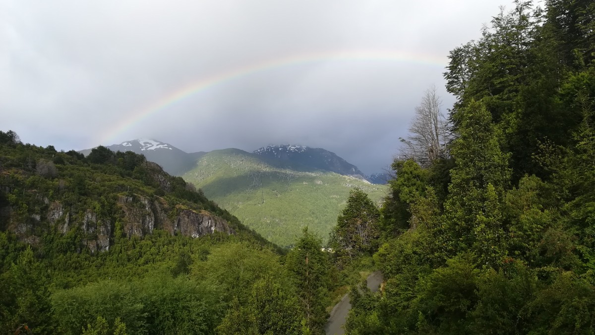

Neulich entdeckten wir in unseren Beiträgen ein wiederkehrendes Muster. Beim letzten Mal stand Wind im Vordergrund, dieses Mal wird es vor allem um Wasser gehen. Feuer kommt später bestimmt auch noch dazu, wenn wir ins Vulkangebiet kommen. Erde werden wir noch sehen (was uns betrifft, können wir Erdbeben gerne überspringen). Heute geht es also um Wasser. Wasser, das aus dem Himmel kam; Wasser, das von den Bergen in die Tiefe stürzte; und Wasser, von dem wir uns im Raftingfloß umherschaukeln ließen.

### Puerto Río Tranquilo nach Coyhaique

Aber erstmal zurück zum Anfang. Der erste Weihnachtsfeiertag in Puerto Río Tranquilo war vollständig verregnet. Zwischen den Schauern probierten wir unsere Wäsche an der Leine zu trocknen. Mit mäßigem Erfolg. Am zweiten Feiertag, den sie hier übrigens nicht feiern, standen wir um Punkt 9 Uhr an der Bushaltestelle. Um Viertel vor zehn kam der Bus zwar, war aber schon voll. Der Busfahrer nahm niemanden mehr mit. Scheinbar waren wir nicht die einzigen, die ihre Reise auf nach Weihnachten verschoben hatten und nun auf dem Rückweg vom Familienbesuch waren. Dann mal wieder Däumchen hochhalten. Nach eineinhalb Stunden, genau in dem Moment an dem wir zurück zur Haltestelle für den nächsten Bus laufen wollten, stoppte krächzend ein Abschleppwagen neben uns. Wollten wir hier wirklich einsteigen? Klar, er brachte uns schließlich den ganzen Weg nach Coyhaique.

Im Schneckentempo (mit Müh und Not den Berg rauf mit 10km/h), der Motor fast überhitzt (wenn‘s bergauf ging: Fenster auf wegen der Kühlung!), und ab und zu eine kurze Pause für ein Gebet bei einem Heiligenbild entlang der Straße. Nach sechs Stunden kamen wir in Coyhaique an, die mit 50.000 Einwohnern die größte Stadt in diesem Teil von Chile ist. Wir waren den Verkehr und den Trubel gar nicht mehr gewöhnt. Wir liefen zum einzigen Hostel, das unser Reiseführer vorschlägt. Das ist geschlossen, aber beim Nachbarn gab‘s noch Betten. Das stellte sich zwar als das teuerste Bett heraus, das wir bisher hatten, aber es gab Frühstück und alles ist hübsch, sauber und neu. Außerdem trafen wir Annemie aus Flandern, dessen Leben in einer der ersten Folgen von „Floortje naar het einde van de wereld“ ([Floortje ans Ende der Welt](“https://programma.bnnvara.nl/floortje/english“)) dokumentiert ist. Die Niederländische Dokuserie ist eine unserer Lieblingssendungen. Floortje besucht Menschen mit besonderen Geschichten, die in den abgelegensten Ecken der Erde wohnen. So also auch Annemie. Bis vor kurzem wohnte sie im südlichen Patagonien auf einer Ranch ohne Internet und Telefon und mit den nächsten Nachbarn etwa 4 Tage entfernt. Momentan arbeitet sie in Coyhaique, unter anderem in dem Hostel, in dem wir schliefen.

### Coyhaique nach Puyuhuapi

Am nächsten Morgen begab Malte sich auf den Weg zur Busstation, um Fahrkarten für den einzigen Bus nach Puyuhuapi zu kaufen. Wiedermal vergebens, der Bus war schon voll. Morgen ginge es. Okay, es war schon 13 Uhr, wenn wir per Anhalter noch nach Puyuhuapi kommen wollten, dann hätten wir besser vor drei Stunden schon an der Straße stehen sollen. Am anderen Ende der Stadt stellten wir uns an den Straßenrand. Nicht besonders viele Autos hier… Nach einer guten viertel Stunde kam unser Bus vorbei und hielt an. Irgendwie war jetzt doch noch Platz. Unverständliches System hier...

Auf dem Weg nach Puyuhuapi wurde es stets nasser. Im Dorf selbst regnete es wie aus Eimern. Das letzte Stückchen mussten wir per Boot zurücklegen. Besser gesagt, der Bus fuhr rückwärts auf einen kleinen Kutter, und der Kutter dann ein paar hundert Meter über den Fjord. Auf dem Streckenabschnitt, der derzeit Baustelle ist, passierten in letzter Zeit so viele Unfälle, dass die Behörden kurzerhand beschlossen, der Wasserweg sei der bessere.

Auch am folgenden Tag ließ sich die Sonne nicht blicken, der Regen umso häufiger. Zum Glück hat Puyuhuapi neben natürlichen Thermen auch eine eigene deutsche Brauerei. Zwischen den beiden Weltkriegen ist nämlich eine große Gruppe Deutscher in dieses Dorf (oder die Umgebung) gezogen. Einer davon, der Herr Hopperdietzel, begann Bier zu brauen, erzählte die ansässige Radiomoderatorin, die neben Malte im Bus saß. Die junge Frau war übrigens mal eben nach Coyhaique gefahren (sechs Uhr mit dem Bus und einer Übernachtung), um ein bisschen Feuerwerk und anderen Krams für Silvester zu kaufen. „Ich kann mir schwer vorstellen, wie es ist, wenn man so weit reisen muss, um Silvestereinkäufe zu erledigen“, sagte Malte ungläubig. „Das ist Leben in Patagonien“, lachte sie.

In der Außen-Therme im glühend heißen Wasser konnten wir den Regentag ganz gut überstehen. Während die Regenschauer auf unsere Köpfe prasselten, sahen wir Delfine durch den Fjord schwimmen und springen. Das Wetter schien sich allerdings nicht mehr zum Guten zu wenden. Weil wir (schon wieder) eine Mitfahrgelegenheit von Jurjen und Chantal angeboten bekamen, warfen wir unsere eigentliche Pläne von zwei Wanderungen in der Gegend über Bord und zogen nach Futaleufú weiter.

### Puyuhuapi nach Futaleufú

Die Straße wand sich entlang eines stets brauner werdenden Flusses. Der Wasserstand war deutlich höher als normal und die Strömung brachte Geröll und ganze Baumstämme mit sich mit. Das waren die ersten Vorzeichen der Katastrophe, die sich etwa zwei Wochen zuvor im kleinen Dorf Villa Santa Lucía ereignet hatte. Extreme Regenfälle mit etwa 13cm Regen an einem Tag brachten einen kompletten Berghang in Bewegung. Die Schlammlawine zog mehrere Kilometer der Carretera Austral mit sich mit und begrub das halbe Dorf unter sich. Das kostete 17 Menschen das Leben und 5 werden immer noch vermisst.

Nach etwa einer Woche hatte man die Umgehungsstraße Richtung Futaleufú wieder frei geräumt, das bedeutete also, dass wir direkt entlang der Bergungsarbeiten kamen. Militär und THW waren präsent. Wir sahen ein Auto und einen Tanklaster halb unterm Schlamm begraben und irgendwo lag ein Hausdach, bei dem nicht ganz ersichtlich war, ob das Haus hier noch drunter lag oder ob der Schlamm das Dach weggetragen hatte. Es ist ein seltsames, fremdes Angesicht, dass uns für einige Zeit die Sprache verschlug.

Gute 80km später, in der Umgebung von Futaleufú, sah es wieder freundlicher aus. Auch hier dreht alles ums Wasser, nämlich den zahllosen Flüssen der Region. Der bekannteste ist der Río Futaleufú, auf dem professionelle Rafters und Kajakfahrer aus der ganzen Welt zu finden sind. Leider steht der Fluss momentan zu hoch – wiederum wegen des nassen und schneereichen Frühlings. Nichtsdestotrotz, wer raften gehen will, muss das hier tun und darum stiegen wir ins Raftingfloß, um den Río Azul nach unten zu donnern. Malte hatte im letzten Sommer in Leipzig schon geübt, aber Freke folgte aufmerksam der Einweisung, so dass sie genau wusste, was zu tun war, sollte sie aus dem Boot fallen. Die Stromschnellen fallen hier in die Klassen III und IV (von maximal VI obwohl die letzte Klasse ein Wasserfall ist) und machte doch Eindruck auf uns. Am Ende war es halb so wild und vor allem spaßig. Die eine Klasse IV Stromschnelle war zwar eine Herausforderung, aber wir kamen heile und mit allen an Bord hindurch.

Wir designierten Futaleufú als den Ort an dem wir Silvester feiern wollten. Wir hatten ein gemütliches, heimisches Hostel gefunden, wo wir schnell Bekanntschaft mit Morgane, Tristan und François (aus Frankreich), Nina (Deutschland) und Louise (Schottland), und Jimmy (England) machten. Dann kam noch eine große Reisegruppe aus Rumänien an. Die Hosteleltern, Nancy und Nathaniel, hatten außerdem Freunde und Familie eingeladen; es herrschte eine festliche Stimmung.

Am Silvesterabend brachten alle etwas zu Essen zum Teilen mit. Malte backte Rhabarberkuchen mit frischem Rhabarber vom Bauern und Freke half Morgane beim Gnocchi machen. Eine Sache haben wir auf jeden Fall gelernt: Mache Gnocchis niemals selbst, jedenfalls keine 4kg. Sie fingen mittags um 16 Uhr an mit Kartoffeln schälen und um 22 Uhr schwammen die erste Gnocchi gar an der Wasseroberfläche im Topf. Und das, obwohl jeder half, wo er nur konnte. Spaß gemacht hat‘s trotzdem, mit freundlicher Unterstützung vom chilenischen Rotwein, und lecker war‘s sowieso. Zwischendurch stießen wir auf das rumänische Neujahr an (um 19 Uhr) und auf das Niederländische/Deutsche/Französische (um 20 Uhr). Das von England/Schottland (um 21 Uhr) vergaßen wir leider.

Um 0:00 Uhr war es dann endlich auch in Chile soweit. Die Rumänen legten Musik auf, um die Stimmung in der Bude ein bisschen anzuheizen. Um 2 Uhr war Schluss im Hostel, aber mit einer kleinen Gruppe zogen wir weiter zur (einzigen) Silvesterparty im Ort: Die Party der ortsansässigen Feuerwehr. Später lernen wir, dass es das einzige Gebäude ist, das groß genug ist um so viele Menschen unterzubringen. Das ganze Dorf war da. Jung und Alt tanzte zur Musik. Richtig los ging es allerdings erst nachdem die Jugendlichen den „Cueca“ getanzt hatten. Im spanischen Stil wird geklatscht, mit Taschentüchern gewinkt (oder wenn nichts anderes zu finden ist, auch mit Bierdosen) und die Hüften geschwungen (auch die Männer).

Am Neujahrstag war noch ein großer Haufen Gnocchi, Salat und andere Leckereien übrig. Kurzerhand wurde ein „Asado“ (Grillabend) organisiert. Auf der Speisekarte stand „Cordero“: Lamm am Spieß, das mindestens drei Stunden am Lagerfeuer gegart wird. Weil die Rumänen inzwischen weg waren (ganz sicher nette Menschen, abgesehen von dem einem, der den Alkohol leider in Aggression verwandeln musste), war es etwas ruhiger und familiärer. Der Abschied am nächsten Tag fiel dadurch auch ein bisschen schwerer als normalerweise. Aber wir mussten jetzt doch mal weiter. Nach den Feiertagen folgte das Leben wieder seinem normalen Rhythmus. Alle Gäste packten ihre sieben Sachen.

Busse Richtung Argentinien gingen an diesem Tag nicht und so beschlossen wir mal wieder unser Glück mit dem Daumen heraus zu fordern. Und wieder mal mussten wir gar nicht erst probieren, denn eine argentinische Familie, die auch im Hostel geblieben war, fuhr in unsere Richtung und willigte ein uns mitzunehmen. Den ganzen Weg bis nach El Bolsón. Kurze Zeit später fuhren wir an Nina und Louise vorbei, die schon einige Stunden glücklos eine Mitfahrgelegenheit probierten zu finden (schlussendlich kamen auch sie in El Bolsón an).

Nach vier Stunden Autofahrt erreichten wir El Bolsón, eine Kleinstadt, die vor allem unter und für seine Hippies bekannt ist. Und dann sprechen wir nicht über Hipster, die heutzutage Berlin und Amsterdam unsicher machen, sondern die echten 70er-Jahre Hippies. Wir drehten eine Runde über den Handwerkmarkt, auf dem nur echtes Handwerk verkauft werden darf, und sammelten die nötigen Informationen für die nächsten Tage. Abends gingen wir mir Nina und Louise noch leckeres Eis essen. Sobald es hier wieder aufhört zu regnen (ab Freitag wird es sommerlich mit Temperaturen bis zu 30 Grad!), ziehen wir in die umliegenden Berge. Uns steht eine 6-tägige Hüttentour bevor. Das verspricht wieder viele Fotos und Geschichten für den nächsten Beitrag!

