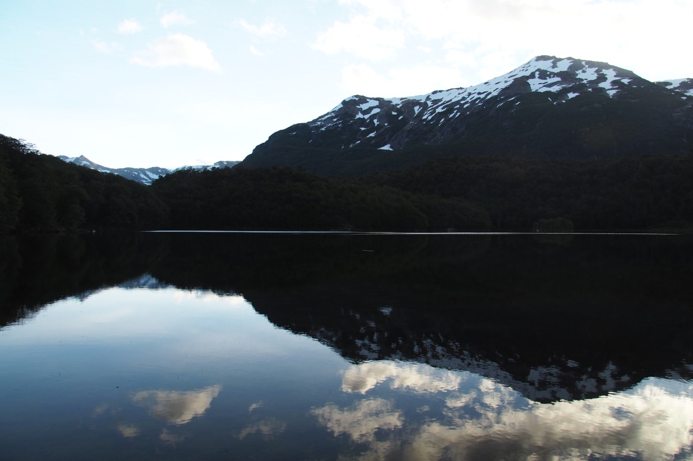
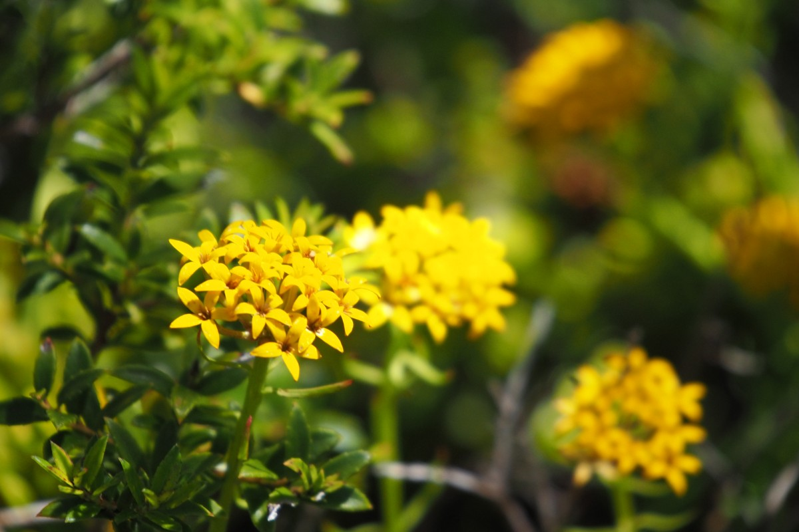

„Die kommen aus Holland!”, rief das Mädchen in der Berghütte mit etwas Stolz in der Stimme zu ihrem Kollegen. Sie selbst sei halb holländisch, halb argentinisch, erzählte sie, kenne allerdings nur ein paar niederländische Wörter: “Dank je wel” und “Eet smakelijk.” Das Mädchen war nicht die einzige, die Interesse an uns hatte. Unter den vielen argentinischen Urlaubern fielen wir zwei bleichen, blonden Ausländer auf wie zwei Fliegenpilze zwischen den Champignons.

In Argentinien sind jetzt Sommer- und Schulferien, von Anfang Januar bis Ende Februar. Und das haben wir auf unserer 6-Tage Wanderung in den Bergen von El Bolsón gemerkt. Das Gebiet ist offensichtlich bei den einheimischen Wanderern bekannter als bei den Touristen von den anderen Kontinenten. Aber die relativ hohe Besucherzahl konnte unsere Tour nicht verderben. Die Route lief vor allem durch Märchenwälder; überseht von einer dicken, grünen Moosschicht und mit Bäumen, die in lange, grasähnliche Schleier umhüllt waren (eine Moosart mit dem passenden Namen: „Großvaters Bart“). Ein Stückchen weiter dann ein geheimnisvoller Gespensterwald, in dem tote, halb abgebrochene Bäume gegeneinander lehnten und knarzten. Kein Vogel war mehr zu hören und wir fühlten uns in eine Folge der Drei Fragezeichen oder Scooby-Doo versetzt. Zum Glück waren wir hier schnell durchgelaufen.

Die meisten Abschnitte waren jedoch voll von Leben; unter anderem drei patagonische Eisvögel auf der Lauer in der tiefen Cajón de Azul (der blauen Schlucht). In den Bergen befinden sich auch „Alercen“ (Lärchen), mit 40-60m die höchste Baumart in Südamerika. Die Bäume stehen hier dann auch schon entsprechend lang: einige schon seit 3000 Jahren. Ab und zu konnten wir unsere Köpfe über die Baumwipfel hinaus strecken und die prächtige Aussicht auf gepuderte Gipfel genießen.

Für zwischendurch hatten wir einen Ruhetag bei der am weitesten entfernten Berghütte eingeplant. Die lag an einem kleinen See inmitten hoher, rauer Bergmassive. Die Pause hatten wir uns nicht nur verdient, sondern auch nötig. Nach drei Tagen wandern, worunter ein Tag, an dem wir erst steil nach oben und direkt danach wieder steil und rutschig nach unten mussten. Frekes Balance blieb hier wortwörtlich mal eben auf der Strecke, was ihr einen matschigen Hintern bescherte.

Duschen war in der Regel nicht drin und so erfrischten wir uns im eiskalten See oder im Bergstrom mit ganz ähnlicher Temperatur. Brrr… Zum Glück hielt die Wettervorhersage, was sie versprochen hatte, und das Thermometer stieg Tag für Tag und Grad für Grad. Die letzten drei Tage schien die Sonne dann durchgängig am wolkenlosen, blauen Himmel und sorgte für anständige 30 Grad Außentemperatur. Daran mussten wir uns nach Wochen im patagonischem Klima mit kräftigen, kalten Wind erstmal gewöhnen. Das gelang uns jedoch ganz gut, denn am Ende eines langen Wandertages lockte die Belohnung in Form einer Literflasche selbstgebrautem, kalten Bier. Einmal sogar serviert in einer alten Grolsch-Flasche. Prost!

