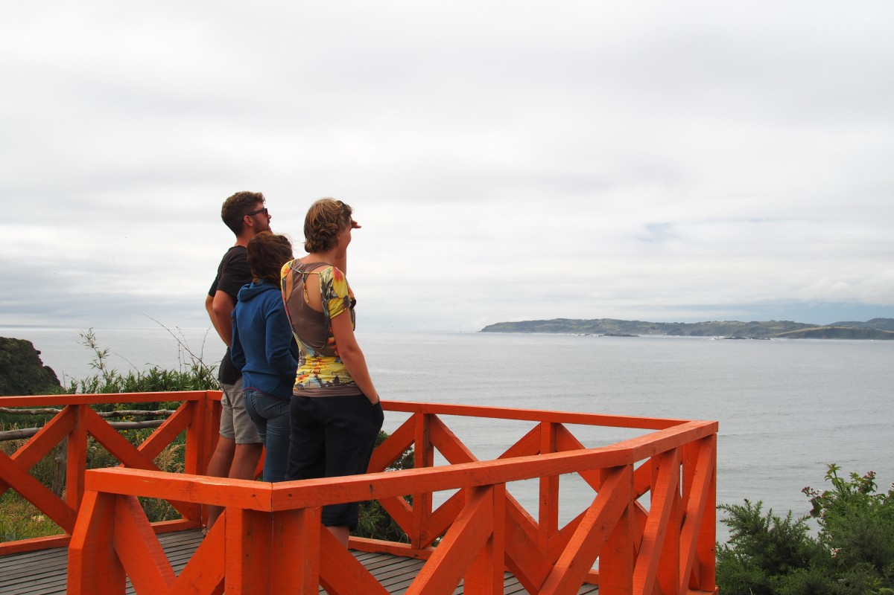
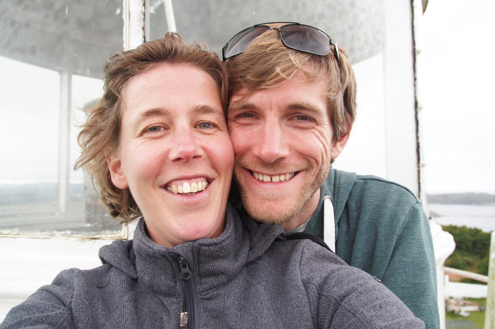
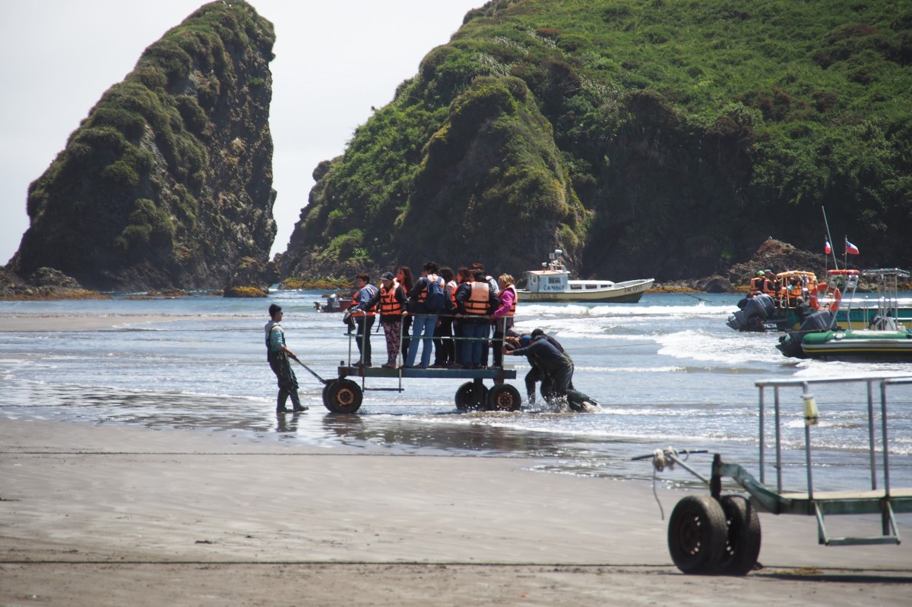

Basilisco, Caleuche en Trauco. Wees welkom in de [mythologie van Chiloé](https://en.wikipedia.org/wiki/Chilote_mythology). Op dit eiland in het zuidwesten van Chili ligt niet alleen de (vermoedelijke) oorsprong van de aardappel, maar het herbergt ook diverse mythologische wezens. Waaronder _El Basilisco_: een slang met een hanenkop, die mensen met zijn blik versteent. _El Caleuche_: een spookschip dat het openbaar vervoer voor heksen vormt. En _El Trauco_: een gebochelde bostrol wiens adem onweerstaanbaar is voor vrouwen en (heel toevallig) verantwoordelijk wordt gehouden voor alle onverklaarbare zwangerschappen op het eiland. We zijn op Chiloé aangekomen en voelen ons hier wel thuis.

Nadat we in El Bolsón een paar dagen rust gepakt hadden, ging de reis verder naar San Carlos de Bariloche (of kortgezegd: Bariloche). Bariloche voelde, na weken in afgelegen gebieden, als een grote stad, met mensenmassa’s uit alle hoeken van de wereld, stoplichten, promenades en souvenirwinkels. De stad is het hele jaar door één grote toeristenmagneet. Het ligt aan een glorieus blauw meer, dat omringd is door bergen die in de winter uitnodigen om te skiën en in de zomer om te wandelen. Om ons onbekende redenen is Bariloche ook bekend om zijn chocolade en daarom verkoopt elk derde winkeltje ‘huisgemaakte’ pralines tegen hoge prijzen.

Toevalligerwijs is Bariloche ook nog het Ibiza van de Argentijnen, in zoverre dat zowel in de winter- als in de zomervakantie jonge studenten en scholieren over de stad uitzwermen om het nachtleven te verkennen. Toen wij op zondagochtend vroeg om 7 uur het hostel verlieten om verder te reizen, deelden we de straat met dronken jongelui die op weg waren naar hun bed.

Zoals je misschien merkt, hadden wij niet zo veel op met Bariloche. Reden genoeg om voor één dag een auto te huren en de omgeving te verkennen. We reden de ‘weg van de zeven meren’ (Ruta de los Siete Lagos) die, zoals de naam al zegt, langs zeven (en meer) meren loopt. Ons oordeel: het landschap was mooi, maar in het voorjaar waarschijnlijk indrukwekkender, wanneer de bergen nog een dikke laag sneeuw hebben. Op de terugweg betaalden we onze lifters-schulden terug en namen we meerdere studenten van het ene naar het andere meer mee. Dit ‘meer-hopping’ (een trend die dit keer niet uit onze koker komt) is een andere geliefde zomerse bezigheid van studenten uit vooral Buenos Aires: een paar dagen lang met tent en slaapzak de campings aan de meren aftikken en onder gelijkgestemden van de zomer te genieten. Geen slecht idee.

Wij wilden niet lang in Bariloche blijven en reisden daarom snel weer verder, terug naar Chili en naar meer afgelegen gebied. Daarvoor moesten we eerst langs de strenge pietjes-precies van de Chileense douane. Al met al stonden we anderhalf uur aan de grens. Eerst moesten we wachten op twee touringcarbussen voor ons, waarna wij aan de beurt waren. Alle bagage moest uit de bus en in een lange rij gelegd worden. Daarna was het wachten tot diverse speurhonden hun werk gedaan hadden. Er werd hier niet alleen naar drugs gezocht, maar ook naar groente, fruit, kaas en vlees. De honden kunnen erg goed ruiken maar blijkbaar niet meer dan één ding tegelijk. Wij stelden het ons zo voor dat ze een appelhond, een bananenhond, een notenhond en een kaashond hebben. Dat moeten we nog maar een keer goed uitzoeken.

Met de bus doorkruisten wij kort het vulkanische Lake District, wat meteen naar meer smaakt maar nog even moet wachten. Met de veerboot staken we eerst over naar Chiloé en we bereikten kort daarna Ancud wat voor de dagen erop ons thuis zou worden.

\[caption id="attachment\_669" align="aligncenter" width="900"\]\[/caption\]

Van tevoren hadden we gelezen dat er op het eiland in januari en februari verschillende oogstfeesten gevierd werden. En zoals het toeval wilde, was het de laatste dag van het aardappelfestival in Ancud. Het avondeten was zo al snel veiliggesteld. Een traditionele maaltijd in deze regio is Curanto en Freke wilde dat graag eens proberen. Dat vond Malte dapper, maar hij liet daar niets van merken. Het was al laat en daarom moesten we even zoeken naar een stand die nog curanto over had. Malte bestelde gefrituurde vis met aardappelen. Terwijl we op het eten wachtten, bleek dat Freke’s kennis over Curanto wat gebrekkig was en dat ze het belangrijkste ingrediënt van het recept, namelijk mosselen, vergeten was. Voor iemand die eigenlijk niet van vis houdt, was ze toch nog redelijk ontspannen toen ze het bord in ontvangst nam. Een echte avonturier.

Voor wie curanto thuis wil maken: men graaft een gat in de grond en vult die met gloeiend hete stenen. Daar bovenop verdeelt men diverse mosselen, afgedekt met bladeren van de Nalca-plant (die wilde rabarber uit een eerder blog van ons). Daar bovenop komen verschillende vleessoorten, van kip tot kasseler-rib, en daartussen een paar dikke aardappelpannekoeken. Het geheel vervolgens goed afsluiten met grasbundels en dan drie dagen wachten. Dan is de Curanto uit de natuurlijke snelkookpan klaar om geserveerd te worden. Tegenwoordig gebruiken de meeste mensen overigens snelkookpannen uit de winkel.

Aan de ontbijttafel kwamen we in gesprek met een Iers-Frans koppel, waarmee we besloten samen een auto te huren en op die manier wat goedkoper het eiland onveilig te maken. We deelden het eiland en de twee dagen op in oost en west. De oostkust is dunbevolkt, maar er wonen toch zeker mensen. Meerdere dorpen herbergen grotere, houten kerken dan eigenlijk bij ze past. Die worden om die paar decennia gerenoveerd, vanwege het natte weer hier. Desalniettemin is de manier van bouwen van deze katholieke kerken bijzonder voor Chili en zijn ze allemaal beschermd erfgoed. Wij reden met de kleine Chrevolet langs de oostkust en tikten daarbij meerdere vissersdorpen met hun kerken af. Ieder dorp leek ons de ideale setting voor een misdaadroman: een detective uit de grote stad botst met de koppige dorpsgemeenschap en wordt door mythische trollen en spookschepen achtervolgd.

 

De volgende dag was de westkust aan de beurt. Eerst de Chepu-vallei: een moerasgebied dat na de aardbeving van 1960 (de zwaarste ooit gemeten: 9,5) en de daaropvolgende tsunami is ontstaan. Hier kon de natuur zich vrij ontwikkelen en dus is het een thuis geworden van verschillende vogelsoorten. De perfecte plek voor een kayaktocht in de ochtend, dachten wij. Na een paar kilometer over relatief goed berijdbare onverharde weg kwamen we echter vrij abrupt tot stilstand. Met nog twee kilometer te gaan ging het plotseling steil naar beneden over een modderweg. We besloten ons lot niet te veel te tarten en draaiden om, om de rest maar te lopen. Maar ook te voet kwamen we niet ver. Binnen seconden nadat we waren uitgestapt werden we omringd door een zwerm rood-zwarte, vliegende kevers. Met de capuchon op en gewapend met een slipper vochten we ons een weg naar beneden, in de hoop dat de kevers ons daar niet zouden volgen. Een compleet verkeerde inschatting. Hoewel we de populatie met goed gemikte tennisslagen aanzienlijk hebben teruggedrongen, kwamen er van alle kanten steeds meer zoemende beesten op ons af. Toen de weg ook nog versperd werd door een kleine rivier gaven we het op. Tegen Bijbelse keverplagen kunnen wij niet op. Zo snel mogelijk keren we terug naar de auto.

\[caption id="attachment\_665" align="aligncenter" width="640"\] Beetle Dance\[/caption\]

De rest van de westkust doet ons denken aan Ierland. Glooiende heuvels met graan- en groentevelden, wolschapen, kliffen, duinen en zandstranden. Aan het einde van de weg staat een eenzame vuurtoren, die door een paar kinderen met speelgoedgeweren verdedigd wordt. Een paar vissers proberen hun geluk bij de zonsondergang.

Na de Bijbelse plagen in de ochtend maakte de middag veel goed: we bezochten een pinguïnkolonie. Nadat we op het strand rustig onze boterhammetjes hadden opgegeten, meldden we ons bij een tourbedrijf dat toeristen in kleine boten langs de kust dobbert. Op een soort bewegend bordes werden we van het strand naar de boot verschoven. We voelden ons een beetje als Romeinse keizers, behalve dat er dan niet één maar meerdere keizers in hetzelfde bordesje zaten. Daarna voeren we in een half uur langs de kolonie, die uit zowel Magelhaen- als Humboldt-pinguïns bestaat. Deze combinatie komt weinig voor. De jonge pinguïns, die afgelopen voorjaar geboren zijn, waren ondertussen al bijna net zo groot als hun ouders, maar ze hadden nog hun kinderlijke, grijze vacht en waggelden nog wat onbeholpen over de rotsen. Daarnaast lag het zeven dagen oude zeeleeuwenjong Flo (rechts op de foto met de zwarte vacht). Bovendien leven hier ganzen, pelikanen en vier schillende soorten aalscholvers. Uiteindelijk hebben we dus zo toch nog de pinguïns gezien, ook al was het met zes weken vertraging. 

\[caption id="attachment\_678" align="aligncenter" width="900"\] Ancud Sunset\[/caption\]
