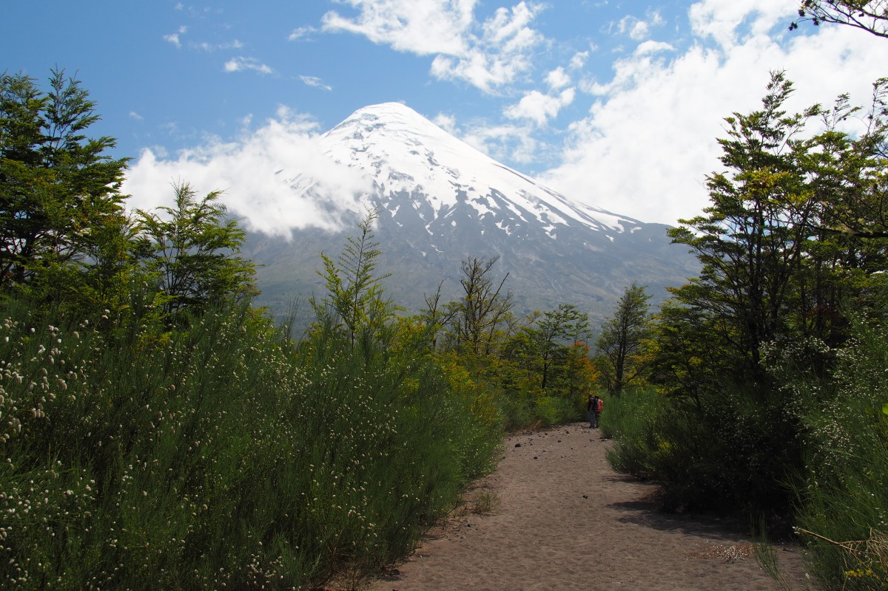
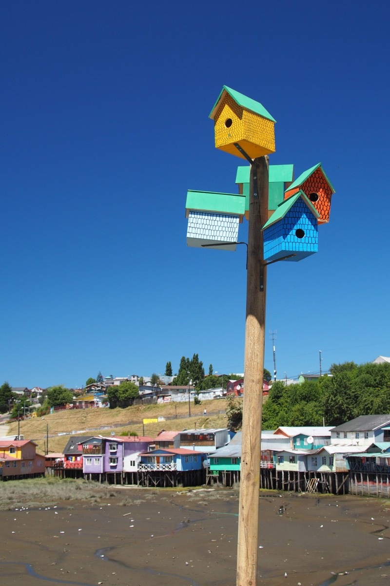
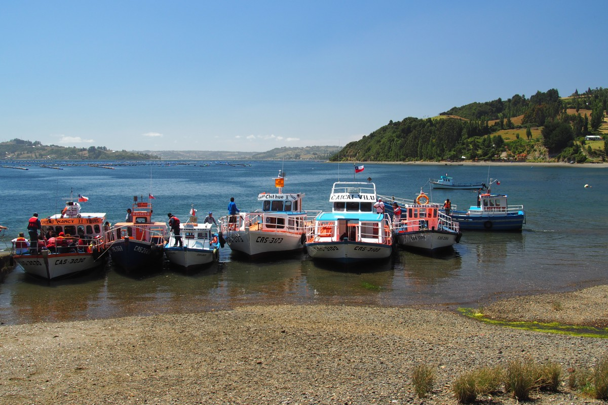

“Natürlich kommt hier alles von Kühen!”, spottet die Käsefachverkäuferin. Die Umstehenden Kunden stimmen ins Gelächter ein. Irritiert dreht Freke sich um. Als holländischer Käskopp weiß sie natürlich, dass sich auch andere Tiere bestens für die Käseproduktion eignen.

Inzwischen haben wir schon zwei Monate (!) hinter uns und so langsam fangen wir an, ein paar Dinge zu vermissen. Guten, geschmackvollen Käse zum Beispiel – Feta, Mozzarella, Camembert, was auch immer, her damit. Voll Verlangen lief Freke zum Supermarkt in Ancud, wieder mal vergebens. Die erhaschte Beute bestand aus einem geschmacklosen, weißen Käse, dessen Textur eher an Kaugummi als Käse erinnerte. Nagut, der Kaugummikäse frischte unseren Couscous-Salat trotzdem ein wenig auf.

Darum konnten wir unseren Augen auch kaum glauben als wir durch die Gänge des Supermarkts in Puerto Varas schlenderten. Feta! Mozzarella! Camembert! Und das war nicht alles: sogar Kokosmilch (die uns wahrhaftig mehrmals für ein leckeres Curry fehlte) und Pesto im Gläschen (bisher mussten wir uns mit getrockneten Pestokräutern abfinden, die in etwas Öl aufgelöst eine Art „Pesto“ ergaben) waren zu einigermaßen erschwinglichen Preisen zu kriegen. In den folgenden Tagen konnten wir unserer Kochlaune also endlich wieder freien Lauf lassen und ausgebreitete Gerichte auf den Tisch zaubern. Von der Portugiesin in unserem Zimmer erhielten wir beinahe den Pokal der besten Hostelköche des Landes. … hier riecht´s angebrannt; das muss das Eigenlob sein.

Das Supermarktangebot legt eine Schlussfolgerung nahe: Wir kommen in die dichter besiedelten Gebiete Chiles. Während man im fernen Süden schon mit frischem Gemüse hochzufrieden war, gelingt die Bevorratung mit exotischeren Nahrungsmitteln hier in Zentralchile mit links.

Somit ließen wir Patagonien hinter uns. Per Fähre machten wir eine Abschiedstour entlang der teilweise noch rauchenden Vulkane der Carretera Austral. Die Überfahrt startete um 6 Uhr morgens in Quellón, im Süden Chiloés. Gegenüber auf dem Festland, in Chaitén, machten wir einen kurzen Zwischenhalt. Vor zehn Jahren brach hier der Vulkan Chaitén zum ersten Mal nach gut 9000 Jahren aus. Das kam ziemlich unerwartet für die Bevölkerung. Am Dorfrand findet man ganze Straßenzüge, die immer noch unter einer meterdicken Ascheschicht begraben liegen.

Viel Zeit hatten wir nicht um Chaitén unsicher zu machen, denn wir mussten zurück auf die Fähre, die uns nach Puerto Montt bringen würde. In Puerto Montt endet die Carretera Austral, der wir nun endgültig den Rücken kehrten. Das machte uns ein wenig traurig und bereitete uns ein bisschen Heimweh. Patagonien stand lange weit oben auf unserer Reisewunschliste. Abgehakt! Und jetzt? Ein großes, schwarzes Loch drängte sich auf. Was wollen wir eigentlich abgesehen von den spektakulären Landschaften Patagoniens auf dieser Reise erreichen? Was erwarten wir, das uns die Reise bringen wird? Wir müssen uns nichts mehr beweisen, sind schließlich keine 18 mehr. Diese Themen liefern genug Gesprächsstoff für lange Busfahrten und am Ende kommen wir auch auf eine Antwort. Wenn man auf Reisen ist, bleiben einem vor allem die unerwarteten Dinge in Erinnerung. Diese machen die Reise reisenswert: Das Cordero Asado über dem Lagerfeuer in Futaleufú, dass wir mit so vielen tollen Menschen teilen durften; Die sechs Stunden mit dem LKW-Fahrer in seinem Abschleppwagen, währenddessen wir uns vor allem mit Händen, Füßen und Lachen unterhielten; Oder das Argentinische Pärchen auf der Tour zu den Cueva de las Manos, deren grenzenloser Enthusiasmus über die kleinsten Dinge wie eine Entenfamilie mit Küken so ansteckend war. Kurzum, wir wollen überrascht werden von Menschen, von Landschaften, von Erfahrungen (to collect them in our baggage :) ). Diese Dinge lassen sich nicht planen. Man kann sie aber herausfordern. Durch Reisen.

Durch unsere Gespräche haben wir wieder etwas mehr Reiselust bekommen. Als wir spät abends in Puerto Varas ankamen, stießen wir zum gerade begonnen Hostel-Grillabend hinzu. Das passte uns perfekt in den Krams, weil wir uns das kulinarische Angebot der Bordkombüse doch etwas größer vorgestellt hatten und entsprechend ziemlich hungrig vom Boot gestiegen waren.

Die Hauptattraktion von Puerto Varas ist der Vulkan Osorno. Der kegelförmige Lavaberg thront hoch oben am Himmel auf der gegenüberliegenden Seite vom Llanguihue-See. Auf der Busfahrt von Bariloche nach Chiloé vor ein paar Tagen sahen wir den Vulkan schon einmal am Horizont. So perfekt geformt (wir vermuten, dass das WhatsApp-Icon  hierauf basiert sein muss) ließ uns damals schon schaudern. Auch von der Fähre aus sahen wir ihn stets näher kommen. Als wir Puerto Varas endlich erreichten, verließ uns das Glück. Von dem Punkt an blieb der Vulkan in dichte, weiße Wolken gehüllt. Während wir uns in der Nähe von Petrohué durch die sandige Asche am Fuße des Vulkans kämpften, konnten wir für einen kurzen Moment einen Blick auf den schneebedeckten Gipfel erhaschen. Petrohué ist übrigens auch ein prächtiger Ort, der am grünen Todos los Santos-Sees liegt und Aussicht auf noch mehr Vulkane bietet. Als wir zwei Tage später wieder im Bus saßen und einen letzten Blick zurück warfen, zeigte sich der Vulkan wieder in seiner ganzen Pracht. Na klar…

\[caption id="attachment\_813" align="aligncenter" width="900"\] Puerto Varas\[/caption\]

\[caption id="attachment\_814" align="aligncenter" width="900"\] Petrohué\[/caption\]

Neben diesem angeblichen Vulkan gibt es in Puerto Varas noch mehr Kurioses zu entdecken. Wir fanden den Waschsalon „Das Glück“, den Hähnchengrill „El Opa“, und das „Kaffee Hausmann“. Der Einfluss der deutschen Immigranten ist in der Region rund um den Llanquihue-See deutlich sichtbar. Im Museum „Colonial Alemán“ im Nachbarort lernten wir, dass locker eine Million enttäuschte Deutsche nach der fehlgeschlagenen Revolution in 1848 auswanderten. Etwa 30.000 kamen nach Chile, von denen knapp 6.000 ein Stückchen Land in und um Puerto Varas bekamen. Deren Einfluss ist an allen Ecken zu sehen, in der Architektur, im Bier und im „Kuchen“, der hier ebenfalls an jeder Ecke zu kriegen ist. Übrigens wurde neben dem Gebäck selbst (meistens Obstkuchen mit Mürbeteig und Streuseln) auch der Name „Kuchen“ eins zu eins ins Spanische übertragen. Valdivia, eine Universitätsstadt an der Westküste Chiles, in der wir ein paar Tage verblieben, war damals die erste Anlaufstelle vieler Deutscher. Darum befindet sich hier auch eine der beliebtesten (deutschen) Brauereien Chiles: Kunstmann. Anfang Februar findet das jährliche Bierfest statt. Mit allem drum und dran, inklusive Bierzelt, Volksmusik und Jodlern… Schade, dass wir nicht so lange blieben.

Valdivia ist mit Abstand die größte Stadt, die wir auf unserem Weg am südlichen Zipfel des Kontinents entgegen gekommen sind, und darum schlugen wir hier auch mal richtig zu. „Was nehmt ihr auf eurer Reise alles mit?“, wurden wir häufig vor der Abreise gefragt. Naja, vor allem alte Klamotten, die wir, wenn sie kaputt gehen, Stück für Stück gegen etwas Neues eintauschen können. Das war jedenfalls die Idee. Frekes Jeans hielt gerade mal vier Tage, wonach sie riss und ausgetauscht wurde. Inzwischen waren auch ihre Halbschuhe am Ende ihres Lateins und darum ziert nun ein hübsches, neues Paar ihre Füße. Malte ist noch auf der Suche nach Ersatz für sein übel riechendes Handtuch und seine etwas mitgenommene Sonnenbrille.

Nach Valdivia fuhren wir zu Chiles Ferienort Nummer 1: Pucón. Beim Besuch des Strandes treffen wir einen breiten Sandstreifen an, auf dem jeder Quadratmeter durch knallgelbe Sonnenschirme besetzt ist, wo Motorboote die ebenso knallgelben, aufblasbaren Bananen über den Horizont ziehen, und wo wir uns nicht so richtig zu Hause fühlen. Wir beschlossen um am nächsten Morgen aus Pucón zu fliehen und im „H-Park“ (eigentlich Huelquehue National Park, aber probier das mal auszusprechen…) eine Runde um drei Seen und ein paar Wasserfällen zu wandern. Dazu gibt es die Aussicht auf den aktivsten Vulkan Südamerikas: Dem Villarrica.

Der Villarrica-Vulkan stand noch auf unserer Todo-Liste als wir anschließend einen zwei-Tages-Ausflug zum Huilo Huilo Naturreservat machten. Beim Wort „Naturreservat“ stellten wir uns eine grüne Einöde vor, weit weg von Pucón und seinen Familienurlaubern. Weit gefehlt. Wir besuchten einen Wasserfall, bei dem wir uns die kleine Aussichtsplattform mit einer Busladung Chinesischer Touristen teilten. Als beim nächsten überlaufenden Fluss auch der Eingang dahin von Menschen überlief, setzten wir diese Runde aus. Stattdessen wollten wir uns von einer Fähre (viel billiger als Ausflugsschiffe) einmal hin und zurück über einen wurmmäßigen See schippern lassen. Als Höhepunkt der Enttäuschungen dieses Tages stellte sich heraus, dass sämtliche Plätze auf dem Fährboot schon seit Tagen ausverkauft waren. Nicht mal einfache Fußgänger durften noch mit. Die Frustration, dass wir überall von anderen Urlaubern verdrängt werden, wird lediglich dadurch gemildert, dass wir den ganzen Tag per Anhalter gefahren sind und dadurch immerhin nicht unnötig Geld ausgegeben haben.

Auch auf dem Villarrica-Vulkan können wir zwar nicht gerade behaupten, allein gewesen zu sein, aber hier stört es uns weit weniger. Ganz im Gegenteil: Von diesem Aufstieg muss man einfach genießen. Mit Steigeisen geht‘s mit Aussicht auf den See und die umliegenden Vulkane über Eis und Schnee bis zum farbenfrohen Krater. Ausgerüstet mit Gasmasken gegen die giftigen Dämpfe, die hier aus dem innersten der Erde emporsteigen, bekamen wir eine gute Viertel Stunde Zeit um vom Anblick zu genießen und Fotos zu machen. Danach folgte der Abstieg, der deutlich lustiger als der Aufstieg war: Nämlich einfach auf dem Hintern den Schnee runterrutschend. Der Eispickel und die Füße dienten als Bremse, obwohl uns das anfangs nicht so sehr gelingen wollte. Unsere Gruppe fabrizierte eine astreine Massenkarambolage, wobei Malte kopfüber auf der Piste zurecht kam. Noch immer lachend gelang es ihm aber die vorher geübte Katzenstellung einzunehmen und sich so elegant zu bremsen. Und auf die Art und Weise legt man die knapp 1000 Höhenmeter von 2800 nach 1800 in Nullkommanix zurück. Die restlichen Meter werden gelaufen und mit dem Auto gefahren.

An diesem Abend luden wir uns selbst zu einem leckeren Essen ein. Weil wir unseren zweiten Vulkan bezwungen haben, weil wir zwei Monate unterwegs sind und weil wir uns eine kurze Auszeit nehmen werden. Wir sind nämlich schon seit einiger Zeit auf der Suche nach einem „Work away“: Irgendwo gegen Unterkunft und womöglich Verpflegung ein bisschen arbeiten. Eine gute Möglichkeit, um Geld zu sparen und mal eben etwas anderes zu tun als zu reisen. Und in Pucón haben wir endlich Glück: Eine chilenische Familie mit drei Kindern will im Sommer nach Belgien ziehen und die Kinder sollen vorher noch einen Crashkurs Holländisch bekommen. Na, das kriegen wir hin! Und so sind wir inzwischen wieder zurück in Puerto Varas, jetzt allerdings in einem gigantischen 320m²-Haus, in dem wir das Wohnzimmer schon mit Post-Its und holländischen Vokabeln tapeziert haben. Morgens spielen wir Memory mit holländischen und spanischen Vokabeln für Körperteile und Tiere, und mittags folgen unzählige Runden Monopoly von Brügge (ein passendes Geschenk einer Freundin der Familie, um sich schon mal auf den Kauf eines Hauses in der neuen Heimat vorzubereiten) mit Catalina (9) und Vicente (8). Sogar der kleinste, Agustín (3), hat schon ein holländisches Word gelernt: Aapje (Äffchen). Denn Freke nennt ihn jedes Mal „Aapje“, wenn er wieder über Tische und Stühle klettert. Hier bleiben wir also bis zum 15. Februar.

To be continued…

Zum Schluss gibt‘s aber noch ein paar übriggebliebene Fotos aus dem (betriebsamen) Castro und dem einsamen Cucao.

\[caption id="attachment\_815" align="aligncenter" width="900"\] Hostel terrace in Cucao\[/caption\] 

