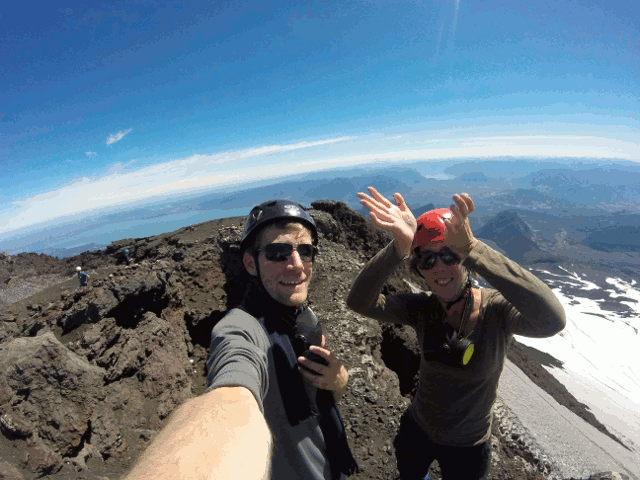

Als es nach uns ginge, würden wir fortan von jedem Berg so absteigen! Whoooeee!

\[flickr video=40159160982 show\_info=no w=1920 h=1080\] [View on Flickr](https://www.flickr.com/photos/collectingbaggage/40159160982)

Und hier noch etwas Inspiration fürs nächste Pantomimespiel im Familienkreis. Gesucht wird: Vulkanausbruch. \[caption id="attachment\_827" align="aligncenter" width="640"\] Eruption Dance\[/caption\]
