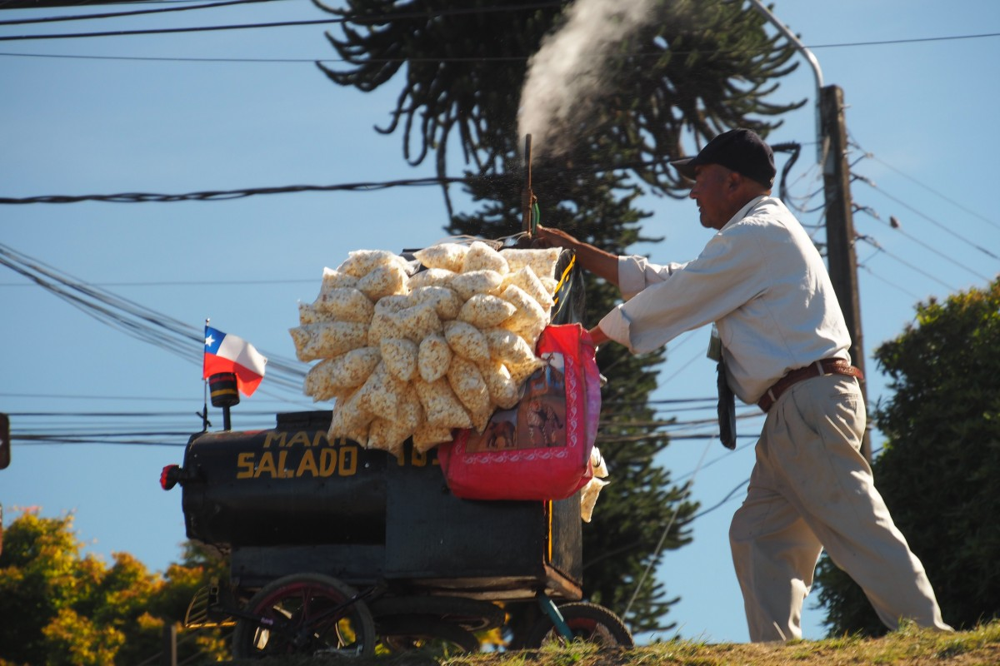

Einige Zeit bevor wir nach Südamerika aufbrachen, bereiteten wir uns mit verschiedensten Mitteln auf die spanische Sprache vor. Unter anderem benutzten wir Duolingo, eine App, die uns mit äußert sinnvollen Sätzen so als „Soy un caballo, hablo inglés“ fütterte. Oder auch, „Ich bin ein Pferd, ich spreche Englisch.“

Monate später begegnet uns dieser Satz erneut. Denn die letzten Worte von unseren Holländischstunden, die bei Catalina (9) hängen geblieben sind, sind „Jij bent een paard“ (Du bist ein Pferd). Hiermit war Malte gemeint, der Agustín (3) mittags auf seinen Schultern durch die Nachbarschaft trug. Agustíns Favorit ist „Jij bent een aapje“ (Du bist ein Äffchen). Jedes Mal als er wieder mal über Tische und Stühle kletterte, nannte Freke ihn Äffchen. Das passierte so häufig, dass selbst ein Kleinkind es irgendwann nachplappert.

Unsere Tage als Lehrerin und Lehrer sind gezählt. Wir hatten zehn wunderbare Tage, die teilweise – zum Beispiel wenn alle drei Kinder gleichzeitig um unsere Aufmerksamkeit rangen – gerne in die Kategorie „anstrengend“ gesteckt werden können. Die Familie zieht im Juli arbeitsbedingt nach Belgien, aber auch des Abenteuers wegen. Horacio und Konstanze, die Eltern, träumten schon länger von einem Leben im Ausland und jetzt, da die Kinder in einem guten Alter dafür sind, ergriffen sie die Chance. Den Kindern wollen sie gerne den Start in die holländische Sprache erleichtern und heuerten uns, um das umzusetzen.

Die Tage, außer am Wochenende, begonnen jeweils mit einer kurzen Besprechung des Tagesprogramms, worauf die Holländischstunden folgten. Catalina stand dann meist schon erwartungsvoll am Esstisch, gewappnet mit all ihren Stiften in verschiedenen Farben und Düften. Auch Vicente (8) stellte am ersten Morgen schon vor unserem ersten Kaffee aufgeregt allerlei Fragen: „Que es eso?“, „Was ist das?“. Seine anfängliche Motivation nahm jedoch mit jedem Tag weiter ab. Ob das nun durch unsere Lehrmethode kam (wir hatten leider etwas spät gemerkt, dass er selbst auf Spanisch lesen und schreiben noch schwierig fand; ganz und gar auf Holländisch) oder an seinem morgendlichen Energieüberschuss, wissen wir nicht. Nichtsdestotrotz schnappte er einige Dinge auf und war in der Lage, sie in den unwahrscheinlichen Momenten zu rezitieren.

Die ganze Truppe ließ uns Teil der Familie werden und wir fühlten uns mehr als willkommen. Wir aßen zusammen zu Mittag und Abend, fuhren mit zum Strand und in die Karaokebar, und probierten uns selbst im Mountainbiken im Wald (einer der Lieblingsbeschäftigungen der ganzen Familie). Auf der anderen Seite bekamen wir genug Zeit für uns selbst, die wir nutzten, um uns von unserer Reise bisher auszuruhen und die Erlebnisse zu verarbeiten. Übers Wochenende besuchte die Familie ein paar Freunde, wodurch wir von einer sturmfreien Bude genießen konnten. Herrlich als Abwechslung zu den vorangegangenen zwei Monaten in Hostels, in denen man nie allein ist. Wir warfen unsere verschwitzten Klamotten in die Waschmaschine, klopften all den Staub aus unseren Rucksäcken, fertigten eine [Online-Karte](https://collectingbaggage.nl/de/collected-locations/) von unseren Stopps an und stellten [all unsere Fotos](https://www.flickr.com/photos/collectingbaggage/) in der Cloud sicher (nicht alle Fotos sind öffentlich zu sehen; wer auch Fotos von uns selbst sehen will, muss uns auf Flickr als Freund zufügen. Oder mal Bescheid sagen, dann schicken wir euch eine Anleitung).

Nach zehn Tagen war unser Akku wieder voll aufgeladen und wir waren bereit, um weiter zu ziehen. Weil wir nach mehr als zwei Monaten immer noch in Südchile waren, hatten wir das Bedürfnis, um die Schrittweite etwas zu erhöhen. Wir wollen doch langsam mal nach Bolivien. Und so, während die Familie ihre Koffer für ihren Sommerurlaub packten, packten wir unsere frisch geputzten Rucksäcke wieder ein. Ein paar Umarmungen von Catalina und einen dicken Knutsch von Vicente später, machten sie sich auf den Weg und wir nahmen den Nachtbus nach San Fernando, gute 1000km nördlich. Hier sollten wir in den frühen Morgenstunden umsteigen und weiterfahren ins kleine Surferdorf Pichilemu. Beinahe zurück in Santiago. Bolivia, here we come!

\[caption id="attachment\_901" align="aligncenter" width="900"\] Lake Llanquihue\[/caption\]
