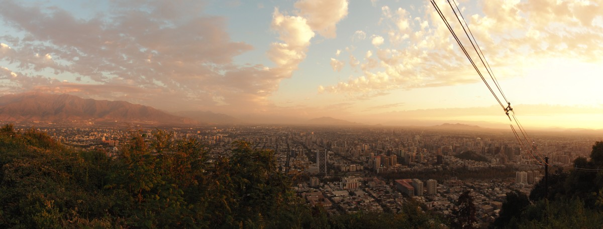
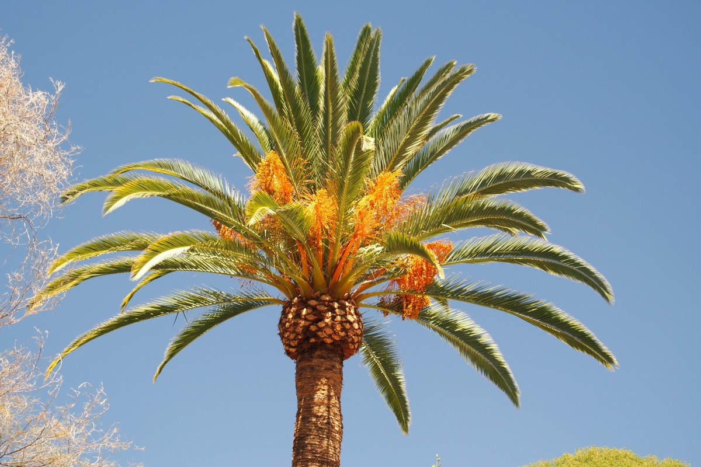

Op naar Bolivië, schreven we de laatste keer. Inmiddels zijn we alweer ruim een maand en inderdaad een grenspost verder, en wát is er veel gebeurd. Ups én downs, waardoor deze blog zo lang werd dat we hem in tweeën splitsen. Dit is deel 1. Om jullie bij de les te houden, strooien we er her en der ook mooie foto’s tussendoor :)

In Pichilemu eindigde ons vorige verhaal. In dat surfdorp aan de Pacifische kust waagden wij ons ook eens op de plank, maar om nou te zeggen dat dat goed ging… Freke koos er uiteindelijk maar voor om te gaan bodyboarden op de hoge golven. Dit moeten we ergens anders nog maar eens gaan oefenen.

De gezellige, relaxte tijd aan de ruwe kust daar werd kort voor vertrek naar Santiago ruw verstoord door triest nieuws uit Nederland. Droefenis tekende daardoor ons verblijf in de Chileense hoofdstad, waar we echter ook genoeg afleiding vonden. En dat is heel gek. Niks in Santiago herinnerde ons aan thuis en dus was het makkelijk weg te stoppen. Tegelijkertijd spraken we veel over wat er toch wel degelijk aan de hand was en leefden we enorm mee met de mensen daar die zoveel verdriet hadden (en nog steeds!).

Santiago is overigens een hele fijne stad. Niet te veel smog zoals we vreesden, geen enorme hitte en genoeg te doen terwijl de stad bekend staat als relatief saai). Vooral het Museo de la Memoria, over de mensenrechtenschendingen onder Pinochet, was indrukwekkend. Daar kan je nog oude beelden en geluidsfragmenten terugkijken/horen van hoe het presidentieel paleis werd gebombardeerd waar de socialistische president Salvador Allende uiteindelijk overleed. Dat presidentieel paleis staat er overigens nog gewoon, opgeknapt en alles, dus over historische sensatie gesproken…

De Cerro San Cristobal, de bekendste heuvel van Santiago, bewaarden we voor een zonsondergang. Op 10 minuten misten we de kabeltram omhoog en dus moesten we onder tijdsdruk omhoog lopen. Precies op het moment van de zonsondergang kwamen we boven aan, om na 5 minuten alweer weggestuurd te worden door de politie want het park ging dicht. Of daar nou een indrukwekkend lichtspektakel te zien is of niet… Balen! Maar een stukje beneden konden we toch nog in alle rust van de goudgele skyline genieten. In het donker liepen we daarna terug naar beneden. Zo donker dat we uiteindelijk onze telefoons maar uit de zak haalden om onszelf een beetje bij te schijnen. Dat was maar goed ook want opeens zag Malte iets voor zijn voeten langs kruipen: een schattige vogelspin! Brr, dat hadden we niet verwacht middenin Santiago. Eenmaal beneden spoelden we onze kippevel weg met een terremoto: letterlijk’aardbeving’ maar hier ging het om een Chileense cocktail van witte wijn, grenadine, een slok Fernet met een bol ananasijs erin. Aparte combi die zo zoet is dat je niks van de alcohol merkt tot je op probeert te staan en dat voelt dan als, inderdaad, een aardbeving. Je kan er ook een kleine versie van bestellen: de naschok.

\[caption id="attachment\_954" align="aligncenter" width="900"\] Santiago de Chile\[/caption\]

Vanuit Santiago maakten we ook nog een uitstapje naar de Cajón del Maipo en het natuurmonument El Morado, waar we een trek deden die uitkwam bij een gletsjer. Toch apart, bij zo’n 25 graden!

\[caption id="attachment\_966" align="aligncenter" width="900"\] Cajón del Maipo\[/caption\]

### Very Large Telescope

Vanuit Santiago ging de reis weer een paar honderd kilometer verder naar het noorden, naar Vicuña in de Pisco Elqui Vallei. Die regio staat bekend om zijn druivenproductie, waar ze onder meer pisco van maken. Pisco is een nationale likeur van zowel Chili als Peru en niemand is het erover eens van wie het origineel is… Pisco wordt, vergelijkbaar met Grappa, van de wijndruif gemaakt en na meerdere keren destilleren en voor lange tijd in mooie, grote vaten laten staan, uiteindelijk gedronken. Puur (en duur), gemengd met cola of, nog beter, als Pisco Sour.

\[caption id="attachment\_982" align="aligncenter" width="900"\] Pisco Elqui Valley\[/caption\]

Als je ‘s avonds dan na een paar glazen sterren begint te zien, dan ligt dat in deze vallei niet alleen aan de pisco. Dat komt ook doordat het hier zo donker wordt en dan buitengewoon goed sterren kan kijken. Dat trekt niet alleen toeristen, maar ook NASA, ESA en hoe die allemaal nog meer heten. Zij hebben hier allemaal megatelescopen en sommige daarvan kan je bezoeken. Leuk, wij hadden ook wel trek in een avondje sterren kijken en dus boekten we een tour naar de Cerro Mamalluca Observatorio. Een felle, bijna volle maan gooide een klein beetje roet in het eten (geen andere sterrenstelsel kunnen zien helaas) maar zo’n mooie maan hebben we wel heel goed van dichtbij kunnen bekijken. Tot wel 17.000 lichtjaren ver weg konden we de sterren bewonderen van Orion, van de tweelingsterren Castor en Polux en van andere nebulae (gaswolken) far far away.

In het donker zie je het niet, maar overdag is de Pisco Elqui Vallei een prachtige groene vallei met aan weerszijden droge, rode bergen, het begin van de Atacama-woestijn. Zo’n vallei laat zich prima ontdekken per fiets en dus gingen we samen met Melissa uit Nieuw-Zeeland op pad. Onderweg lieten we ons de pisco (in een piscodistilleerderij) en het bier van de regio goed smaken. Toch al in de mood om te experimenteren, probeerden wij voor het eerst het cactusfruit (Copao) en Freke ontdekte al snel dat je die vanwege de kleine, gemene haartjes niet aan de schil moet vasthouden… Hij is wel lekker en dus belandt die sindsdien regelmatig in ons winkelmandje.

\[caption id="attachment\_1004" align="aligncenter" width="900"\] Pisco Elqui Valley\[/caption\]

Op de weg de vallei uit stopten we nog even in de stad La Serena. Vanuit daar bezochten we nog een paar eilanden waar onder meer de Humboldt-pinguïn nestelt, maar ook pelikanen, zeeleeuwen, aalscholvers en de dagelijkse boten met toeristen de kust onveilig maken. Alleen op maandagen en dinsdagen hebben de pinguïns vrij (echt waar: op die dagen mogen de boten niet aanleggen maar er alleen aan voorbijvaren).

\[caption id="attachment\_1022" align="aligncenter" width="900"\] Isla Damas\[/caption\]

En toen kwam de vaart erin. Per nachtbus trokken we zo’n 1.000 km naar het noorden, naar de woestijnstad Iquique. Toen we wakker werden in onze lekker ligstoelen, konden we genieten van een prachtige kustlijn met enerzijds het zoute water en anderzijds de dorre woestijn zonder leven. Een aparte combinatie.

In Iquique veranderden onze zorgvuldig uitgestippelde plannen snel. We waren al langer op zoek naar een campervan om de Atacamawoestijn rondom het toeristenstadje San Pedro de Atacama mee te verkennen, en vonden opeens een deal om een campervan van Wicked Camper terug te brengen van Arica (de meest noordelijke stad van Chili, vlakbij de grens met Peru) naar San Pedro de Atacama. Een deal voor zeven dagen die goedkoper was dan drie dagen. Moesten we alleen wel eerst naar Arica.

En dus reisden we de volgende dag direct door van Iquique naar Arica. Daar doken we nog kort in de zee (die verrassend genoeg een stuk warmer was dan verwacht. Vaak is het Chileense kustwater koud door de Humboldt-stroom die erlangs trekt), want we hadden gehoord dat het daar wemelt van de schildpadden. Vol verwachting stonden we klaar met onze snorkel en duikbril, maar we ontdekten al snel dat het water zo troebel was dat je niets kon zien. Maar toch, kijk daar! Daar stak er eentje z’n kop boven water. En daar nog één! Toch best flinke beesten.

Wordt vervolgd...

\[caption id="attachment\_1040" align="aligncenter" width="300"\] Cliffhanger?\[/caption\]
