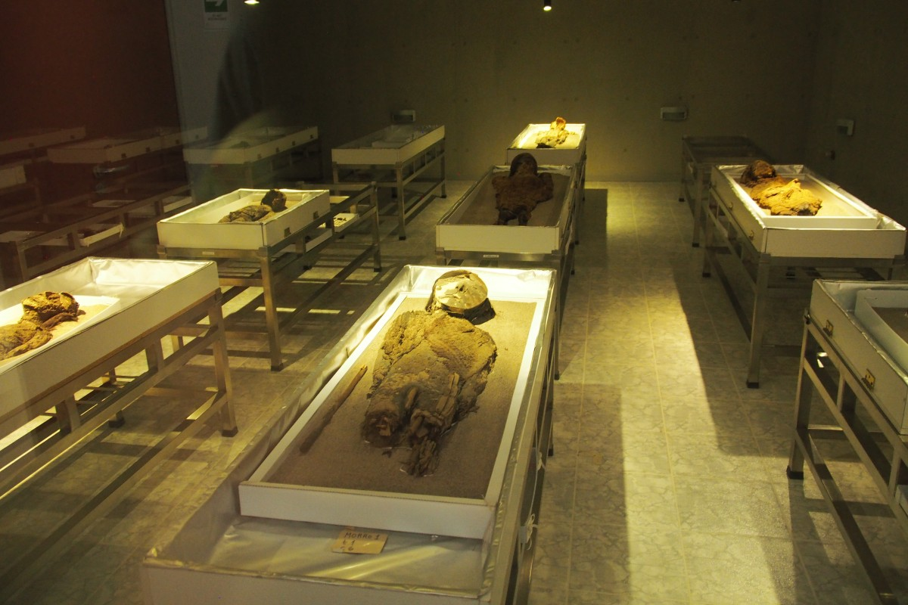
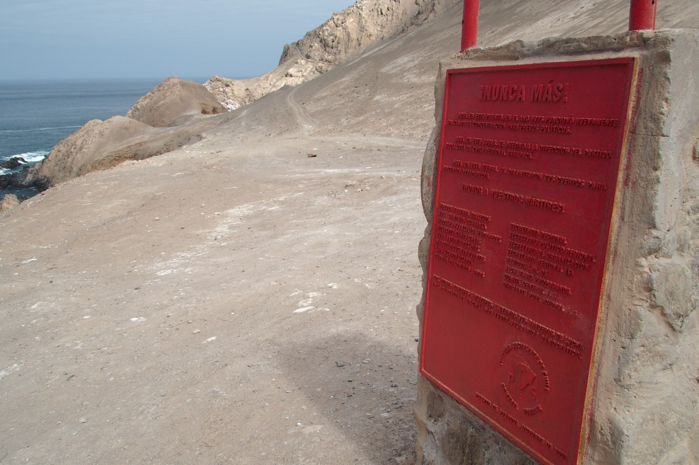
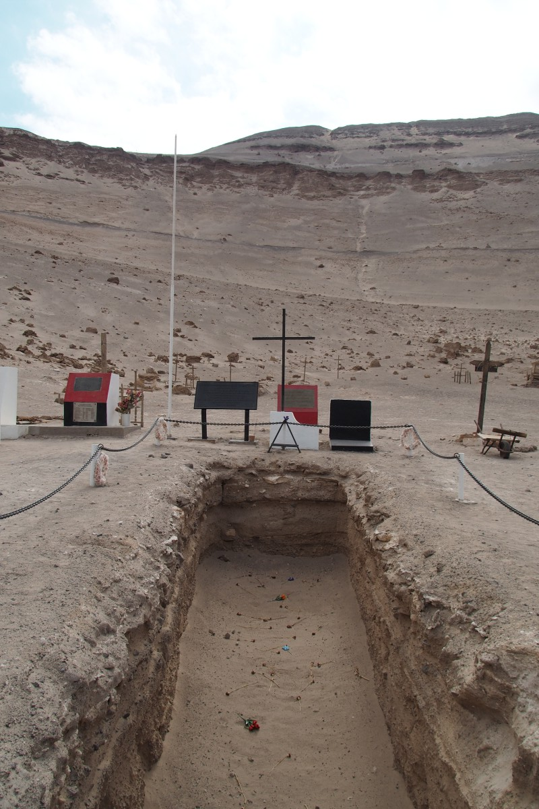
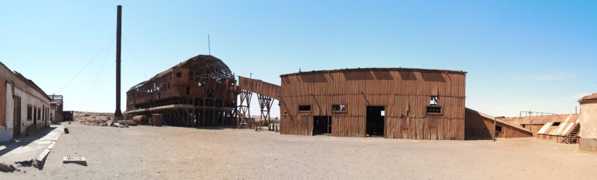
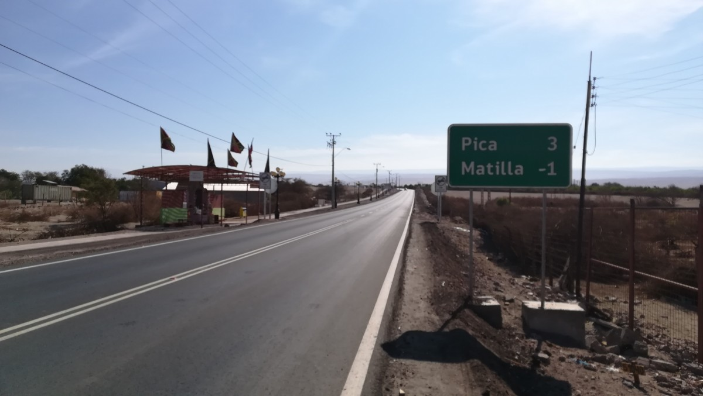
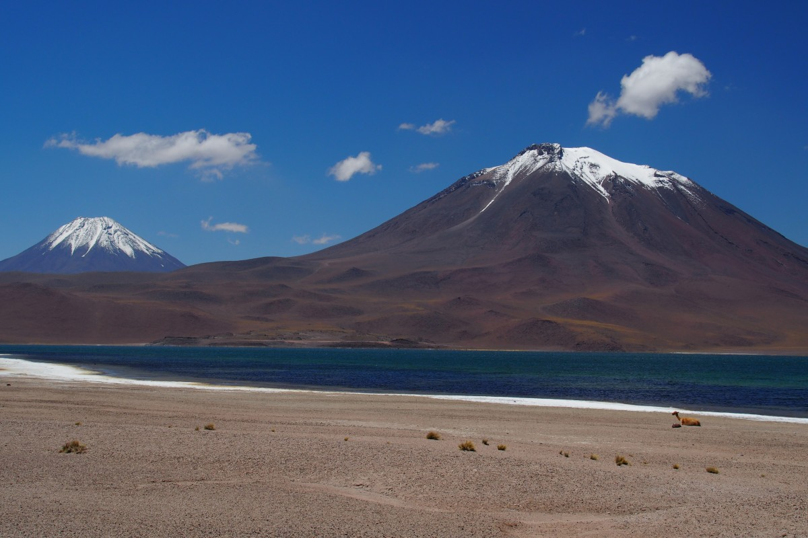
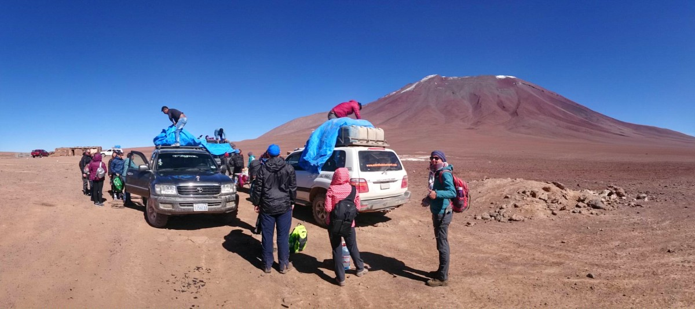
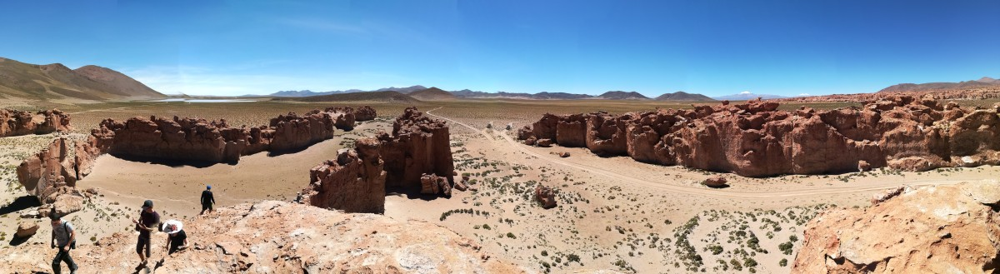
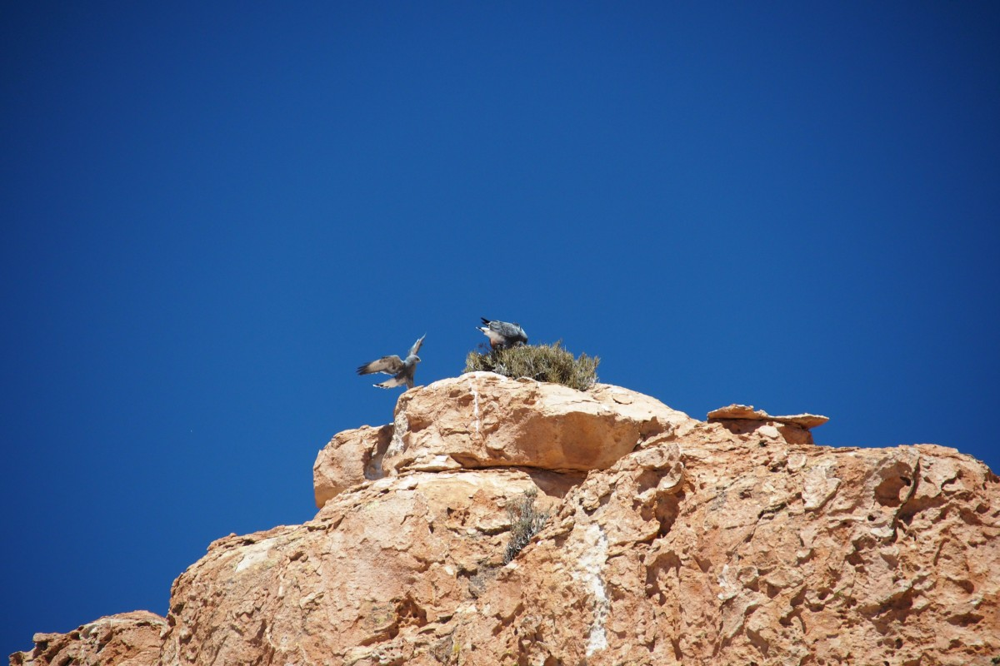
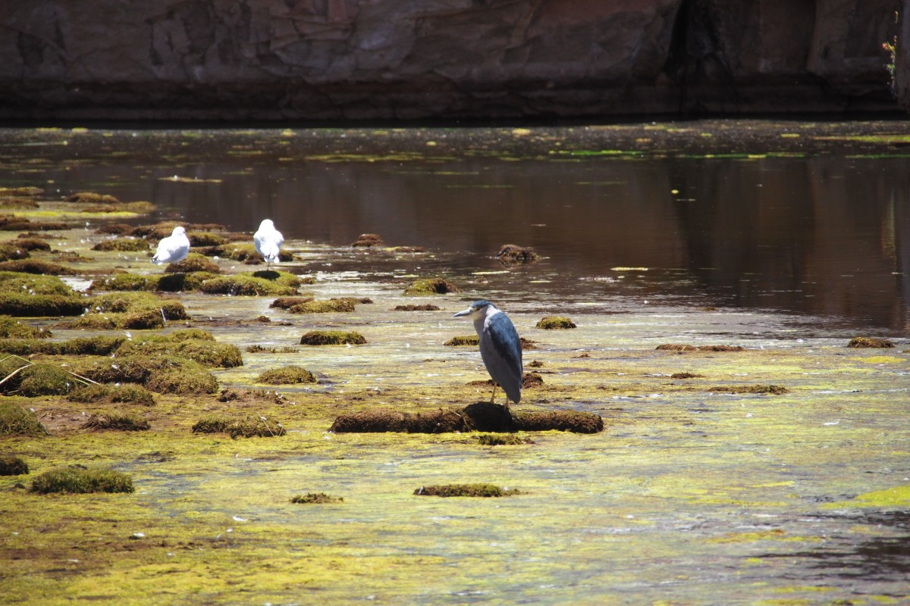

Het tweede deel van onze reis tussen Santiago en Bolivië begint in Arica, de meest noordelijke stad van Chile. Dat ligt op een steenworp afstand van Peru, maar Peru moet nog even wachten. Eerst willen we nog de Atacama-woestijn onveilig maken met onze campervan en daarna dwars door de zoutvlakte Uyuni naar Bolivië reizen.

### Campertocht

Op zaterdag 3 maart ging het dan echt loos. In de ochtend pikten we onze campervan op: we waren blij verrast want Wicked Camper staat nou niet bekend om z’n goede campervans maar die van ons was relatief nieuw. Prima dus, we hadden er zin in! Na nog een halve dag rondrijden in Arica, voor boodschappen, voor benzine, voor vergeten spullen in het hostel, gingen we dan eindelijk op weg.

Onze eerste stop was een archeologisch museum, speciaal opgezet rondom een honderdtal Chinchorro mummies. In de jaren tachtig stuitten ze bij het aanleggen van een pijp opeens op een begraafplaats van zo’n 7.000 jaar oud, waarvan de lichamen goed bewaard waren gebleven door de droogte van de woestijn. Het museum vertelde over die Chinchorro-cultuur, die (voor zover bekend) als eersten ter wereld (zelfs voor de Egyptenaren) begonnen met het mummificeren van hun doden. De mummies zelf vormden een wat angstaanjagend beeld. Wij waren op dat moment de enige bezoekers in de slechtbelichte kelder van het museum. Achter glas in het halfdonker lagen ze zij aan zij op stalen lijktafels. Het einde van dit mortuarium was in het donker niet te zien. Gelukkig waren deze mummies echt dood; geen enkele heeft onze hersenen proberen op te eten.

De Atacamawoestijn klinkt overigens onbewoonbaar (en ziet er voor het grootste deel ook zo uit) maar tot zo’n 100 jaar geleden woonden en werkten hier honderdduizenden mensen in de salpeter-industrie. ‘Chilisalpeter’ werd wereldwijd gebruikt in explosies en kunstmest en was zo kostbaar dat er zelfs een oorlog over werd gevoerd (met Bolivië, dat er sindsdien nog steeds om treurt dat het de toegang tot de zee verloor, nu de slechte verliezer speelt, en de zaak voor het Internationaal Strafhof in Den Haag voorlegt). Steden als Iquique beleefden eind 19e eeuw hun hoogtijdagen door het salpetergeld. Er wordt zelfs gezegd dat nergens anders ter wereld er zoveel champagne vloeide als in Iquique. Dat duurde tot ongeveer de Eerste Wereldoorlog. Toen ontdekten de Duitsers een andere manier om kunstmest te maken, stortte de Chileense miljoenenindustrie als een kaartenhuis in elkaar.

\[caption id="attachment\_1050" align="aligncenter" width="900"\] Atacama\[/caption\]

Tegenwoordig zijn er langs de snelweg door de woestijn nog genoeg tekens van de bloeitijd van destijds. Oude salpetermijnen met namen als Buena Esperanza (goede hoop), Prosperidad (voorspoedigheid), Rica Aventura (rijk avontuur) geven wel aan dat de bomen tot in de hemel leken te groeien. Inmiddels zijn het allemaal halfingestorte plekken in verlaten uithoeken waar geen hond meer te bekennen is (en dat zegt wat in Zuid-Amerika met al z’n zwerfhonden!).

Wij tuften vanuit het museum door naar Pisagua. Ook dat was ooit een rijk salpeterstadje, maar nu slechts nog een ieniemini-vissersdorpje. De weg ernaartoe is echter prachtig. Tussen Arica en de afslag naar Pisagua duik je vier keer diepe ravijnen in waar opeens wel water is en dus leven. De afslag naar Pisagua ligt op het oog in the middle of nowhere. De weg duikt aan het eind bij een hoge klif opeens naar beneden en kronkelt zich via haarspeldbochten uiteindelijk richting de Pacifische kust. We waren net te laat voor de zonsondergang, maar genoten onderweg wel van de warme kleuren op het rode woestijngesteente. Vanaf onze campingspot zagen we zeeleeuwen vrolijk ronddobberen langs de kustlijn. Geen slechte eerste slaapplek.

Pisagua speelt nog een rol in een recenter hoofdstuk van de Chileense geschiedenis. In de tijd van Pinochet stond hier een gevangeniskamp. In de jaren negentig is hier een massagraf gevonden met twintig lichamen erin. Op het monument staan nog meer namen, ook van mensen waar ze nooit meer iets van gehoord of gevonden hebben. Op zo’n prachtige plek aan de kust gaan hier je nekharen van overeind staan.

Vanuit Pisagua reden wij door naar Humberstone, nog zo’n spookstad uit de salpetertijd met als enige verschil met de andere verlaten stadjes dat hier nog wel alles overeind staat. De huizen, van de arbeiders tot die van de opzichter, de kerk, het hotel met zwembad, het theater, het ziekenhuis. Alleen de bewoners ontbreken. Aan de rand van het verlaten dorp staat de fabriek waar uit het gesteente salpeter en jodium gewonnen werd. We kregen er de kriebels van de wind die oude verroeste platen liet kraken en piepen. Het was dat de zon scheen, anders had het zo een horrorfilm kunnen zijn.

\[caption id="attachment\_1084" align="aligncenter" width="900"\] Pool\[/caption\]

\[caption id="attachment\_1101" align="aligncenter" width="900"\] Factory\[/caption\]

We sliepen die tweede nacht in Pica, een oasedorpje met lekkere warmwaterbronnen en net zo lekkere, verse sappen. Vanuit daar reden we weer een paar uur – her en der achtervolgd door een stofduivel (stofhoos) – voordat we een stop maakten bij een bijzondere archeologische plek: de geoglyphen van Chug Chug. Er zijn duizenden geoglyphen te vinden in de Atacamawoestijn: megagrote figuren en symbolen op heuvels en bergen, gemaakt om de handelskaravanen in de pre-Spaanse tijd de weg te wijzen.

### Houd de dief!

En toen waren we in Calama. Die stad heeft een nare bijsmaak achtergelaten. Als enige grote stad in de buurt van San Pedro de Atacama moesten we daar boodschappen doen. We parkeerden in een garage waar bewakers rondliepen en namen uit voorzorg al onze waardevolle spullen mee de supermarkt in. Desondanks troffen we bij terugkomst de passagiersdeur opengebroken en onze grote backpacks verdwenen.

Direct schoot er door ons hoofd wat er allemaal nog meer in die backpacks zat. Ja, we hebben al onze waardevolle spullen nog, maar oh nee, Freke’s dagboek zat er nog in. En al onze kleren, ondergoed, medicijnvoorraden, de oplader van de camera… En de backpacks zelf natuurlijk, toch een beetje je thuis op reis. In de hoop dat de dieven de rugzakken dumpen – zodra ze zouden merken dat ze buiten ons vieze ondergoed niet veel buitgemaakt hadden – speurden we nog de omgeving af, maar helaas. We hebben anderhalf uur op het politiebureau gezeten, waar ze teleurstellend weinig doen tegen dit soort misdaden, en de volgende dag hebben we de halve mall leeg gekocht. Zo snel mogelijk wilden we weer de weg op, weg uit Calama. Die avond zagen we nog net de laatste zonnestralen over de Valle de la Luna (de maanvallei), naar verluidt een van de mooiste plekken in de woestijn om de zonsondergang te zien, maar het was nog lastig om ervan te kunnen genieten.

\[caption id="attachment\_1117" align="aligncenter" width="900"\] Sunset Valle de la Luna\[/caption\]

\[caption id="attachment\_1119" align="aligncenter" width="900"\] Sunrise Valle de la Luna\[/caption\]

\[caption id="attachment\_1299" align="aligncenter" width="300"\] Sunrise dance\[/caption\]

Dat gevoel kwam gelukkig langzaamaan weer terug. Je kan ook niet anders in zo’n mooie omgeving als die rondom San Pedro de Atacama. Na een nacht aan de rand van de Valle de la Luna genoten we al wat meer van de zonsopkomst daar. We reden door naar de verborgen lagunes van Baltinache, die meer zout bevatten dan de Dode Zee. En je kan er in zwemmen! Nou ja, ‘zwemmen’. Vanaf de rand lieten we onszelf voorzichtig achterover vallen. Je verwacht een plons die niet komt omdat je gewoon blijft drijven. Als je rechtop staat, hoef je niet te watertrappelen om je hoofd boven water te houden. Sterker nog, je schouders worden niet eens nat. Een heel aparte ervaring. Teruglopend naar de campervan droogde het zoute water langzaam op en liet onze lichamen helemaal wit achter. Een gratis scrupbeurt, asjeblieft! Gelukkig waren er douches.

\[caption id="attachment\_1124" align="aligncenter" width="900"\] Laguna Baltinache\[/caption\]

Na een tankstop in San Pedro de Atacama karden we door naar Laguna Chaxa, middenin de zoutvlakte van Talar. Zo’n zoutvlakte ontstaat door de afzetting van zout uit de Andes, waar het water verdampt onder de hete woestijnzon. Toch zijn er plekken met water en daar weten vooral flamingo’s hun maaltijden te vinden. In Laguna Chaxa zagen we ze voor het eerst, terwijl we wachtten op de zonsondergang. Die nacht sliepen we net buiten het beschermde gebied voor de flamingo’s, op een plek waar het zo donker werd dat de melkweg fel afstak in de sterrenhemel.

\[caption id="attachment\_1137" align="aligncenter" width="900"\] Flamingos\[/caption\]

De volgende dag stond in het teken van hoogte: de ‘altiplano’ (hoogvlakte). Voor het eerst in ons leven gingen we naar hoogtes boven de 3726 meter. Dat persoonlijke record stond nog op de vulkaan Rinjani in Indonesië en dat moesten we nog klimmend doen. Hier lieten we de kleine 1.2L-motor het zware werk voor ons doen. Onderweg moesten we talloze plasstops maken, want zo ontdoet je lichaam zich nou eenmaal van de schadelijke stoffen die hoogteziekte veroorzaken. We kwamen langs meren met de meest ongelooflijke kleuren, zagen vicuña’s (een soort wilde lama’s) en besneeuwde bergtoppen die niet zo hoog lijken maar toch meer dan 6.000 meter zijn. En passend passeren we nog de [steenbokskeerkring](https://nl.wikipedia.org/wiki/Steenbokskeerkring).

\[caption id="attachment\_1152" align="aligncenter" width="900"\] Altiplano\[/caption\]

Die avond sliepen we ook op hoogte: 4.300 meter welteverstaan, bij de ingang van de El Tatio geisers. Die zijn namelijk het meest actief rond zonsopkomst, onder invloed van de temperatuurverschillen tussen dag en nacht. Om er niet midden in de nacht naartoe te hoeven rijden, zetten we de avond ervoor al ons kamp op bij de ingang. En we hebben gemerkt dat het ‘s nachts flink koud kan worden op die hoogte: -7. De ramen van onze campervan waren bevroren. Van binnen… En toen mochten we nog een paar uur buiten staan, om de geisers te bewonderen. Malte ging halverwege maar even in de auto zitten om op te warmen, Freke warmde haar handen op aan een van de mini-geisertjes waar hete stoom uitkwam. Samen deelden we een paar handschoenen van een van de parkmedewerkers, aangezien we nog geen nieuwe handschoenen hadden gekocht.

De weg terug naar San Pedro de Atacama was zo mogelijk nog mooier. De ene besneeuwde bergtop na de andere stak scherp af tegen de blauwe lucht, met op de voorgrond hordes vicuña’s. Een van de bergtoppen was een vulkaan waar nog rook van opstak. Omdat de krater bijna verticaal gevormd was, zou je er, met een goede verrekijker, zelfs zo in kunnen kijken.

\[caption id="attachment\_1172" align="aligncenter" width="900"\] On the way back\[/caption\]

We hadden echter een beetje haast, want de Valle de la Luna, waar we al eens de zonsondergang hadden bewonderd, stond nog op ons lijstje. Daar kan je namelijk ook doorheen rijden. Dat moest uiteindelijk een beetje snel snel, want we moesten ons rijdende onderkomen weer op tijd schoon inleveren. Dat ging gelukkig zonder problemen.

 We besloten nog een dagje in San Pedro de Atacama zelf te blijven. Met de campervan dagen op pad, en dan ook nog zo’n nare belevenis in Calama, was toch best vermoeiend en we hadden nog wel het een en ander nodig voordat we doorreisden naar de zoutvlaktes van Uyuni.

### De zoutvlaktes van Uyuni

Maar toen was het zover: na drie maanden lieten we Chili achter ons en betraden we eindelijk Bolivië. Per tour, want de zoutvlaktes van Uyuni zijn nou niet echt gebied om in je eentje te verkennen. We hadden een erg leuke groep, met mensen van ongeveer onze leeftijd uit Ierland, Bulgarije, Australië, Brazilië, Amerika en nog zo wat landen. Toch fijn want je zit wel drie dagen op elkaars lip.

Dag 1 bracht ons langs een paar prachtige meren, met namen als Lago Blanco, Lago Verde (dat helaas door het gebrek aan wind meer bruin dan groen was), Lago Colorado (met talloze flamingo’s), en een stel warmwaterbronnen met volgens ons het mooiste uitzicht ooit. Het hoogtepunt, letterlijk (op 5.050 meter hoogte) en figuurlijk, waren opnieuw een stel geisers. Deze stoomden minder dan die van El Tatio, maar hadden gaten vol modder die gorgelden en boerden als een stel lomperikken. Het rook er ook naar. Het was toch ongelooflijk om op zo’n hoogte te zijn, waar besneeuwde bergtoppenvan 6.000 meter hoog net boven de horizon uit piepen.

\[caption id="attachment\_1196" align="aligncenter" width="900"\] Lago Blanco\[/caption\]

Die nacht sliepen we in een hostel in een klein dorpje op de hoogvlakte. Meteen werd duidelijk dat we niet langer in Chili waren omdat de mensen, vooral de vrouwen, er traditioneel gekleed gingen in paarse rok, een eigen hoed en poncho. Wat een gek idee dat twee buurlanden zó verschillend kunnen zijn, maar met zo’n hoogvlakte en een woestijn ertussen is er maar weinig interactie tussen de twee.

Dag 2 stond in het teken van vulkanische rotsformaties. De een lijkt op de FIFA-wereldbeker, de ander op een kameel. Je kan er alles in herkennen, als je het maar wil zien. Lunchen deden we in een prachtige, groene vallei met tientallen lama’s en een enkele viscacha (een combinatie van een konijn en een kangoeroe). Net toen we weer onderweg waren en iedereen een beetje indommelde, klonk er een schrapend metalig geluid vanonder onze auto. Dat kan niet goed zijn, dachten we allemaal. Het viel mee: iets met het tractiecontrolesysteem, een auto-onderdeel dat een leuk extraatje is voor een 4x4 maar waar je ook zonder kan rijden, verzekerde onze chauffeur ons (de chauffeur die Michael heette maar zichzelf Magic Mike noemde. We wachten nog steeds op de striptease…) Onze chauffeurs, die tegelijkertijd onze gids, kok en automonteur waren, sleutelden een uurtje en toen ging het weer verder. Onderweg langs een diepe kloof (de Canyon van de Anaconda, omdat de rivier op een zwarte slang lijkt) en een dorpje met een verlaten treinstation (maar met eigen bier gemaakt van quinoa) liet de tractie toch nog geregeld van zich horen. Toch niet handig als je de volgende dag de echte zoutvlaktes op wil rijden. Zoutvlaktes die in deze tijd van het jaar geen droge, dorre bedoeling zijn, maar 1 tot 30 centimeter onder water staan door de vele regen in het regenseizoen. De hele avond waren de chauffeurs daarom nog aan het sleutelen om de volgende ochtend om 5 uur richting zonsopgang te kunnen vertrekken.

Het was overigens, om minder technische redenen, niet eens zo vanzelfsprekend dat we over de zoutvlaktes zouden rijden. Bij vertrek uit Chili was het plan nog om rond de zoutvlaktes te rijden, juist omdat ze nu onder water staan. De chauffeurs hadden echter andere plannen en wisten hun bazen (mede onder ons enthousiasme, want over de zoutvlaktes rijden is veel leuker) te overtuigen. Oke, maar dan wel goed bij elkaar blijven voor het geval er iets misgaat.

Na de nacht in het zouthostel (geheel gemaakt van zout; Malte heeft de muur getest en dit bevestigd) reden we dus langs de rand van de zoutvlaktes terwijl de eerste kleuren van de zonsopkomst al voor een prachtig schouwspel zorgden. Als de zoutvlakte onder water staat, wordt het een soort spiegel waardoor je tijdens zonsopkomst eigenlijk twee zonnen op ziet komen. Met onze blikken gefixeerd op de horizon reden we door het 15-20 cm hoge water. Tot… op nog geen kilometer weg van het vasteland een van de auto’s stopte en wild met z’n lichten begon te knipperen. Hij was vastgelopen.

Terwijl wij op slippers onze eerste stappen zetten in het ijskoude, zoute water en van de zonsopkomst genoten (want we verwachtten dat dit oponthoud hoogstens een uurtje gaat duren), schoten de andere chauffeurs te hulp. Een van de auto’s probeerde de vastgelopen auto eruit te trekken. Dat bleek echter nog niet zo makkelijk. Vier uur lang probeerden de drie chauffeurs de auto zelf los te trekken. Zij hadden immers de verantwoordelijkheid genomen om over de zoutvlaktes te rijden en het zou een enorm gezichtsverlies betekenen als ze hun bazen toch om hulp moesten bellen. Maar na vier uur duwen, trekken, en zoutig worden liep ook de tweede auto vast en was het welletjes. Er werd een telefoontje gepleegd naar het dichtstbijzijnde dorpje en terwijl we op hulp wachtten, ontbeten we. Ondertussen had de zon het ondiepe water opgewarmd, zodat onze voetjes weer konden ontdooien en er zelfs een soort poolparty-sfeer ontstond.

Uiteindelijk kwamen er drie personen aan gewandeld met een lange stok, een lege gasfles en een stel planken. Dus, voor zover de Wegenwacht van Uyuni. Ze construeerden er een hefboom mee waarmee ze de auto wiel voor wiel optilden. Onder de wielen legden ze de planken. Dat moesten ze een paar keer herhalen want telkens liep de auto na een paar meter weer vast in de modder. Uiteindelijk, zeven uur later, waren de twee auto’s weer los en konden we verder. Maar ach, zeiden we steeds tegen elkaar, je hebt slechtere plekken om vast te lopen. De foto’s spreken voor zich.

Eindelijk weer onderweg kwamen we al snel op droger land, waar het meeste regenwater al was verdampt en we aardig konden doortuffen. Het zag eruit als één grote ijsvlakte, inclusief kleine gaten die er uitzagen als wakken. We werden er een beetje zenuwachtig van, zeker toen onze gids Michael vertelde dat er onder de metersdikke laag zout, op zo’n 100 meter onder ons, gewoon water zat. Dat komt via de gaten omhoog en verdampt daar. Lopend kan je daar zelfs invallen, maar de auto niet, verzekerde ‘Magic Mike’ ons. We moesten hem maar op zijn woord geloven.

Bij het vallen van de avond arriveerden we dan eindelijk in het stadje Uyuni, waar we zonder oponthoud eigenlijk in het begin van de middag hadden moeten zijn. Het maakte het bezoek aan de treinbegraafplaats echter nog meer de moeite waard. De plek waar tientallen oude stoomlocomotieven liggen te verroesten, werd prachtig verlicht door de ondergaande zon. Een mooie afsluiting.

Samen met een koppel uit Bulgarije besloten we die avond nog door te reizen naar Potosí. Gehaast namen we afscheid van onze medereizigers en haalden we nog snel een portie rijst, friet en kip. Zo’n 24 uur later bleek dat laatste een slecht idee te zijn geweest, als we beide geregeld op de wc te vinden zijn. Welkom in Bolivië!

### Het stadsleven van Bolivië

Potosí, op 4.090 meter een van de hoogstgelegen steden ter wereld, doet bij de meeste mensen misschien geen belletje rinkelen. Ten onrechte want ooit was dit de grootste stad van Zuid-Amerika, vergelijkbaar met het Londen van tegenwoordig. Het zilver dat hier gemijnd werd, financierde zo ongeveer het hele Spaanse wereldrijk. Zo’n 60 procent van het zilver kwam in de 16e, 17e en 18e eeuw uit Potosí. Zelfs het dollar-teken is afgeleid uit het merkteken op de Potosí-zilvermunten (S+I=$; ooit stonden hier ook nog de letters P en T (van PoToSI) in maar die zijn ondertussen verdwenen). De Spanjaarden vonden weliswaar niet El Dorado, de stad van goud, maar ze hadden wel Potosí, de stad van zilver. De voormalige zilvermijn, al lang geleden uitgeput maar waar ze nu nog wel andere metalen mijnen, is te bezoeken maar dat lieten we aan ons voorbijgaan. De arbeidsomstandigheden zijn er beroerd en dat wilden we niet nog meer financieren. Wel bezochten wij het Casa de la Monedad, de vroegere geldmunterij en nu een museum.

Ook de ontstaansgeschiedenis van Sucre, onze volgende en huidige bestemming, is nauw verbonden aan die zilveren geschiedenis. Hier, de constitutionele hoofdstad van Bolivië, streek de rijke elite neer en bouwde er hun eigen, witte stad vol mooie gebouwen op een wat schappelijkere hoogte (2800 meter).

Wij rusten hier nu uit van de afgelopen drukke reisweken en we spijkeren ons Spaans bij. Een paar uur per dag krijgen we privéles en daarnaast leren we koken met quinoa en spelen we wallyball (een Boliviaanse variant op volleybal dat ook veel weg heeft van squash…). Voor deze twee weken hebben we zelfs ons eigen appartementje, met een eigen badkamer en keuken. Heerlijk! Hoewel, we koken niet heel vaak, omdat we al snel ontdekten dat je soms goedkoper uit bent door uiteten te gaan (3,30 euro voor een soep, hoofdgerecht, dessert en sap!). We kunnen niet klagen…

