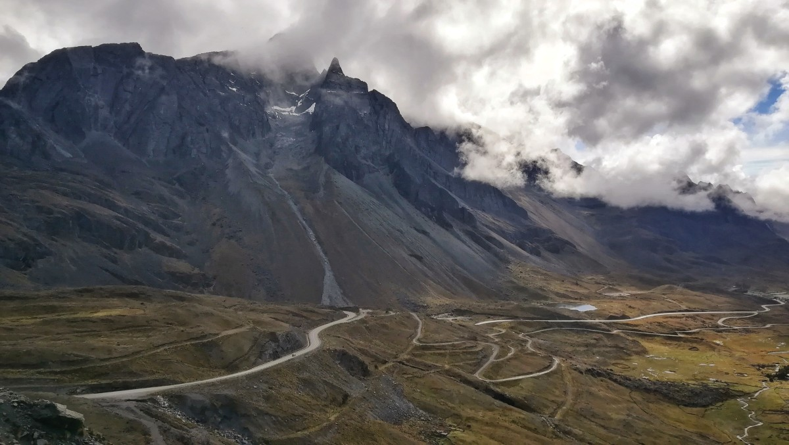
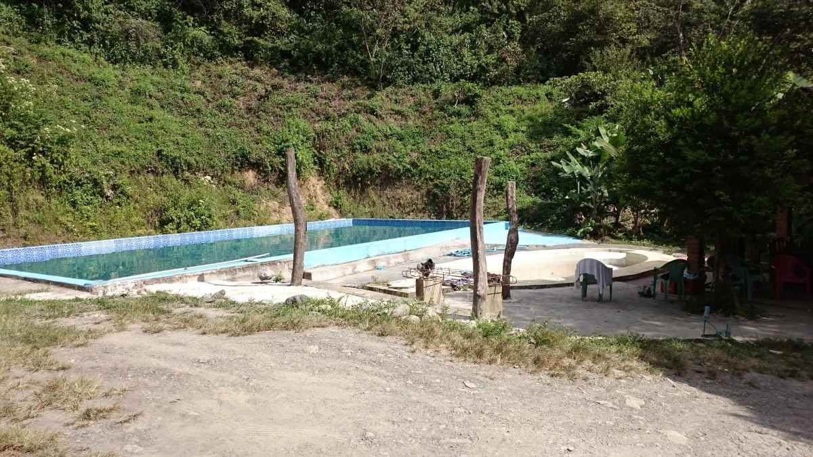

Heel wat uren in de bus verder zijn we inmiddels in Peru! En daar kijken we onze ogen uit: ze hebben hier grote supermarkten! En mooi belichte etalageruiten. En brede stoepen zonder gaten erin. Het lijkt wel alsof we nu pas realiseren hoe arm Bolivia eigenlijk was.

Dat hadden we al wel een beetje door toen we in Sucre waren. Die stad zag er weliswaar mooi uit, maar als je, zoals wij na de diefstal in Calama, veel dingen nodig hebt, dan merk je pas hoe weinig zo’n land heeft. Contactlenzen met cilinder voor Freke? Dat duurt 1 tot 3 maanden want dat moeten ze nog importeren. Malariapillen? Na flink wat zoeken heeft één apotheek wel wat maar dat is volgens onze dokter in Nederland niet geschikt voor de malaria in Bolivia. Hoe ironisch. Flight bags? Nog nooit van gehoord.

Het leek ons dat de Boliviaanse economie ergens in de late Middeleeuwen is blijven steken. De markt is vooral aanbodgedreven. Als klant moet je het doen met wat er is. Zo is er een markt vol restpartijen en gedoneerde kleding uit Europa en Amerika. Daarnaast zijn de meeste winkels vaak gespecialiseerd in één product of ze bieden precies één dienst aan. De tomatenboer verkoopt zijn tomaten, de bananenimporteur zijn bananen, en de werkplaats om remmen te repareren, kan niet veel meer dan remmen repareren. Naar onze verhoudingen nog steeds tegen spotprijzen.

Maar goed, Renée zou snel komen en dan zouden we weer grotendeels voorzien zijn in alle westerse comfortartikelen. Moet ze wel de juiste tas meenemen van de bagageband… Maar dat is een verhaal voor later!

Nu nog even terug naar Bolivia. Op Tweede Paasdag (een gewone maandag hier), na een laatste Salteña met onze ‘huisbaas’ Javier, vlogen wij naar Santa Cruz. Het is maar een paar honderd kilometer, maar de weg ernaartoe leek ons te slecht na het regenseizoen en dus kozen we voor een vlucht van een half uurtje. We kregen zelfs een snack en drinken!

Omdat Santa Cruz zelf niet zoveel te bieden heeft, namen we meteen een trufi om ons naar Samaipata te brengen. Samaipata is vooral populair onder Westerse immigranten en ligt nabij het Nationaal Park Amboró waar drie ecosystemen samenkomen: de Andes, de Amazonewoud en het [nevelwoud](https://nl.wikipedia.org/wiki/Nevelwoud). Het nevelwoud ligt op zo’n 2.000 meter hoogte en wordt gevoed door de vochtige lucht uit de natte Amazone. Dat stijgt op en de winden rondom de evenaar drijven dat als wolken de bergen in, waar het nevelwoud van leeft. Oeroude boomsoorten kan je hier vinden, vertelde onze gids, zelfs soorten uit de tijd van de dinosaurussen. Ze wees ons op de gigantische varens (sommigen wel 10-15 meter hoog) die, als ze omvallen, gewoon weer verder kunnen groeien en zo wel honderden jaren oud kunnen worden.

In de omgeving van Samaipata vind je ook nog drie watervallen die we bezochten en waar Freke zelfs nog in gezwommen heeft. Niet in dezelfde waterval als waar de grootste cultuurclash ooit plaatsvond: we zagen daar enerzijds een groep luidruchtige Russen/Oost-Europeanen/andersoortige westerlingen met melkflessen en anderzijds een Mormoonse familie op uitstapje die de frivoliteit van de anderen met samengeknepen mond aanschouwden. Harmonie ziet er anders uit…

Vanuit Samaipata gingen we onderweg naar La Paz, de officieuze hoofdstad van Bolivia (ook al voelde het veel meer als een hoofdstad dan het provinciale Sucre). Die rit nam twee dagen in beslag en ging over hoge bergkammen in de wolken en langs lieflijke vlaktes die wel aan Zwitserland deden denken. Alleen de inheemse bevolking met hun kleurrijke kleding en de huizen van klei pasten daar dan niet bij. Om de zoveel tijd passeerden we een dorp van een paar huizen groot, waar vrijwel altijd één restaurant met rode plastic stoeltjes van een bepaald frisdrankmerk te vinden was. Op andere plekken deden mensen de was in de rivier of ploegden het land met os en wagen. De chauffeur reed overal luid toeterend langs zodat mensen de bus niet misten. Hij toeterde sowieso veel. Bijvoorbeeld ook in blinde bochten om tegenliggers te waarschuwen niet de binnenbocht te nemen.

Langs de weg zijn hier talloze rotsen en huizen beschilderd met ‘si! Vota Evo!’ Het zijn overblijfselen van het referendum over Morales’ presidentschap of hij mocht blijven of niet ondanks het verstrijken van zijn termijn. De grondwet is daar eigenlijk heel duidelijk in: nee, dat mag niet, maar daar trekt ‘men’ zich niet zoveel van aan. De ‘no’ langs de weg is verreweg in de minderheid: de propagandamachine van de overheid draaide op volle toeren en de president tegenspreken is gevaarlijk. Enkele Bolivianen hebben ons in omhulde termen of achter gesloten deuren desondanks verteld over hoe ze denken over Evo Morales en dat is niet mals. Maar het was gek om te merken hoe gevaarlijk het eigenlijk voor ze is om hun mening te geven. Het nee-kamp heeft destijds wel de overwinning behaald. Dat was echter anderhalf jaar geleden en Morales is nog steeds president. In zijn wereld was de vraag van het referendum onduidelijk en hebben veel kiezers ‘nee’ gestemd terwijl ze eigenlijk ‘ja’ bedoelden. Sterker nog, naar alle waarschijnlijkheid doet hij volgend jaar gewoon weer mee aan de verkiezingen.

De tweede dag in de bus – we hadden Cochabamba nog maar net achter ons gelaten – begon met een harde knal. Lekke band… Gelukkig gebeurde dat precies op 10 meter rollen van een ‘gomeria’ waar je je band kan laten plakken. We wachtten in de bus terwijl de band verwisseld werd. Naast de gomeria had een restaurant net een varken geslacht en twee vrouwen waren druk bezig al het vel van het zware beest te scheren en te scrubben.

Toen we weer op weg waren ging de weg al snel omhoog. En omhoog en omhoog. Er leek geen einde aan te komen. Net toen we dachten dat we met 4100 meter toch wel de hoogste pas hadden gehad, bleek het nog hoger te kunnen: tot wel 4500 meter. Tot in de blauwe nevelen in de verte kon je de bergkammen zien. We moesten ook wel omhoog want La Paz is met 3640 meter de hoogste hoofdstad ter wereld (zeggen de Paceña zelf, ook al is het dus geen hoofdstad).

\[caption id="attachment\_1434" align="aligncenter" width="900"\] La Paz\[/caption\]

La Paz is, om eerlijk te zijn, toch wel een van de lelijkste hoofdsteden die we ooit gezien hebben. Veel mooie gebouwen om te bezoeken hebben ze niet. De walking tour waar we altijd mee beginnen, ging dan ook voornamelijk over de vele markten van de stad. Naast de gebruikelijke groente/fruit/rommelmarkt had La Paz ook een heksenmarkt met praktische drankjes voor allerlei kwaaltjes, kommer en kwel in de liefde, en wraakacties. Op de ingrediëntenlijst staan diverse kruiden en lama-embryo’s. Wij hadden echter al heel wat Boliviaanse markten gezien en waren ze een beetje beu: er is veel maar zie maar eens te vinden wat je zoekt…

Indrukwekkender was de begraafplaats. Begraafplaatsen in Bolivia zien er een beetje anders uit als bij ons in Europa. In plaats van onder de aarde schuift men de lichamen hier in muurgaten. Die gaten worden dichtgemetseld en aan de voorkant krijgen de graven een klein, glazen deurtje. Daarachter worden dingen neergezet die de overledene graag mocht. Behalve bloemen en kaarten kan dat ook eten, drinken of, in geval van een kind, speelgoed zijn. Voor zo’n laatste rustplaats moet je echter jaarlijks huur betalen. Als de nabestaanden niet meer betalen, wordt het lichaam er weer uitgehaald. Wordt het lichaam daarna door niemand geidentificeerd, dan wordt het gecremeerd en verdwijnt het. Voor wie toch nog wordt betaald, die wordt gecremeerd en in een kleiner gat gezet. Zo zorgen ze er voor dat de begraafplaats, midden in de grote stad, niet vol geraakt.

La Paz, gevestigd in een diepe kloof, is eigenlijk op zijn best van een afstandje, van boven vanuit één van de vele ‘teleférico’s’, het openbaar vervoer per kabelbaan. Dan pas kan je goed waarderen hoe enorm de stad is. De huizen klimmen tegen de kloofwanden op en stromen over over de rand naar waar het niet meer La Paz heet maar El Alto. Daar woont nog eens een miljoen andere mensen, voornamelijk arm, in de hoop ooit zo rijk te worden dat ze in de kloof kunnen wonen.

In de verte zag je vanuit je cabine de besneeuwde bergtoppen van meer dan 6.000 meter hoogte. Daar lonkte de cordillera en hoe kan je die beter in korte tijd zien dan vanaf de Death Road. De Death Road, de meesten wel bekend van bijvoorbeeld een [Top Gear-special](https://www.youtube.com/watch?v=WXLxszv9eCM), kreeg die bijnaam in de jaren negentig toen een Amerikaanse bank berekende dat daar ongeveer om de dag iemand overlijdt. Niet zo gek ook als je bedenkt dat het grotendeels een onverharde eenbaansweg was waar desondanks al het verkeer richting het noorden van het land langs moest. Ook trucks en dubbeldekkers dus.

Dat is gelukkig allemaal verleden tijd sinds er een nieuwe weg geopend is, met asfalt, twee rijbanen en een vangrail. Sinds 2006 is de voormalige Death Road dan ook vooral het domein van toeristen die er per mountainbike naar beneden zoeven. Nog wel voorzichtig uiteraard, want ook fietsen kunnen over de rand vliegen en dat is ook al een paar keer gebeurd. Maar het is een leuke manier om ook nog iets van de groene bergen daar te zien.

\[caption id="attachment\_1472" align="aligncenter" width="900"\] Yungas "Death" Road\[/caption\]

Wij kozen onze touroperator zorgvuldig (je wil toch dat je remmen het doen op zo’n weg) en bleken uiteindelijk downhill te gaan met één van Zuid-Amerika’s beste downhill-bikers. Tof. De tocht begon op 4650 meter hoogte en eindigde uiteindelijk op 1200 meter, over een lengte van 62 kilometer. Het eerste deel was nog op asfalt, om te wennen aan je fiets. De bergen waren alleen bedekt met wat gras, waar de rotsen hard en kaal tussen afstaken. Hoe anders was dat 32 kilometer verderop, waar de echte Death Road begon. Daar zat je al heel snel in het natte groen van de jungle. Je moet er links rijden, wat erg tegennatuurlijk is als links van je de berg naar beneden duikt. In Bolivia zit het stuur van de auto, net als bij ons, aan de linkerkant en dus kan de chauffeur zo goed zien hoeveel ruimte hij nog heeft voor hij met auto en al naar beneden zou donderen. Aan het einde van de weg was het land droger en zonnig en af en toe staken enorme, kleurrijke vlinders de weg over (onze gids: ‘die vlinders doden mensen. Die zijn dan te afgeleid en dan gaat het mis’). Begonnen we de tocht nog met drie lagen kleren aan, aan het einde waren we blij met het zwembad om in af te koelen.

Bij het Titicaca-meer brachten we onze laatste dag in Bolivia door. Isla del Sol, bekend als het hart van het oude Incarijk, sloegen we over. Er is al maanden een protest gaande op het eiland om de toeristendollars waardoor het noorden, het mooiste deel van het eiland, niet toegankelijk is.

In plaats daarvan maakten wij een lange wandeling van het dorpje Yampupata terug naar Copacabana, waar we verbleven. De weg ging door kleine dorpjes en langs boerenlandschap, waar de mensen bezig waren met het rooien van aardappelen en het oogsten van quinoa. We werden overal vriendelijk begroet en toegezwaaid. Toch een mooie afsluiter van een land waar wij merkten dat de mensen tegen elkaar vooral onvriendelijk zijn. In het verkeer bijvoorbeeld is het ieder voor zich waardoor er regelmatig zulke opstoppingen ontstaan dat niemand meer voor- of achteruit kan. En dan maar blijven toeteren… Mooi om te zien dat het dus ook anders kan in Bolivia.

\[caption id="attachment\_1499" align="aligncenter" width="900"\] Lake Titicaca\[/caption\]
