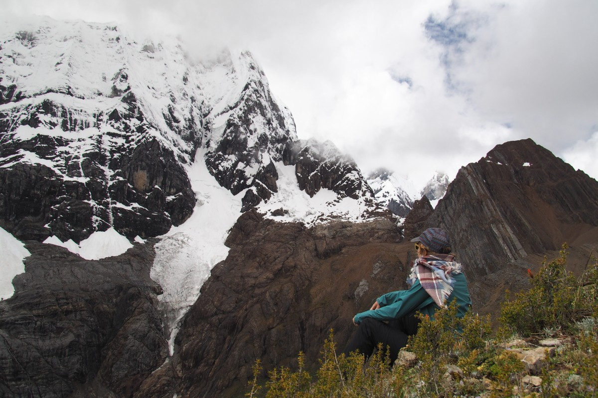

Wir müssen weiter. Wir wollen weiter. Weiter nach Ecuador, den Galapagos Inseln und Kolumbien. Vor ein paar Wochen hatten wir schon unseren Weiterflug zum nächsten Kontinent, Australien, um drei Wochen verschoben und uns damit mehr Zeit für Kolumbien verschafft. Inzwischen hatten wir aber auch Peru ein wenig satt und wir entschieden uns daher kurzerhand den peruanischen Dschungel rechts liegen zu lassen und schnurstracks zu den Galapagos und den blue-footed boobies zu reisen. Ein paar Tage später ging unser Flug!

Wir haben Peru ein wenig satt. Das klingt erstmal schlimmer als es in Wirklichkeit ist. Wir haben Peru als überraschend vielseitig erfahren, einfacher zu bereisen als Bolivien – wenn auch etwas teurer – aber was uns zu schaffen macht sind die langen Busreisen zwischendurch. Es gibt viel zu entdecken, aber die touristischen Höhepunkte liegen quer verteilt über das ganze Land. In Chile und Patagonien im Besonderen gelang es uns besser das Land in kleinen Schritten zu erkunden. Der Weg war Teil des Ziels – und den Weg suchten wir uns weitestgehend selbst. In Peru hingegen folgten wir dem ausgetrampelten Touristenpfad, einer Aneinanderreihung von Orten, die man mal gesehen haben muss – Machu Picchu, Nazca, Lima, die Cordillera Blanca (dazu später mehr). Jeder weitere Ort kostete uns eine 10-12 Stunden Busfahrt mit dazwischen wenig abgesehen von Steppe, Wüste, ein paar Berge oder Dunkelheit (im Falle von Nachtbussen).

Diesen Eintrag schreiben wir in Máncora, einem kleinen Surferstädtchen am Pazifikstrand – ungefähr der erste Ort nördlich des Humboldtstroms und damit mit warmen Temperaturen. Unser letzter Stop in Peru. Abgesehen von den Ansässigen Bewohnern ist die Stadt noch ziemlich ausgestorben. Es ist Nebensaison und Wellen zum Surfen gibt es auch keine. Dafür gibt’s jede Menge Platz am Strand. Jedenfalls bis die Flut kommt, die nimmt nämlich hinterlistig einen großen Teil des Strandes in Anspruch. Wir schlafen auf einem kleinen Campingplatz keine 100m vom Strand entfernt. Gerade geht die Sonne die unter und färbt den Himmel glutrot.

### Huaraz

Jetzt aber erstmal zurück in der Zeit. Nachdem wir Renée nachmittags ins Taxi zum Limaer Flughafen gesetzt hatten, zogen wir um in eine anderes Hostel in der Nähe. Das versprach ein bisschen lebendiger zu sein; war es auch, aber leider auch ziemlich dreckig. Die Menschen waren zwar nett und das Frühstück auch nicht schlecht, aber nachdem auch am dritten Tag das einzige Badezimmer nicht geputzt war, war unser Urteil gefällt. Weg hier. Wir nahmen einen Bus nach Huaraz am Fuße der Cordillera Blanca, einer majestätischen Gebirgskette in den Anden. “Majestätisch” hatten wir lediglich irgendwo gehört, denn als wir ankamen war es schon dunkel, und den ersten Blick auf den enormen schneebedeckten Gipfel am Horizont konnten wir erst am nächsten Tag von der Frühstücksdachterrasse aus erhaschen. Unsere Stimmung wurde besser und wir fassten den Plan, um hier die Mehrtageswanderung, die wir am Machu Picchu ausfallen lassen mussten, nachzuholen.

Wir entschieden uns vier Tage im Huayhuash-Gebirge zu wandern. Die Route nennt sich passenderweise Mini-Huayhuash, denn eigentlich dauert es 8-21 Tage, um das ganze Gebiet zu erkunden. Vier Tage waren uns genug. Am Tag bevor es losging wanderten wir zur Eingewöhnung an die Höhe (wir würden die gesamte Zeit über 4000m wandern und schlafen) noch zur Laguna 69. Der Name verspricht zwar nicht so viel (es gibt keinen einheimischen Namen und daher bekam der See stattdessen eine Nummer), die Lage daher umso mehr. Türkisfarben, wie man es nicht besser photoshoppen könnte, im Kontrast mit schwarzem Granitwänden und schneeweißen Gipfeln. Unfassbar schön! Freke hat über diese Wanderung einen Artikel für MountainReporters.com geschrieben: [Den gibt’s hier zu lesen (auf holländisch).](https://www.mountainreporters.com/activiteiten/run/wennen-aan-de-hoogte-in-het-trekkersparadijs-van-peru/)

\[caption id="attachment\_1635" align="aligncenter" width="900"\] Laguna 69\[/caption\]

Schon früh am nächsten Morgen saßen wir im dann im Minivan zum Startpunkt des Mini-Huayhuach-Treks. Mit uns waren fünf junge Amerikaner, ein gebürtiger Peruaner, der in Australien wohnt, ein Koch, ein Eseltreiber und ein Guide. Achja, und jede Menge Ausrüstung, Zelte, Essen und so weiter. Vollbepackt fuhren wir gute fünf Stunden über immer schlechter werdende Wege. Kurz hinter Huaraz mussten wir noch einen kleinen Umweg einlegen, da ein Erdrutsch gute 10m der Straße in die Tiefe gerissen hatte. Vom Ausgangspunkt in Pulcpa aus waren es noch etwa drei Stunden Laufen zum erstem Campingplatz. Die waren allerdings nicht so spannend. Wir folgten einer Schotterstraße entlang eines kleinen Flusses, welcher leider durch ein Eisen-/Kupfer/-Zinkbergwerk flussaufwärts heimlich verseucht wird. Selbst mit unseren Wasserfiltern wollten wir hieraus nicht trinken.

\[caption id="attachment\_1646" align="aligncenter" width="900"\] Quiet mountain life\[/caption\]

Tag zwei begann mit einem leichten Anstieg zum ersten Bergpass auf 4750m. Der morgendliche Nebel verzog schnell und gab so den Blick auf die gewaltigen 5- und 6-Tausender frei. Die Linien und Bögen im Gestein zeugen vom tektonische Druck, der den Boden hier in die Höhe presste. Ein klein bisschen Bewegung an den Bergwänden verriet das eigentlich unsichtbare Wild auf der gegenüberliegenden Seite. Während der Mittagspause erklang plötzlich ein lauter Donner und wir sahen aus dem Augenwinkel noch eine großes Stück vom Gletscher abbrechen und in die Tiefe stürzen. Das Eis ist in diesem Gebiet schon seit einiger Zeit auf dem Rückzug. Lange konnten wir nicht von der Aussicht genießen. Gegen Mittag zogen erneut Wolken auf, die uns zunächst Schnee und Hagel bescherten und später nach dem zweiten Pass des Tages mehr und mehr Regen. Auch das sei eine Folge des Klimawandels, so unser Guide, vor ein paar Jahren regnete es zu dieser Jahreszeit praktisch nie. Ziemlich durchnässt erreichten wir den zweiten Campingplatz, auf dem wir zwei Nächte schlafen würden. Der Campingplatz wird als einer der schönsten Plätze in Südamerika umworben. Als sich am Abend die Sonne nochmal kurz zeigte, begriffen wir warum. Wir hatten unsere Zelte in einem Tal aufgeschlagen, an dessen Ende Perus zweit-höchster Berg, der Yerupajá (6635m), thront. Mit stetig knackendem, krachendem Gletscher darunter, gefolgt von drei hübschen Gletscherseen. Fotos gucken!

\[caption id="attachment\_1658" align="aligncenter" width="900"\] Snow on the pass\[/caption\]

Am dritten Tag folgte ein steiler Anstieg auf einen östlich gelegenen Berg, der als Aussichtsplattform für die hinter dem Tal liegenden Berge diente. Dafür mussten wir allerdings erstmal ordentlich kraxeln; Zickzack-Laufen hilft hier auch nicht mehr. Und das gleiche galt für den Abstieg. Die jungen Amerikaner rannten nahezu hoch und wieder runter; da konnten wir mit unseren alten Knochen nicht mithalten. Mit dem Wetter hatten wir heute dafür mehr Glück. Trotz Bewölkung blieb es weitestgehend trocken, so dass wir auf dem Rückweg am Ufer eines Baches mittagessen konnten. Am Nachmittag lief ein kleiner Teil unserer Gruppe noch ein Stück zurück, um den Gletscher von Nahem zu betrachten. Diese Aussicht blieb uns am erstem Tag wegen des Regens nämlich leider verwehrt.

\[caption id="attachment\_1669" align="aligncenter" width="900"\] Next time, up there\[/caption\]

\[caption id="attachment\_1673" align="aligncenter" width="900"\] Laguna Sotteracocha\[/caption\]

Auf dem Rückweg am vierten Tag stand uns erneut ein Pass (4300m) bevor. Mit vier Wandertagen in den Beinen und all den Versuchen, den Amerikanern Einhalt zu gebieten, fiel uns dieser jedoch etwas schwerer. Wir passierten Bauernhöfe, sowohl alte (Vor-Inka) und „neue“, in denen Bauern unter einfachen Dächern aus Reet, Plastikfolie und Wellblech leben. Wir kamen durch kurze Waldstücke mit Queñoa-Bäumen, von den der rote Bast abblättert. Zum Schluss folgte ein langer, gradueller Abstieg ins Tal entlang rosa, roten, gelben, violetten, weißen und bunten Blumen (ab und zu mit versteckten Stacheln, hier will man sich lieber nicht reinsetzen). Die letzten Meter waren dann von mannshohen Agavenkakteen gesäumt. Im Dorf angekommen verschlungen wir noch schnell unsere Mittagssandwiches und fuhren anschließend zurück nach Huaraz, wo uns (nach einer Dusche) ein Nachtbus an die Küste erwartete.

\[caption id="attachment\_1682" align="aligncenter" width="900"\] The last pass\[/caption\]

### Perus Pazifikküste

Nach den Wandertagen war uns nach Entspannung am Strand. Wir wollten ein paar Tage am Strand relaxen um neue Kraft für den Dschungel zu schöpfen. Ganz ohne Sehenswürdigkeiten ist die Pazifikküste jedoch auch nicht. In Huanchaco besuchten wir alte Tempel der Moche-Kultur (200 v. Chr. - 600 n. Chr.), in denen prächtige Reliefs in originalen, kräftigen Farben immer noch intakt sind. Durch die erhaltenen Verzierungen und Farben bekamen wir ein viel lebendigeres Bild von dieser Kultur als es beispielsweise die bewundernswerten, aber kahlen Inkamauern schafften. Maltes Bedarf an Archäologie war damit gedeckt, Freke hingegen legte noch einen Stopp bei Chan Chan ein. Zu ihrer Zeit (ca. 900-1470) war Chan Chan die größte Stadt Südamerikas und gehörte zum Chimú-Reich (nicht zu verwechseln mit: [Chan Chan von Buena Vista Social Club](https://youtu.be/KODWcrncnUU)). Die Wüstenlage wurde ihnen letztendlich zum Verhängnis. Die Inkas schnitten der Stadt hinterlistig die Wasserzufuhr ab und zwangen sie damit, noch bevor die spanischen Kolonisten landeten, zur Kapitulation. Vor ein paar Wochen waren die Ausgrabungsstätten sogar noch in den internationalen Nachrichten vertreten: [Man fand ein Massengrab mit 140 Kinderskeletten, die höchstwahrscheinlich zu Ritualzwecken geopfert wurden.](https://news.nationalgeographic.com/2018/04/mass-child-human-animal-sacrifice-peru-chimu-science)

In Huanchaco fanden wir seit langem mal wieder ein kleines zu Hause. Im Hostel von Paul, einem gebürtigen Holländer, fühlten wir uns sofort wohl. Die selbstgemachte Erdnussbutter, die wir bei ihm kaufen konnten, half dabei ebenso wie die drei flauschigen Häschen, die zutrauliche Katze und die langsame Schildkröte, welche als Haustiere im Innenhof für Belustigung sorgten. Wäre Platz gewesen, hätten wir wahrscheinlich für ein oder zwei Wochen im Hostel ausgeholfen. Diese Pause blieb uns leider verwehrt, mit dem Ergebnis, dass wir unsere Pläne für die folgenden Wochen aus dem Fenster warfen und beschlossen erstmal auf den Galapagos Inseln Energie zu tanken. Der Dschungel muss warten.

Bei der Entscheidung hilf auch, dass wir ein Schnäppchen für die Flüge auf die Inseln ergattern konnten. Mit einem Zwischenstopp in Máncora (warmer, mehr Sonne und Wassertemperaturen, die zum Schwimmen einladen) machen wir uns auf den Weg nach Guayaquil, Ecuador!

\[caption id="attachment\_1704" align="aligncenter" width="900"\] Huanchaco\[/caption\]
