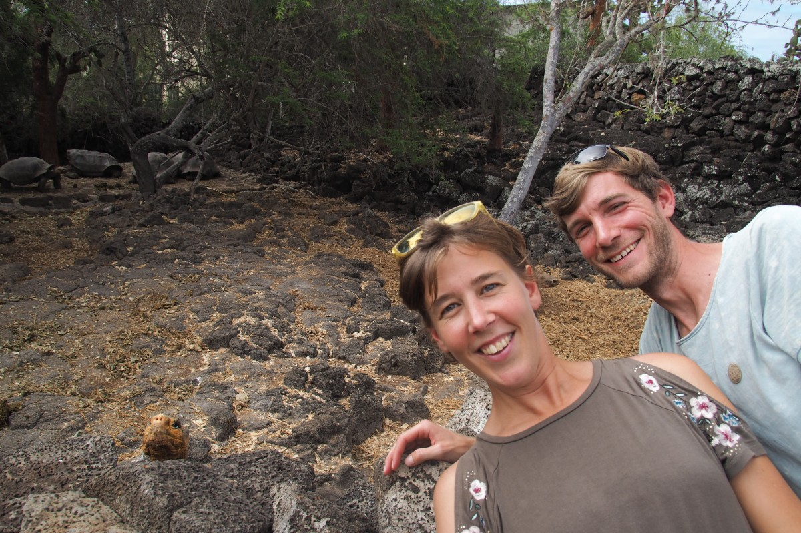
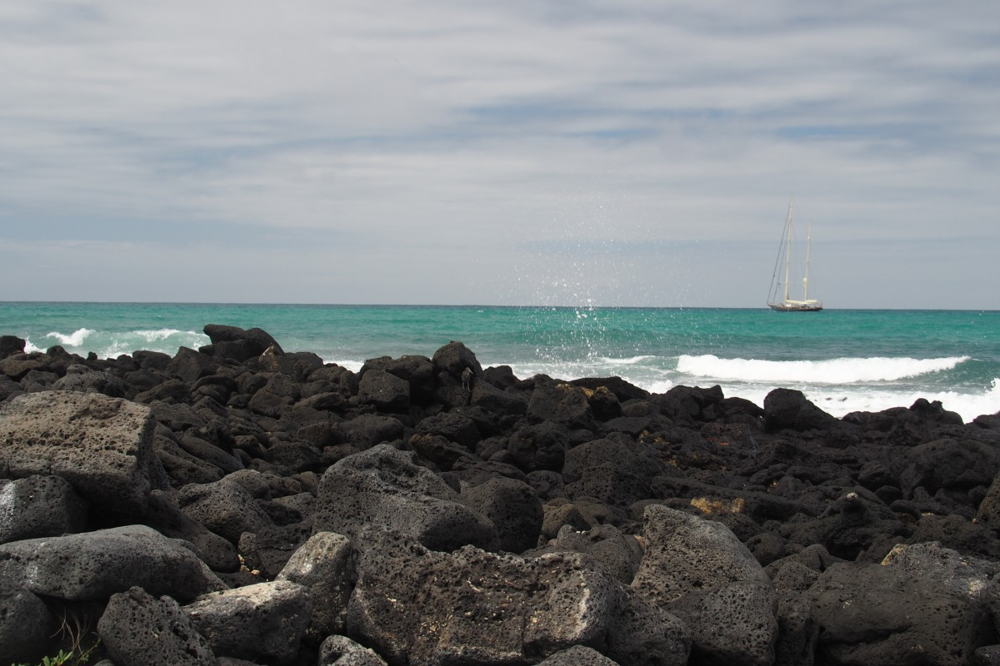
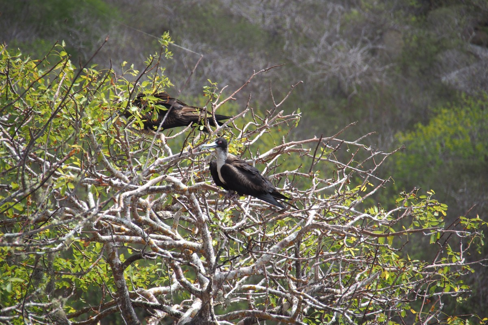
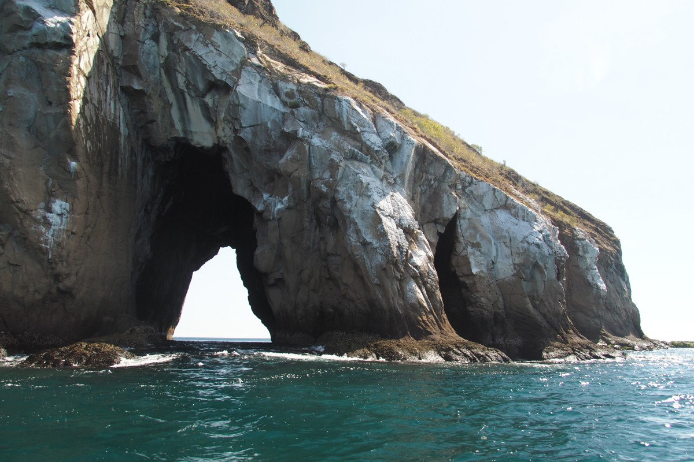

Die Galapagosinseln… Ein Ziel, das wir schon lange vor Augen hatten. Und dann waren wir plötzlich da. Eine Warnung vorab: Dieser Eintrag kann neidisch machen.

Die Inselgruppe, die Darwin zu seiner Evolutionstheorie inspiriert hat, hat für uns immer etwas mythisches gehabt. In unserer Phantasie war es eine Art Jurassic Park, wo Tiere aus der Zeit der Dinosaurier stammten und bisher so ungestört lebten, dass sie keine Angst vor Menschen hatten. Dies würde _ihr_ Land sein.

Unser Bild schien lediglich zum Teil wahr zu sein, merkten wir bei der Ankunft. Ehrlich gesagt zeigte sich schon schnell nach der Landung, dass wir eigentlich ziemlich wenig über die Galapagosinseln wussten. Wie sind die noch mal entstanden? Das fragten wir uns im ersten Bus vom Flughafen nach Puerto Ayora, während Straßenschilder an uns vorbei sausten, die vor tieffliegenden Vögeln warnten. Der Flughafen selbst liegt auf einer kleinen Insel nördlich der meistbewohntesten Insel Santa Cruz (mit Hauptstadt Puerto Ayora). Das heißt, um zur Stadt zu kommen, braucht es drei Verkehrsmittel: Bus – Boot – Bus.

Die Entstehungsgeschichte des Archipel hat mit sogenannten Hotspots zu tun, lernten wir kurz drauf. Ein Hotspot ist eine direkte Verbindung zum Erdinneren und damit zum flüssigen und wahnsinnig heißen Magma. Solche Hotspots liegen nicht an Übergangsstellen verschiedener tektonischer Platten (wo die meisten Vulkane der Erde liegen), sondern können theoretisch überall in Mitten eine Platte liegen. Das Magma bohrt sich dann ab und zu wie ein Pickel durch die Erdkruste und drückt dort Lava heraus. Ähnlich wie momentan auf Hawaii, passiert das hier mitten im Ozean, wodurch nach meist mehreren Ausbrüchen eine Insel entsteht. Die Galápagos sind also in Wirklichkeit Vulkangipfel, die aus dem Wasser ragen. Und weil sich die Erdplatte bewegt, der Hotspot aber nicht, entstehen ständig neue Inseln (auch heute noch).

Die Tiere sind also leider keine Überreste aus der Dinosaurierzeit. Dafür sind die Inseln zu jung. Stattdessen sind sie mehr oder weniger per Zufall an Land getrieben, geflogen oder geschwommen, und letztendlich dort geblieben. Das Fehlen von Raubtieren (inklusive Menschen) führte zu einigen spannenden Entwicklungen. Einige verlernten zum Beispiel das Fliegen, wie der flugunfähige Kormoran (Galapagosscharbe), der genug Futter zu seinen Füßen finden konnte und wenig Angst haben musste, aufgefressen zu werden. Schildkröten hingegen konnten viel größer als ihre Vorfahren vom Festland werden.

\[caption id="attachment\_2039" align="aligncenter" width="900"\] Water\[/caption\]

Von Schildkröten gesprochen! Für diese sind die Galápagos natürlich bekannt. Wer kennt Lonesome George nicht? Wir haben ihn getroffen. Ausgestopft, aber immerhin. George ist 2012 im Alter von ungefähr 102 Jahren gestorben. Er war zwar zum Glück nicht die letzte Riesenschildkröte, aber sehr wohl der letzte seiner Art. In mehreren Aufzuchtstationen konnten wir sowohl kleine Schildkrötchen (5 cm) als auch größere (mindestens 1m) sehen (darunter ein Paar, das gerade versuchte neue Schildkrötchen zu machen; später erzählte man uns, dass das zwei Männchen waren, die „Dampf“ ablassen mussten). Wir sahen aber auch wilde Schildkröten; gleich am ersten Tag lag eine einfach so schlafend neben dem Fußweg; am vorletzten Tag saß eine andere neben der Hauptverkehrsstraße (und übrigens einzige Straße) ein bisschen zu grasen; und bei einer Fahrradtour auf der Insel Isabela sahen wir gleich drei (oder zwei, eventuell war die dritte auch die erste). Die letzte schien enormes Interesse an unseren Fahrrädern zu haben. Erst fauchte sie die Pedale an, dann probierte sie das Rahmengestänge aufzuessen. Wir konnten sie gerade noch davon abhalten mit ihrem vollen Gewicht (gute 250kg) auf den Rädern zu stehen und die Speichen zu verbiegen.

Isabela, Santa Cruz, San Cristóbal und (ein ganz klein bisschen) Floreana. Das sind die bewohnten Inseln des Archipels. Die Anwesenheit von Menschen reicht deutlich weiter zurück in der Zeit als Darwins Besuch. In unserer Unwissenheit dachten wir eigentlich immer, dass er unberührte Natur vorfand, aber Piraten und Walfänger kamen ihm zuvor. Im Jahre 1535 landete der Bischof Tomás de Berlanga mit seiner Crew per Zufall hier an, nachdem ihr Segelschiff in einer Flaute zurecht kam und in den Großen Ozean abgetrieben war. Danach wurden die Inseln zum sicheren Versteck und zur Vorratskammer (Riesenschildkröten eigneten sich wunderbar als Nahrung auf hoher See, da sie lange Zeit am Leben und somit frisch blieben) von Piraten und später von Walfängern. Diese zwei Gruppen sorgten dafür, dass eine ganze Reihe Riesenschildkrötenarten innerhalb kürzester Zeit ausstarben. Auch der Walfischbestand nahm drastisch ab.

Heutzutage ist der Tourismus eine der großen Herausforderungen für die Inseln. Entsprechend schuldig fühlten wir uns auch, um überhaupt hierhin zu kommen. Im Allgemeinen probieren wir auf unserer Reise so viel Rücksicht auf die Umwelt zu nehmen wie möglich, und zum Beispiel wenig zu Fliegen und teurere Tours zu buchen, die ebenfalls die Umwelt berücksichtigen.

Auf der anderen Seite waren die Galapagosinseln in Greifweite. Dass man gerade mal 1% des Nationalparks besichtigen kann, beruhigte uns. Und wir müssen zugeben: Die Ecuadorianer geben ihr Bestes durch viel Aufklärungsarbeit, keinen Müll auf Straßen oder ins Meer zu werfen (es wird nebenbei viel recycelt) und Guides, die ihre Gäste konsequent zurückpfeifen, wenn sie den Tieren zu Nahe kommen.

Der überwiegende Teil der Touristen besucht die Inseln mit einem Kreuzfahrtschiff (und dann nicht so ein Queen Mary-Monster, sondern meistens ein kleines für 16-30 Passagiere). Wir hatten im Vorfeld Gutes über diese Touren gehört und auch den Tipp bekommen, um Last Minute zu buchen. Damit solle man die Preise gerne um mehr als die Hälfte drücken können (was sich bei 4000-5000 Dollar doch lohnen würde). Das klang verlockend und somit waren wir die ersten eineinhalb Tage damit beschäftigt ein geeignetes Kreuzfahrtschiff zu suchen. Leider waren die Preise selbst mit Rabatt immer noch weit außerhalb unseres Budgets. Dann halt doch „Island Hopping“, also die drei bewohnten Inseln besuchen und von dort aus ein paar Tagesausflüge machen. So verbrachten wir jeweils ein paar Tage auf Santa Cruz, San Cristóbal und Isabela.

\[caption id="attachment\_2040" align="aligncenter" width="900"\] Sunset\[/caption\]

Insgesamt blieben wir für zwei Wochen und was haben wir nicht alles für Tiere gesehen. Es gibt eben nicht nur Schildkröten. Man kann auch mit Seelöwen schwimmen, über Haien schnorcheln, den ulkigen, ehrlich gesagt ein bisschen albernen Paarungstanz der Blaufußtölpel (Blue-footed boobie) bestaunen und über Meerechsen stolpern. Es leben hier so viele wilde Tiere, dass man ziemlich schnell zu einer verwöhnten Prinzessin (oder Prinz) wird. Obendrauf gibt‘s tolle Landschaften und, obwohl alle Inseln vulkanischen Ursprungs sind, kommen die Vulkane in allen denkbaren Formen und Farben. Zu all dem später mehr.

\[caption id="attachment\_1898" align="aligncenter" width="900"\] A bay\[/caption\]

### Getier

In einer Bucht auf San Cristóbal schwammen wir zum ersten Mal mit Seelöwen. Der Galapagosseelöwe ist etwas kleiner als sein Artverwandter vom Festland und ähnelt darum eigentlich mehr einer Robbe. Vor allem die jungen sind fröhlich und verspielt und lieben es einen unter Wasser durch die Maske anzuglotzen oder hinter den Taucherflossen herzujagen. Das alleine war es den Besuch schon wert. Sie können allerdings auch ordentlich territorial sein. Als wir einen Abend an einem Strand den Sonnenuntergang genossen, kamen mehr und mehr Seelöwen aus dem Wasser. Irgendwie schienen wir genau in ihrem Weg zu sitzen. Während der erste noch um uns hin robbte, wurden wir von den darauffolgenden lauthals weggebrüllt. Malte konnte gerade noch sein zum trocknen aufgehängtes Shirt vom Gestänge ziehen, worunter es sich die Löwen gerade bequem machten. Das fanden die wohl nicht so witzig.

Schildkröten hingegen geben sich eher gefällig. Sowohl an Land als auch unter Wasser. Meeresschildkröten so als die, die wir bei Lavatunneln auf Isabela fanden, sind unfassbar groß. Der Kopf größer als unser eigener. Sie teilten sich die Bucht mit etlichen Haien. Die von der ungefährlichen Sorte: Kleine (ungefähr einen halben Meter lange) Schwarzspitzen-Riffhaie bis größere (1-1,5 Meter) Weißspitzen-Riffhaie. Es gibt auch lokale Galapagoshaie, die wir glauben gesehen zu haben, und Hammerhaie. Die Hammerhaie haben wir leider knapp verpasst. Die ersten aus unserer Gruppe, die vom Boot ins Wasser sprangen, riefen sogleich: „Hammerheads, hammerheads!“ Wir tauchten sofort hinterher. Alle zeigten ständig auf irgendwas hinter uns – vielleicht schwammen sie genau dort – aber am Ende haben wir sie nicht gesehen. Naja, man muss ja noch irgendwas zu Wünschen übrig lassen.

Rund um die Inseln leben außerdem verschiedene Rochenarten. Vom „gewöhnlichen“ Stechrochen bis zum famosen Teufelsrochen, dem größten Rochen der Welt. Wir sahen einige Adlerrochen mit einer schönen Diamantform und weißen Punkten auf dem dunkelblauen Rücken. Das Juwel unter den Rochen bleibt jedoch der Teufelsrochen. Der Kapitän unseres Bootes sichtete sie schon aus der Ferne, bevor auch nur irgendetwas in den großen, dunklen Schatten neben uns im Wasser erkennen konnten. „Manta, manta!“, rief er. Als wir mehrere beieinander gefunden hatten, fragte unser Guide, ob wir hier schnorcheln gehen wollten. Das ließ Freke sich nicht zweimal fragen und sprang als erste über Bord. Sie sah sofort drei Teufelsrochen. Was sind die Viecher riesig! Deutlich größer als man selbst und sie „fliegen“ anmutig wie ein Teppich durchs Wasser. So was riesiges hatte Freke unter Wasser noch nicht gesehen (das ist vielversprechend für ihren nächsten Traum: Schwimmen mit Walhaien, den größten Fischen der Welt). Dummerweise hatte unsere GoPro heute keine Lust gehabt zu funktionieren und so gibt es keine Fotos. Auch doof für Malte, denn für ihn war der Zug schon abgefahren. Oder besser: Er durfte nicht gleich hinterher springen, weil das Boot noch ein Manöver drehen wollte. Danach waren die Rochen schon weitergezogen oder das Boot lag an der falschen Stelle oder was auch immer. Jedenfalls sah er sie nicht. So ein Mist! So häufig kriegt man die Chance nicht… An einem anderen Tag sahen wir sie dann zum Glück nochmal vom Boot aus. Dieses Mal jedoch nicht Unterwasser sondern Überwasser, springend und Saltos machend. Scheinbar springen Teufelsrochen genauso wie Wale und Delfine. Aus genauso unbekannten Gründen. Bizarr und wunderbar!

Den kleinen Freund der Wale sahen wir an unserem letzten Tag: Den Pinguin. Genauer gesagt den Galapagospinguin – noch eine endemische Art, die nur hier vorkommt. Gleichzeitig ist es der einzige Pinguin, der oberhalb des Äquators lebt. Beim Schnorcheln fanden wir zwei, die sich auf einem Felsen ausruhten. Ab und zu schwimmen sie auch vorbei, aber leider nicht bei uns.

Während man so vor sich hin schnorchelt und dauernd diese großen Dinger sieht, übersieht man leicht das kleine Leben unter Wasser. Aber da waren auch Seepferdchen, ein kleiner Tintenfisch, ein paar Seesterne, eine Seegurke und unendlich viele kleine, bunte Fischchen, von denen wir die Namen nicht wissen. An irgendeinem Strand fanden wir die Überreste einer Krabbe mit Beinen von sicher 20cm. Das muss eine große Krabbe gewesen sein, schätzten wir. Das konnten wir dort, wo wir auch die Pinguine fanden, in lebendiger Form bestätigen. Brr…

Bei all dem Schnorcheln vergaßen wir fast, das an Land auch noch eine Menge Dinge zu erkunden waren. Manchmal weiß man einfach nicht, wo man zuerst hinschauen muss. Überall fliegen braune Pelikane rum, die sich mit mäßig viel Eleganz ins Wasser stürzen, um ihr Abendessen zu fangen. Der Blue-Footed Boobie (Boobie kommt übrigens vom spanischen „bobo“, was so viel wir Trottel oder eben Tölpel bedeutet, da er sich so einfach fangen ließ) kann das mit dem ins Wasser plumpsen etwas besser. Als B-Note würde er sicher eine 9.6 bekommen: Kaum Gespritze und mit einer leichten Drehung um die eigene Körperachse fängt er sich seinen Fisch. Danach ist eben Aufmerksamkeit angesagt, denn der Fregattvogel (der selbst zu faul ist, um selbst ins Wasser zu gehen) lauert und stiehlt sich gern den frischen Fang. Der Fregattvogel ist eine Mischung aus einer großen, schwarzen Möwe und einer Schwalbe. Die Flügel sind leicht abgeknickt und die Schwanzfedern kann er für bessere Flugkontrolle spreizen. Die Männchen haben außerdem einen roten Airbag vor der Brust, den sie fürs andere Geschlecht aufblasen und zur Schau stellen. Das sieht zwar etwas unkomfortabel aus, aber gut… jeder was er gerne mag. Sie stehlen übrigens nicht nur Fisch sondern erobern auch gerne das Nest eines anderen. Freke durfte das aus nächster Nähe beobachten. Generell war vieles wie in einer Naturdokumentation, weil man allem so unglaublich Nahe kommen konnte.

Der Blue-Footed Boobie hat zum Beispiel auch kein Problem damit, wenn man etwas dichter ran kommt (die Parkwächter hingegen sehr wohl: 2m Mindestabstand). Sie kennen die Gefahr von Raubtieren nicht und auch 500 Jahre menschliche Anwesenheit hat ihnen noch keinerlei Angst gelehrt. Das Pärchen, dass wir beobachten durften, ließen sich daher ihrem Paarungsritual auch nicht stören. Das Männchen präsentiert dabei abwechselnd seine blauen Füßchen, reckt stolz seinen Schnabel in die Höhe und gibt dem Frauchen kleine Zweige als Geschenk. Letztendlich wird das Nest allerdings nicht aus Zweigen gebaut, sondern man sucht sich ein kleines Loch im Felsen. Dann wird um das Loch herum gleichmäßig im Kreis geschissen und am Ende ein paar Eier in die Mitte gelegt. Nach dem Schlüpfen sind die Boobies erstmal kahl, dann etwas später flauschig und süß. Wir sind große Fans (darum investierten wir auch in einen passenden, neuen Einkaufsbeutel).

\[caption id="attachment\_2042" align="aligncenter" width="900"\] Blue-footed boobie\[/caption\]

Genauso wie die Schildkröten haben sich auch die Leguane oder Echsen irgendwann mal auf die Inseln treiben lassen. Von dort aus haben sich verschiedene Arten entwickelt, vor allem in Meerechsen und Landechsen. Meerechsen sind überall auf den Galapagos. Man muss aufpassen nicht aus Versehen auf eine zu treten (ihre schwarze Hautfarbe deckt sich wunderbar mit dem schwarzen Lavagestein und sie haben auch nicht so viel Lust, sich zu bewegen). Daher gilt: Leguane haben Vorfahrt; ist ja schließlich auch _ihre_ Insel. Die gelblichen Landechsen sind etwas schwieriger zu finden, auch weil es weniger von ihnen gibt und dann nur auf bestimmten Inseln. Auf Seymour Norte sahen wir aber doch ein paar.

Die Liste mit gesichteten Tieren ist zwar jetzt schon ziemlich lang, aber ein paar müssen wir noch hinzufügen. Da hätten wir die Rote Klippenkrabbe oder auch Grapsus Grapsus genannt (etwa die Größe deiner Hand), den Galapagosbussard, einen Flamingo von sehr weit weg, die Gabelschwanzmöwe mit leuchtend roten Augen (die einzige Möwenart, die nachts auf Jagd geht), die Spottdrossel (die gerne die Geräusche anderer nachmacht) und natürlich die Darwinfinken, die Darwin angeblich auf die Spur seiner Theorie brachte. Nagut, und dann müssen wir auch die nervigen Sandfliegen nennen.

### Landschaft

An dieser Stelle sind wir immer noch nicht fertig. Neben der Fauna ist nämlich auch die Flora und die Landschaft prächtig. Jede der Inseln hat mindestens einen Vulkan (meist etwa in der Mitte) mit langsam ablaufenden Lavahängen. Die Hänge sind darüber hinaus mit Pickeln überseht, kleine Minivulkane, wo sich die Lava auch einen Ausgang aus dem Hotspot gebahnt hat.

Auf Isabela gibt es Lavatunnel, die dadurch entstehen, dass der Lavastrom nach einem Ausbruch auf der Oberseite schneller abkühlt und verhärtet als unten drunter. Unterirdisch fließt dann noch weiterhin heiße Lava; dazwischen kommt es dann manchmal zu Lufteinschlüssen und kilometerlangen Tunneln. Auf Santa Cruz sind zwei solcher Tunnel eingestürzt und haben riesige große Löcher in der Landschaft hinterlassen. Auf San Cristóbal sieht man die alten Lavaströme am besten vom Boot aus. Dort geht das schwarze Lavagestein plötzlich in dunkelgrüne Pflanzen über, was einen wunderbaren Kontrast bildet. Auf Isabela wanderten wir entlang des Kraters des Sierra Negra Vulkans, welcher mit einem Durchmesser von 10km einer der größten Krater der Welt ist. Hier auf dieser Insel und auf der etwas westlich gelegenen Insel Fernandina sind einige Vulkane noch aktiv. Der Sierra Negra grummelt momentan ein bisschen vor sich hin und darum war die gelbe Warnstufe ausgerufen. Davon haben wir allerdings nichts bemerkt, außer dass ein paar Pfade gesperrt waren und man darum momentan nicht ganz so dicht an die stinkenden Auslasse kommt.

Die Landschaft von Bartolomé, nördlich von Santa Cruz, ist dagegen wieder ganz anders. Bartolomé ist eine kleine, unbewohnte Insel, die vor der viel größeren Insel Santiago liegt. Hier variieren die Farben von rot bis tiefschwarz und es wächst und lebt abgesehen von ein paar Lavakakteen praktisch nichts. Einfach mal die Fotos angucken, die sprechen für sich:

Wir könnten noch ein paar Seiten mehr über die Galapagos vollschreiben. Es war eine fantastische Erfahrung und wir sind glücklich, dass wir hin geflogen sind. Vielleicht war es nicht so krass Jurassic Park als wir erst dachten, aber all die Reptilien und riesigen Vögel kamen dem Ganzen schon recht nahe. Von daher bleibt das Archipel der magische, mythische Ort, der es für uns immer gewesen war.

