Von den Galapagosinseln, weit abgelegen im Pazifischen Ozean, in gleich drei Millionenstädte hintereinander: Quito (Ecuador), Bogotá (Kolumbien) und Medellín. Nur um uns kurz danach auf einem Bauernhof im kolumbianischen Hinterland niederzulassen.

Quito, Hauptstadt Ecuadors, erwies sich für uns vor allem als notwendiger Zwischenstopp. Nach zwei Wochen abgeschiedenem Inselleben labten wir uns am gut sortierten Supermarkt um die Ecke. Eigentlich wollten wir, unsere Geburtstage als Anlass, irgendwo nett Essen gehen, aber einmal mehr machte uns ein rumorender Magen-Darm-Trakt einen Strich durch die Rechnung. Mehr als ein leckeres Geburtstagsfrühstück für Malte war leider nicht drin.

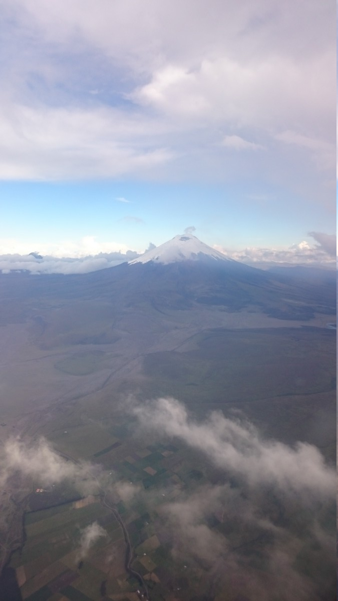
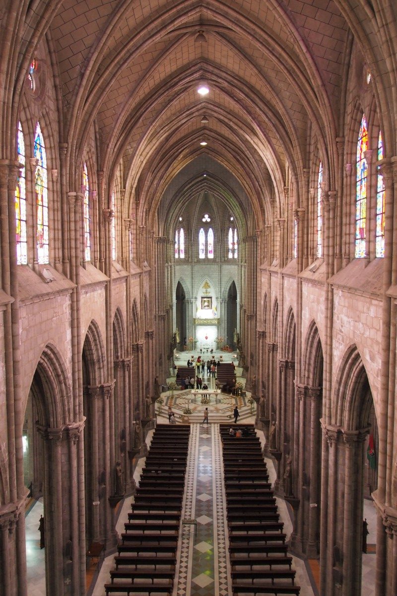

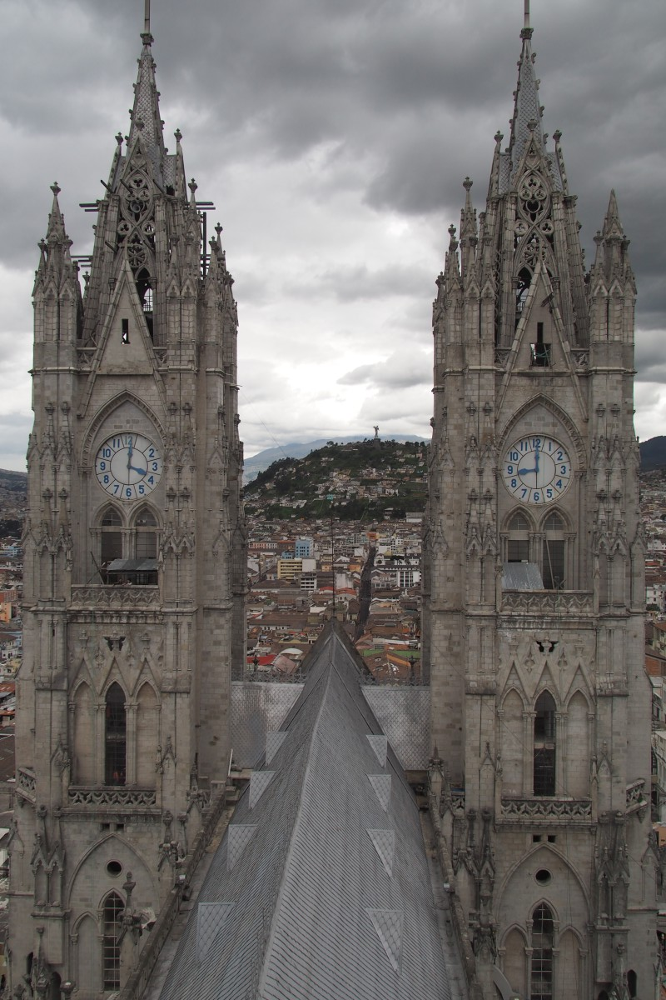
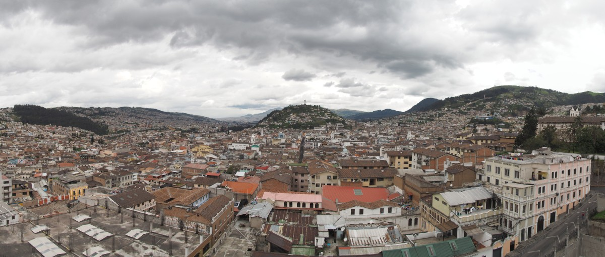

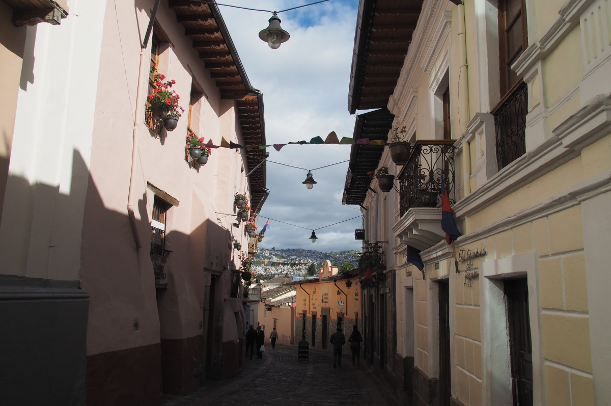

Seit unserem spontanen Aufbruch in Peru zu den Galapagos hatten wir eigentlich nicht viel über die Zeit nach Quito nachgedacht. Kolumbien lag quasi vor der Haustür, aber wir mussten doch mal bedenken, was wir dort genau sehen wollten. Besonders viel Enthusiasmus für lange Busreisen und versteckte Orte konnten wir jedoch nicht aufbringen. Und so waren wir uns schnell einig, dass wir schnellstmöglich einen längeren Aufenthalt am selben Platz einplanen wollten. Also erstmal pausieren. Wir fanden eine kleine ökologische Farm im Herzen Kolumbiens, die Helfer und Mitbewohner suchte. Da die Region für ihr dauerhaftes Frühlingswetter bekannt ist, erschien uns das ein geeigneter Ort, um uns auszuruhen. Bevor wir dort anfangen konnten, hatten wir allerdings erst noch ein paar Tage zu überbrücken.

### Bogotá

Darum flogen wir von der ecuadorianischen zur kolumbianischen Hauptstadt, Bogotá. Etwas nervös betraten wir das Land, das im Ausland vor allem durch seine bewaffneten Konflikte, den Drogenhandel und die nicht gerade rosige Kriminalitätsstatistik Bekanntheit erlangt hat. Naja, vielleicht auch noch durch [Carlos Valderrama](https://de.wikipedia.org/wiki/Carlos_Valderrama). Zur gleichen Zeit waren wir gespannt und neugierig; unterwegs horten wir viele positive Erfahrungen anderer Reisender, über das Land und seine Leute. Es musste also noch mehr geben als Koks und Rebellen.

Unser erstes Ziel in Bogotá war allerdings eine (deutsche) Ärztin. Freke schien einen tropischen Parasit mit sich zu tragen: Jippeh! Zum Glück ließ der sich mit einer handvoll Pillen relativ schnell vertreiben und wir konnten mit Stadtführungen das kolumbianische Großstadtleben entdecken.

Hierbei konnten wir uns voll ausleben. Erstmal eine generelle, geschichtliche Tour, dann eine tiefergehende über die Geschichte von Krieg und Frieden (ja, den gibt es also auch) und zum Schluss noch eine für den Gaumen mit allerlei kolumbianischen Köstlichkeiten. Auf jeder dieser Tour bekamen wir von dem Stadtführer zu hören, wir glücklich er sei, dass wir dort waren. „_Wie fiel die Reaktion zu Hause aus, als ihr erzählt habt, dass ihr nach Kolumbien reist? Wahrscheinlich, dass ihr gut aufpassen müsst, weil es so enorm gefährlich sei._“ Kommt dem einen oder anderen bekannt vor? ;) Kolumbien ist ganz sicher noch nicht am Ziel, aber es ist doch schon ein ganz großes Stück sicherer als noch vor 10-15 Jahren. „_Und wer hat diese Netflix-Serie geschaut? Hatte ich schon erwähnt, dass wir die hier in Kolumbien echt überhaupt nicht mögen? Größtenteils Unsinn!_“, meinte Hector, unser Stadtführer, kurz bevor wir von einer freundlichen Dame weggeschickt wurden. Hier würden gleich Dreharbeiten stattfinden. Wir konnten noch einen Blick auf ihr Namensschild werfen, welches irgendwas mit Netflix sagte. Dann drehte sie sich um und lief weg.

\[caption id="attachment\_2083" align="aligncenter" width="900"\] Bogotá\[/caption\]

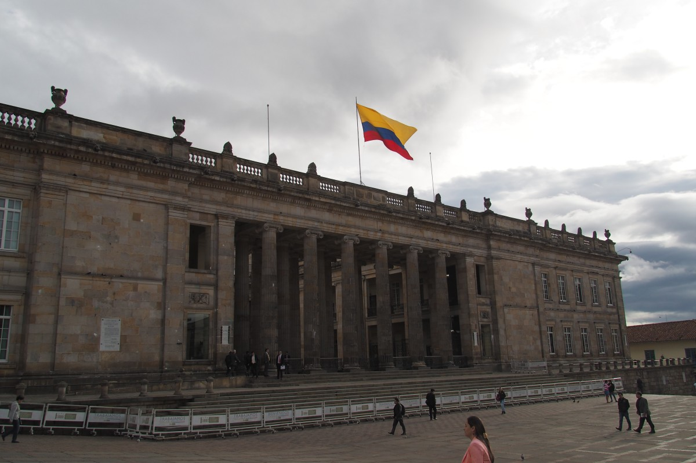

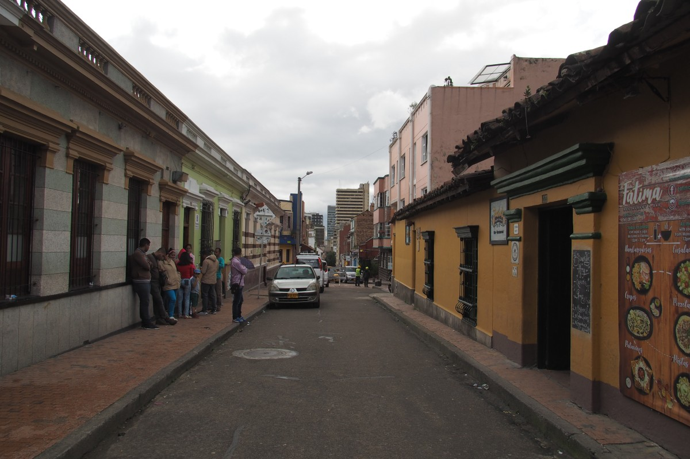

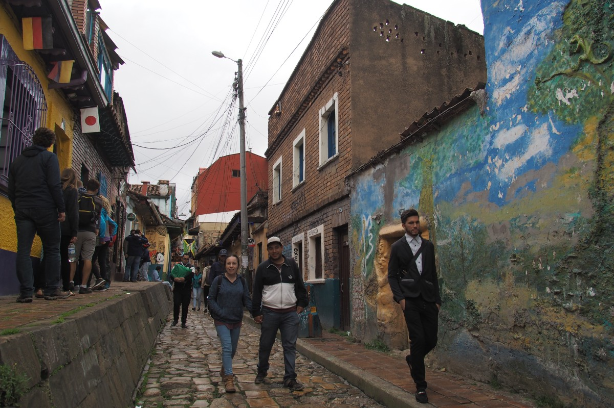
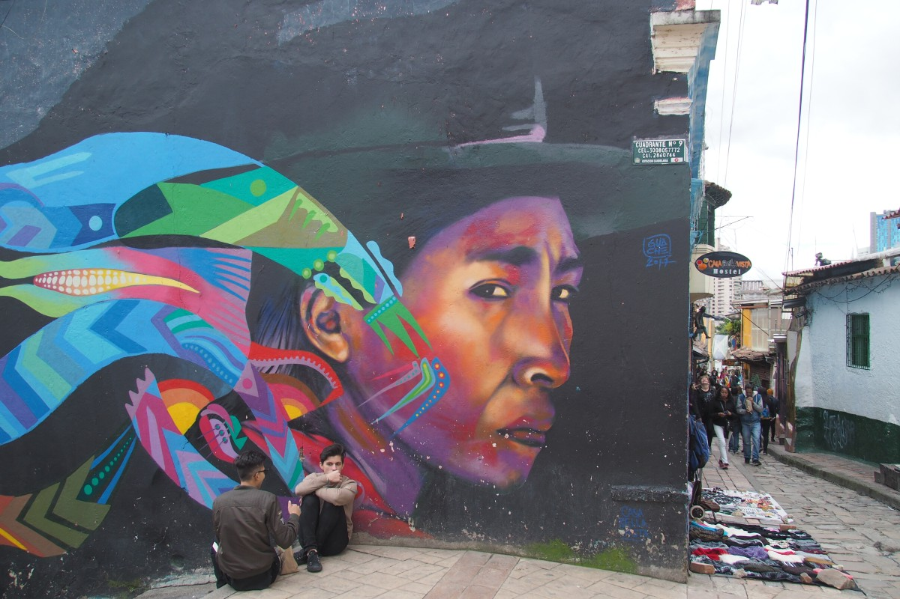

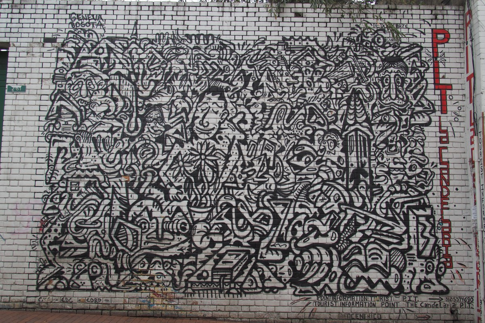
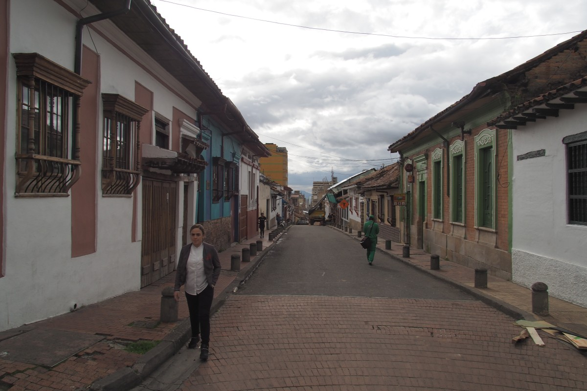
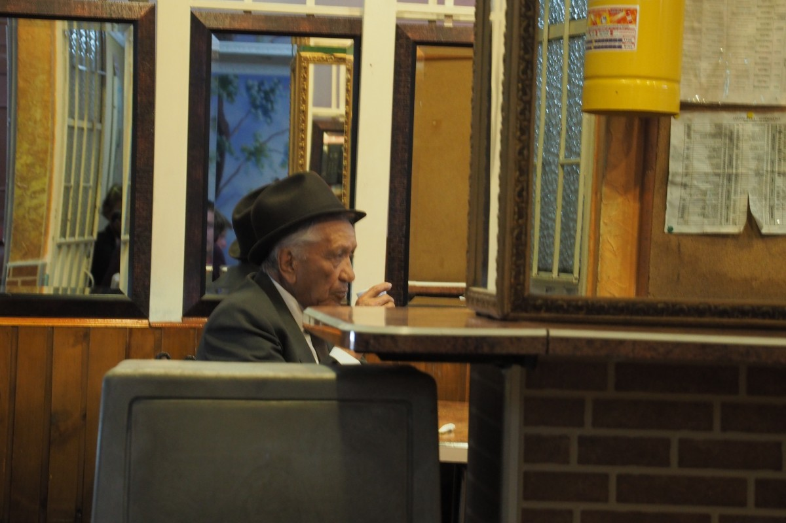

Wir fühlten uns in jedem Fall sicherer als in manch bolivianischer oder peruanischer Großstadt. Vielleicht hat das auch damit zu tun, dass Bogotá eine beinahe westliche Weltstadt ist und sich darum automatisch sicherer anfühlt. Es ist allerdings keine besonders schöne Stadt. Als 1948 ein populärer Präsidentschaftskandidat auf offener Straße erschossen wurde, kam es zu Ausschreitungen, in Folge dessen große Teile des Zentrums in Schutt und Asche gelegt wurden. Wie in diversen deutschen Städten, die nach dem Weltkrieg nicht besonders liebevoll wiederaufgebaut wurden, überherrschen auch in Bogotá die 50er-Jahre Betonbauten. Deutlich interessanter waren dagegen die Geschichten hinter dem Straßenbild (und das Essen der Eck- und Straßenverkäufer).

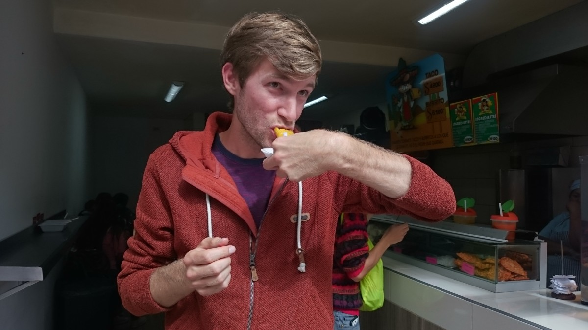

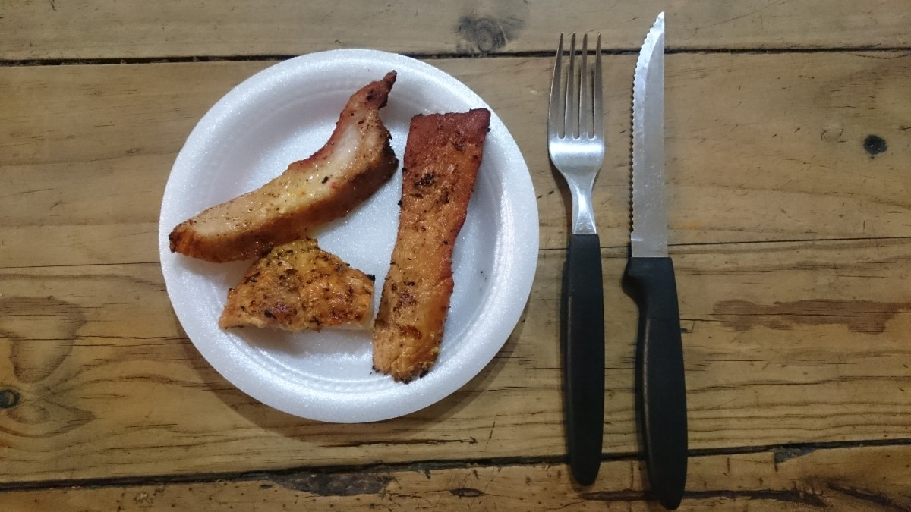

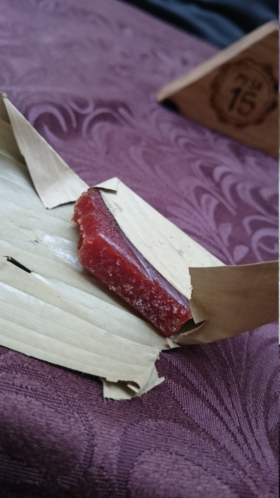

Bogotá hat außerdem ein beeindruckendes (und schwerbewachtes) Goldmuseum, in dem so viele goldene Objekte der alten einheimischen Kulturen liegen, dass sie beinahe nicht wissen wohin mit dem ganzen Schmuck, Dekorationen, Kronen und Musikinstrumenten. Aus diesem goldenen Zeitalter stammt auch die spanische Legende von El Dorado (der verschollenen Stadt aus purem Gold). El Dorado fanden die Kolonisten zwar nicht, dafür aber einen Bergsee, in den die damaligen Völker Unmengen von goldenen und silbernen Krams geworfen haben. Nämlich jedes Mal, wenn ein neuer Machthaber das Volk übernahm. Damit wurde in ihrer Auffassung der Kreislauf des Lebens geschlossen: Gold und Silber seien nämlich Sonnen- und Mondstrahlen, die auf die Erde trafen. Wenn man sie ins Wasser wirft, gelangen sie so zurück zu ihrem Ursprung. Von all dem Edelmetall ist nur noch wenig übrig geblieben, aber trotzdem ist es genug für mehr als ein Museum.

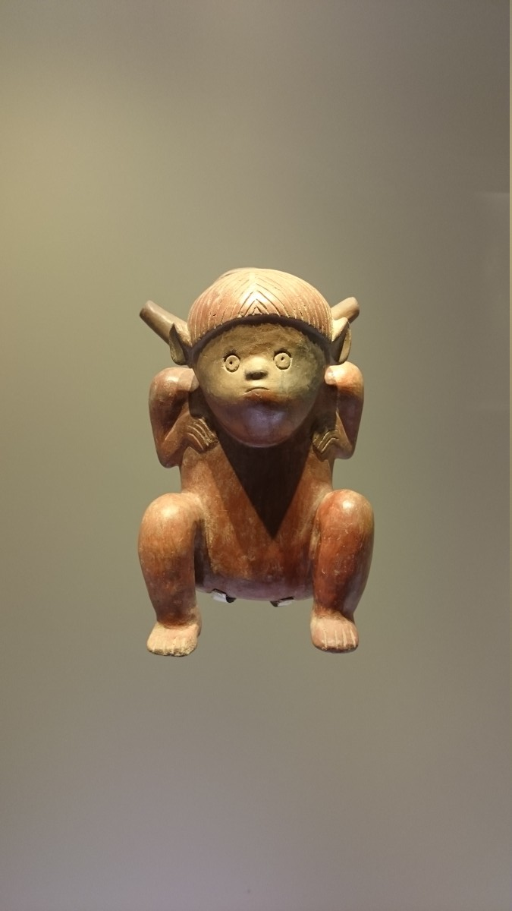

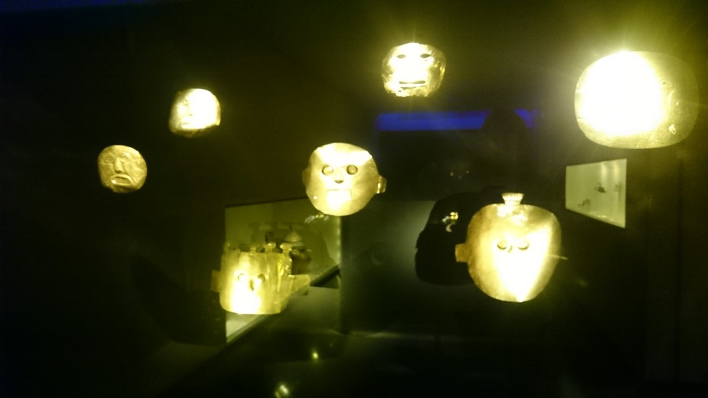
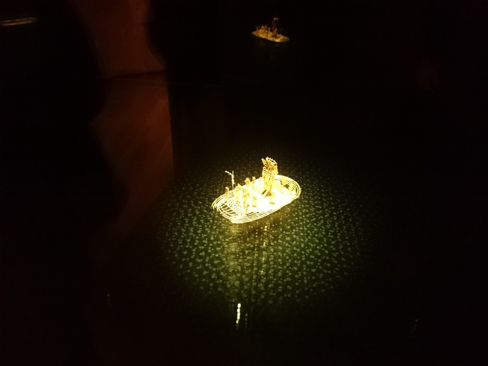

So viel Gold will natürlich gut bewacht werden. Militärpräsenz ist nicht nur am Museum zu sehen, sondern ist allgegenwärtig. In einigen Stadtteilen steht an jeder Ecke (insgesamt also vier pro Kreuzung) ein Soldat mit Maschinengewehr. Für uns Europäer erscheint das zwar als eine Bedrohung, für Kolumbianer bedeutetet es aber genau das Gegenteil. Es gab in der Vergangenheit (mehrfach) Zeiten, in denen weit und breit kein Militär zu sehen war. Selbst Polizisten und Soldaten trauten sich nicht in Gebiete, in denen die Drogenkartelle das Sagen hatten. Viele Gebäude sind daher immer noch mit Stacheldraht und hohen Mauern umzäunt. Nicht um – wie in einem Gefängnis – Menschen drinnen zu halten, sondern um unerwünschten Besuch draußen zu halten.

\[caption id="attachment\_2079" align="aligncenter" width="1008"\] Security\[/caption\]

Unsere Bleibe war im Stadtteil Chapinero, eine reichere Ecke, in der man auch abends ohne Probleme nach draußen kann. Das gefiel uns gut und weil es Freke inzwischen wieder besser ging, konnten wir endlich unser Geburtstagsessen nachholen. Auf der Karte standen überraschende Kombinationen verschiedener kolumbianischer Spezialitäten und Säfte von exotischen Früchten. Lecker!

### Medellín

Nach ein paar Tagen Bogotá nahmen wir den Bus nach Medellín. Zehn Stunden durch prächtige, saftig-grüne Hügellandschaften und durch klamme Hitze (das merkten wir allerdings erst bei einer Pause als wir aus dem klimaanlagen-gekühlten Bus stiegen). Zum Glück war es in Medellín nicht ganz so schwül. Ganz im Gegenteil: In Medellín herrscht ewiger Frühling.

Medellín war – vor nicht allzu langer Zeit – eine der gefährlichsten Städte der Welt mit einer Mordrate, die völlig außer Kontrolle geraten war. Heutzutage locken bunte Graffiti und hippe Cafés vor allem jüngere Besucher an. Überall in Kolumbien merkten wir, dass vor allem junge Rucksacktouristen, wie wir, den Weg für ein breiteres Publikum zu ebnen scheinen. Der Altersdurchschnitt in den meisten Touren lag zwischen 25-30 Jahren und günstige Hostels findet man wie Sand am Meer. Kolumbien verändert sich und Medellín ist ein Paradebeispiel für diese positive Entwicklung. Vor kurzen gewann die Stadt selbst einen renommierten Innovationspreis.

\[caption id="attachment\_2081" align="aligncenter" width="900"\] Medellín\[/caption\]

Ein Ort, an dem diese Transformation besonders sichtbar ist, ist Comuna 13, ein Stadtteil Medellíns. In dieser Nachbarschaft lieferten sich noch Anfang dieses Jahrhunderts FARC, ELN, die Drogenmafia und das Militär erbitterte Kämpfe. Die Menschen, die hier wohnten, waren ursprünglich Flüchtlinge aus dem Hinterland, die vor der Gewalt der Drogenbarone geflüchtet waren. Unter erbärmlichen Umständen ohne fließend Wasser oder Strom lebten die meisten hier in illegal gebauten Brechbuden. Ohne jegliche Unterstützung (oder Sicherheit) seitens der Regierung, hatte Pablo Escobar leichtes Spiel, um hier Reihenweise Fußsoldaten für sich zu gewinnen.

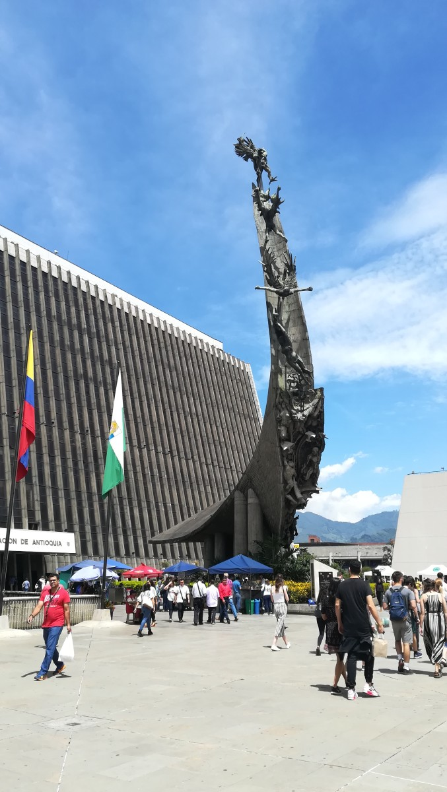

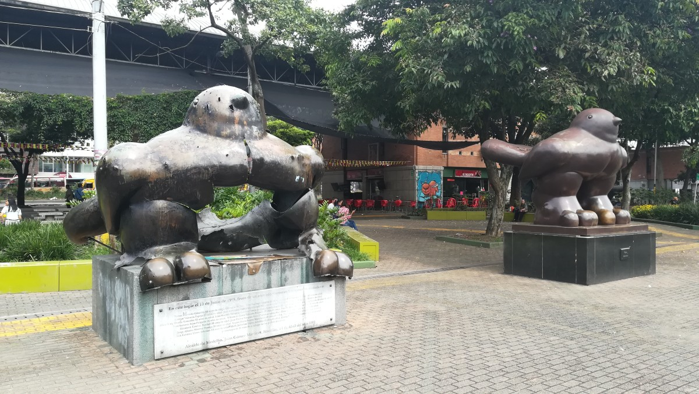
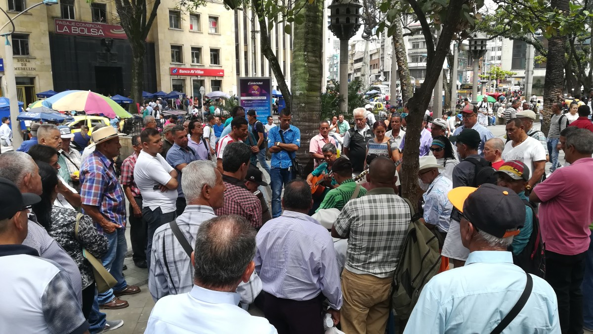
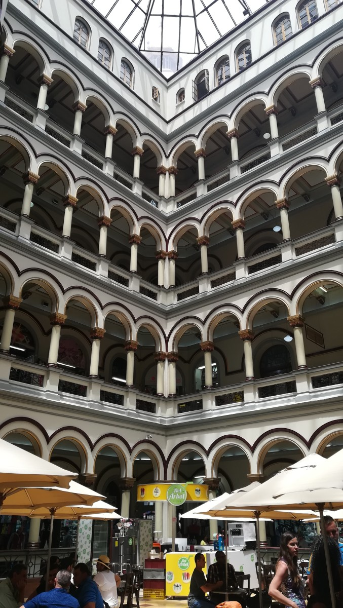

Pablo Escobar hat Medellín berüchtigt gemacht. Durch seine Hand starben hunderte oder wahrscheinlich eher tausende von Menschen. Einmal führte er einen Anschlag auf ein Passagierflugzeug aus, nur um eine einzige Person zu töten (welche letztendlich gar nicht an Bord war). Inzwischen ist auch er selbst getötet worden, aber er bleibt weiterhin eine kontroverse Person in der Bevölkerung. Stadtführer, die ihre Touren auf Englisch machen, vermeiden seinen Namen und benutzen Synonyme, wie „der berüchtigte Kriminelle“. Sie haben Angst vor Missverständnissen mit zufälligen Vorbeigängern, die meist kein Englisch können und nur den Namen hören würden. Aus dem Kontext gerissen könnten sie dann denken, dass Escobar verherrlicht würde. In der Tat werden auch „Escobar-Tours“ angeboten, währenddessen man unter anderem seine alte Wohnung und den Ort, an dem er erschossen wurde, besucht. Auch sein Grab steht auf dem Programm. Diese Tour haben wir mal links liegen lassen.

\[caption id="attachment\_2084" align="aligncenter" width="900"\][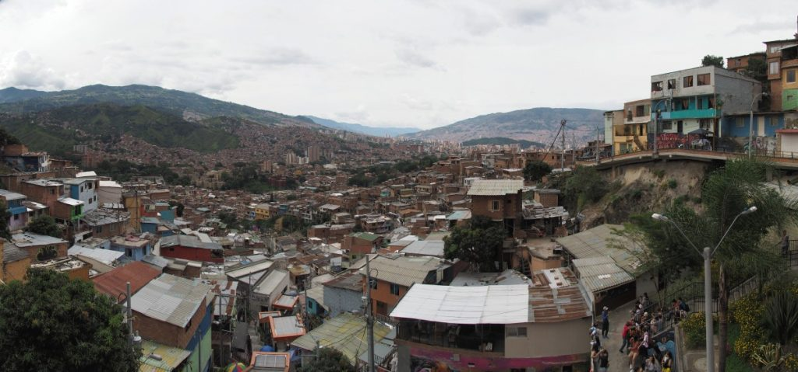](https://collectingbaggage.nl/wp-content/uploads/2018/06/P6102803-P6102807.jpg) Medellín - Comuna 13\[/caption\]

Comuna 13 hat seine düstere Geschichte augenscheinlich hinter sich gelassen. Graffitikünstler und Breakdancer haben sich ihrem Stadtteil angenommen und das zieht jährlich tausende Touristen an. Auch der Bau von mehreren Rolltreppen hat den vormals ausgegrenzten Stadtteil mit dem Zentrum verbunden und damit die Menschen näher zusammengebracht. Trotz allem ist die Vergangenheit noch lange nicht wie weggeblasen. Die junge Frau, die uns die Nachbarschaft zeigte, erzählte uns nach dem offiziellem Teil, wie sie vor gerade mal drei Wochen einen Anruf vom größten Kriminellen des Stadtteils erhielt. „_Ich solle zu ihm kommen, wir müssten reden. Ich hatte natürlich Todesangst. Vielleicht hatte ich was falsches gesagt, eine falsche Person verärgert. Als ich dort war, sagte er lediglich, dass ich von jetzt an kein Schutzgeld mehr bezahlen müsse._“ Ungläubig schauten wir uns an. Bis vor kurzen bezahlte sie also noch Schutzgeld, um ihre Stadtrundgänge ohne Belästigungen und Bedrohungen irgendwelcher Ganoven anbieten zu können.

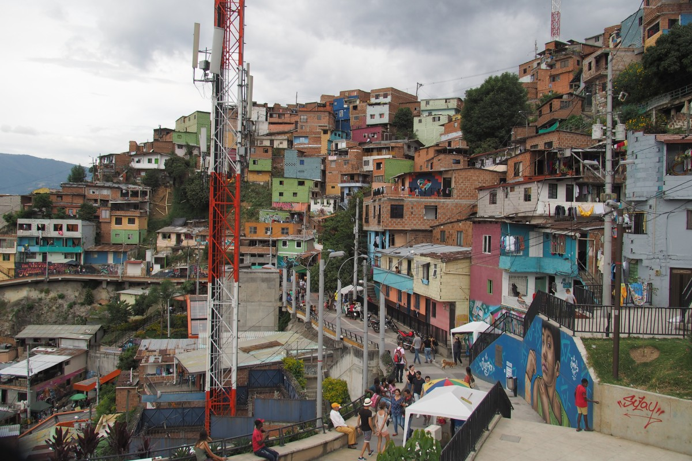
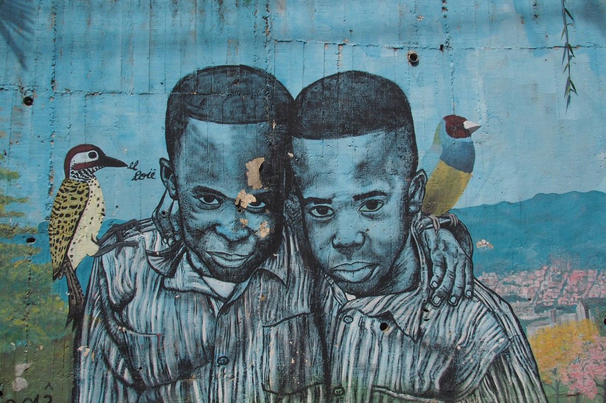
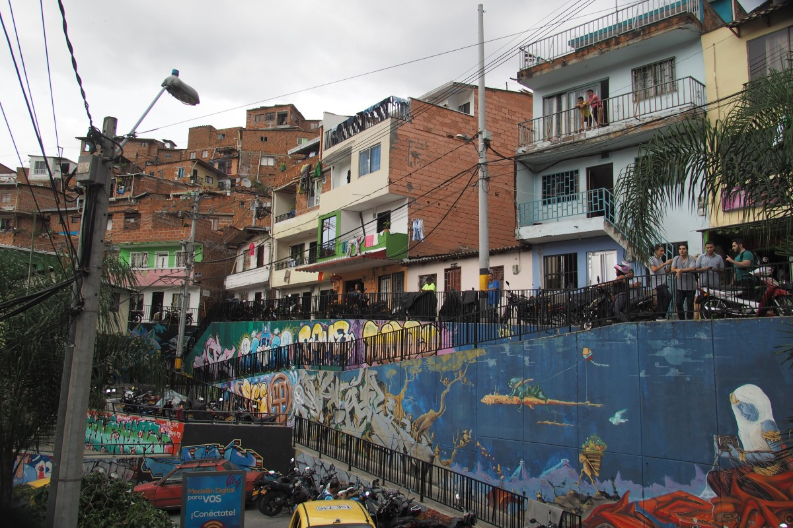

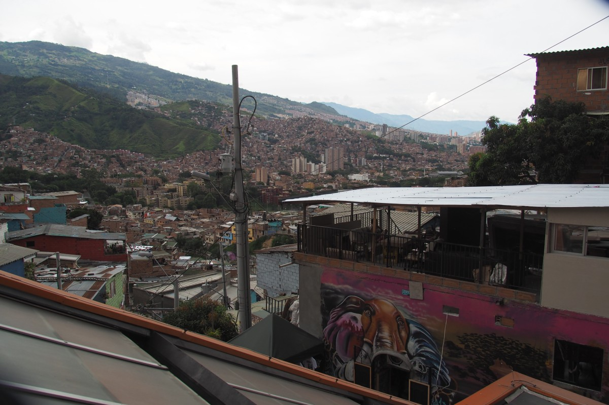

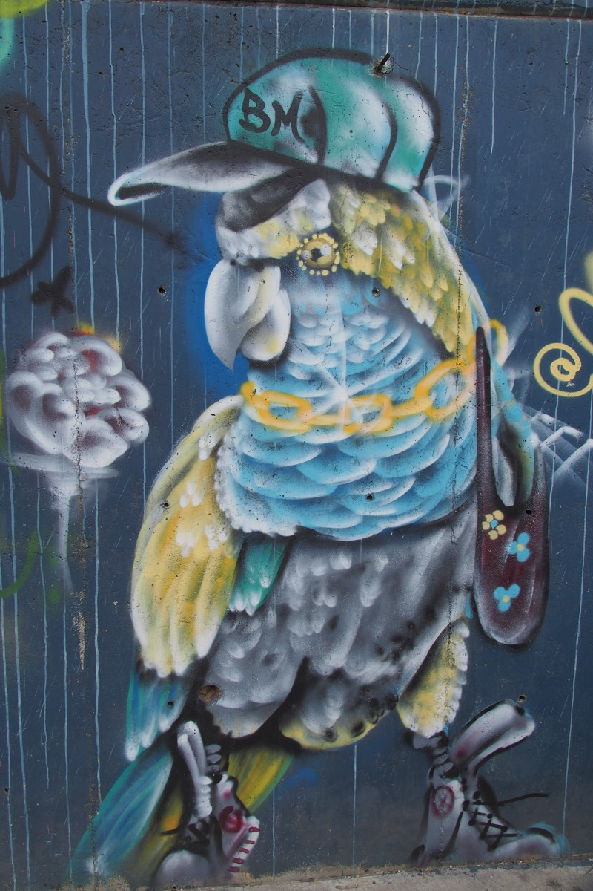
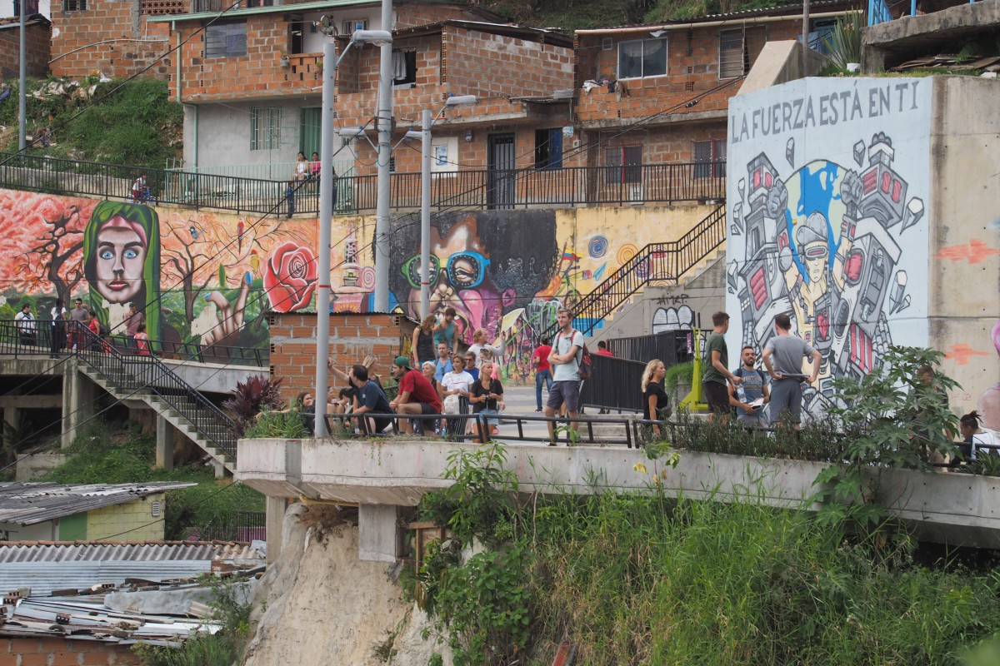

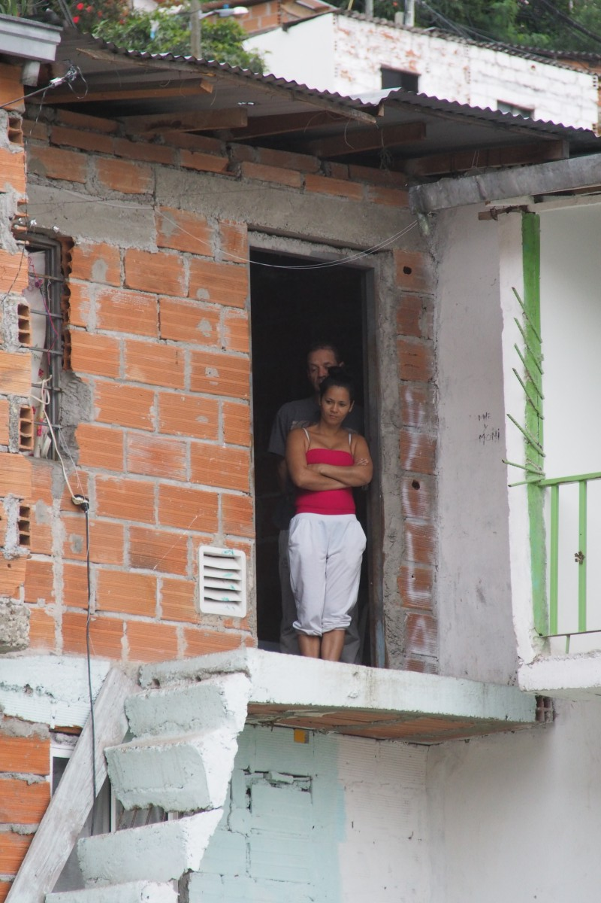
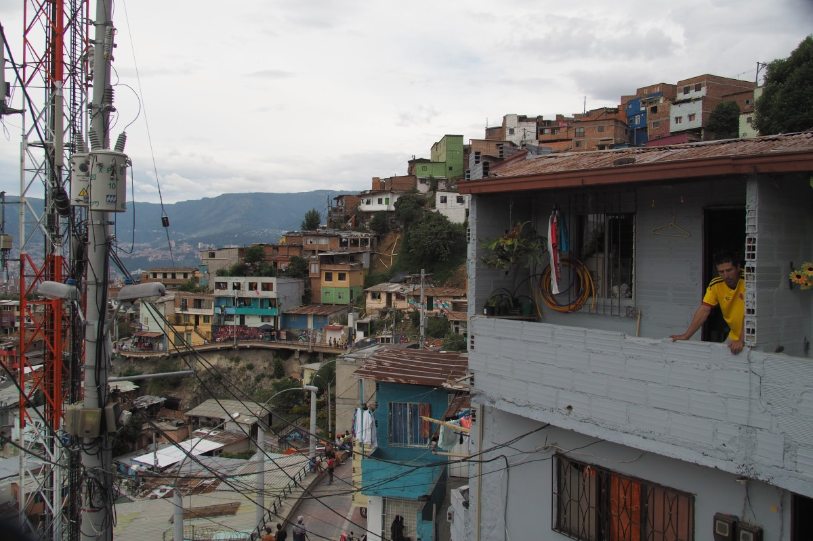

Nach drei Tagen in Medellín war es dann endlich so weit: Wir stiegen mit der Anweisung in Puente Tierra auszusteigen in den Bus nach Guatapé. In keiner unserer Karten konnten wir das finden, nicht mal Google wusste Rat, und so waren wir gespannt, wohin es uns letztendlich verschlagen würde. Von der Kreuzung, an der uns Busfahrer rausließ, liefen wir noch eine gute halbe Stunde einen schmalen Weg entlang („_Ist es dieser Hof? Nein, müsste der nächste sein. Nee, auch nicht..._“) bis wir endlich bei der Granja Vidar ankamen. Wir wurden herzlich und lauthals von fünf kläffenden Hunden, Flaco, Blass, Mago, Kiny und Kenya, begrüßt. Insgesamt durften wir in den letzten Wochen noch mehr Bekanntschaften schließen. Nicht nur mit den Hof-“Eltern“ und den anderen Freiwilligen, sondern auch mit den Katzen, Ziegen, Enten, Hühnern, Küken, der Kuh und dem Kalb. Eine große Familie also…

\[caption id="attachment\_2082" align="aligncenter" width="900"\][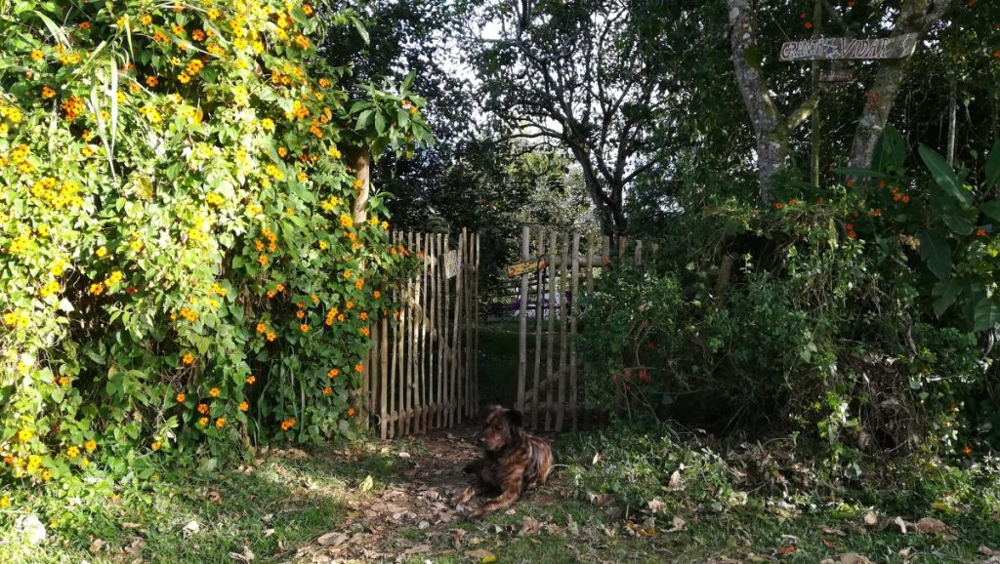](https://collectingbaggage.nl/wp-content/uploads/2018/06/IMG_20180614_170115.jpg) Granja Vidar\[/caption\]
