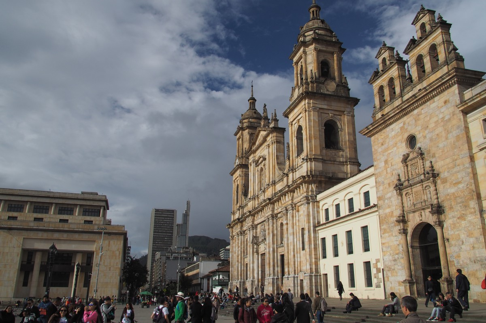
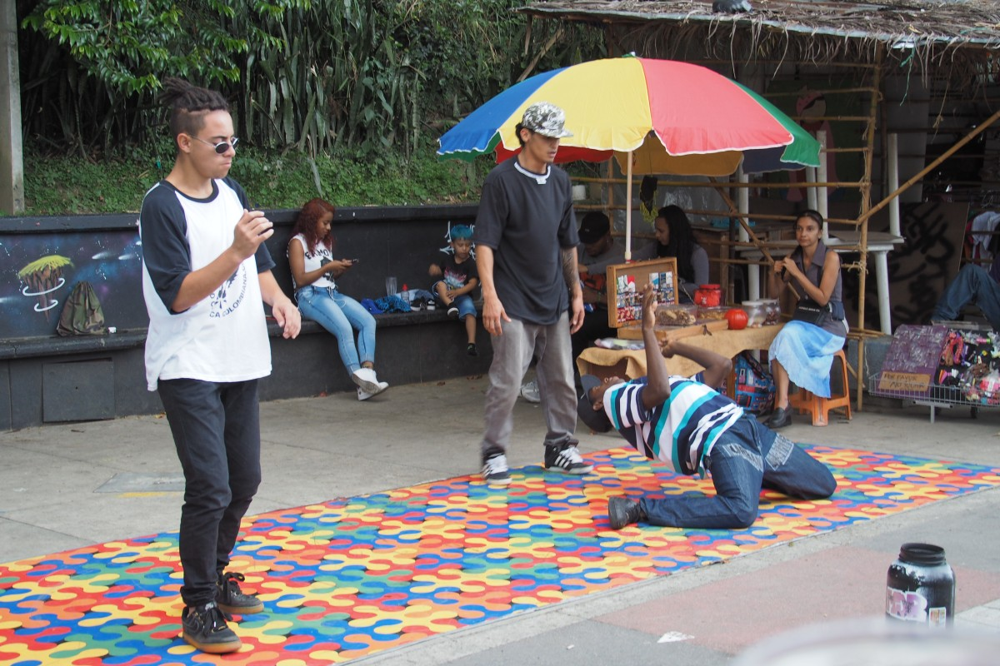

Van de verafgelegen Galapagoseilanden reisden we meteen naar drie miljoenensteden achter elkaar: Quito (Ecuador), Bogotá (Colombia) en Medellín. Om vervolgens neer te strijken in een boerderij op het Colombiaanse platteland.

Quito, de Ecuadoraanse hoofdstad, was voor ons vooral een noodzakelijke tussenstop. Na twee weken eilandleven, weg van alles, laafden we ons aan de goed gesorteerde supermarkt om de hoek. Eigenlijk wilden we lekker uiteten gaan, ter gelegenheid van onze verjaardagen, maar eens te meer zette ons humeurige maag-darmsysteem een streep door de rekening. Meer dan een lekker verjaardagsontbijt voor Malte zat er helaas niet in.

Tijdens onze spontane vlucht van Peru naar de Galápagos hadden we eigenlijk niet veel verder dan Quito gedacht. Colombia lag voor de deur maar we moesten nog bedenken waar we dan precies heen wilden reizen. We konden echter maar weinig enthousiasme opbrengen voor lange busreizen en weggestopte bestemmingen, en dus waren we het er snel over eens dat we zo snel mogelijk een plek wilden vinden om even tot rust te komen. In het hart van Colombia, nabij Medellín, vonden we een kleine, ecologische boerderij die een extra paar handen zocht. Omdat de regio bekendstaat om haar constante voorjaarsweer leek dat ons wel een mooi plekje voor een pauze. Voordat we daar terecht konden, moesten we nog een paar dagen overbruggen.

### Bogotá

En dus vlogen we van Quito naar Bogotá, de hoofdstad van Colombia. Enigszins gespannen betraden we dit land dat bekendstaat om z’n gewapende conflicten, drugshandel en hoge criminaliteitscijfers. Oké, en misschien om [Carlos Valderrama](https://nl.wikipedia.org/wiki/Carlos_Valderrama). Maar tegelijkertijd waren we ook nieuwsgierig: onderweg in Zuid-Amerika hadden we al zoveel positieve verhalen gehoord over het land en zijn bewoners dat we het zelf wel eens wilden zien.

Colombia begon eerst met een bezoek van een (Duitse) dokter. Freke bleek een tropische parasiet met zich mee te dragen: jieuw!! Gelukkig is dat met een handvol medicijnen snel op te lossen en kon ze wel mee met een aantal free walking tours.

Daar hebben we ons op uitgeleefd: een generieke historische tour, eentje over de Colombiaanse geschiedenis van oorlog en vrede (ja dat is er ook) en eentje over het Colombiaanse eten. En elke tour weer kregen we van de gids te horen hoe blij hij was dat we er waren. ‘_Want wat was de reactie toen jullie zeiden dat je naar Colombia ging? Dat je moest oppassen, dat het er gevaarlijk is, of het wel veilig is om er te reizen?_’ Tja, de mensen zelf weten wel wie dat tegen ons heeft gezegd. Colombia is er nog lang niet, maar het is er al wel een stuk veiliger. ‘_En wie heeft er die ene Netflix-serie gezien? Hebben we al gezegd dat we Narcos hier maar niks vinden?_’ om vervolgens door een vrouw weggestuurd te worden want er wordt straks een filmscène gedraaid. Ze droeg een identificatiekaart met het logo van Netflix.

\[caption id="attachment\_2083" align="aligncenter" width="900"\] Bogotá\[/caption\]

Wij voelden ons in ieder geval veiliger dan soms in Bolivia of Peru. Dat had misschien ook wel te maken met het feit dat Bogotá een (bijna Westerse) wereldstad is, en zo onbewust vertrouwd aanvoelde. Het is geen mooie stad. Nadat in 1948 een populaire presidentskandidaat werd vermoord, braken er grote rellen uit die vrijwel het hele centrum in puin legden. Vergelijk het met Nijmegen dat na het bombardement ook niet al te mooi werd heropgebouwd. Maar de verhalen van de straat waren des te interessanter (en het eten des te lekkerder).

Bogotá heeft daarnaast een erg interessant (en zwaarbewaakt) Goudmuseum, waar zoveel gouden objecten van oude culturen zijn opgeslagen dat ze bijna niet meer weten wat ze ermee moeten doen. Hier komen de Spaanse geruchten over El Dorado (de Gouden Stad) vandaan. El Dorado vonden ze niet, wel een bergmeer waar bij elke machtswisseling de nieuwe koning een offer vol gouden en zilveren objecten in het water gooide. Daarmee werd volgens hun de cirkel van het leven voltooid: goud en zilver zijn namelijk eigenlijk zonne- en maanstralen die de aarde treffen. Als men het goud en zilver weer in het water gooit, komen ze weer terug bij Moeder Aarde. Van al dat moois is nog maar een fractie over, maar dus nog steeds om meer dan één museum te vullen.

Zoveel goud moet natuurlijk goed bewaakt worden, maar militairen zijn hier sowieso een ding. Soms staan ze letterlijk op elke straathoek (als in vier op één kruising). Hoewel dit Europeanen onveilig kan laten voelen, betekent het voor Colombianen juist veiligheid: er zijn tijden geweest dat er mijlenver geen soldaat te zien was. Zelfs de politie en het leger waagden zich niet in de gebieden waar drugskartels het voor het zeggen hadden. Veel gebouwen hebben nog wel hoge hekken met prikkeldraad, niet om – zoals in een gevangenis – de mensen binnen te houden maar om ongewenste indringers buiten te houden.

\[caption id="attachment\_2079" align="aligncenter" width="1008"\] Security\[/caption\]

Wij verbleven in de wijk Chapinero waar je ‘s avonds wel gewoon over straat kan. Nu de medicijnen hun werk deden, hadden we nog een lekker etentje voor onze verjaardagen tegoed. Op het menu stonden verrassende gerechten met lokale, Colombiaanse ingrediënten. Jummie.

### Medellín

Vanuit Bogotá namen we een tien uur durende bus naar Medellín. Die ging door prachtige glooiende heuvels, met veel groen en, zoals we merkten zodra we even de door airco gekoelde bus uitstapten, vochtige hitte. Gelukkig was Medellín zelf niet zo zweterig. Integendeel, Medellín staat bekend als stad van de eeuwige lente.

Medellín was nog niet zo lang geleden de gevaarlijkste stad ter wereld, met de hoogste moordratio. Tegenwoordig trekken bontgekleurde graffiti en hippe koffiebarretjes vooral jonge bezoekers aan (in heel Colombia is het overigens merkbaar dat backpackers de weg plaveien voor andere toeristen; veel tours kennen een gemiddelde leeftijd van 25-30 jaar). Colombia verandert en Medellín is een schoolvoorbeeld van deze positieve ontwikkeling. Kortgeleden won de stad zelfs een prestigieuze innovatieprijs.

\[caption id="attachment\_2081" align="aligncenter" width="900"\] Medellín\[/caption\]

Een van de plekken waar de verandering het meest zichtbaar is, is Comuna 13. In deze wijk werd begin deze eeuw nog (letterlijk!) slag geleverd tussen de FARC, de ELN, de drugsmaffia en het leger. Allemaal van een andere kant. Wijkbewoners waren ooit het geweld op het platteland ontvlucht en vonden in de stad alleen krakkemikkige bewoning zonder stromend water en elektriciteit. Drugskartels zoals die van Pablo Escobar vonden hier een dankbare pool van ‘uitzendkrachten’.

Pablo Escobar is de reden waarom Medellín zo berucht werd. Hij vermoordde honderden, zo niet duizenden mensen. Zo pleegde hij eens een aanslag op een passagiersvliegtuig om één persoon te doden (die op het laatste moment juist niet op die vlucht zat). Nog steeds is zijn naam controversieel. Gidsen die hun free walking tours in het Engels voeren, zeggen zijn naam nooit hardop en verwijzen naar hem als ‘de meest beruchte crimineel’. Lokale voorbijgangers, die geen Engels spreken en dus niet weten wat er precies wordt gezegd, komen anders verhaal halen, omdat ze denken dat Escobar verheerlijkt wordt. Je kunt inderdaad ook Escobar-tours doen waarbij je onder meer zijn oude appartement en het dak bezoekt waar hij werd doodgeschoten. Ook zijn graf staat op het programma. Die tour hebben wij maar links laten liggen.

\[caption id="attachment\_2084" align="aligncenter" width="900"\] Medellín - Comuna 13\[/caption\]

Comuna 13 heeft die geschiedenis, op het oog, achter zich gelaten. Graffiti-artiesten en breakdancers hebben de wijk nu overgenomen en dat trekt duizenden toeristen per jaar. Ook de bouw van meerdere roltrappen in de open lucht had het voorheen afgelegen stadsdeel met het centrum verbonden en daarmee de mensen dichterbij elkaar gebracht. Maar ook hier is het verleden nog steeds voelbaar als onze gids vertelt hoe ze slechts drie weken daarvoor werd gebeld door de grootste crimineel van dit stadsdeel. ‘_Ik moest bij hem komen. Ik was doodsbang natuurlijk. Ik dacht dat ik iets verkeerds had gedaan. Maar ik ging erheen en hij vertelde me alleen maar dat ik geen afpersingsgeld meer hoefde te betalen._’ Onze oren flapperden: tot voor kort betaalde zij dus nog steeds geld om deze tours te kunnen houden zonder dat de criminelen haar daarbij lastig vielen.

Na drie dagen in Medellín was het dan eindelijk zover: we stapten in de bus richting Guatapé met de instructie om bij Puente Tierra uit te stappen. Dat stond niet eens op onze kaart dus we waren benieuwd waar we terecht zouden komen. Vanaf de weg moesten we nog ongeveer een half uur lopen (‘is het die boerderij? De volgende is het zeker…’) tot we eindelijk aankwamen bij Granja Vidar. Hier werden we begroet door vijf blaffende honden: Flaco, Blass, Mago, Kiny en Kenya. En in de afgelopen weken hebben we nog veel meer bewoners van deze schattige boerderij leren kennen. Zoals Domingo, Yang, Morita, Jea, Minca...

\[caption id="attachment\_2082" align="aligncenter" width="900"\] Granja Vidar\[/caption\]
