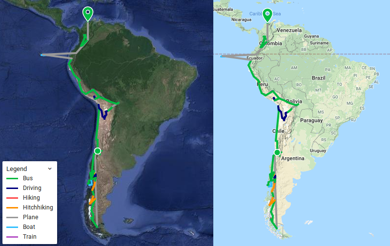
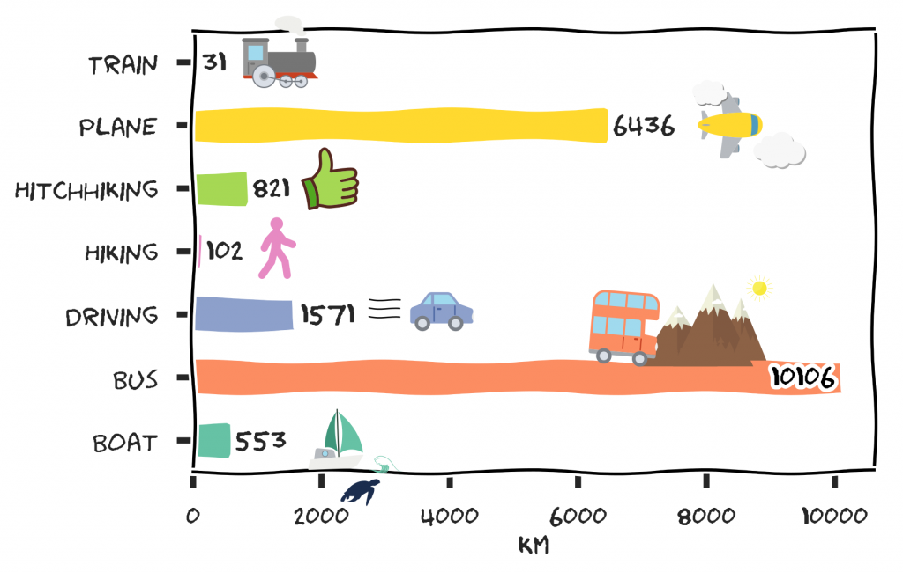

Fast genau sieben Monate ist es her, dass wir zum ersten Mal südamerikanischen Boden berührten. Seitdem haben wir den Kontinent einmal von Süd nach Nord durchquert. Heute sind wir am nördlichsten Punkt, den wir in Südamerika auf unserer Reise erreichen werden: Taganga an der karibischen Küste. Wer sich unsere Route etwas mehr im Detail anschauen möchte, der kann das auf unserer [interaktiven Karte](https://collectingbaggage.nl/de/collected-locations/) tun. Übrigens ist diese Karte auch immer im Menü unter _Collected Locations_ zu finden.

\[caption id="attachment\_2142" align="aligncenter" width="799"\]Von Süd nach Nord in 7 Monaten\[/caption\]

Weil jemand fragte: Bisher haben wir etwa 31632 km zurückgelegt. Dies ist eine Schätzung, die auf den Luftlinien zwischen unseren Schlafplätzen basiert ist. Also ohne Tagesausflüge und so. Den Hinweg von Amsterdam aus haben wir ebenfalls nicht mitgezählt.

\[caption id="attachment\_2147" align="aligncenter" width="900"\] Ingesamt: 31632.4 km\[/caption\]
