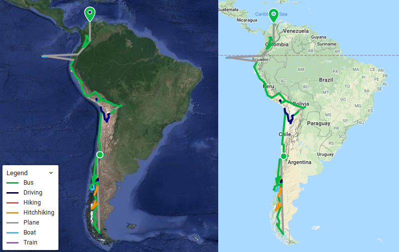

Bijna precies zeven maanden geleden zetten wij voor het eerst voet op Zuid-Amerikaanse bodem. Sindsdien hebben we het continent van zuid naar noord doorkruist. Op dit moment zijn we op de meest noordelijke plek die we in Zuid-Amerika zullen bereiken: Taganga, aan de Caribische kust. Als je onze route in meer detail wil bekijken, dan kan dat via onze [interactieve kaart](https://collectingbaggage.nl/collected-locations/). Deze kaart is altijd te vinden via het menu onder _collected locations_.

\[caption id="attachment\_2142" align="aligncenter" width="799"\]Van zuid naar noord in 7 maanden\[/caption\]

Omdat ernaar gevraagd is: inmiddels hebben we rond de 31632 km afgelegd. Dit is maar een schatting gebaseerd op de afstanden hemelsbreed tussen onze slaapplekken. Dus zonder dagtripjes en dat soort dingen. Verder hebben we de heenreis vanuit Schiphol ook niet meegeteld.

\[caption id="attachment\_2147" align="aligncenter" width="900"\] Totaal: 31632.4 km\[/caption\]
