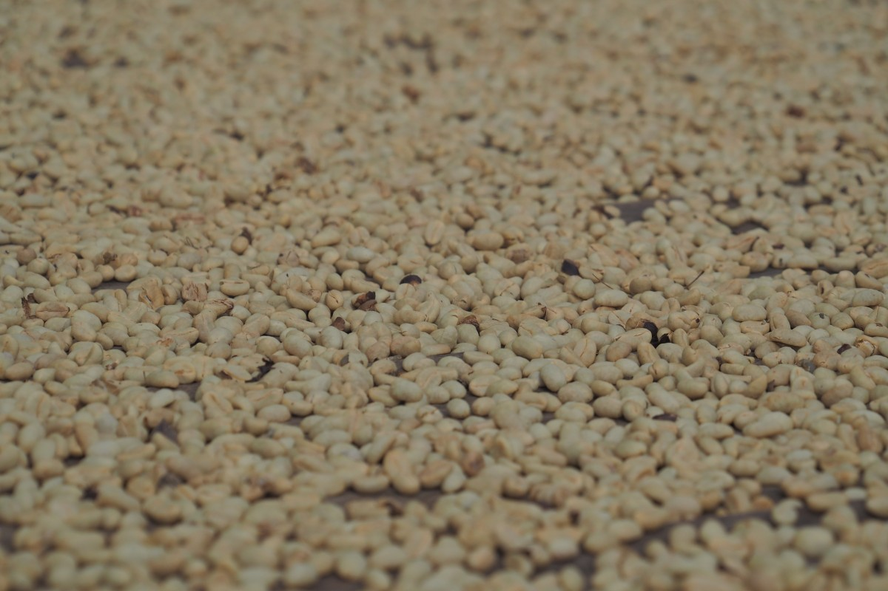
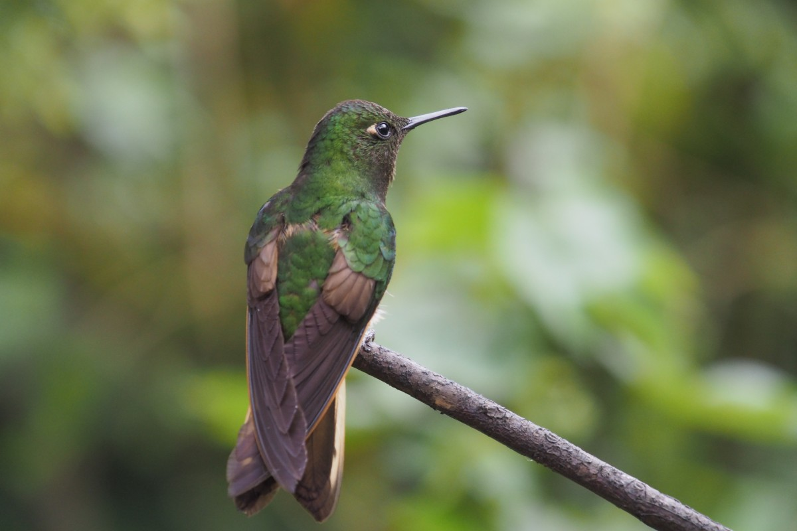

Wij hebben nog nooit zoveel WK voetbal gekeken als dit jaar. En dat terwijl Nederland niet eens speelt en Duitsland er al snel uit werd gekieperd. Maar in Colombia is voetbal overal en onontkoombaar.

Op de boerderij werd er al minstens één wedstrijd per dag gekeken, maar dat was nog verklaarbaar: de vele vrijwilligers wilden ook graag hun land zien spelen. Maar tijdens de laatste groepswedstrijd werd ons pas echt duidelijk hoe belangrijk voetbal hier is. Wij waren onderweg en de urenlange busrit werd opgeluisterd door de WK-wedstrijd Colombia vs Senegal. Alles lag nog open en dus was het spannend. Wegwerkers keken samen met de politieman op de telefoon, een door weer en wind getekende boer luisterde via een oude radio en in de dorpen verzamelden truckers zich om te kijken op één van de vele televisies. In onze bus stond de radio aan en er werd gejuicht toen Colombia scoorde. Toen ze uiteindelijk zelfs als groepswinnaar doorgingen naar de volgende ronde, leek het wel alsof ze de wereldbeker al gewonnen hadden: een grote, gele stoet fans trok op scooters feestvierend over de snelweg, luid toeterend aangemoedigd door voorbijrijdende vrachtwagens.

Op de dag dat Colombia de achtste finale speelde, tegen Engeland, gingen wij naar het Tayrona National Park, aan de Caribische kust. Gewoonlijk een belangrijke, soms overvolle toeristische attractie, maar die dag zou het wel vrijwel leeg zijn, dachten wij. Op het 8 kilometer lange pad, door jungle en langs witte stranden, werd al snel duidelijk dat we ook hier niet ontkwamen aan het voetbal. Bij één van de eettentjes langs een strand liep een klein jongetje al uren voor de wedstrijd luid blazend op een fluit voorbij: hij had er zin in. De geel-blauw-rode vuvuzela’s lagen klaar. Op ons einddoel, het idyllische Cabo San Juan, was het strand inderdaad vrijwel leeg: iedereen had zich verzameld in het restaurant waar de wedstrijd, nationaal park of niet, gewoon te zien was.

Twee uur later moesten wij alweer terug, maar de wedstrijd werd verlengd. Het stond 1-1. Bij het volgende strand, met de volgende televisie in een eettentje, was de stand onveranderd. De camera zoemde in op de keepers: het werden penalty’s. We liepen door en hoorden een paar minuten later luid gejuich (of gejammer?). Bij weer het volgende kampement keek iedereen triest. Enkelen omhelsden elkaar gelaten. Colombia had verloren.

\[caption id="attachment\_2246" align="aligncenter" width="900"\] Tayrona National Park\[/caption\]

Maar daarmee was het WK in Colombia zeker niet afgelopen. Enkele dagen later vertrokken wij op een vierdaagse trek door de jungle naar wat, heel romantisch, de Verloren Stad wordt genoemd. De Ciudad Perdida was de hoofdstad van de Tayrona, die hier woonden toen de Spanjaarden kwamen, en werd daarna verlaten. Pas in 1976 werden de overwoekerde ruïnes herontdekt. Nog steeds kan je er alleen lopend komen, 23 kilometer heen en 23 kilometer terug, dwars door de Sierra Nevada de Santa Marta, een gebied dat een aantal inheemse stammen zoals de Kogui nog steeds hun thuis noemt.

\[caption id="attachment\_2266" align="aligncenter" width="900"\] Kogui Village\[/caption\]

Best afgelegen, leek ons, maar in Colombia kan je zelfs op zo’n trail nog voetbal kijken. In de kampementen waar we sliepen of lunchten, of waar we een fruitpauze hielden. Tijdens het lopen werden we steeds op de hoogte gehouden over hoe België stuntte door Brazilië te verslaan. Het laatste Zuid-Amerikaanse land dat eruit vloog, jammerden de gidsen. Het was een rare cultuurclash om te zien hoe leden van de inheemse stammen nog steeds witte, vieze vodden dragen, terwijl ze op een flatscreen-tv de laatste Hollywoodfilms zitten te kijken. Die kunnen ze zich veroorloven dankzij het toerisme naar de Verloren Stad.

\[caption id="attachment\_2290" align="aligncenter" width="900"\] Ciudad Perdida\[/caption\]

De enige plek waar we geen voetbal hebben gezien, was in Rincón del Mar, een klein vissersdorpje aan de Caribische kust met een aantal tropische eilanden in de buurt. Rincón del Mar was voor ons in eerste instantie een tussenstop op weg naar zo’n idyllisch, Caribisch eiland (met palmbomen, wit strand, blauwe zee en cocktails uit een kokosnoot) maar het dorpje zelf heeft ons betoverd. Een dorp waar de vissers langskomen met hun kreeften die nog krioelen in hun handen, waar de lokale jeugd voetbalt op het strand onder aanmoedigend gejoel van de volwassenen (in onverstaanbaar Spaans), en waar je op blote voeten naar de overkant van de straat loopt om in het enige kleine winkeltje je boodschappen te doen. Zelfs de Colombianen hebben deze plek nog niet ontdekt, waardoor het er heerlijk rustig en vooral Caribisch relaxt was. Maar met genoeg te doen op vaarafstand – we hebben er bijvoorbeeld gezwommen met lichtgevend plankton en een tour rondom de eilanden gedaan – staat deze plek op het punt om te exploderen: naar verluidt komt het in de volgende editie van de Lonely Planet. Nu is het nog een plek om geen voetbal te kijken (hoewel dat meer was vanwege het gebrek aan signaal in het hostel).

\[caption id="attachment\_2299" align="aligncenter" width="900"\] Relax!\[/caption\]

Toen we genoeg bijgebruind waren, reden we naar Cartagena, de belangrijkste havenstad van het vroegere Spaanse rijk in Zuid-Amerika. Vanuit hier zeilden de Spaanse karvelen vol Zuid-Amerikaanse rijkdommen naar het Europese continent en hier kwamen talloze Afrikaanse slaven aan om te zwoegen op bijvoorbeeld de verdedigingswerken van de stad. Zo’n rijke stad was vroeger immers een gewild doelwit van schietgrage, gierige piraten. De Afrikaanse afkomst van een groot deel van de Colombiaanse bevolking is goed te zien en te horen. In de Colombiaanse keuken is de invloed bijvoorbeeld merkbaar in de zoetigheden en de overal te horen salsaklanken worden gemengd met ritmisch getrommel.

Vandaag voerden Kroatië en Frankrijk de laatste strijd. Ondanks dat deze twee landen op vele vlieguren hier vandaan liggen (we vragen ons af of Colombianen Kroatië wel zouden kunnen aanwijzen op de kaart), verzamelden zich ook hiervoor Colombiaanse voetbalfans al om tien uur ‘s ochtends rondom de ouderwetse beeldbuizen van de lokale kiosks. De uitslag is inmiddels bekend: de Franse fans gingen om 4 uur ‘s middags al ladderzat over straat.

\[caption id="attachment\_2337" align="aligncenter" width="900"\] Cartagena\[/caption\]

### Heilige koffie

Goed, genoeg over voetbal. In Colombia draait ook veel om koffie en om heiligen. Eerst over koffie: de beste ter wereld, volgens velen, hoewel Colombianen niet lijken te weten hóe je dan goede koffie zet. Ze filteren het gewoon door een soort oude sok of gooien het in een grote pan samen met kokend water, klaar. Daardoor is het voor velen juist de slechtste koffie ter wereld. Wij, daarentegen, vinden het nog best te drinken, na alle oploskoffie in de rest van Zuid-Amerika.

Helemaal geconditioneerd op het vinden van goede pasto waren we vertrokken van de boerderij op weg naar het kleine dorpje Salento, midden in de Colombiaanse koffiezone. Na een teleurstellende voetbalochtend waarin Duitsland naar huis werd gestuurd, gingen we voor een sterk kopje op de ecologische koffiefinca van Don Elias. De kleinzoon des huizes toonde ons hoe ze er ook bananenbomen groeien voor de schaduw, avocadobomen om het water in het regenseizoen op te nemen en hoe ze chili gebruiken als pesticide. Hun koffiebonen komen uiteindelijk in Europese restaurants terecht in de koffie van Segafredo. We leerden dat er eigenlijk helemaal geen extra cafeïne zit in een espresso, dat is marketing, en dat er geen verschil is tussen de koffie Arabica en Colombia, behalve de kleur van de boon. Aan het einde kwam Don Elias zelf ook nog even gedag zeggen.

\[caption id="attachment\_2353" align="aligncenter" width="900"\] Salento\[/caption\]

Vanuit Salento kan je ook een toffe Willy-jeep nemen als openbaar vervoer. Wij namen zo’n oude jeep, uit de Tweede Wereldoorlog, naar de Valle de Cocorra waar je een mooie wandeling kan maken door het platteland, de jungle en tussen de waspalmen, de grootste palmbomen ter wereld en een nationaal symbool van Colombia.

En dan de heiligen. Wij merkten al bij aankomst in Bogotá dat Colombianen hun heiligen serieus nemen, net als hun vrije dagen. Als de viering van een bepaalde heilige (en ze hebben er veel) niet op een maandag valt, dan zijn ze de maandag daarna tóch vrij (en rekenen taxi’s een zondags tarief). In Rincón del Mar maakten ze zich bij ons vertrek klaar voor de viering van de dag van de maagd Carmen. In het zuidelijke La Plata vierden ze de dag van San Pedro en San Juan met muziek en vele flessen aguardiente, de nationale likeur.

\[caption id="attachment\_2365" align="aligncenter" width="900"\] Festival in La Plata\[/caption\]

Dat laatste is een verhaal met een lange aanloop. Na Salento in de Colombiaanse koffiezone wilden wij naar de archeologische opgraving Tierradentro, dat letterlijk ‘in de aarde’ betekent. Het zijn eeuwenoude graftombes die, ondanks hun status als werelderfgoed, nog maar weinig buitenlandse toeristen trekken. Het is dan ook nogal een onderneming om er te komen. Wij moesten daarvoor eerst naar Popayán, een schattig, koloniaal stadje dat weer eens als bijnaam ‘de Witte Stad’ draagt en wat weer meer in de richting van Ecuador ligt. Na een nacht daar namen we de enige lokale bus die ons die dag naar Tierradentro kon brengen. De weg kronkelde zich een weg door de Andes, tot we tot stilstand kwamen bij het begin van wegwerkzaamheden. Anderhalf uur later… reden we weer verder, inmiddels over onverharde, soms modderige wegen.

Toen we uiteindelijk in de ‘grote stad’ aankwamen, werden we opnieuw opgehouden, maar dit keer door het Colombiaanse leger. Iedereen moest de bus uit, alle mannen werden gefouilleerd en hun tassen werden doorzocht; de vrouwen hoefden zich alleen te identificeren. Voor Malte was het een aparte ervaring om een keer met je handen tegen een bus aan betast te worden door een soldaat. Freke had net die dag vergeten haar paspoort uit de grote backpack te halen maar moest die per se onder alle andere bagage tevoorschijn halen. Ze werd vervolgens gewenkt. Een andere passagier verzuchtte grappend: ‘het zijn toch ook altijd die Europeanen’. Maar het ging slechts om het teruggeven van de paspoortkopie die Freke in eerste instantie had gegeven.

\[caption id="attachment\_2375" align="aligncenter" width="900"\] Tierradentro\[/caption\]

De tientallen graftombes liggen verspreid in de vallei, maar allemaal binnen loopafstand. Al met al is het een flinke daghike om ze allemaal te zien. Stel je daarbij voor dat de graftombes zo’n 5 tot 8 meter onder de grond liggen en alleen toegankelijk zijn via (originele) grote traptreden die als een spiraal de grond in gaan, en dan is het niet verwonderlijk dat we hierna flinke spierpijn hadden. De graftombes zijn gegraven tussen de zesde en negende eeuw na Christus, door een cultuur die daarna is verdwenen. Het zijn familiegraven waar ook eerder overleden voorouders zijn herbegraven in potten. Ooit waren ze beschilderd met rood, zwart en witte geometrische figuren en gezichten en een deel daarvan is goed bewaard gebleven. Het feit dat slechts een handjevol tombes zijn belicht en je de anderen zelf moet belichten met je hoofdlamp, gaf ons een echt Indiana Jones-gevoel.

Om half 4 kwamen we terug bij onze hospedaje waar we hadden overnacht. Ruim op tijd om de laatste bus van 4 uur te halen, dachten wij. We moesten naar een stadje zo’n 40 kilometer verderop, La Plata, waar we een nachtbus naar Bogotá en dan een vlucht naar de Caribische kust zouden nemen. Er hing dus nogal wat af van deze lokale bus.

Om 4 uur was er echter geen bus. De eigenaresse van onze hospedaje ging steeds bezorgder kijken. ‘Als de bus vol zit en je hebt geen stoelen gereserveerd, dan komt hij niet eens het dorp in. En dat was echt de laatste bus.’ Onze enige optie was een andere lokale bus die misschien naar La Plata zou gaan. Toen die uiteindelijk voorbijreed, moest de chauffeur ons echter teleurstellen. Hij ging niet naar La Plata. We stonden al onze laatste opties te bespreken (taxi?) toen de bus 50 meter verderop stopte en weer achteruit reed. Hij ging wel naar een ander gehucht en vanuit daar waren er nog bussen naar La Plata. We sprongen aan boord, hopend dat hij zich niet vergiste. In een dorpje, naar ons gevoel in the middle of nowhere, werden we eruit gezet. De buschauffeur vergewiste zichzelf bij de kioskeigenaar nog snel van of de bus inderdaad nog moest komen, voordat hij achter een bocht verdween. Daar stonden we dan in een kiosk, onder de nieuwsgierige blikken van de gehuchtbewoners en met een verse Papa Rellena in onze hand (een gefrituurde, gevulde aardappelbol). Na een half uur verscheen er een jeep die inderdaad nog naar La Plata ging. Gelukkig, we komen er!

In La Plata wilden we eerst nog wat eten voordat we de nachtbus zouden nemen. Het centrum was echter onverwacht druk: er waren veel mensen op straat en er stond een klein legertje politie. Waar zijn we nu weer in terechtgekomen? Voorzichtig volgden we de stroom mensen richting het centrale plein. Daar bleek het groot feest. Veel mannen gingen gekleed als ware Zuid-Amerikaanse cowboys, in witte broek, wit overhemd, grote rode sjaal en witte sombrero, en de vrouwen droegen glitters en kleurrijke jurken vol franjes. We stonden ons nog maar net te verwonderen over dit alles als er één van die ‘cowboys’ op ons afkomt, ons twee shotglaasjes in de handen duwt en ze vult. ‘Bienvenidos’ riep een vrouw ons toe als we proostten en het glaasje aguardiente achteroverslaan. Geweldig! Toen we uiteindelijk een tafeltje vonden in de lokale ‘McDonalds’ (VikingBurgers), werden we aangestaard door zo ongeveer iedereen die er in de rij voor de wc stond (denk: Vierdaagselengte). Een groepje muzikanten, eentje met een enorme hoorn die klonk als een hoorn van een Orc, speelde continu muziek. Sommigen waren zelfs te paard naar het feest gekomen. En zo viert men dus de dag van San Pedro en San Juan (en liggen Caribische Colombianen de maandag erna massaal aan de stranden van Tayrona National Park).

In Rusland rolt de bal niet meer en ook ons avontuur in Colombia nadert z’n einde. Vanuit Cartagena vliegen we naar de andere kant van het land: de Amazone. Het is onze laatste stop in Zuid-Amerika voordat we via Santiago de Chile naar Australië vliegen. Yes, mates, time’s flying when you’re having fun!

\[caption id="attachment\_2394" align="aligncenter" width="900"\] Goodbye Caribbean\[/caption\]
