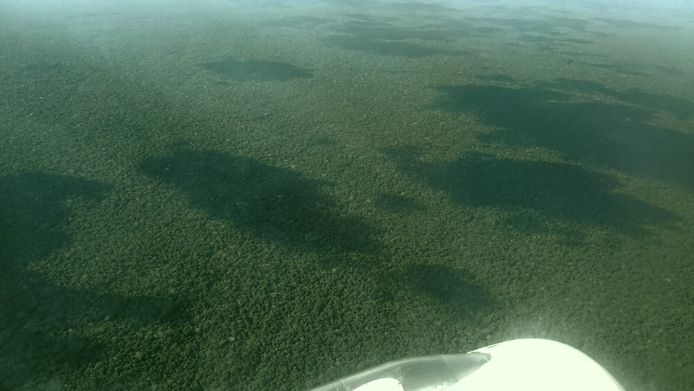
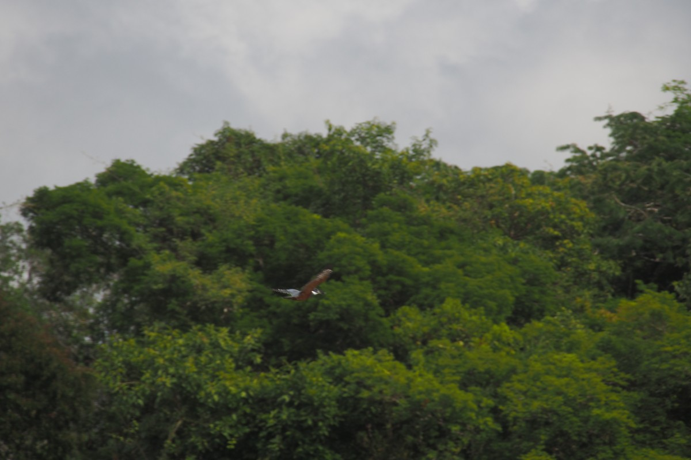
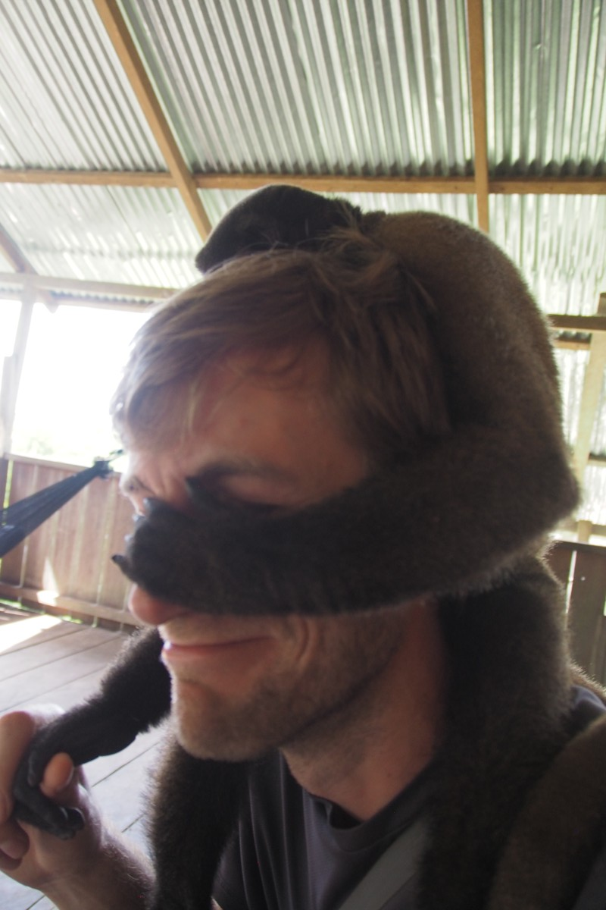
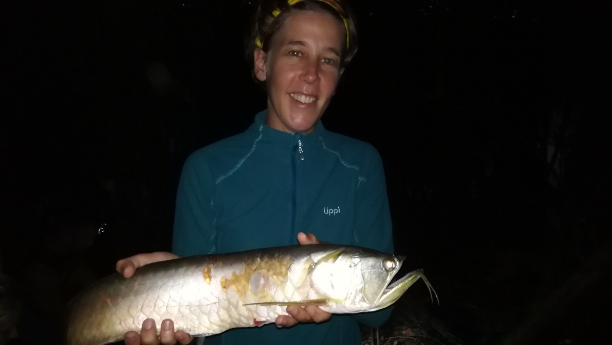
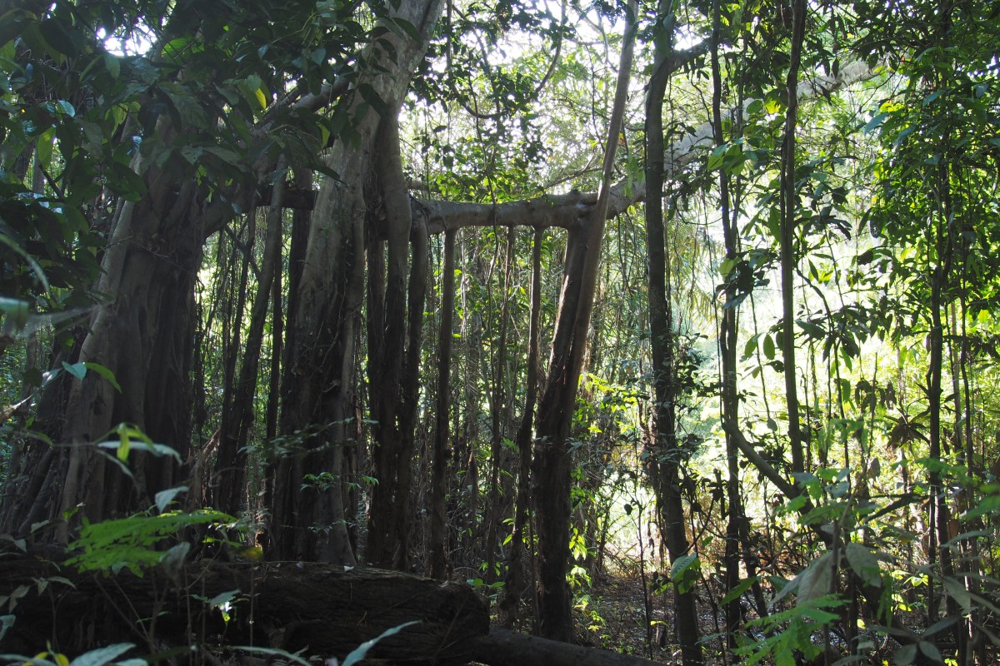
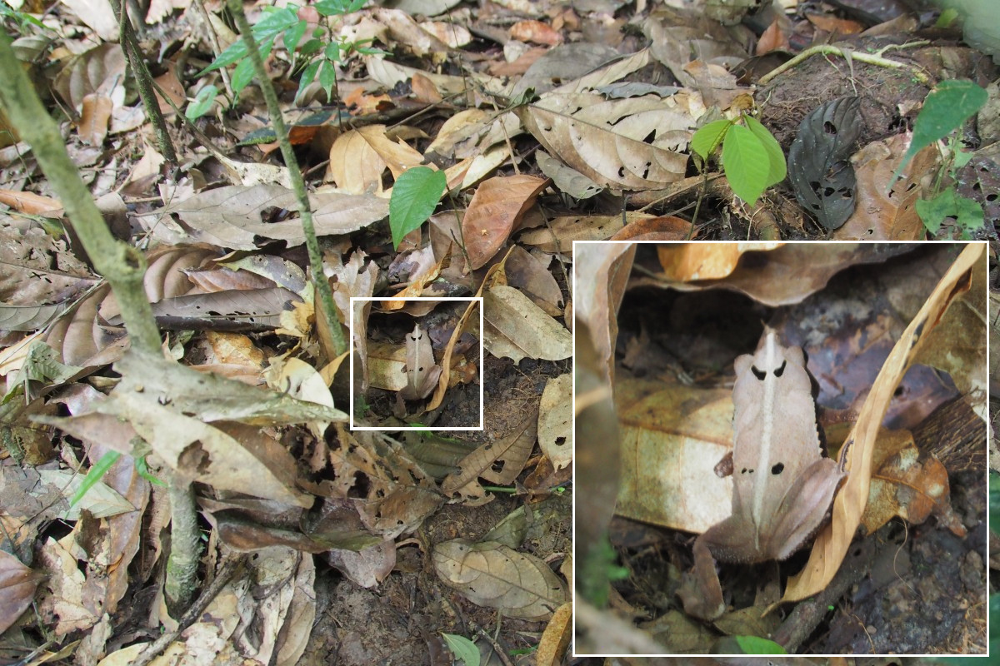

Baum.

Diese [Szene](https://www.youtube.com/watch?v=qGaQ7Kfg9Us) aus dem Disneyfilm Bärenbrüder schießt uns durch den Kopf als wir in Leticia ankommen. Soweit das Auge reicht erstreckt sich ein grünes Meer unter uns und unserem Flugzeug, lediglich durch einen breiten, funkelnden Fluss entzwei geteilt. Wir sind im Amazonas-Regenwald.

Mehr als sieben Monate durch Südamerika reisen ohne den Amazonas zu besuchen, das geht natürlich gar nicht. Für uns ist es der letzte Stopp, bevor wir den Kontinent verlassen. Leticia liegt am Amazonas selbst, also am Fluss, und grenzt sowohl an Peru als auch an Brasilien. Genauer gesagt, Leticia (Kolumbien) und Tabatinga (Brasilien) sind aneinander gewachsen. Der Grenzübergang liegt mitten in der Stadt und man könnte ihn leicht übersehen, würde nicht plötzlich alles auf portugiesisch geschrieben stehen. Peru liegt auf der gegenüberliegenden Seite des Flusses und ist nur per Boot zu erreichen. In diesem Dreiländereck, welches ohne Straßenverbindung isoliert im gigantischen Regenwald liegt, herrscht wortwörtlich grenzenlose Bewegungsfreiheit. Unser Hostel bietet darum folgenden spaßigen Zeitvertreib an: „Besorge innerhalb einer Stunde je ein Bier aus Kolumbien, Brasilien und Peru und erhalte ein zusätzliches Bier aufs Haus!“

Dass die Stimmung hier zwischen den Nachbarn brüderlich-freundschaftlich ist, davon zeugt das jährliche Festival der „Confraternidad“, welches zufällig gerade zugange ist als wir ankommen. Heute ist Brasilien an der Reihe, sich von seiner besten, kulturellen Seite zu zeigen. Abends während der Show im Stadtpark kriegen wir eine Idee vom brasilianischen Karneval: ohrenbetäubende Sambaklänge (Lärmschutz? Was das denn?), bunte Kostüme an leicht bekleideten Damen und eine kurze, faltige Oma, die zwischen den Reihen selbstgemachtes Eis verkauft. Der Park ist voll mit Menschen – so häufig fallen die Feste im Amazonas wohl nicht – und das heißt, Vorsicht vor den Taschendieben! Frekes Handy wurde um ein Haar gestohlen, aber der Täter war zum Glück sturzbetrunken und langsam wie ein Faultier, so dass Freke ihr Handy wieder aus seinen Klauen reißen konnte.

Unserem letzten Abenteuer mit Booten zu trotz (in Rincón del Mar fiel nach dem Schwimmgang mit dem fluoreszierenden Plankton in totaler Finsternis der Motor unseres leicht lecken Bootes aus, woraufhin wir durch ein zufällig vorbeifahrendes Fischerboot „gerettet“ und weggeschleppt wurden), beschlossen wir, doch nochmal unser Glück mit einem Boot zu versuchen. Im Grunde hatten wir natürlich auch nicht wirklich die Wahl, denn mit soviel Wasser um uns herum, sind Boote die einzigen Verkehrsmittel. Der Großteil der lokalen Flotte besteht dabei aus motorisierten Holzkanus. Mit diesen werden Menschen, Handelsware und Hausrat verschifft. Die Fischer fahren mit ihnen entlang der Ufer der vielen Seitenarme auf der Suche nach Fischen, die sich in den ausgelegten Netzen verheddert haben. Hin und wieder begegnet man einem größerem Dampfer, wie zum Beispiel den Fähren nach Manaus (Brasilien) oder Iquitos (Peru), auf denen man die mehrtägige Reise in einer Hängematte (selbst mitzubringen) verbringen kann.

### Rauf auf‘s Wasser

Unser Kanu, mit dem wir vier Tage durch den Dschungel tuckern würden, geht sprichwörtlich in der Masse unter (mit Ausnahme unseres blauen Plastikdaches, welches die meisten Boote nicht haben). Flussabwärts geht es zunächst über den Amazonas, aber schnell biegen wir rechts ab, in einen Seitenarm, dem Yavarí-Fluss. Dieser ist etwas schmaler, sodass man etwas weiter in den Wald schauen kann. Das Ufer ist jedoch schlammig und überall mehrere Meter höher gelegen als der Wasserstand des Flusses. Es ist Trockenzeit. Oberhalb des Matsches fängt der echte Dschungel an. Hier gilt: Nur die stärksten überleben. Wer es nicht geschafft hat, liegt am Ufer. Umgeknickte Bäume liegen auf Sandbänken wie gestrandete Schiffe. Bis zur nächsten Regenzeit, wenn der Wasserspiegel wieder steigt und sie fortspült. Die alljährliche Aufräumaktion der Natur.

Unterwegs zu unserer ersten Unterkunft machen wir Bekanntschaft mit ein paar besonderen Amazonasbewohnern: Rosa Amazonasdelfine. Sie schwimmen zusammen mit ihren grauen Brüdern vor allem an Orten mit starker Strömung oder in der Nähe der festinstallierten Fischnetze, wo sie zum Ärger der lokalen Fischer leicht zugängliche Mahlzeiten finden. Außerdem merken wir, dass die Abholzung des Regenwalds zumindest auf der peruanischen Seite ausschließlich von einem ökonomischen Standpunkt aus gesehen wird. Große Mengen abgeholzter Regenwald liegen an der Seite zum Export in andere Teile der Welt bereit.

\[caption id="attachment\_2470" align="aligncenter" width="900"\] On the Yavarí\[/caption\]

Wer denkt, dass es im Regenwald leicht ist, wilde Tiere zu finden (so wie wir), wird schnell merken, dass er sich täuschte. Zugegeben, wir sind ein bisschen zur falschen Jahreszeit gekommen: Vögel und Affen gibt es momentan nur wenige, da zur Trockenzeit wenig Früchte an den Bäumen hängen. Auf unseren Wanderungen durch das Gehölz, sowohl tagsüber als auch nachts, bekommen wir nichtsdestotrotz besondere Dinge zu sehen. Das vielleicht bemerkenswerteste sind die kleinen Frösche, die sich so gut an ihre Umgebung angepasst haben, dass sie praktisch unsichtbar sind. Selbst wenn man mit dem Finger auf sie zeigt, sind sie doch nicht vom braunen Laub zu unterscheiden (probier sie in den Fotos unten mal zu finden; die Auflösung gibt‘s am Ende dieses Blogs). Angsteinflößender sind die schwarzen Skorpione (sogar der kleine Babyskorpion, den unser Guide beinahe übersah) und die fetten, haarigen Vogelspinnen (besonders die eine extra-dicke, die wahrscheinlich Eier mit sich trug). Unter der Kategorie „schön“ dagegen würden wir die Tukane verbuchen, die eines Tages plötzlich über den Fluss flogen. Tukane sind ziemlich selten, um so glücklicher sind wir, dass wir neben einem domestizierten Exemplar ein paar Tage zuvor auch welche in freier Wildbahn sehen konnten. Ähnlich geht es uns mit den großen, roten Papageien (Macaws), dem „stinky turkey“ oder auch „müffelnder Truthahn“, dem roten und weißen Adler und den etlichen Eisvögeln, die auf der Suche nach einem schnellen Fischsnack den Fluss hin und her fliegen. Einen Vogel, der Laute wie fallende Wassertropfen macht, taufen wir kurzerhand „WhatsApp-Vogel“.

WhatsApp vogel: \[audio mp3="https://collectingbaggage.nl/wp-content/uploads/2018/07/whatsapp\_bird.mp3" preload="auto"\]\[/audio\]

Love bird: \[audio mp3="https://collectingbaggage.nl/wp-content/uploads/2018/07/love\_bird.mp3" preload="auto"\]\[/audio\]

Ein paar Äffchen sehen wir hoch oben durch die Baumwipfel hopsen, persönlich lernen wir sie aber erst in einer Auffangstation für bedürftige „Haustier“-Affen kennen. Vor allem Malte entwickelt in no-time ein Band mit den zutraulichen und neugierigen Tieren. Eine Anaconda haben sie dort auch, aber in der Natur begegnen wir (zum Glück) keiner. Um das Kleine nicht zu vergessen: Wir sind die ganze Zeit umgeben von farbenfrohen Schmetterlingen, durchsichtigen Libellen, etwas zu groß geratenen Ameisen und natürlich jeder Menge Mücken.

Eines Tages fischten wir nach Piranhas, die im Allgemeinen zwar klein, ihre Gebisse aber nicht zu unterschätzen sind. Im Dunkeln hielten wir Ausschau nach Kaimanen und unser Guide schaffte es, ein kleineres Exemplar zur besseren Betrachtung kurz zu fangen. Freke machte dann noch persönliche Bekanntschaft mit einem Arawuana, den sie (in der Hoffnung, er würde sich in einen Prinz verwandeln) auf den Mund küsste. Das ist jedenfalls die romantische Version. In Wirklichkeit sprang der 40cm Brummer wie aus dem Nichts ins Boot, direkt in Frekes Gesicht. Eine blutige Kratzwunde und etwas Zahnschmerzen später endete er sozusagen als Revanche über dem Lagerfeuer.

\[caption id="attachment\_2565" align="aligncenter" width="900"\] Sunrise\[/caption\]

Auf unserer viertägigen Tour besuchten wir den Regenwald sowohl auf der peruanischen als auch auf der kolumbianischen Seite vom Fluss. Und die sind ziemlich unterschiedlich. In Peru liegt der sogenannte „untere Dschungel“. Dieser wird jedes Jahr zur Regensaison überflutet. Die Bäume stehen hier mit etwas größerem Abstand von einander, wodurch man auf der Suche nach wildem Leben weiter in die Ferne schauen kann. In Kolumbien liegt der „obere Dschungel“ und der ähnelt mehr dem, was man sich unter Dschungel im Allgemeinen so vorstellt. Hier stehen Bäume dicht an dicht und dazwischen ist alles zugewuchert mit Sträuchern und Lianen. Weiter als 2-3m sieht man nichts mehr außer einer grünen Masse.

\[caption id="attachment\_2532" align="aligncenter" width="900"\] Colombian rainforest\[/caption\]

In Peru schlugen wir für eine Nacht ein Lager mitten im Dschungel auf. Zwischen ein paar Bäume hingen wir unsere Hängematten mit Moskitonetz auf. Auf dies Weise konnten wir, geschützt vor den blutdürstigen Biestern, von den Geräuschen genießen, die der Dschungel nachts von sich gibt. Für die letzte Nacht hingen wir die Hängematten in einer Maloca auf, einer großen, runden Holzhütte eines Schamanen und seiner Frau. Auf traditionelle Art und Weise wurden wir mit Schnupftabak (brennt einem sämtliche Sinne aus der Nase) und einer Ladung Coca-Puder unter der Zunge (nein, kein Kokain) Willkommen geheißen.

\[caption id="attachment\_2542" align="aligncenter" width="900"\] Maloca\[/caption\]

Nach der Tour hatten wir noch ein paar Tage übrig die Umgebung von Leticia zu erkunden. Wir nahmen ein Boot nach Puerto Nariño, ein größeres Dorf etwa zwei Stunden stromaufwärts. Ein niedlicher, super-ökologischer Ort mit einem zur Aussichtsplattform umgebauten Wasserturm und einer Eisdiele mit Eis von verschiedenen Amazonasfrüchten. Lecker. Uns wurde allerdings empfohlen, uns das Nachbardorf einer einheimischen Gemeinde anzuschauen, und so beschlossen wir, uns einen Kapitän zu suchen, der uns dorthin, nach San Martín, bringen würde.

 \[caption id="attachment\_2546" align="aligncenter" width="900"\] Puerto Nariño\[/caption\]

Der nun deutlich schmalere Fluss nach San Martín meandert sich durch das grüne Dickicht. Nun am Ende des Tages, kurz vor Sonnenuntergang, ist das goldgelbe Licht besonders prächtig und spiegelt sich das Ufer im wellenlosen Wasser. Als wir die Siedlung erreichen, scheint sich das halbe Dorf gerade am Flussufer zu waschen, die Zähne zu putzen oder die Wäsche zu waschen. An Land wird in einer Pfanne mit guten 1.5m Durchmesser Yuca (irgendwas zwischen Kartoffel und Rübe) über dem offenen Feuer geröstet. Wer von den 600 Einwohnern des Ticuna-Stammes gerade nicht mit Haushaltsdingen beschäftigt ist, ist auf dem (Beton-)Fußballplatz zu finden. Auf der Suche nach einem Schlafplatz klopfen wir zunächst bei der aus Holland stammenden Heike an, die hier eine Herberge betreibt. Die erweist sich jedoch außerhalb unseres Budgets und so kommen wir letztendlich in zwei Hängematten bei Armando zurecht. Von Armando hatten wir zuvor von einer Reisebekanntschaft gehört. Er ist einer der insgesamt neun Personen, die in San Martín Tourismus betreiben. Sein Nachbar, einer der anderen neun, führt uns eine Runde durch den Dschungel, der Teil des Amacayacu Nationalparks ist. Er erzählt uns alles mögliche über die ansässige Flora, über die Bäume und wofür der Stamm sie verwendet: Im Grunde für alles, von Medizin und Malerfarben bis hin zu Möbeln. Andere dienen als Kommunikationskanal, wenn man sich mal verlaufen sollte. Mit der Machete schlägt man ein paar Mal kräftig auf die dicken, hohen Wurzeln eines bestimmten Baumes. Die Schläge hallen kilometerweit durch den Wald und werden (hoffentlich) von jemandem gehört, der zu Hilfe kommt.

Dinge mit Stacheln: 

Als wir nachmittags wieder an der Mündung des Flusses Richtung San Martín stehen und auf das Boot zurück nach Leticia warten, wird uns bewusst, dass dies unser letzter Halt, unser letzter Ausflug war bevor wir nach Sydney fliegen würden. Im Prinzip beginne zwei Tage später unsere lange Reise vom Amazonas-Regenwald zur Ostküste Australiens. Eine Reise von insgesamt vier Tagen.

\[caption id="attachment\_2554" align="aligncenter" width="900"\] Bus stop in the amazon\[/caption\]

### Amazonas nach Australien: Ihre Route wird berechnet...

Die erste Etappe geht von Leticia per Schnellboot nach Iquitos, Peru. Wir lassen uns auf einem Zollboot am Amazonasufer aus Kolumbien aus- und in Peru wieder einstempeln. Dann machen wir uns tief in der Nacht auf den Weg. Zunächst in einem Motorkanu auf die andere, peruanische Seite des Flusses, wo die Fähre sanft beleuchtet in der Finsternis schon auf uns wartet. Brandneu sei sie, hatten uns die Menschen voller Stolz erzählt. Als wir an Bord gehen, erweist sich recht schnell, dass sie ganz so neu nicht sein konnte: Das Schiff ist offensichtlich eine ausrangierte Fjordfähre aus Norwegen. Sogar die Warnhinweise sind auf norwegisch. Nagut, für südamerikanische Verhältnisse handelt es sich um einen Luxusliner und so entwickelt sich die Reise auch deutlich angenehmer als wir erwartet hatten. Für die ersten Stunden konnten wir uns sogar noch auf leeren Stuhlreihen lang machen und bis zum Sonnenaufgang schlafen. Bettlose Nacht Nummer 1.

Als wir aufwachen, sehen wir den braunen Amaonas, das schlammige Ufer und den grünen Regenwald an uns vorbeiziehen. Immer noch. Ab und zu taucht eine kleine Siedlung mit einer handvoll Häuschen auf Stelzen auf (für die Regensaison). Fast forward... zwölf Stunden später. Die Aussicht ist noch immer die selbe. Wir sind beeindruckt. Nicht nur von der Umgebung, sondern auch davon, dass die 500 km, die wir soeben auf dem Amazonas zurückgelegt haben, lediglich ein klitzekleines Stückchen der gesamten Länge des Stromes (6992.6 km) sind.

In Iquitos angekommen haben wir lediglich ein paar Stunden vor unserem Flug nach Santiago via Lima. Ein paar Stunden, die mehr als genug sind, um uns ins Gedächtnis zu rufen, was uns an Peru nicht gefällt. Wir sind noch keine zwei Minuten von Bord und keine 10cm vom Hafengelände als wir von einer Horde Taxichauffeurs belagert werden. Alle wollen uns in die Stadt bringen und alle haben persönliche „Empfehlungen“ für Unterkunft, Dschungeltour und was noch alles. Auf dem zentralen Platz können wir die Fußsoldaten der hiesigen Unternehmen kaum abschütteln. Nein, wir suchen keinen Schlafplatz, Hunger haben wir auch noch nicht und ein Taxi brauchen wir gerade nicht, danke. Wir stellen fest, warum Reisen durch Peru so anstrengend war und warum es uns in Kolumbien so gut gefiel.

Etwas später am Abend machten es die Peruaner allerdings wieder wett. Wir aßen in einem kleinen, freundlichen Grillspieß-Restaurant, dass extra für uns etwas früher öffnete als vorgesehen. Als wir beim Bezahlen merken, dass wir die Anzahl unserer letzten peruanischen Sol überschätzt hatten, finden uns die Damen der Bedienung eher komisch als nervig. Und im Tuktuk zum Flughafen scheint es selbst als würde uns halb Iquitos zum Abschied dorthin begleiten. Wir genießen noch ein paar Minuten vom peruanischen Verkehrsdschungel. Unser Chauffeur fährt uns gekonnt hupend, links und rechts um die knatternden Motorräder, die klappernden Tuktuks und das vereinzelnde Auto herum. Dann erreichen wir den Flughafen und damit die klimagekühlte, geordnete, beinahe westliche Welt.

\[video width="800" height="450" mp4="https://collectingbaggage.nl/wp-content/uploads/2018/07/iquitos\_tuktuk\_800x450.mp4" poster="https://collectingbaggage.nl/wp-content/uploads/2018/07/IMG\_20180725\_194430.jpg"\]\[/video\]

In aller Frühe, nach der zweiten bettlosen Nacht, landen wir in Santiago, Chile. Vor knapp acht Monaten begann hier alles. Inzwischen ist es Winter geworden und es ist deutlich kälter als damals. Das winterliche Santiago – ehrlich gesagt fühlt es sich in der sanften Mittagssonne eher wie ein schöner Herbsttag an – weckt ein Weihnachtsgefühl in uns. Weihnachten ist es zwar noch nicht, dafür aber unser letzter Tag in Südamerika und mit ein wenig Wehmut nehmen wir Abschied von diesem Kontinent.

Muchas gracias, amigos. Que te vaya bien!

\[caption id="attachment\_2570" align="aligncenter" width="900"\] Chao America del sur!\[/caption\]

Zum Schluss noch die Froschauflösung: 

