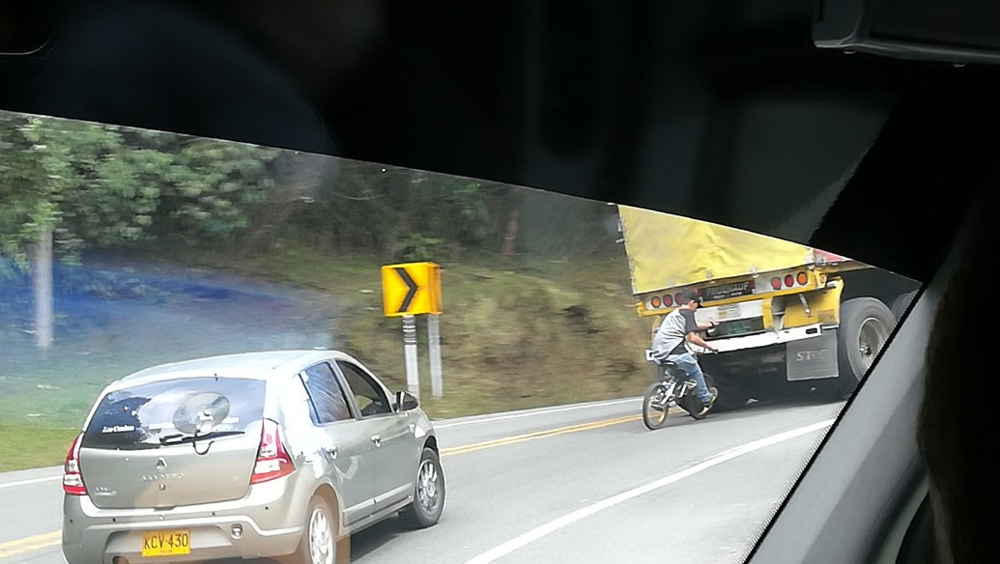

Auf einmal befanden wir uns wieder in einem Land, wo die Paprika rot glänzen, wo man Toilettenpapier in die Toilette wirft und wo die Hunde an der Leine laufen: Australien. Ein paar Tage in einem westlichen Land reichen wohl aus, um Südamerika weit entfernt erscheinen zu lassen. Ein guter Moment für einen kurzen Rückblick auf dieses Sammlerstück.

Wo in Südamerika mehr oder weniger organisiertes Chaos herrscht, ist hier in Australien alles bis ins kleinste Detail geregelt. Etwas zu kleinlich, finden wir. Papiertücher zum Putzen seines Einkaufswagens? Braucht man das wirklich? – Den größten Kulturschock erlitten wir jedoch in der Gemüseabteilung: Die Paprika sind auf einmal so rot, glänzend und formschön. Wo sind die staubigen, halbroten/halbgrünen, verschrumpelten geblieben? Daneben fallen uns die ganzen Hinweis- und Achtungsschilder auf: „Stay behind the yellow line“ (in der U-Bahn), „Kletter nicht über diesen Zaun“ und „Halte deine Kinder in Armreichweite“ (im Schwimmbad). In Südamerika muss man stabile Zäune bauen, um die Menschen in eine Reihe vor den Bus zu zwingen; hier lässt sich niemand von einer gelben Linie aufhalten. Bei Aussichtspunkten hingegen sucht man Geländer vergeblich: Niemand ist doch so blöd von einer Klippe zu springen. Und wenn doch, naja, selber schuld. Auf ähnliche Weise lernen auch die Kinder, was sie tun können und was nicht. Hinfallen und wieder aufstehen und daraus lernen.

Der erfreulichere Teil der westlichen Kultur ist nicht mehr alle zehn Meter von Verkäufern angesprochen zu werden. Auch dass ein Naturbad mit Wasserfall genau das ist, ohne Stände mit Sonnenbrillen, Spielzeuglamas und Popcorn, finden wir entspannend. Einzig den Gesang der Männer und Frauen, die quer durch Südamerika mit der selben Melodie „Heeee-lado, Helado, Heladoooo“ (Eis) rufen, vermissen wir ein bisschen. Dass Toilettenpapier einfach wieder in die Toilette fallen gelassen werden kann, ist doch irgendwie praktisch. Obwohl wir uns gerne mal dabei erwischen es in den Mülleimer zu werfen, weil wir uns inzwischen so daran gewöhnt haben. Und auch an das Angesicht von Hunden an der Leine müssen wir uns nach acht Monaten voll mit Streunerhunde erst wieder gewöhnen.

\[caption id="attachment\_2621" align="aligncenter" width="900"\] Nobody selling anything :)\[/caption\]

Auch auf der Straße funktionieren die Dinge wieder auf eine andere Art und Weise. Der Australier an sich hält freundlich am Zebrastreifen, genauso wie der Chilene. Der hält selbst für jeden Fußgänger, der an einer beliebigen Kreuzung die Straße überqueren möchte. In den anderen südamerikanischen Ländern gibt es zwar Zebrastreifen, die haben aber wenig Bedeutung. Als wir am Ende unseres Trips noch ein letztes Mal durch Peru kamen, holten uns die Erinnerungen an den peruanischen und bolivianischen Verkehr wieder ein: Motorräder, Tuk-Tuks, Minivans, Autos und Reisebusse fahren mit viel grundlosem Gehupe linksrum, rechtsrum und quer durch einander hin. In Kolumbien ging es etwas gesitteter zu, jedenfalls mit weniger Hupen.

Wie sich die Menschen im Verkehr benehmen, scheint auch viel darüber zu sagen, wie sie miteinander umgehen. In Bolivien handelte jeder vor sich, ohne Rücksicht auf den anderen. Selbst wenn dadurch ein so großes Chaos entstand, dass es weder vor noch zurück ging. Im normalen Leben schien es nicht viel anders zu sein. Unsere Spanischlehrerin erzählte uns aus ihrer Kindheit. Wenn ihre (alleinerziehende) Mutter arbeitete, verblieb sie bei einer Freundin. Dort musste sie, um sich eine Schälchen Suppe zu verdienen, erst einen Löffel scharfe Roccotosauce schlucken. Seitdem liebt sie scharfes Essen.

\[caption id="attachment\_2627" align="aligncenter" width="900"\] Bolivian chaos\[/caption\]

In Kolumbien herrscht zwar auch hin und wieder Chaos auf den Straßen, aber dann mit einem Lächeln. Im echten Leben greift man sich gegenseitig unter die Arme. Wahrscheinlich gerade weil die Probleme im Land schon so lange anhalten (Rebellen, Drogen, korrupte Regierungen) und es darum nur wenige Anlässe zur Freude gibt, genießen die Menschen von jedem Tag, den sie zusammen haben. Eine Straßenecke in einer kolumbianischen Wohngegend ohne Salsamusik ist schwer vorzustellen, ohne ebenso wenig, dass sich jemand über die Lautstärke beschweren würde.

In Chile dominiert vor allem Toleranz und gegenseitiger Respekt. Der Verkehr ist ähnlich wie in Deutschland oder Holland geregelt und abseits der Straße lebt man aber eigentlich nur so viel wie nötig miteinander. Ansonsten lebt man sein eigenes Leben. Vielleicht sind die Unterschiede zwischen Kolumbien im Norden und Chile im Süden ähnlich klimatisch bedingt wie beispielsweise bei den extrovertierten Spaniern und Italienern gegenüber den kälteren Nordeuropäern.

\[caption id="attachment\_2630" align="aligncenter" width="900"\] Chile\[/caption\]

An dieser Stelle müssen wir auch kurz über Friseure in Südamerika sprechen. Wer acht Monate reist, muss sich früher oder später doch von ein paar Zipfelchen seiner Haarpracht entledigen. Für uns lief das selten besonders erfolgreich ab. Plump gesagt: In Südamerika scheint Friseur vor allem ein Beruf wie Maurer oder Klempner zu sein, während es bei uns für viele doch eher eine Kunst ist. Als Freke in Kolumbien einmal zum Friseur ging, fing dieser an zu schnippeln ohne überhaupt zu fragen, was am Ende bei rauskommen sollte. Einheitsfrisur für jedermann! Eine Friseurin in Ecuador war weniger mit Frekes Haaren beschäftigt als mit ihrer Kollegin und ihrer Familie am Telefon. So spritze sie das Wasser fröhlich in Frekes Gesicht anstatt in ihr Haar. In Chili wurde ihr Haar ohne zu Fragen schön glatt geglättet. Es dauerte zwei Monate bis sich die natürlichen Locken wieder zurück trauten. Im allgemeinen schien Maltes Frisur weniger Probleme zu bereiten. Bis auf in Kolumbien, wo vor allem der Langhaarschneider Anwendung fand. Das Ergebnis: Seiten kurz, oben lang. Kolumbianischer Einheitsschnitt!

Es ist natürlich auch gar nicht so einfach auf Spanisch zu erklären, was man genau möchte. Unterwegs wurde unser Wortschatz zwar immer umfangreicher, wir merkten jedoch auch immer häufiger, dass Spanisch nicht überall gleich Spanisch ist. So fragt man im Süden um „asientos“ (Stuhl) in einem Bus, in Kolumbien hingegen um „puestos“ (Sitzplatz). Das bekannte „de nada“ als Antwort auf „gracias“ ist eigentlich überall gültig, nur in Kolumbien wird es als zu stumpf angesehen. Bevorzugt wird „con gusto“ (wortwörtlich „mit Gefallen“ oder auch „gern geschehen“) und das klingt tatsächlich etwas vornehmer. Ähnlich hübsch finden wir „a la orden“ (zu ihren Diensten), was lediglich von kolumbianischen Verkäufern als Begrüßung (potentieller) Kunden gebraucht wird. Dann gibt es natürlich auch noch die Umgangssprache. In Kolumbien wird „que chimba“ für alles gebraucht, was irgendwie super, cool oder genial ist, während die Chilenen überall „cachai?“ anhängen („weißte/verstehste?“). Wer nun denkt, „oh super, hab ich was gelernt“, der sollte noch eben weiter lesen. Außerhalb Kolumbiens ist „chimba“ ausschließlich ein Wort fürs weibliche Geschlechtsorgan. Bitte notieren.

Mit der Zeit verbesserte sich unser Spanisch ansehnlich, was auch daran lag, dass wir die unglaublich schwer zu verstehenden Chilenen und Argentinier hinter uns ließen. Die nuscheln, sprechen absurd schnell und mit krassem Dialekt. Als ob es eine Steuer für besondere Laute gäbe, weigert man sich vehement ein ‚s‘ auszusprechen (richtig wäre nämlich „cachas“ statt „cachai“). Und die Argentinier vermurksen es so richtig: Das hübsche spanische ‚ll‘ (denk an Paella oder Mallorca) wird zum ‚sch‘, also zu Paescha und Maschorca (nicht dass man in Argentinien Paella essen würde, aber jetzt mal so als Beispiel). Das ‚s‘ in Cusco (die Stadt in Peru) wird zu einem harten ‚ch‘ wie in „Lachen“, das in der Kehle stecken bleibt und zurück in den Hals fällt. Schwierig aufzuschreiben, ich werde es mal vormachen, wenn wir zurück sind.

Und damit kommen wir zur Nahrung. Speis und Drank – obwohl vielerorts vergleichbar oder sogar identisch – haben an verschiedenen Orten andere Namen. Das bekannteste Beispiel ist der Empanada, wie er meistens genannt wird. Überall ist die Rezeptur, die Größe und der Inhalt etwas anders und in Bolivien gibt es noch die speziale Variante, die dann „Salteña“ heißt (und ursprünglich aus Salto, Argentinien kommt). Am Ende bleibt es eine gefüllte Teigtasche entweder aus dem Ofen oder der Friteuse. Ein anderes Beispiel ist der traumhafte Karamellbrotaufstrich, den man abhängig vom Land als „Manjar“, „Dulce de Leche“ oder „Arequipe“ im Supermarktregal findet. Mais spielt im Essen eine dominante Rolle und so hat jede Landesküche minimal ein typisches Maisgericht auf der Karte. Mit Bananenblatt umhüllt wird es dann zu „Humintas“ oder „Tamales“. Während in Chile und Argentinien die Grillkultur besonders groß ist, lieben die Kolumbianer ihre Buñuelos (ein frittierter Teigball mit Käse, der witzigerweise wir ein holländischer Oliebol schmeckt). Einzig und allein „Papa Rellenas“ (gefüllte Kartoffeln) heißen überall „Papa Rellenas“. ¿Cachai?

Für all das leckere Essen muss man natürlich bezahlen. In Chile und Argentinien kann man noch relativ häufig mit Karte bezahlen, aber im Rest des Kontinents herrscht eine reine Bargeldwirtschaft. Daher sollte man darauf achten, dass man jederzeit Geld in der Tasche hat und die großen Scheine aus dem Geldautomaten rechtzeitig an geeigneter Stelle klein bekommt. Wechselgeld ist nämlich rar und wenn es aus ist, wartet man gerne mal eine Viertelstunde bis der Schein durch irgendeinen Nachbarn klein gemacht werden kann. Auch größere Rechnungen werden mit Bargeld beglichen: Für eine Tour durften wir daher mal eben 1,7 Millionen Pesos in Scheinen abzählen. Drin schwimmen kann man noch nicht ganz, aber fast…

\[caption id="attachment\_2634" align="aligncenter" width="900"\] 1.7 million\[/caption\]

Südamerika ist noch nicht durch eine gemeinsame Währungsreform gegangen und damit hat jedes Land noch genauso seine eigene Währung, wie früher Frankreich, Italien oder Deutschland. Das heißt, nach jedem Grenzübergang begann das Spiel von vorne: An neue Münzen, Scheine und Umrechnungskurs gewöhnen, und die Banken finden, bei denen man mit den geringsten Kosten Geld abheben kann. Das ein oder andere Mal 2 bis 6€ für eine Abhebung zu bezahlen ist vielleicht noch zu übersehen, aber so drückt das acht Monate lang ganz schön aufs Budget. Wertvolle Stunden haben wir daher mit der Suche nach Gratisgeldautomaten verbracht.

So läuft man dann hin und wieder mit hunderten Pesos, Bolivianos, Soles oder Dollars in der Hosentasche durch die Straßen in Ländern, in denen man seine Sachen gut im Auge behalten sollte. In Chile und Kolumbien fühlten wir uns am sichersten. Ironisch genug sind das genau die beiden Länder, in denen erst unsere Rucksäcke gestohlen wurden und danach beinahe Frekes Telefon. Mit dem Rucksackdiebstahl noch frisch im Gedächtnis waren wir in Bolivien und Peru etwas mehr auf der Hut. Genau dort merkten wir auch häufiger, dass man enorm aufpassen muss, nicht mit überteuerten Preisen beschissen zu werden. In Kolumbien gibt es vor allem in den großen Städten Teile, die man nachts vermeiden sollte, einige sogar tagsüber. Wenn man sich an die Ratschläge der Einwohner hält, passiert einem normalerweise auch nichts. Das gleiche gilt natürlich auch für die Gebiete mit hoher Rebellen- oder Drogenkartellaktivität. Sowohl das deutsche als auch das holländische Außenministerium raten von Reisen in diesen Gebieten stark ab, was man dann besser auch befolgt.

Insgesamt waren wir in sechs südamerikanischen Ländern, in dem einen länger und ausführlicher als in dem anderen: Chile, Argentinien, Bolivien, Peru, Ecuador und Kolumbien (und eine halbe Stunde in Brasilien, aber die lassen wir mal außen vor). In Chile waren wir mit 2,5 Monaten am längsten. Das war am Anfang, als wir noch dachten alle Zeit der Welt zu haben. Letztendlich mussten wir unseren Weiterflug nach Australien doch verschieben, um mehr Zeit für unseren zweiten Favoriten Kolumbien zu haben. Dort blieben wir gute 7 Wochen. Den kürzesten zog Argentinien, wo wir in 19 Tagen lediglich einen klitzekleinen Teil in Patagonien sahen.

Wir haben festgestellt, dass wir die besten Beziehungen zu den Ländern aufgebaut haben, in denen wir für längere Zeit an einem Ort blieben. In Chile wohnten wir bei der Familie, die inzwischen nach Belgien gezogen ist. In Bolivien lernten wir Spansich und in Kolumbien arbeiteten wir auf der kleinen Farm. Auf diese Weise bekamen wir einen viel besseren Eindruck von den Gegebenheiten und der Kultur des jeweiligen Landes. Unsere Favoriten sind darum auch Chile und Kolumbien. Dort kann man jedenfalls über den Hauptplatz laufen, ohne dass zehn Menschen gleichzeitig probieren uns Essen, Betten oder Krimskrams aufzuschwatzen.

Am Ende dieses langen Vergleichs der ganzen südamerikanischen Länder, fragt ihr euch wahrscheinlich vor allem, was denn jetzt genau unsere Höhepunkte waren. Was gefiel euch denn am besten? Den einen Höhepunkt gibt es für uns nicht. Würden wir uns darüber auslassen, müsstet ihr wahrscheinlich noch eine halbe Stunde weiter lesen. Darum fassen wir es lieber in Bildern zusammen:

