Toen waren we weer in een land waar de paprika’s glimmend rood zijn, waar je je toiletpapier in de wc mag gooien, en waar de honden aan de lijn lopen: Australië. Een paar dagen in dit Westerse land en Zuid-Amerika lijkt alweer een wereld ver weg. Een goed moment om het nog eens van een afstandje te bekijken.

Waar Zuid-Amerika een min of meer georganiseerde chaos is, is hier in Australië alles tot in de puntjes geregeld. Een beetje te, vinden we zelfs. Papieren doekjes om je winkelwagentje mee schoon te maken, really?? De grootste cultuurshock hadden we op de groenteafdeling: de paprika’s zijn hier zó glimmend, zó rood en zó gaaf. Waar zijn de stoffige, halfrode/halfgroene, gerimpelde paprika’s gebleven? Ook vallen de vele waarschuwingen op (waar mensen zich dan ook nog aan houden): stay behind the yellow line (in de metro), klim niet over dit hekje, en hou je kinderen binnen handbereik (in het zwembad). In Zuid-Amerika moet je grote hekken neerzetten om mensen in een rij voor de bus te dwingen; daar houdt niemand zich aan een gele lijn. Hekken bij uitzichtpunten zijn er daarentegen nauwelijks: niemand is toch zo dom om van een klif te vallen. Als dat toch gebeurt, is het je eigen schuld. En kinderen leren vanzelf met vallen en opstaan wat ze wel en niet moeten doen.

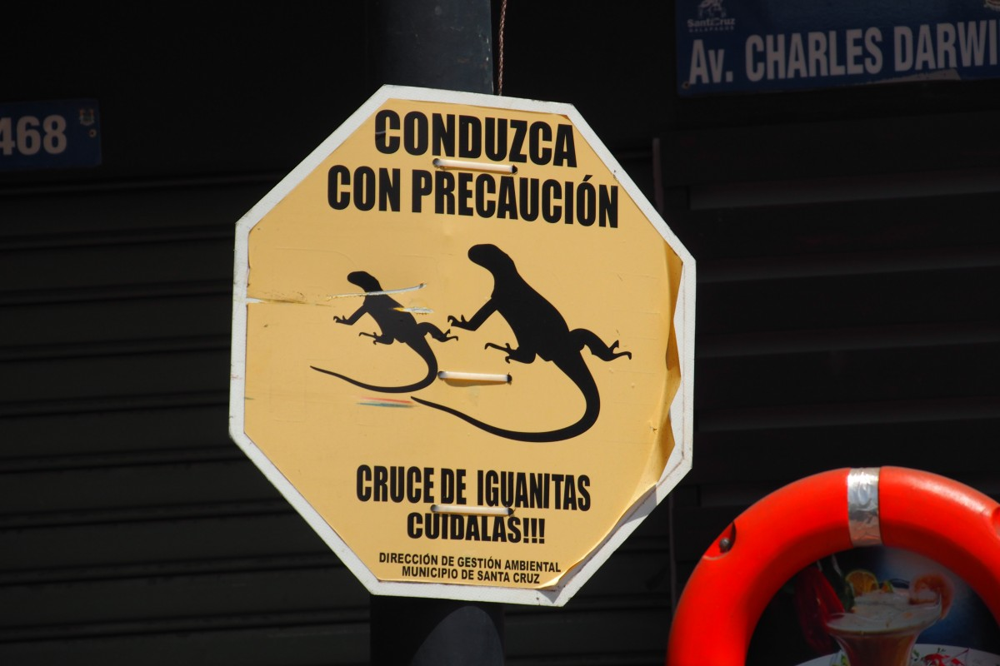
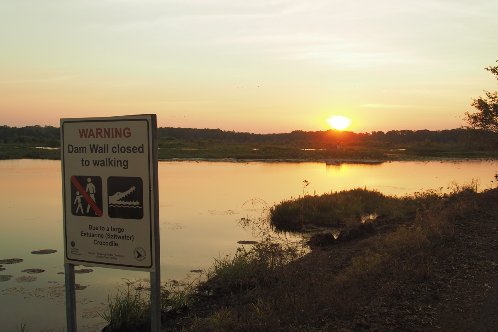

De Westerse cultuur is echter ook bijzonder ontspannend omdat we niet meer elke tien meter aangesproken worden door verkopers of sjacheraars. Omdat een natuurlijk zwembad bij een waterval ook alleen dat is, zonder stalletjes vol zonnebrillen, speelgoedlama’s of snacks. Alleen het gezang van de mannen en vrouwen die in heel Zuid-Amerika op dezelfde toon heeee-lado, helado, hela-doooo (ijs) roepen, missen we wel een beetje. Wc-papier kan gewoon weer ín de wc, hoewel we dat nog wel eens vergeten. En we moeten weer even wennen aan de aanblik van honden aan de lijn na acht maanden met alleen maar zwerfhonden.

\[caption id="attachment\_2621" align="aligncenter" width="900"\][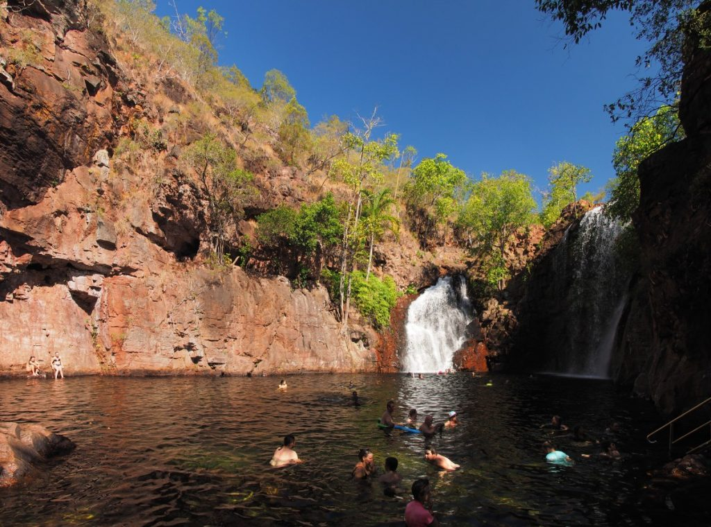](https://collectingbaggage.nl/wp-content/uploads/2018/08/P8084611-P8084613.jpg) Nobody selling anything :)\[/caption\]

Op straat gaan de zaken weer op een andere manier. Australiërs stoppen voor het zebrapad, net als de Chilenen. In Chili stopten ze zelfs voor voetgangers die van rechts kwamen want dat moet. In de andere landen moeten ze in theorie ook stoppen voor het zebrapad, maar dat was vaak te veel gevraagd. Toen we aan het einde van onze trip weer even in Peru waren, werd ons het verkeer in Bolivia en Peru weer in herinnering gebracht: scooters, tuktuks, minibussen, auto’s en touringcars rijden er kriskras door elkaar heen, onderweg toeterend naar elkaar om de minste of geringste reden. In Colombia ging dat er toch een stuk rustiger aan toe, in ieder geval zonder toeteren.

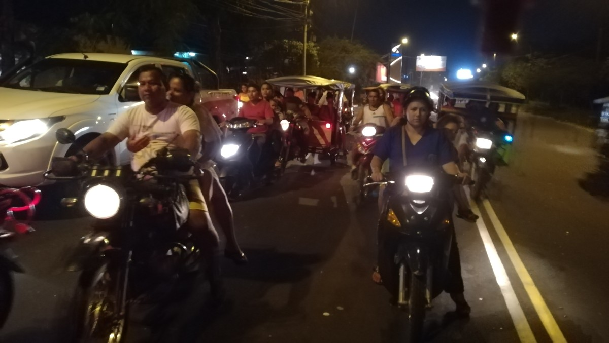
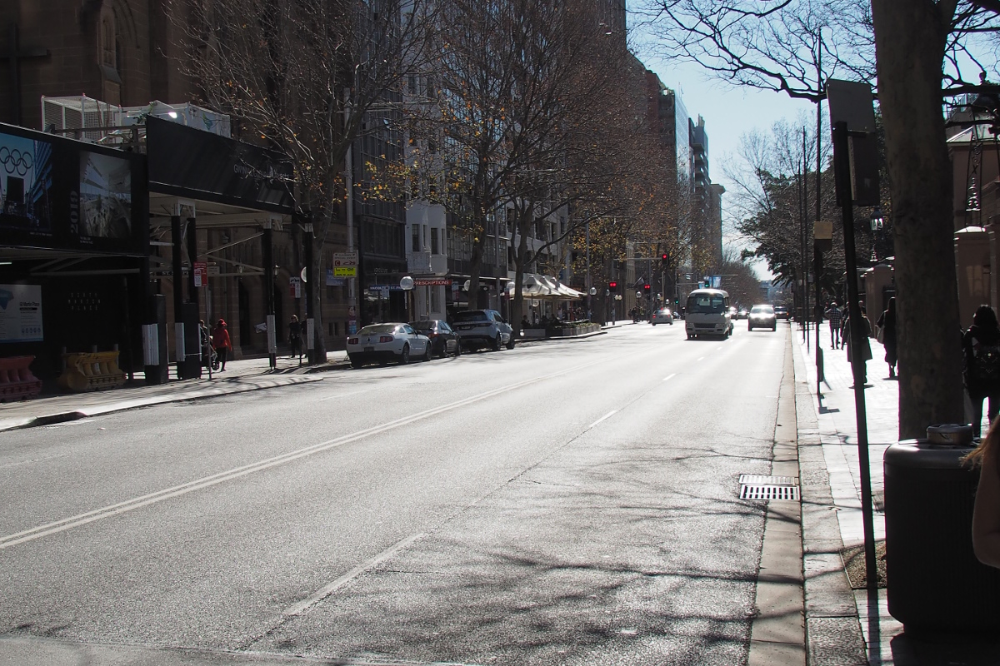

Hoe de mensen zich in het verkeer gedragen, zegt overigens veel over hoe ze zich ten opzichte van elkaar gedragen. In Bolivia was het ieder voor zich, ongeacht of je daarmee zo’n verkeerschaos veroorzaakte dat er niemand meer voor- of achteruit kwam. Ook in het gewone leven schijnen de mensen er niet altijd even vriendelijk voor elkaar te zijn. Zo vertelde onze Spaanse lerares een verhaal uit haar kindertijd, toen haar (alleenstaande) moeder moest werken en zij bij een vriendin werd gedropt. Toen er eindelijk een keer eten op tafel stond, moest ze eerst een lepel vol superpittige roccoto eten om ook een kom soep te verdienen. Sindsdien houdt ze van pittig.

\[caption id="attachment\_2627" align="aligncenter" width="900"\] Bolivian chaos\[/caption\]

In Colombia daarentegen is het soms ook een chaos, maar met een glimlach. De Colombianen slepen elkaar er doorheen, in en buiten het verkeer. Misschien juist omdat de problemen van het land (met de rebellengroepen, de drugs en de corrupte regering) weinig reden geven tot vreugde, genieten ze samen van elke dag. Van elke straathoek klinkt salsamuziek en er is niemand die klaagt over het volume.

In Chili domineert de tolerantie en wederzijds respect. Regels stroomlijnen het verkeer, net als in Nederland en Duitsland, en ook daarbuiten dealen ze met elkaar als het moet en zoals het moet. Verder leven ze vooral hun eigen leventje. Misschien zijn de verschillen tussen Colombia in het noorden en Chili in het zuiden wel net zo klimatologisch ingegeven als die tussen extroverte Spanjaarden en Italianen en de koudere Noord-Europeanen.

\[caption id="attachment\_2630" align="aligncenter" width="900"\] Chile\[/caption\]

We moeten hier ook even de Zuid-Amerikaanse kappers noemen. Wie acht maanden reist, moet vroeg of laat zijn haar onder handen laten nemen. Bij ons was dat zelden een succes. Bot gezegd: in Zuid-Amerika is kapper zijn een beroep zoals metselaar of loodgieter, terwijl het bij ons voor velen meer een kunst is. Freke ging in Colombia eens naar de kapper en die begon gewoon te knippen zonder te vragen wat het eindresultaat eigenlijk moest zijn. Eén kapsel voor iedereen! De dame in Ecuador was minder met Freke’s haar bezig dan met haar collega of met haar gezin aan de telefoon. Zo sproeide ze het water vrolijk in Freke’s gezicht in plaats van in haar haar. In Chili werd zonder te vragen haar haar gesteild, waarna het twee maanden duurde voordat er weer een beetje krul in kwam. In het algemeen lijkt Malte’s kapsel minder problematisch. Tot Colombia, waar meteen een scheerapparaat werd ingezet. Het resultaat: kort aan de zijkanten, lang op de bovenkant. Colombiaanse eenheidsworst.

Probeer dan ook maar eens in het Spaans uit te leggen wat je precies wil… Gaandeweg werd onze Spaanse woordenschat wel steeds groter, maar ontdekten we ook dat het Spaans niet overal hetzelfde is. Zo vraagt men in het zuiden om ‘asientos’ (stoel) in een bus, in Colombia daarentegen ‘puestos’. Het bekende ‘de nada’ als antwoord op ‘gracias’ geldt eigenlijk overal, alleen in Colombia vinden ze dat te lomp. ‘Con gusto’ (letterlijk: met smaak, ofwel graag gedaan) heeft daar de voorkeur en dat klinkt ook echt wat vrolijker. Vergelijkbaar schattig vinden we ‘a la orden’ (tot uw dienst) wat alleen gebruikt wordt door Colombiaanse verkopers als begroeting van (potentiële) klanten. Dan heb je natuurlijk ook nog spreektaal. Colombianen zeggen ‘que chimba’ voor alles wat geweldig is en Chilenen houden van hun ‘cachai?’ (snap-ie?). Wie nu denkt ‘mooi, ook weer wat geleerd vandaag’ moet nog even verder lezen. Buiten Colombia is ‘chimba’ uitsluitend een woord voor het vrouwelijke geslachtsorgaan. Graag noteren.

Met de tijd verbeterde ons Spaans aanzienlijk. Dat kwam ook doordat we ongelooflijk slecht te verstane Chilenen en Argentijnen achter ons lieten. Zij mompelen, praten absurd snel en met een vreemd accent. Alsof er een belasting gold voor bepaalde klanken, weigerde men de ‘s’ uit te spreken (eigenlijk komt ‘cachai’ namelijk van ‘cachas’). En de Argentijnen maken er helemaal een potje van: de schattige, Spaanse ‘ll’ (denk aan paella of Mallorca) wordt ‘sj’ (ofwel paesja of Masjorca). De ‘s’ in Cusco (de stad in Peru nabij Machu Picchu) wordt een Limburgse g.

Ook voor het eten worden op verschillende plekken andere namen gebruikt, terwijl het (min of meer) hetzelfde is. Het bekendste voorbeeld is misschien wel de empanada, zoals die meestal genoemd wordt. Overal is de bereidingswijze, de grootte en de inhoud een beetje anders. In Bolivia heb je nog een speciale variant, die salteña heet (en oorspronkelijk uit Salto, Argentinië komt). Uiteindelijk blijft het een gevuld deegzakje die ofwel uit de oven of de frituur komt. Een caramelachtige broodsmeer heet, afhankelijk van het land, manjar, dulce de leche of arequipe. Mais speelt in elke Zuid-Amerikaanse eetcultuur een dominante rol en dus vind je op elke menukaart wel een typisch maisgerecht. Omhuld met bananenbladeren heet dat de ene keer humintas, de andere keer tamales. Chili en Argentinië kennen een grote barbecue-cultuur, terwijl ze in Colombia dol zijn op buñuelos (een gefrituurde deegbal met kaas die gek genoeg smaakt als een oliebol). Alleen papa rellena (gevulde aardappel) heet overal papa rellena. ¿Cachai?

Voor al dat lekkere eten moet je natuurlijk betalen. In Chili en Argentinië kon je nog relatief vaak afrekenen met de creditcard, maar voor de rest is Zuid-Amerika een echte cash-economie. Je moet daarom altijd contant geld op zak hebben en ook op de juiste momenten de grote biljetten kapotmaken. Op veel plekken accepteren ze die gewoon niet of moeten ze eerst een kwartier lang zoeken bij naburige verkopers of die wisselgeld hebben. Zo kan het dus gebeuren dat je een tour moet afrekenen in cash en zo 1,7 miljoen Colombiaanse pesos in biljetten moet neertellen. We konden er nog net niet in zwemmen.

\[caption id="attachment\_2634" align="aligncenter" width="900"\] 1.7 million\[/caption\]

Zuid-Amerika kent natuurlijk geen euro in de vorm van een gedeelde munt. Dat betekent dat je na elke grensovergang weer van voor af aan kon beginnen: wennen aan de nieuwe munten, biljetten en valutakoers, en het vinden van de banken die je geld laten pinnen zonder toeslag. Een of twee keer 2 tot 6 euro betalen is nog te overzien, maar dat wil je geen acht maanden lang doen. Vele uren zijn we kwijt geweest aan het zoeken naar een geldautomaat waar we gratis geld konden pinnen.

En dan loop je dus met een paar honderd euro aan pesos, bolivianos, soles of dollars op zak in landen waar je voorzichtig met je spullen moet zijn. In Chili en Colombia hebben we ons het veiligst gevoeld. Ironisch genoeg waren het juist in die landen waar eerst onze backpacks gestolen zijn en daarna bijna Freke’s telefoon. Met de diefstal van de rugzakken nog vers in het geheugen waren we in Bolivia en Peru meer op onze hoede. Daar merkten we ook vaker dat je altijd alert moet zijn om niet enorm afgezet te worden. In Colombia heb je vooral in de grote steden wijken waar je ‘s nachts of zelfs overdag niet moet zijn. Als je je aan het advies van de lokale bewoners houdt, overkomt je normaal gesproken niets. Uiteraard geldt dat ook voor de gebieden waar de rebellengroepen of drugskartels actief zijn. De Nederlandse en Duitse ministeries van Buitenlandse Zaken raden reizen daar naartoe sterk af, dus dat doe je dan ook gewoon niet.

In totaal hebben we zes Zuid-Amerikaanse landen aangedaan, de een wat langer en intensiever dan de ander: Chili, Argentinië, Bolivia, Peru, Ecuador en Colombia (en een half uur in Brazilië, maar dat tellen we maar even niet mee). In Chili waren we met 2,5 maand het langst. Dat was nog in het begin toen we dachten alle tijd van de wereld te hebben. Uiteindelijk moesten we onze vlucht naar Australië toch verplaatsen om genoeg tijd te hebben voor onze tweede favoriet Colombia. Daar waren we ruim zeven weken. Het kortst waren we in Argentinië. Daar reisden we alleen doorheen omdat dat op bepaalde plekken in Patagonië nou eenmaal niet anders kan.

We merken dat we meer een band hebben ontwikkeld met de landen waar we langer op één plek zijn geweest. In Chili hebben we bij de familie gewoond die inmiddels naar België is verhuisd. In Bolivia volgden we een taalcursus en in Colombia werkten we op een kleine boerderij. Op die manier kregen we een beter gevoel voor hoe de landen in elkaar steken dan voor de landen waar we alleen als toerist doorheen zijn getrokken (Argentinië, Peru, Ecuador). Chili en Colombia, waar we de meeste tijd doorbrachten, zijn daarom onze favoriet. Daar kan je ten minste rustig over het grote plein lopen zonder dat er tien mensen zijn die je eten, een slaapplek of snuisterijen proberen aan te smeren.

Een heel verhaal over de verschillen en overeenkomsten tussen Zuid-Amerikaanse landen verder vragen jullie je natuurlijk vooral af wat onze hoogtepunten waren. Wat vonden wij het leukst, het mooist, het meest bijzonder? Zouden we daar nog verder over uitweiden, dan moet je waarschijnlijk nog een half uur verder lezen. Dus kijk gewoon zelf maar:

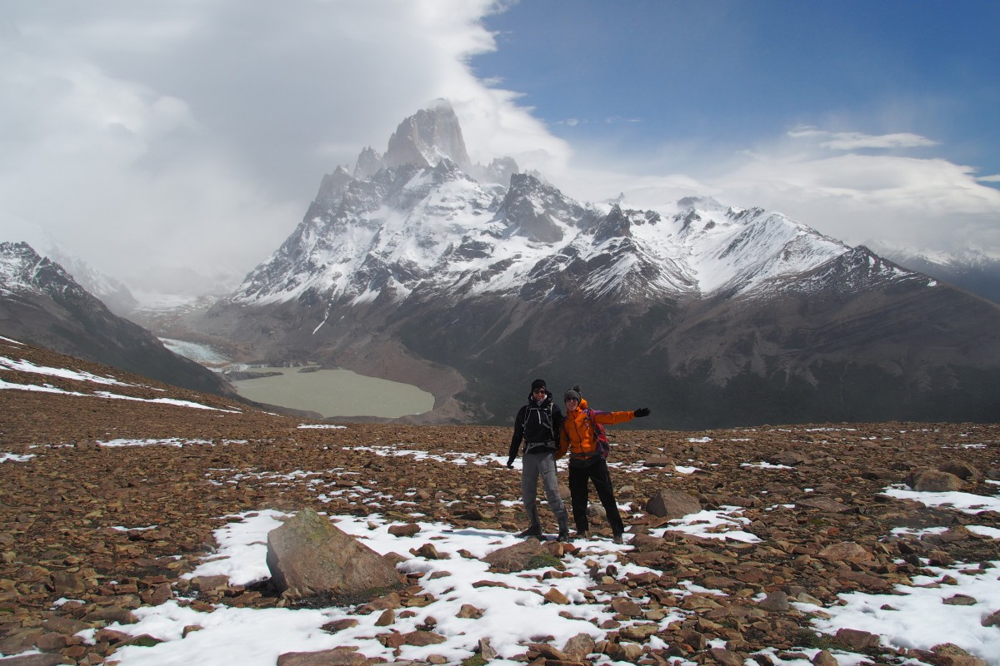

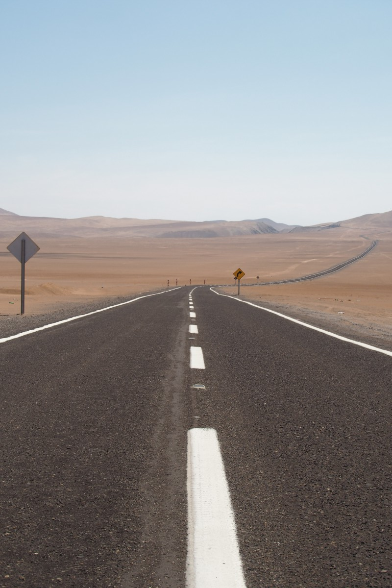
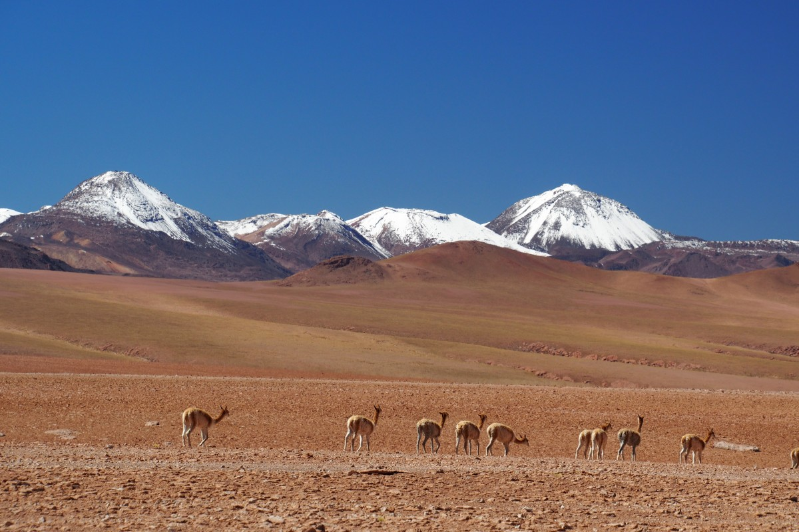
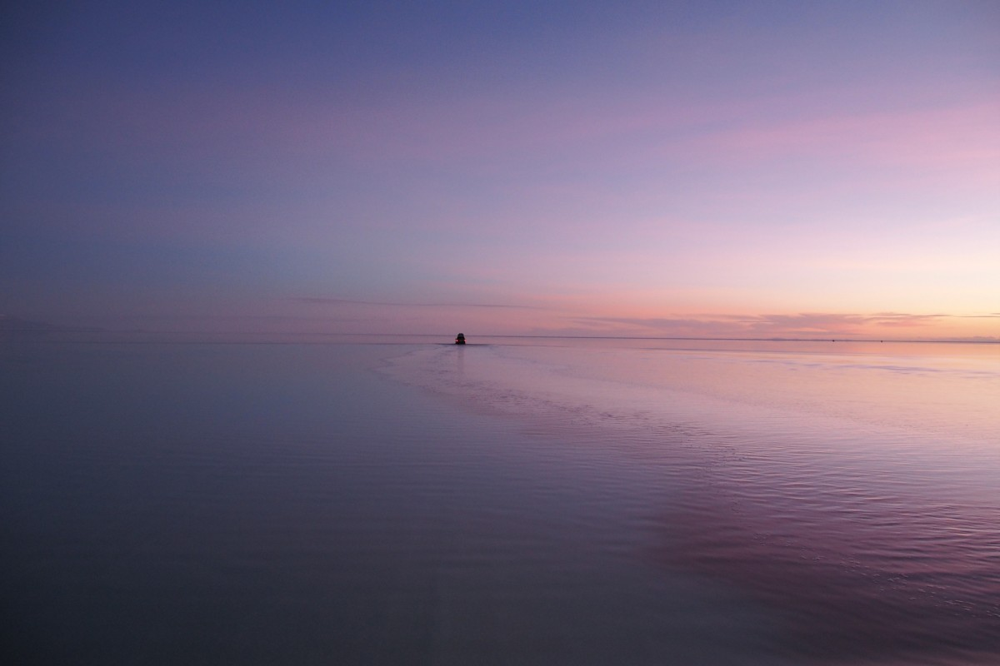
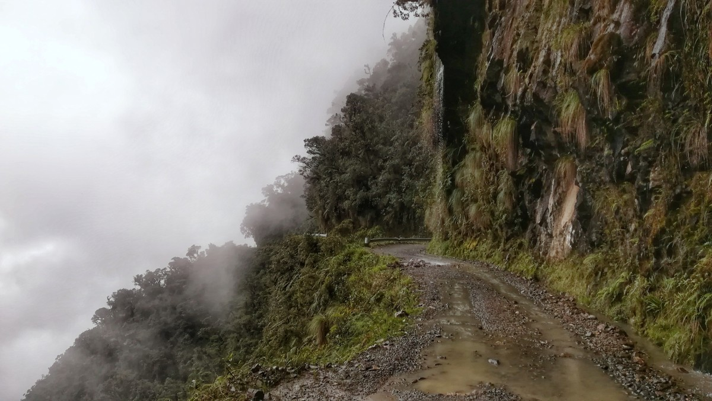
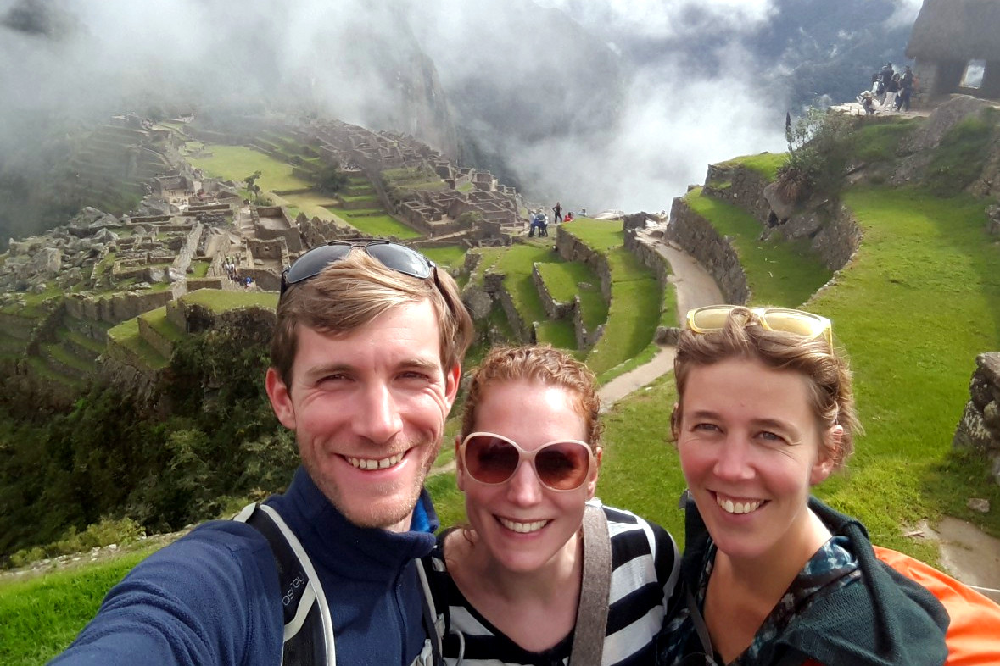

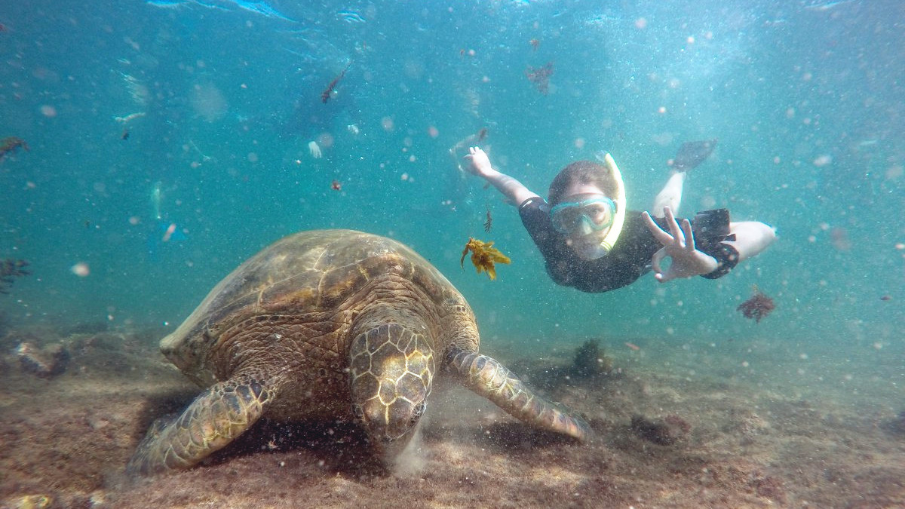

