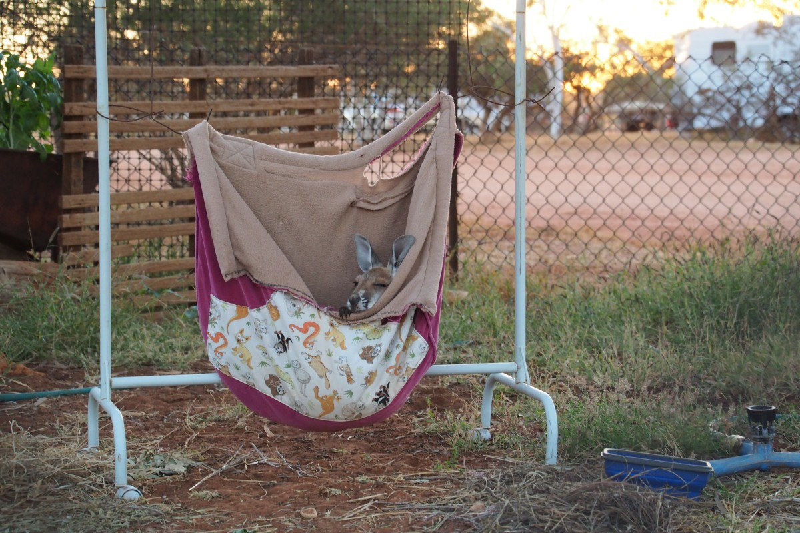

Manchmal muss man einen Umweg von mehr als 1000km nehmen, aber ein paar Orte in Westaustralien sind es das absolut wert. Der Karijini Nationalpark und das Ningaloo Reef sind zwei solcher Orte. In diesem Teil unseres Roadtrips geht es von Broome bis zum südlichen Wendekreis, wo die Tropen enden und das gemäßigte Klima beginnt. Diese zwei Juwelen liegen „quasi“ auf dem Weg.

Das Ortsausgangsschild von Broome flog an uns vorbei und vor uns lag nichts als staubtrockenes Niemandsland. 600km bis zum nächsten nennenswerten Ort und dazwischen ganze zwei Roadhouses (also Tankstellen mit angeschlossenem Motel oder Campingplatz). Zur Verdeutlichung, das ist ungefähr der Abstand zwischen Bremen und Nürnberg. Dieses Stück des Great Northern Highways führt entlang einer Wüste mit endlosen Reihen Spinifex – trockenen, harten Grasbüscheln. So ziemlich das einzige, was hier überlebt. Man nennt das Gebiet auch liebevoll „The Big Empty“. (Wer gerade nichts besseres zu tun hat, kann sich das ja mal auf [Streetview](https://goo.gl/maps/YCGymmg4j7M2) anschauen.) Am Horizont sahen hin und wieder mal eine kleine Erhebung, aber alles andere war platt wie ein Pfannkuchen.

Ebenfalls platt wie ein Pfannkuchen sind Roadkills, also über- und angefahrene Tiere, denen man häufiger begegnet als einem lieb ist. Mit der Zeit haben wir Ausweichstrategien für die verschiedenen Tiere entwickelt: Krähen = einfach weiterfahren, die flüchten in die richtige Richtung; Känguru, Kuh und große Raubvögel = auf jeden Fall bremsen, denn man weiß nicht so genau, wo sie hin hoppeln/laufen/fliegen; Emu = kompletter Stillstand, denn Emus haben ein Gehirn so groß wie ‘ne Erbse und sind in der Lage voll aufs Auto zuzurennen.

Das nächste Lied unseres 80er-Jahre-Mixtapes – Wake me up before you go-go – ertönte gerade aus dem Radio als sich die Landstraße plötzlich dazu entschied, eine Notfalllandebahn für Flugzeuge zu sein („RFDS Emergency Landing Strip“, stand auf dem Schild). Wir hielten den Rückspiegel vorsichtshalber mal im Auge, bis wir realisierten, dass RFDS für Royal Flying Doctor Service steht. Die müssen zwar in der Tat schnell mal irgendwo sein, aber dann würden sie doch wahrscheinlich genug Zeit haben, um die Straße kurz zu sperren. So stellten wir uns das jedenfalls vor...

### Noch mehr Pfannkuchen

Unser eigentliches Ziel, der Karijini Nationalpark, lag etwa 900km hinter Broome. Wir hatten schon viel von diesem Park gehört. Für viele war es einer der Höhepunkte Westaustraliens; wir waren entsprechend gespannt. Er enttäuschte uns nicht. Karijini besteht aus mehreren wasserdurchströmten Schluchten in einer Sandsteinlandschaft, die älter ist als jegliches Leben auf Erden (mehr als 2,5 Milliarden Jahre). Das heißt, in diesem Gestein sucht man vergeblich nach Fossilen. Bizarr eigentlich.

\[caption id="attachment\_2798" align="aligncenter" width="900"\] Karijini National Park\[/caption\]

Karijinis Glanzseite sind die Felsformationen unten in den Schluchten, wo die Flüsse ihre Spuren hinterlassen haben. Als Beispiel die Hancock Gorge, unser Favorit. Der Wanderpfad brachte uns zunächst hinunter auf den Boden der Schlucht, von wo es über glattgeschliffene Steinplatten weiterging, links und rechts gesäumt durch gestapelte Pfannkuchen. Die obere Hälfte der Wand war feuerrot, die untere – bis wohin das Wasser in der Regenzeit reicht – dunkelgrau. Unser Ziel war ein Teich, der „Kermit Pool“ genannt wird und in dem man sich abkühlen konnte. Wir wussten, dass wir schon vor dem Pool nass werden würden, und als wir die erste Wasserstelle erreichten, zogen wir brav unsere Schuhe aus und wateten gute 20m durch das knietiefe Wasser.

Danach kamen wir zur nächsten Wasserstelle und wir dachten, oh, das soll es wohl sein: Hellblaues Wasser umringt von roten Pfannkuchenfelsen. Schön sah es aus! Wir zogen schnell unsere Badesachen an und hielten kurz den Atem an, bevor ins eis-eiskalte Wasser plumpsten. Bevor uns Eiszapfen wuchsen, schwammen wir schnell ans andere Ende, nur um dort zu entdecken, dass der Weg doch noch nicht vorbei war. Es ging weiter durch den „Spider Walk“, der den Namen glücklicherweise nicht auf Grund einer hohen Konzentration achtbeiniger Viecher hat, sondern weil man wie eine Spinne (mit Hilfe sämtlicher Gliedmaßen) durch eine schmale Schlucht klettern musste. Das Wasser floss über die Felsen und unsere Füße, was das ganze eine glitschige Angelegenheit machte. Die Schlucht wurde stets schmaler und stets hübscher bis wir endlich wirklich das Ende erreichten: Strahlend blaues Wasser zwischen meterhohen Felswänden. Für den Fluss ging es noch weiter. Über eine Klippe stürzte er sich in die Tiefe, wo er hinter einer Krümmung in der nächsten Schlucht verschwand.

Das war ein spezialer Ort. Die Fotos werden dem leider nicht gerecht. Auch, weil wir die erst später machen konnten (weil wir ja all unsere Klamotten und die Kamera am Anfang liegen gelassen hatten), und das Sonnenlicht später nicht mehr so schön in die Schlucht strahlte wie zuerst.

In Sachen Schönheit wurde die Hancock Gorge dicht gefolgt von der Knox Gorge. Weil wir die am frühen Morgen besichtigten, hatten wir die komplette Schlucht für uns alleine. Auch diese Wanderung endete wieder bei einer schmalen Felsspalte, durch die die Strahlen der aufgehenden Sonne in die Schlucht fielen.

\[caption id="attachment\_2807" align="aligncenter" width="900"\] Knox Gorge\[/caption\]

Ob Dales Gorge, Joffre Gorge oder Weano Gorge, jede Schlucht hatte seine schönen Seiten. Und überall fanden wir eiskaltes Wasser zur Abkühlung (was uns nach ein paar Tagen ohne Dusche auch ganz recht kam). Hier lassen wir es dann aber doch bei den Fotos:

### The big three + 1

Karijini lag, lass es uns so sagen, nicht so wirklich auf dem Weg. Denn danach mussten wir schon wieder 600km zurücklegen, um zum Ningaloo Reef zu kommen. Das Ningaloo Reef ist, touristisch gesehen, die kleine Schwester des Great Barrier Reefs vor der Ostküste Australiens. Das macht es allerdings nicht weniger schön, ganz im Gegenteil. Das Korallenriff liegt hier nur wenige Meter vom Strand entfernt, was es deutlich zugänglicher macht, und weil hier nur wenige Menschen leben, ist es auch noch wunderbar intakt. Im Wasser liegt also das Riff, hinterm Strand im Landesinneren liegt der Cape Range Nationalpark mit herrlichen Campingplätzen in den Dünen und, juchéé, mehreren Schluchten zum wandern (man merkt es wahrscheinlich – in diesem Stadium waren wir ein wenig „gorged out“). Wir haben uns darum vor allem auf die Wasserseite konzentriert.

\[caption id="attachment\_2827" align="aligncenter" width="900"\] Cape Range National Park\[/caption\]

Wer zufällig zur richtigen Zeit in dieser Ecke ist, hat nicht nur die Chance Walhaie zu sehen, sondern gleichzeitig auch noch Buckelwale und Mantarochen. Wir hätten es selbst nicht besser planen können, denn es war genau die richtige Zeit. Spoileralarm: Wir haben „the big three“ alle gesehen!

Seit Jahren war es Frekes Traum einmal mit Walhaien zu schwimmen. Der Walhai ist der größte Fisch der Welt und auch der größte Hai. Das besondere an ihm ist, dass er mit seiner hübsch gepunkteten Haut so entzückend aussieht und sich, wie ein Wal, von Plankton ernährt. Eigentlich war die Walhaisaison schon vorbei, aber ein Teil der Population ist noch etwas länger geblieben und darum hatten wir schnell eine Tour gebucht. Mit Hilfe eines Erkundungsflugzeugs hatte die Crew innerhalb kürzester Zeit ein Exemplar entdeckt. Alle schnell in die Neoprenanzüge, Flossen an, Schnorchel rein, und mit einem leidenschaftlichen „Go go go!“ rein ins Wasser. Sekunden darauf tauchte knapp unter Wasseroberfläche ein Schatten auf: Unser erster Walhai! Er hatte ganz schön Fahrt drauf und so mussten wir unser bestes geben, um mithalten zu können. Nichtsdestotrotz konnten wir die weißen Punkte auf der dunkelblauen Haut gut erkennen und die geschmeidige Bewegung seiner gewaltigen Schwanzflosse bewundern.

Müde geworden durch die hohe Geschwindigkeit hievten wir uns kurz darauf wieder zurück an Bord, wo wir gleich hörten, dass noch ein zweiter in der Nähe sei. Wer will nochmal? Natürlich! Und das sollten wir nicht bereuen, denn der zweite Walhai war nicht nur größer (gute 7m) sondern auch lecker am Plankton naschen. Er blieb ziemlich an der gleichen Stelle und schien uns selbst ein bisschen interessant zu finden. Um uns kreisend öffnete er zwischendurch sein enoooormes Maul und ließ das Wasser reinströmen. Ein bisschen unheimlich war es lediglich als sich dieses große Loch plötzlich zu einem selbst hin drehte. Wir kamen am selben Tag zufällig auch noch einem Zebrahai entgegen, der ein bisschen kleiner ist, beige mit Punkten und ziemlich cool. Aber der verschwand genauso schnell, wie er gekommen war.

Die Mantarochen standen auf Maltes Liste seit er sie auf den Galapagosinseln verpasst hatte. Bei dem Strandörtchen Coral Bay lebt glücklicherweise eine permanente Population dieser größten Rochenart. Genau wie bei Walhaien wurden wir militärmäßig ins Wasser geschickt, woraufhin alle wie verrückt nach den Mantas suchten. Der erste „flog“ so schnell an uns vorbei, dass er sich in Nullkommanix wieder im Blau auflöste. Danach positionierte sich unser Boot wieder in die Bahn des Rochens uns wir sprangen wieder ins Wasser. Und danach nochmal und dann nochmal. Fantastische Viecher.

Über die Buckelwale zweifelten wir ein paar Tage lang. Teurer Spaß das alles und bei den Walen sind die Erfolgschancen kleiner als bei den Walhaien. Aber jetzt waren wir ja schon mal hier, zur richtigen Zeit, und es gibt gerade mal drei andere Plätze auf der Welt, wo es möglich ist. Es juckte uns in den Flossen. In Westaustralien befinden sich die Buckelwaltouren noch in der Probephase. In 2020 wird entschieden, ob es ein permanenter Zeitvertreib wird. Mit Buckelwalen zu schwimmen ist einige Male schwieriger als mit Walhaien. Letztere schwimmen nämlich in aller Regel mit relativ niedriger Geschwindigkeit an der Oberfläche und lassen sich von ein paar Schnorchlern nicht so schnell ärgern. Buckelwale auf der anderen Seite tauchen gerne einfach mal so in die Tiefe ab, können mit einem Hieb der Schwanzflosse plötzlich mehrere Meter weiter sein und haben auch nicht immer Lust auf Menschen. Daneben sind eine ganze Reihe Regeln zu beachten. Zum Beispiel, ist es nicht erlaubt, mit einer Mutter und ihrem frischgeborenen Kalb zu schwimmen.

Unser Erkundungsflugzeug hatte also etwas mehr Mühe einen geeigneten Wal zu finden. Die meisten tauchten zu lange zwischen ihren Atemzügen und waren damit schnell wieder aus der Sicht. Nach einer guten halben Stunde kam die gute Nachricht. Man hatte eine kleine Gruppe geortet: Eine Mutter mit Kalb, das aber alt genug für einen Besuch unsererseits war. Alle fertig angezogen am Heck versammeln! In voller Montur mussten wir noch 10 Minuten auf grünes Licht warten. Dieses Mal ging alles stiller vonstatten. Weil Buckelwale so schreckhaft sein können, gab es keinen lauten Militärbefehl zum Stürmen des Wassers, sondern glitten wir möglichst geräuschlos ins Wasser.

Wir schauten um uns herum, denn die Wale konnten von überall her kommen. Und dann erschienen große, dunkle Schatten mit den fast leuchtenden Rändern ihrer weißen Flossen. Leider blieb es bei diesem ersten Versuch bei den vagen Schatten, bei denen nicht ganz deutlich war, wo der eine Walfisch anfing und der andere endete. Beim zweiten Versuch hatten wir mehr Glück. Jetzt sahen wir erst, dass es nicht zwei, sondern sogar drei Wale waren. Die Mutter mit Kalb und einer Eskorte zum Schutz der Gruppe. Die Mutter glitt mit ihrem Kalb praktisch auf dem Rücken an der Oberfläche an uns vorbei. Die Eskorte drehte sich einmal unter uns hindurch, um uns von Näherem zu betrachten, woraufhin er mit einem kräftigen Schlag der Schwanzflosse in einer Wolke von Luftblasen verschwand. Wow, das war supercool!

Insgesamt haben wir eine ganze Woche am Ningaloo Reef verbracht. Wir gingen nämlich zwischendurch auch noch tauchen. Das hatten wir schon eine ganze Weil nicht mehr getan und dann ist es immer erstmal wieder spannend. Der erste Tauchgang fand beim „Navy Pier“ statt, eine militäre Landungsbrücke, wo sich in den letzten Jahrzehnten allerlei Meeresbewohner versammeln haben. Der Tauchgang wird als einer der besten beschrieben, die man direkt vom Strand aus beginnen kann. Wir waren neugierig. Man könnte sagen, dass wir hier Nummer 4 der großen Fische gesehen haben: Den BFG (Big Friendly Grouper). Es handelt sich dabei um einen Dunklen Riesenzackenbarsch mit großem Maul und dicken Lippen. Das lokale Exemplar misst ungefähr 2m und hat, so unser Tauchbegleiter, „no sense of personal space“. Besonders neugierig und ein bisschen hinterlistig schleicht er sich am liebsten von hinten an, um plötzlich und unerwartet direkt neben dem Gesicht aufzutauchen. Außer dem freundlichen Riesen kam auch eine gelbe Seeschlange vorbei (giftig, aber das hörten wir erst hinterher), eine großer Tintenfisch, zwei verschiedene Sorten Haie (wovon eine offensichtlich schwanger war) und ein paar grell-bunte sogenannte Nacktkiemer (den Namen musste ich auch heraussuchen, also im Grunde sind das Nacktschnecken, die im Meer leben).

Während der Mantarochen-Tour machten wir noch zwei weitere Tauchgänge direkt im Korallenriff (also ohne Rochen). Die Korallen im Ningaloo Reef sind fantastisch. Es wirkte beinahe wie ein Unterwasserwald mit Korallen in Form von Bäumen mit blauen Spitzen und anderen wie große Salatköpfe. Mitten im Riff befand sich eine Putzerstation für Riffhaie, von denen sich ein paar gerade die Zähne putzen ließen. Und natürlich darf die Schildkröte nicht fehlen, die quasi kopfüber an den Korallen knabberte.

Falls jemand mal in der Nähe ist: Das Korallenriff lässt sich auch wahnsinnig einfach direkt schnorchelnd vom Strand erkunden. Es gibt gleich mehrere Orte so als Sandy Bay, Turquoise Bay und die Oyster Stacks, wo man keine 5m schwimmen muss, um die Korallen mit seinen bunten Bewohnern zu finden. Solche Strandtage schlossen wir dann mit einem Sonnenuntergang am Leuchtturm ab, von wo man die Buckelwale durchs Wasser springen sehen konnte. Top!

### Vom Fisch zum Rind

Zwischen all den Meeresabenteuern schliefen wir auf einem Camplingplatz, der unser Favorit der ganzen Reise werden sollte: Bullara Station. Bullara ist eine aktive Viehfarm mit einem kleinen Campingplatz. Die liegt ein bisschen im Nichts, aber dadurch perfekt gelegen zwischen den zwei wichtigsten Orten am Ningaloo Reef (Exmouth und Coral Bay). So eine Farm sieht genauso aus, wie man sich eine australische Farm im Outback so vorstellt: Groß, mit roten Sand und freundlichen Menschen. Einer der Mitarbeiter bereitete jeden Abend ein Brot überm Lagerfeuer zu, das mit allen Gästen geteilt wurde.

Schon als wir ankamen, hörten wir vom „Muster“, der in ein paar Tagen anfangen solle. Mit Hilfe von insgesamt vier Reitern, drei Motorrädern, einem alten Geländewagen und einem Helikopter werden alle Rinder (man schätzte sie auf circa 3500), die quer über die gesamte Farm (von mehr als 100.000 Hektar) verteilt sind, eingesammelt (also wortwörtlich übersetzt zum Appell gerufen, aber ich weiß nicht, ob Rinder da so einfach mitmachen). Jedenfalls sind sie damit ungefähr fünf Wochen lang beschäftigt… Und dabei ist Bullara für australische Verhältnisse eine recht kleine Farm. Fun fact: Irgendwo mitten in Australien gibt es eine Viehfarm mit einer Fläche, die ungefähr die Hälfte der Niederlande bedecken würde. Nicht verwunderlich, dass das die größte der Welt ist. Wie auch immer; obwohl wir nur einen kleinen Teil von dieser Unternehmung „Muster“ beobachten konnten, als die erste Horde mit viel Staub und Gemuhe den Bauernhof erreichte, gab es uns einen besonderen Einblick ins australische Farmleben.

Mit Bullara Station fühlten wir uns also schnell besonders verbunden. Aber eigentlich können wir nicht über unsere Campingplätze klagen. So standen wir häufig für ‘nen Appel und ‘en Ei auf den Campingplätzen der Nationalparks (dann lediglich mit einem Plumpsklo, aber meist ist das alles was man braucht) und ab und zu konnten wir irgendwo umsonst stehen. Zum Beispiel auf einem der vielen Rastplätze entlang der Landstraßen, welche nicht selten erstaunlich gut angelegt sind: Weg von der Straße (nicht das nachts überhaupt Verkehr wäre), mit kleinen Campingecken mit Picknicktischen, manchmal sogar mit einem Grill und stets mit Plumpsklo.

Wild campen ging an verschiedenen Ort auch ganz gut. So standen wir bei Shark Bay unweit vom Ningaloo Reef, worüber wir im nächsten Blog mehr erzählen, ganz alleine auf einem Aussichtspunkt über der Küste. Überwältigender Sternenhimmel gratis mitgeliefert. Ansonsten standen wir auch mehr als genug auf stinknormalen Campingplätzen mit Spültoiletten und Duschen. Vor allem zu Beginn als wir noch regelmäßig Strom für unseren Kühlschrankakku brauchen. In Coral Bay, als der Akku praktisch komplett seinen Geist aufgegeben hatte, ließen wir ihn endlich austauschen und hatten anschließend zu jeder Zeit gut gekühlte Schokolade.

Was es mit der Shark Bay auf sich hat und ob wir es am Ende wirklich nach Perth geschafft haben, das erfahrt ihr im nächsten Blog. To be continued…

_Wenn das Video nicht funktioniert, probier es auf [Flickr](https://www.flickr.com/photos/collectingbaggage/31077120918)._ \[flickr video=31077120918 show\_info=no w=720 h=480\]
