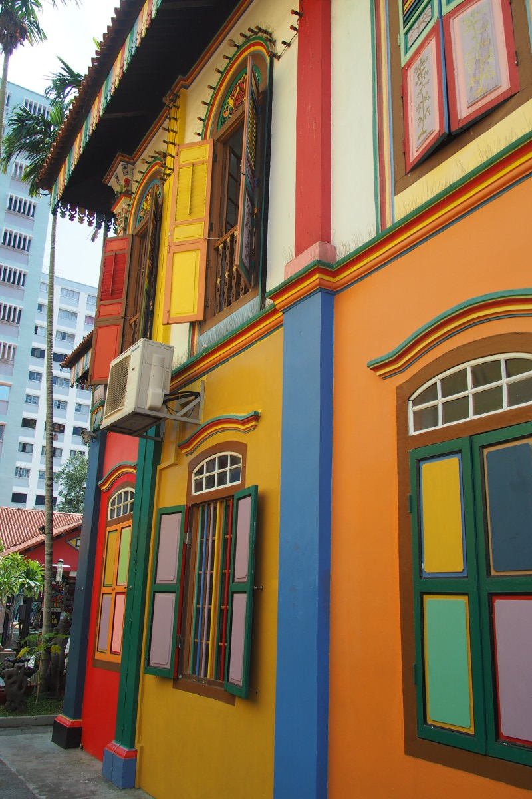
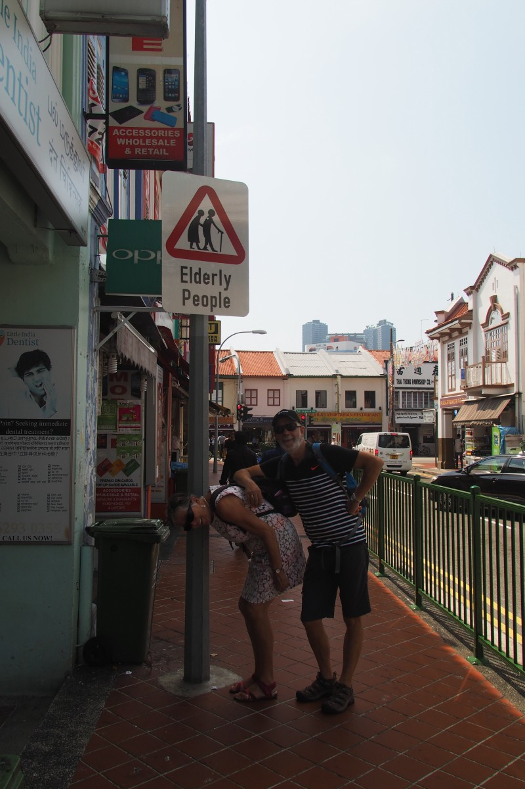
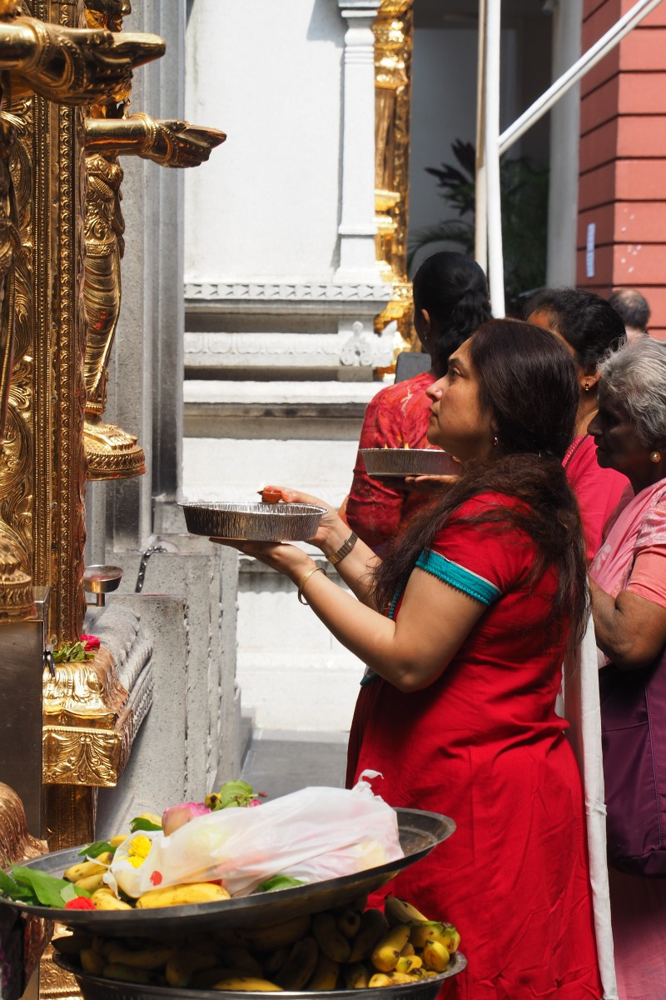
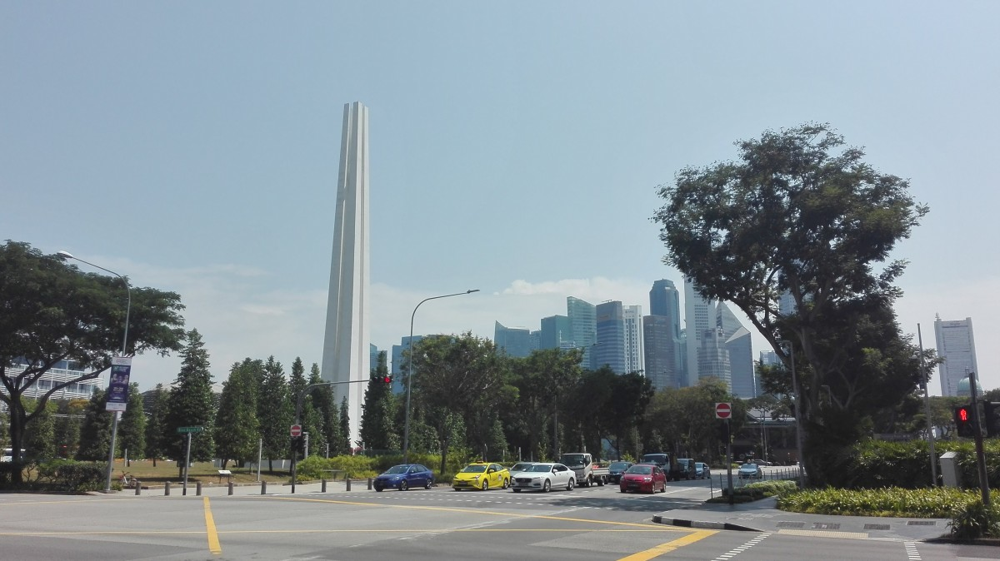
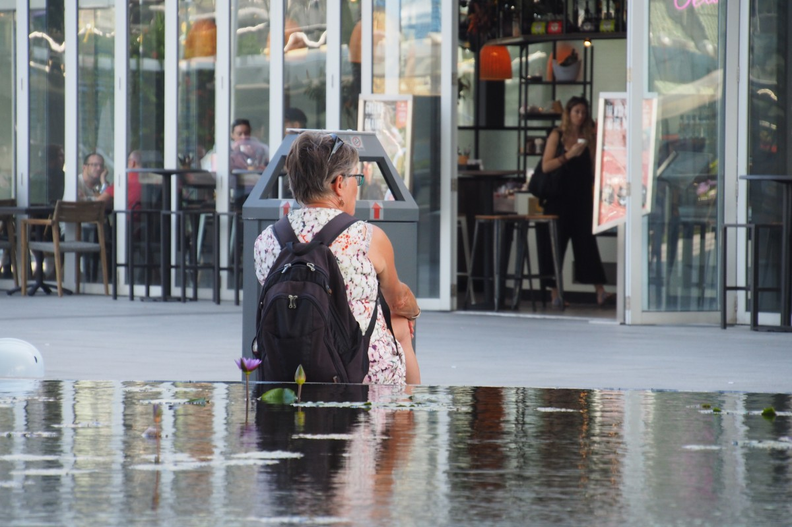
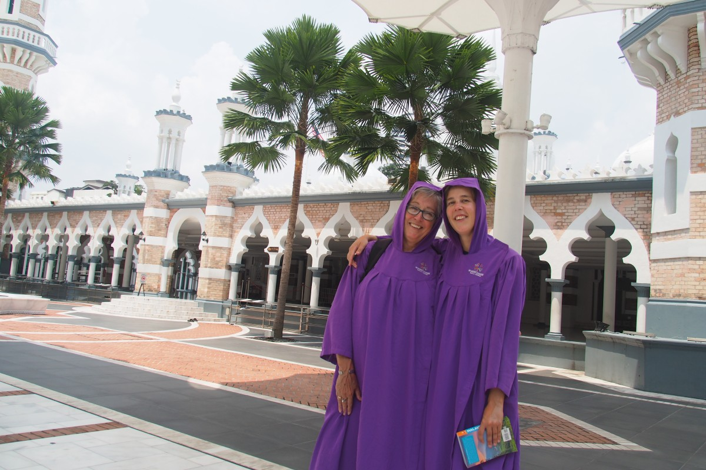
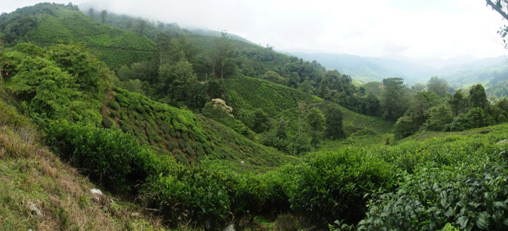
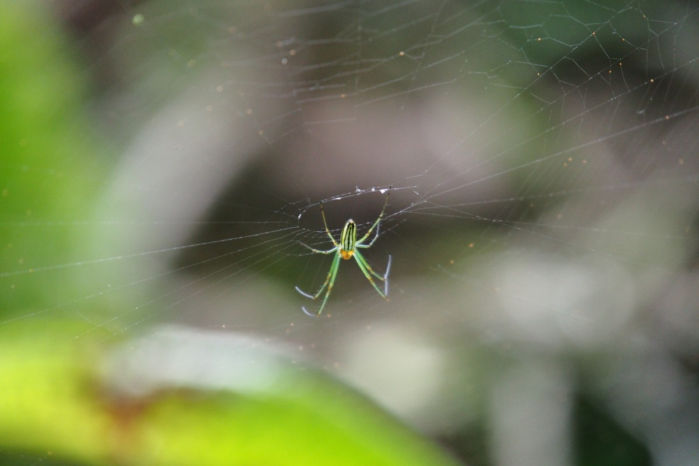

Zwischen Australien und Europa erwartete uns noch ein weiterer Kontinent: Asien. Dieser würde sich jedoch zunächst einmal von seiner niederländischen Seite präsentieren. Am Flughafen von Singapur warteten nämlich Frekes Eltern schon auf uns. Eine Umarmung, ein Küsschen – ein fröhliches Wiedersehen nach 10 Monaten! Familie Remmers vergaß dabei, dass auch noch ein Lorbach mitreiste und ließ Malte kurzerhand auf dem Bahnsteig des Flughafenshuttles stehen.

Die Türen des Zuges, der zwischen den Terminals hin- und herfährt, schlossen sich für Malte etwas zu schnell. So standen wir dann, Familie Remmers im Zug, während Malte mutterseelenalleine auf dem Bahnsteig aus der Sicht verschwand. Zum Glück pendeln die Züge alle paar Minuten, so dass wir schnell das zweite Wiedersehen feiern konnten. Anschließend ließen wir ihn nicht mehr aus den Augen.

Ton und Gerda hatten schon ein paar Wochen Urlaub in Thailand hinter dem Rücken, während wir selbst noch in Australien waren. Bevor wir den roten Kontinent verließen, ließ er sich noch mal von seiner besten Seite sehen. Am letzten Abend wurden wir spontan zu ein paar Gläschen Wein von unseren Airbnb-Hosts, Sarah und Eric, eingeladen. Auf der Terrasse tauschten wir Reisegeschichten aus. Und am Flughafen von Perth suchten wir vergeblich nach einem Briefkasten für unsere letzten Postkarten. Eine Mitarbeiterin am Check-In erzählte uns, dass man aus Sicherheitsgründen alle Briefkästen entfernt hatte. Sie würde unsere Karten jedoch mitnehmen und sie später auf dem Weg nach Hause einwerfen.

Vor allem für Freke war es besonders nett, um wieder vertraute Gesichter von zu Hause zu sehen. Und dann ausgerechnet in Singapur. Ton und Gerda hatten sich in den vier Wochen in Thailand schon an Asien gewöhnt. Wir beide hingegen waren in unseren Köpfen noch in Australien. Sie erzählten uns, dass überflutete Badezimmer völlig normal sind (man benutzt normalerweise kein WC-Papier sondern eine Art Gartenschlauch mit Spritzpistole, was offensichtlich häufig in ein Wasserballett ausartet). Für Freke war das erstmal unpraktisch, da ihre Schuhe (aus Chile) inzwischen durchgelaufen waren und sie durch das Loch in der Sohle nasse Socken bekam (hoffentlich nur Wasser!). Grund genug, sich ein neues Paar zu beschaffen.

\[caption id="attachment\_3175" align="aligncenter" width="900"\] Singapore\[/caption\]

Zu viert machten wir also erstmal Singapur unsicher. Singapur ist ein kunterbunter Haufen verschiedenster Kulturen: Das farbenfrohe Little India mit hinduistischen Tempeln; das stattliche Chinatown mit einem massiven Tempel nur für einen angeblichen Zahn Buddahs (so groß wie ein Daumen…); und das hypermoderne Marina Bay mit dem berühmten dreitürmigen Hotel, sowie die futuristischen Gardens by the bay. Wir schlenderten den ganzen Tag durch die Stadt und schlossen ihn ab mit der beeindruckenden Licht- und Wassershow in der Bucht und bei den Kunstbäumen im Gardens by the bay. Die wurden lediglich noch übertroffen durch einen wohlverdienten Cocktail auf der Dachterrasse des Marina Bay Sands Hotels im 57. Stockwerk. Wunderschön! Wer sich jetzt fragt, ob wir in dem Hotel auch schliefen: Auf keinen Fall! Statt 360€ für ein Standardzimmer hinzublättern, dösten wir doch lieber in unserem 40€-Spacepod vor uns hin :)

##### Little India:

##### Chinatown:

##### Modernes Singapur:

##### Abends:

Zum Mittagessen trafen wir uns mit Pamela, einer Freundin von Frekes Schwester, die seit ein paar Jahren in Singapur wohnt und uns einen Einführungskurs in die singapurische Küche gab. Fast aßen wir in einer Sterne-Imbissbude, die einzig und allein Reis mit Hühnchen serviert, das aber so gut zu sein scheint, dass es einen Michelin-Stern dafür bekam. Leider war die Schlange ein bisschen _zu_ lang. Beim Nachbarn gab es das gleiche leckere Gericht, dann allerdings ohne Preiskrönung. In sogenannten Hawker Centers, also überdachte Essensbasare mit unzähligen kleinen Ständen, probierten wir alles Mögliche. Alles ist unfassbar lecker, aber die Namen merken? Char Kway Teow, Bee Hoon, Hokkien Mee, Bak Kut Teh, Nasi Lemak. Viel Spaß… Das ist aber natürlich das tolle an der asiatischen Küche: Es gibt viel zu entdecken und beim Bestellen, weiß man normalerweise nicht, was man gleich bekommt. Um das ganze Spektrum Asiens zu probieren, bietet sich Singapur bestens an, denn dort kommen allerlei Küchen zusammen (chinesisch aus allerlei verschiedenen Ecken, thailändisch, indisch, malaysisch). Glücklicherweise ist auch nicht alles automatisch scharf, wie Freke anfangs befürchtete. Nur in Malaysia hilft es vorher genau zu fragen.

### Violette Gewänder

Die malaysische Hauptstadt, Kuala Lumpur, war unser nächstes Ziel. Wir tauschten unsere Spacepod-Käfige gegen eine „kleine“ Wohnung ein, aus der wir die Aussicht auf den KL Tower genießen konnten. Den Fernsehturm bestiegen wir später noch (naja gut, wir nahmen den Fahrstuhl), um die berühmten Petronas Twintowers und die übrige Skyline im Nachtlicht zu bestaunen. Wir drehten eine Runde durch das alte, koloniale Stadtzentrum, Little India (weniger bunt als in Singapur) und Chinatown (weniger stattlich, dafür chaotischer). In der Moschee ließ man uns hübsche, lila Gewänder anziehen, bevor wir nach drinnen durften (als ob es nicht warm genug gewesen wäre), während draußen der nächste Hollywood-Film gedreht wurde (okay, „nicht Hollywood, sondern Malaywood“, meinte ein Crewmitglied mit Augenzwinkern).

\[caption id="attachment\_3200" align="aligncenter" width="900"\] Kuala Lumpur\[/caption\]

\[caption id="attachment\_3204" align="aligncenter" width="900"\] Kuala Lumpur by night\[/caption\]

Am Stadtrand von Kuala Lumpur liegen die Batu-Höhlen. Als wir in die erste Höhle/Heiligtum liefen, fühlten wir uns ins Phantasialand versetzt. Anhand bunter Plastikfiguren mit sanfter Beleuchtung wurde die Lebensgeschichte des Herrn Rama erzählt. Lediglich die Untermalung mit eintöniger Märchenmusik fehlte.

Ein Stückchen weiter liefen wir die Regenbogentreppe mit 272 Stufen zur nächsten Grotte hoch. Der Weg war gesäumt mit heimtückischen Makaken, die alles mitnahmen, was sie in die Hände kriegen konnten: Souvenirs, Trinkflaschen und Eis. Die zweite Höhle war größer, weniger überfüllt mit Kitsch, etwas natürlicher und dadurch faszinierender. Krasser Unterschied zu den Höhlen, die wir letztens noch in Australien besichtigten! Lediglich das Hinweisschild, das davor warnt mit Herzproblem die Treppen nach oben zu laufen, hätte man vielleicht besser unten und nicht oben an der Treppe platziert…

### Tee

Nach Kuala Lumpur hatten wir noch ein paar Tage Zeit zu schauen, was in der Umgebung noch so zu sehen war. Alle Möglichkeiten lagen eine Busreise von ein paar Stunden entfernt, aber es fühlte sich erstaunlich gut an, um mal wieder in einem urwaldgrünen Bus mit Gardinen und Bordüren zu sitzen. Unsere letzte Busfahrt, an der kolumbianischen Karibikküste, war immerhin schon drei Monate her. Wir mussten uns lediglich wieder daran gewöhnen, dass die Busse keine Toiletten, dafür aber Kakerlakenbefall haben (letzteres sahen wir im allerersten Bus, aber das lesen Frekes Eltern hier nun zum erste Mal. Wir haben das vorsichtshalber verschwiegen, so dass sie noch mal mit uns in einen Bus steigen würden ;) ).

Bestimmungsort war die Teeregion, Cameron Highlands, welche in den Bergen im Landesinneren liegt. Herrlich, um sich eine Abkühlung von der feuchten Hitze in Singapur und Kuala Lumpur zu verschaffen. Das dachten früher auch die britischen Kolonisten, die hier einen Urlaubsort kreierten. Wir besuchten die Teeplantagen Malaysias größtem Teeproduzenten BOH (Best Of Highlands) und dessen Fabrik, in der die Maschinen aus kolonialer Zeit immer noch verwendet werden, um verschiedenste Teeblätter zu verarbeiten. Natürlich durften wir auch probieren.

 \[caption id="attachment\_3252" align="aligncenter" width="900"\] Tea, tea and tea\[/caption\]

Am Abend war es Zeit für das nächste Essensexperiment: Das chinesische Dampfboot. Das geht ungefähr so: Man bekommt einen Campingkocher und einen großen Topf Suppe auf den Tisch gestellt (man kann zwei verschiedene Suppen in einem Topf mit dünner Zwischenwand bekommen). Dort wirft man dann alles Mögliche rein, lässt es kurz gar werden und fischt es anschließend mit einer Suppenkelle wieder raus, um es in den Mund zu stecken. Also eigentlich wie Fondue, nur ein bisschen anders. Denn bei uns gab es unerkennbares Gemüse, Garnelen, Fleisch, Quallen und Noodles in Tom Yam-Suppe und nicht-scharfe Hühnerbrühe. Superlecker!

\[caption id="attachment\_3228" align="aligncenter" width="900"\] Steamboat\[/caption\]

Im Grün der Cameron Highlands lässt es sich auch gut wandern, gerade wegen der kühleren Temperaturen. Leider mussten wir Gerda und Ton im Hotel zurücklassen, nachdem Gerdas Knöchel Tribut an die malaysischen Wege (= Löcher, Kanten, Unebenheiten) zollen musste. Während Gerda also ihre blaues, geschwollenes Fußgelenk hoch legte, zogen wir eine Runde um die benachbarten Hügel. Die „berühmten“ Wasserfälle von Tanah Ratah fanden wir zwar auf Anhieb, aber beeindruckt waren wir weniger. Haufen von Plastikmüll am Ufer ließen den Zauber verschwinden. Nichtsdestotrotz tat es gut, um dem Trubel der Millionenstädte kurz zu entfliehen und gegen saftiges, kühles grün einzutauschen.

### Utrechter Grachten

Einen Reisetag später standen wir auf dem Holländischen Platz in Melaka. Melaka war früher eine zentrale Hafenstadt, in der diverses holländisches Erbgut aus der Zeit, als der VOC hier das Sagen hatte, zu finden sind. Unter anderem gibt es ein „Stadthuys“ mit rotem Giebel und allem drum und dran. Sieht allerdings überhaupt nicht holländisch aus! Das könnte der Grund sein, warum Malaysier nie nach Holland zu Besuch kommen…

Sehr hübsch hingegen ist der Fluss, der wie eine Art Utrechter Gracht durch den Stadtkern fließt. Der „Boulevard“ hat letztens ein Upgrade bekommen, wodurch man in allerlei Cafés und Bars direkt am Wasser sein Bierchen genießen kann (allerdings im Regen, das ist wiederum so gar nicht holländisch). Für uns persönlich war das doch einer unserer Höhepunkte der Reise mit Frekes Eltern: Zusammen irgendwo gemütlich ein Bierchen trinken und quatschen; das vermissen wir auf Reisen.

Von Melaka aus traten wir zu viert unsere Rückreise nach Kuala Lumpur an. Für Ton und Gerda ging es wieder zurück in die Niederlande, mit etwas schwereren Koffern als auf dem Hinweg. Dafür waren unsere Rucksäcke endlich wieder schön leicht. Nach zehn Tagen zusammen waren _wir_ es zur Abwechslung, die die anderen zum Gate begleiteten. Aber der Abschied ist dieses Mal von kurzer Dauer: „Bis in 7 ½ Wochen!“
