Borneo, geteilt in die zwei malaysische Staaten Sarawak und Sabah, ist eines der bemerkenswertesten Reiseziele unserer Reise bisher. Wir begegnen hier nicht nur natürliche Attraktionen wie Dschungel, Orang-Utans, Nasenaffen und Laternenkäfern, auch wir selbst sind nicht selten eine Attraktion für die lokalen Bewohner.

„Wir haben der Queen die Hand geschüttelt. Und guck‘ mal, hier ist ein Foto mit Sylvester Stallone. Und das ist David Beckham!“ _Wir_ beschreibt in diesem Fall nicht unseren Gesprächspartner selbst (ein chinesischer Ladenbesitzer in Miri), sondern seinen Bruder. Das ist aber unwichtig; im erweiterten Sinn hat die ganze Familie allerlei Promis getroffen und man ist mächtig stolz darauf. Der Ladenbesitzer sprach uns auf der Terrasse eines Cafés an, auf der wir Eiskaffee-schlürfend auf unsere Wäsche im Waschsalon um die Ecke warteten. Er hatte sich zur täglichen Kaffeepause mit anderen chinesischen Unternehmern aus der Nachbarschaft verabredet, aber wir schienen die interessanteren Gesprächspartner zu sein.

Wir haben bereits mehrfach festgestellt, dass die Malaysier eigentlich immer zu einem kurzen Schnack bereit sind oder, bei unzureichenden Englischkenntnissen, zumindest zu einem Selfie mit uns. Inzwischen fragen wir als Gegenleistung auch immer um ein Selfie mit unserem eigenen Telefon. So auch in Kuching, wo wir zum ersten Mal Borneo betraten. Zwei verschleierte Mädchen hatten endlich den Mut versammelt, um um ein Selfie mit Malte zu fragen. Blöderweise verstand Malte erst nicht, was sie wollten. Am Gesicht der jungen Frau war die Schwierigkeit den parat gelegten Satz zu wiederholen deutlich abzulesen.

Manchmal fällt die Reaktion aber auch weniger verlegen aus. „Wie bitte? Nicht scharf? Aber das hier ist ein indisches Restaurant, all unser Essen ist scharf“, seufzte die Kellnerin eines zugegeben indischen Restaurants im Ölstaat Brunei auf Frekes Frage, welches Gericht auf der Karte denn nicht scharf sei.

Seit der frühen Kindheit wuchs Freke mit dem Bild von Borneo als bedrohtes Dschungelparadies voll Orang-Utans auf, das man via WWF und grauem Recycling-Toilettenpapier probierte zu schützen. Ein einziger großer Urwald: Das ist Borneo schon lange nicht mehr. 5,6 Millionen Menschen leben alleine auf der malaysischen Seite, die meisten davon in großen Städten so als Kuching, Sibu, Sandakan und Kota Kinabalu. Von Kuala Lumpur aus landeten wir in Kuching. „Kuching“ ist malaysisch für „Katze“ und entsprechend steht die ganze Stadt voll mit prächtigen Katzenstatuen. Momentan ist Nebensaison für den Tourismus und das war nicht schwer zu erkennen. Wir hatten gerade unser Quartier in einem Homestay über einem kleinen chinesischen Café bezogen als es wie aus Eimern begann zu regnen. Regenzeit halt.

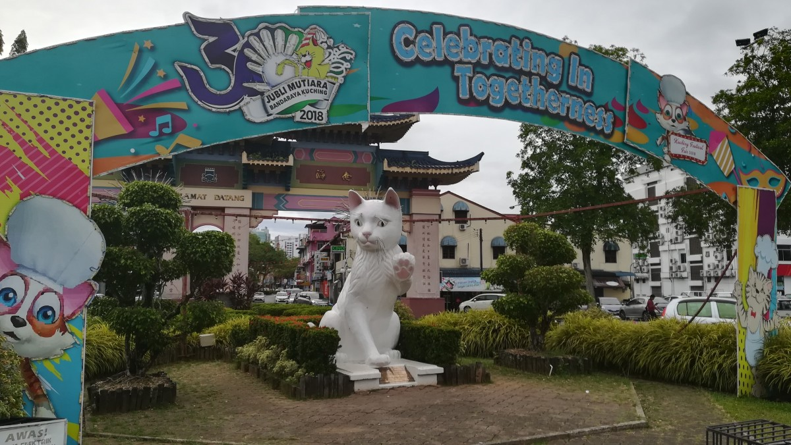

Der anschließende Tag war jedoch trocken. Zum Glück, denn ansonsten wären unsere Chancen Borneos berühmtesten Bewohner, die Orang-Utans, zu sehen wahrscheinlich kleiner gewesen. Außerhalb der Stadt liegt ein Rehabilitationszentrum für verwaiste und gerettete Affen. Die Orang-Utans leben im Prinzip in der Wildnis, aber wer selbstständig noch nicht ganz über die Runden kommt, der kann sich seine tägliche Ration Bananen, Kokosnüsse und Zuckerrohr abholen. Eine Garantie fürs Auftauchen der Affen gibt es allerdings nicht.

Die Rangers des Zentrums gaben bei unserem Besuch allerdings relativ schnell grünes Licht: Ein paar seien in der Nähe und kämen langsam Richtung Futterstelle. Mit ein paar „gekonnten“ Tarzan-“Aaaahiihaaahh“-Rufen probierten die Rangers die Affen in die richtige Richtung zu locken. Das Männchen kam als erstes angewatschelt. Von hinter einem kleinen Hügel kam er Schritt für Schritt zu Vorschein und somit langsam auf uns zu. Ein Koloss von einem Tier! Nach ein paar Metern blieb er stehen, begutachtete die kleine Gruppe Besucher mit ihren Kameras, entschied, dass wir wohl keine große Gefahr darstellten, und setzte seinen Weg zu den Bananen, nun schwingend über Taue und Baumstämme, fort. Von weiter oben in den Bäumen kam ein Weibchen hinzu, das gerade mal halb so groß war, sowie ein jüngerer Affe von etwa fünf Jahren. Man ließ es sich sichtbar schmecken: Die Bananen wurden gekonnt geschält und etwas weniger elegant in den Mund gestopft, die Kokosnüsse mit Gewalt am Baumstamm geöffnet und das Zuckerrohr zwischen den Zähnen zermalmt. Bon appétit!

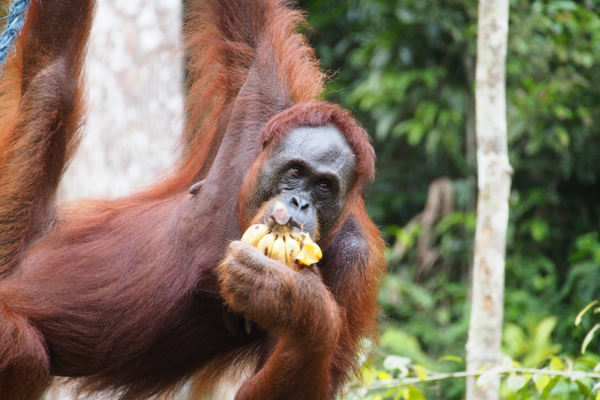

Am nächsten Tag wollten wir ursprünglich zum Bako Nationalpark, aber der anhaltende Regen machte uns einen Strich durch die Rechnung. Stattdessen beschlossen wir mal wieder einen Kochkurs zu besuchen. Das sind immer schöne Gelegenheiten, um Kontakt mit „normalen“ Menschen aufzunehmen und gleichzeitig unbekanntes Obst und Gemüse kennen zu lernen. Mit unserem Guide und seinem Sohn zogen wir eine Runde über einen lokalen Gemüsemarkt. Wir bekamen die „Dutch Durian“ zu sehen, die gar keine Durian-Frucht ist (die bekannte Stinkefrucht, dessen Mitnahme in den meisten öffentlichen Verkehrsmitteln in Asien verboten ist), sondern lediglich so aussieht. Die holländischen Kolonisten waren in die Irre geführt und seitdem nennt man sie „Durian Belanda“. Außerdem fanden wir vier verschiedene Sorten Aubergine (von bitter bis süß), sowie Habaneros, eine der schärfsten Chilischoten der Welt, die ihren Weg aus Zentralamerika bis nach Asien gefunden hat.

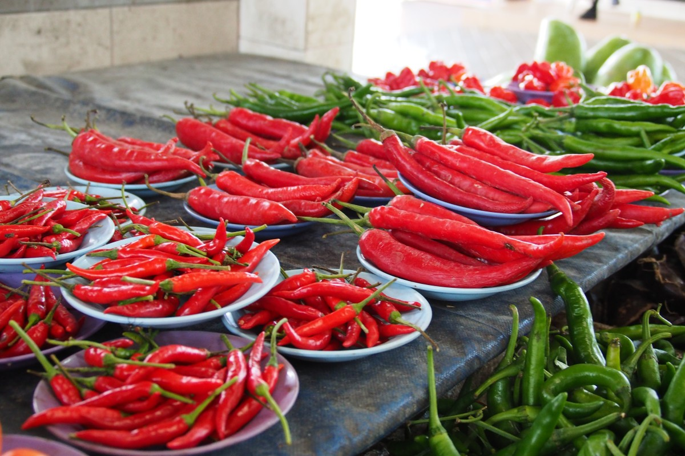

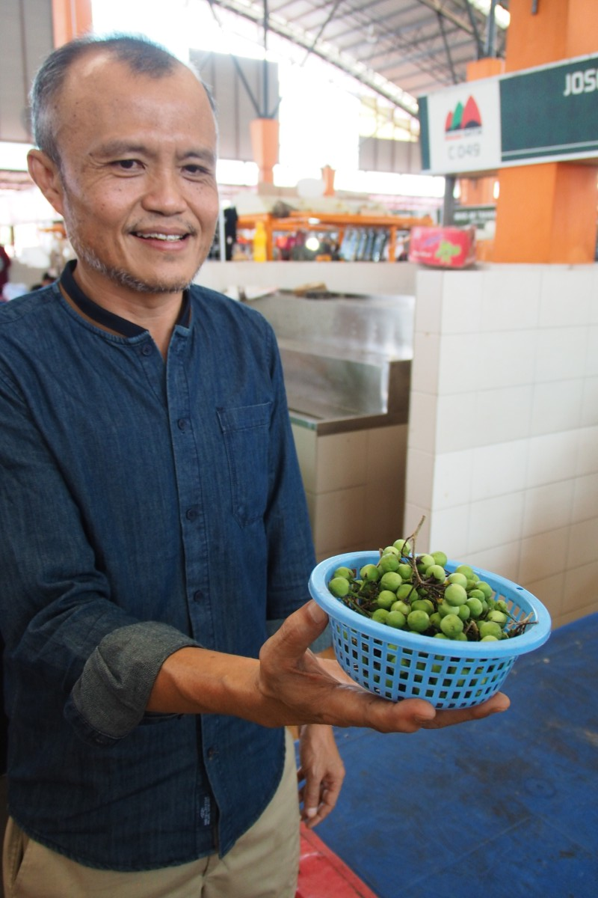

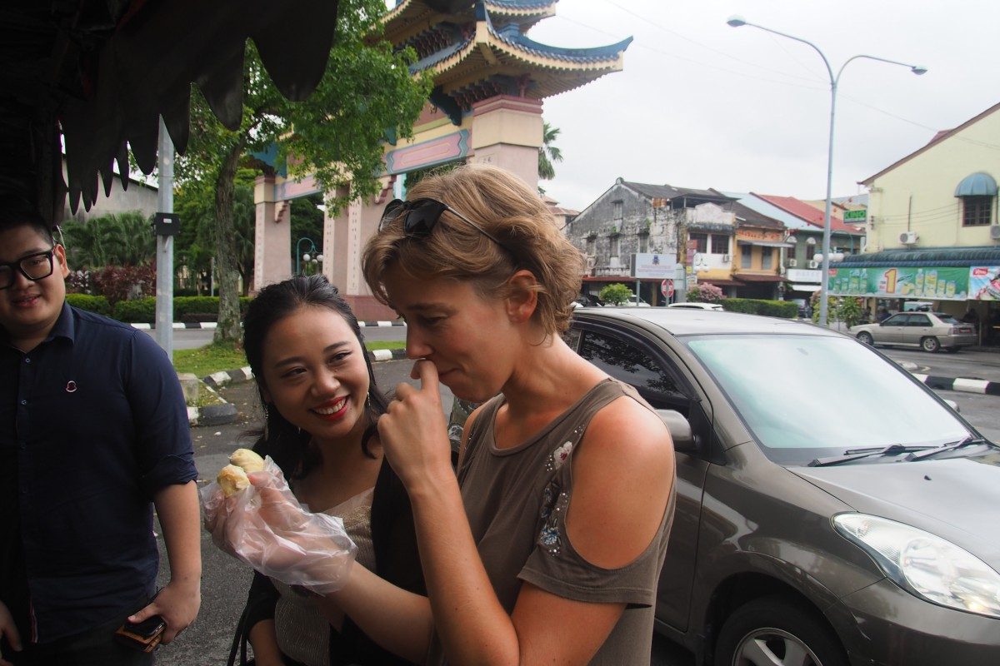

Zurück in der Küche bereiteten wir eine Handvoll lokaler Gerichte zu. Sarawak Laksa, ein pikantes Hühnchengericht, das mit einer speziellen Gewürzpaste geschmort wird; Hühnchen Gula Apong, das mit Palmzucker mariniert wird und entsprechend süß schmeckt; sowie ein Salat mit Urwaldfarnen, die nur hier zu kriegen sind. Das ganze wird meist abgerundet mit frischer Kokosmilch, Zitronengras und Fackel-Ingwer. Jummie!

Dann war doch noch die Zeit für den Bako Nationalpark gekommen. In dem Stückchen Regenwald an der Küste leben ein paar Nasenaffen, die ein Besuch wert sind. Mit immenser Nase und dickem Bauch sitzen sie am liebsten auf irgendeinem Ast und kauen auf ein paar Blättern herum. Aus irgendeinem Grund heißen sie in der malaysischen Sprache „Orang Belanda“ (holländischer Mensch). Warum nur? Man weiß es nicht… Neben den putzigen Affen gab es noch bärtige Wildschweine zu sehen (die Avantgarde der Hipsterbärte), jede Menge Makaken (oder auch „Standardaffen“, wie sie jemand nannte, weil sie einfach überall zu finden sind), himmelblaue Krebse und amphibische Schlammspringer. Etwas unbeweglicher waren die faszinierenden fleischfressenden Trichterpflanzen. So eine hatten wir mal zu Hause im Wohnzimmer stehen, in der Hoffnung sie würde unser Fruchtfliegenproblem lösen. Tat sie aber nicht. In der Natur scheint es ihnen besser zu gehen.

\[caption id="attachment\_3322" align="aligncenter" width="900"\] Bako National Park\[/caption\]

### Fliegende Särge

Wer sich überhaupt von Kuching aus auf dem Landweg durch Borneo bewegt, tut das in aller Regel in einer langen Hauruckaktion direkt bis Miri, im Norden Sarawaks. Die Aussicht auf 12 Stunden Busfahrt erregte jedoch wenig Begeisterung in uns und darum beschlossen wir einen Umweg durchs Landesinnere zu nehmen. Das hieß zwar trotzdem, dass wir den Nachtbus nach Sibu nehmen würden, aber danach sollte es langsam per Boot den Fluss hinauf gehen. Wir erreichten Sibu leider nicht wie versprochen um 6 Uhr morgens sondern schon 3 Uhr. Nachdem wir zwei Stunden im ausgestorbenen Busterminal rumgehangen hatten, ließen wir uns per Grab (dem asiatischen Äquivalent zu Uber) zum Fährbootterminal bringen. Endstation würde Belaga sein, mit einer Zwischenübernachtung in Kapit. Ob das Boot nach Belaga wirklich fuhr, war allerdings noch undeutlich; bei niedrigem Wasserstand fällt die Fahrt schon mal aus.

Am Bootsterminal angekommen fiel unsere Aufmerksamkeit sofort auf die Meute vor den geschlossenen Toren. Dicke Pakete druckfrischer Zeitungen wurden auf den Bürgersteig ausgeladen, wahrscheinlich um per Boot in den umliegenden Dörfern verteilt zu werden. Aber irgendwas schien nicht zu stimmen, die Menschen wirkten unruhig. Ein paar Männer rupften ungeduldig am Vorhängeschloss, das die Türen verschloss. Schließlich kam jemand mit einem großen Schraubenschlüssel und brach das Schloss auf. Was ist denn hier los?

Wie sich herausstellte, arbeiteten die ungeduldigen Männer im Terminal, aber der Sicherheitsdienst mit den Schlüsseln hatte offensichtlich verschlafen. Zeit ist Geld, dann hilft man sich halt selbst! Wir bezahlten für unser Ticket, luden unsere Rucksäcke auf das Dach des Bootes und stellten danach fest, dass wir eigentlich noch gar nicht wissen, ob das zweite Boot nach Belaga jetzt eigentlich fährt oder nicht. Naja, wir werden sehen…

Die Boote auf dieser Route haben den Spitznamen „Flying coffins“ (fliegende Särge). Zum Glück (oder hoffentlich?) nicht wegen vieler Unfälle, sondern wegen der Form, die in der Tat ein bisschen an einen Sarg erinnert. Auch drinnen; an Klaustrophobie sollte man besser nicht leiden. An der Außenseite läuft rund um das Boot eine kleine Plattform, die den Anschein von Flügeln erweckt. Okay, fliegende Särge also. Die Klimaanlage kühlte die Kabine auf gefühlte 10ºC, warum Malte sich unter sein Handtuch verkroch und so dem Bild des Sarges noch mehr Authentizität verlieh ;)

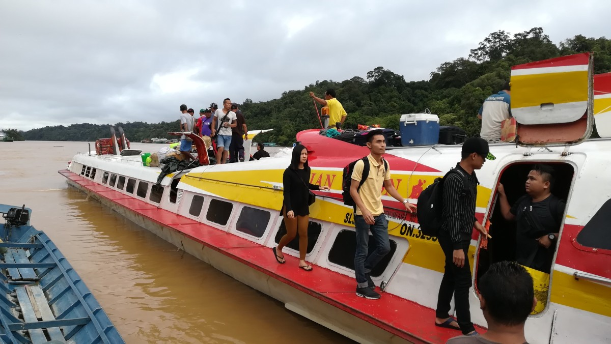
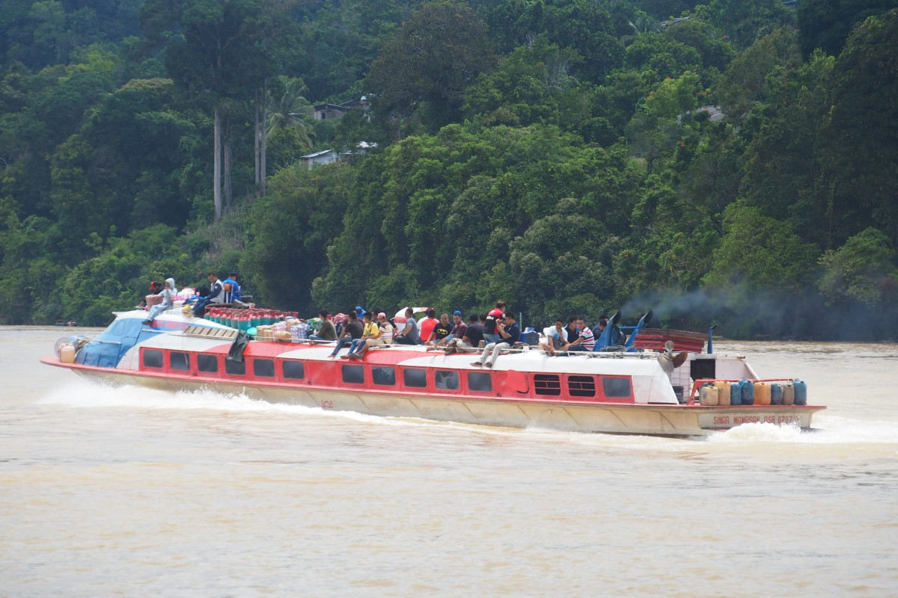

Nach guten drei Stunden erreichten wir das kleine, aber hektische Kapit. Überall drehen sich Köpfe nach uns um, denn so viele Ausländer kommen hier nicht vorbei. Erstmal checken, ob unser Anschlussboot fährt (ja, es fährt), und danach eine Unterkunft für die Nacht regeln. Kapit selbst hatten wir in einer halben Stunde gesehen. Es gibt einen Bäcker („the famous bakery“), der süße Brötchen in allen Farben und Formen backt, und einen Markt. Dort bekamen wir für 2 malaysische Ringgit (40 Cents) so viele Bananen zugesteckt, dass wir drei Tage später immer noch Bananen aßen. Jetzt können wir erstmal keine Bananen mehr sehen… Am Rand des Flusses steht außerdem noch ein „Fort“ aus der Zeit des weißen Rajas, welches eher aussieht wie ein hölzernes Getreidelager. Mit [weißen Rajas](https://de.wikipedia.org/wiki/Wei%C3%9Fe_Rajas) meint man übrigens die britische Familie Brooke, die hier unabhängig vom britischen Reich in den Jahren 1841 bis 1946 regierte.

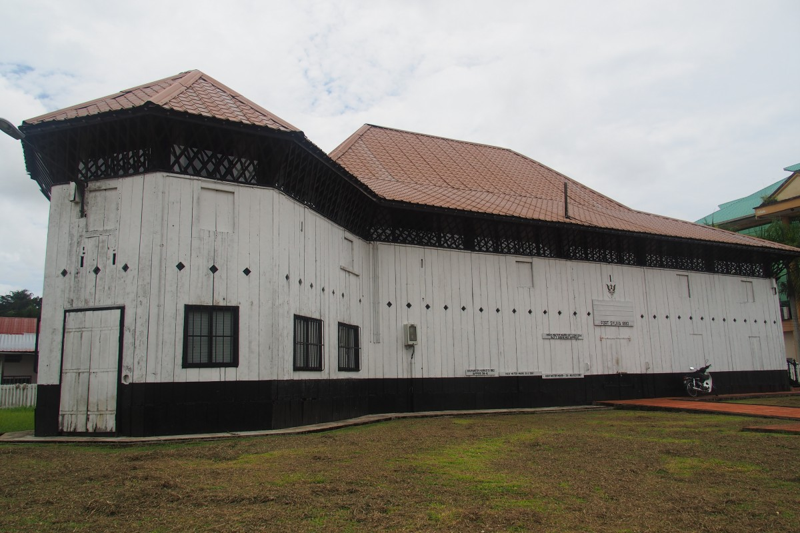

Am nächsten Morgen frühstückten wir bei der „famous bakery“, wo wir zufällig der einzigen weißen Familie des Dorfes über den Weg liefen. „Wir kommen aus Australien“, erzählte der baumhohe Kerl (noch so ein auffälliges Merkmal zwischen all den kleinen Malaysiern). „Aber es gibt _noch_ eine weiße Familie, aus Amerika. Oh ja, und ein Deutscher. Der fliegt die Hubschrauber. Was verschlägt euch nach Kapit?“ Am Ende war er so schnell wieder verschwunden, dass wir ihn dieselbe Frage nicht zurück fragen konnten.

Kurz darauf standen wir mit unseren sieben Sachen wieder am Steg. Alles mögliche wurde auf die Boote geladen: Hühner, meterlange stählerne Rohre, Waschmaschinen, zentnerweise Mehl… Von hier aus flussaufwärts sind die meisten Gemeinden nur auf dem Wasserweg zu erreichen. Es wurde nicht nur viel mitgenommen, es ging während der Fahrt auch jede Menge über Bord: Plastikflaschen, Tüten, komplette Pappkartons. So viel zum umweltbewussten Borneo…

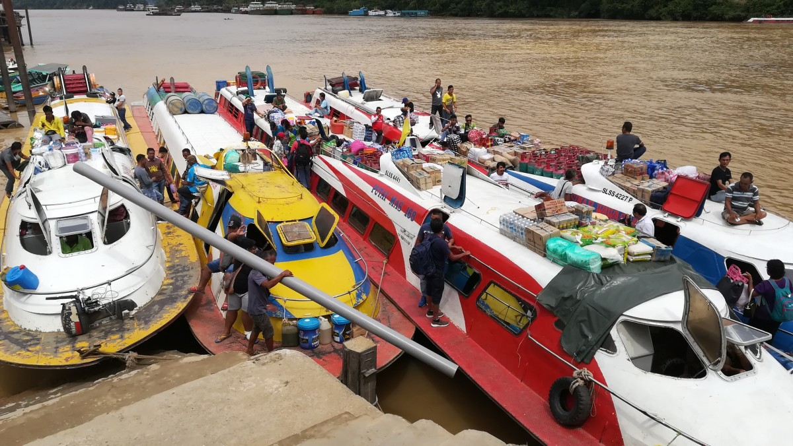

Unser Boot legte überpünktlich ab und wir machten es uns auf dem Dach bequem. Unten in der Kabine sieht man ja sowieso nichts und die wunderbare Aussicht auf den Dschungel wollten wir uns nicht entgehen lassen. Überwucherte, grüne Hügel zogen an uns vorbei, ab und zu ein Longhouse (wortwörtlich enorm lange Häuser, in denen traditionell Einheimische Stämme wohnen). Früher waren die Longhouses aus Holz gebaut, aber heutzutage sind die meisten aus Beton, mit Strom, Wasser und Satellitenschüsseln. Die romantischen Zeiten, in denen man ein traditionelles Longhouse besuchen und sehen konnte, wie man dort lebt, scheinen vorbei. Ein paar Holzhäuser werden für touristische Zwecke noch Instand gehalten, aber die meisten Menschen leben in den verbesserten Varianten. Für sie ist es sicherlich ein Fortschritt.

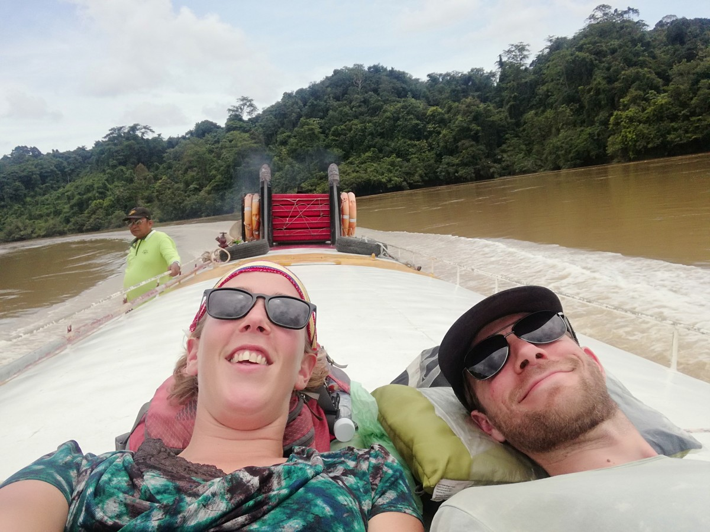

Nach etwa einer Stunde kamen wir zum spannendsten Teil der Überfahrt, den Pelagus Stromschnellen. Hier verändert sich der Fluss für 800m in eine flink strömende, wirbelnde Wassermasse und hier mussten wir durch. Diese Boote fahren hier jeden Tag hindurch, probierten wir uns zu beruhigen, aber wir hielten uns sicherheitshalber gut fest. Es ging von links nach rechts gegen die Strömung, vorbei an Strudeln und großen Felsen. Unser Kapitän lotste uns fehlerlos durch. Danach konnten wir wirklich entspannt an Deck liegen.

Fünf Stunden später legten wir endlich in Belaga an, einem kleinen Dorf mit etwa 800 Einwohnern, das gefühlsmäßig tief im Urwald eingegraben liegt. Es ist einer dieser Orte, wo man von den hiesigen Schulkindern begrüßt und gefragt wird, „Where are you from?“. Nicht unbedingt, weil sie besonders daran interessiert sind, sondern weil sie ihr weniges Englisch üben wollen. Wir hatten nichts gebucht, aber wir hatten im Vorfeld über ein Gasthaus gelesen. Wir gingen davon aus, dass wir in den Nebensaison flexibel sein könnten, aber völlig ohne Voranmeldung aufzukreuzen erwies sich ebenfalls als keine Gute Idee. Der Besitzer war für einige Tage verreist, aber der Nachbar ließ uns rein (keine einzige Tür im Dorf schien abgeschlossen zu sein). Alles machte den Anschein als ob schon länger niemand hier gewesen war. Betten, Stühle und Tische hingen voll Spinnweben und von Sauberkeit konnten wir auch nicht unbedingt sprechen. Nagut, war ja nur für eine Nacht.

Es ging nämlich gleich weiter, nicht per Boot, sondern per Geländewagen. Quer durch den Dschungel, erst ein Stück über holprigen Asphalt, dann über eine Art Matschpiste. Ab und zu erhaschten wir einen Blick durch das Gehölz über die hügeligen Täler, der Regenwald zum Teil noch im Morgennebel versunken. Herrlich schön! Und dann, etwa auf halber Strecke, verändert sich das Bild plötzlich. Die chaotisch überwucherte Böschung verschwindet allmählich und macht Platz für lange Reihen Palmen. Palmöl. So sieht das also aus.

Die matschigen Feldwege, über die wir fuhren, hat man natürlich nicht ohne Grund angelegt. Sie werden von der Holzindustrie benutzt, die im Borneoschen Urwald wütet. Der Weg wurde immer breiter und regelmäßig kamen uns große Lastwagen entgegen. Da die Wege im Privatbesitz der Konzerne sind, sind es keine öffentlichen Straßen und es gelten ein paar extra Regeln: Damit die großen Lastwagen auf den kurvigen Wegen nicht so viel Zeit verlieren, wird mit Pfeilen angegeben, auf welcher Straßenseite der übrige Verkehr zu fahren hat. Manchmal links, manchmal rechts; auf der Innenbahn oder der Außenbahn der Kurve.

Wir begonnen uns zu fragen, wie dick der Urwald, den wir am Tag zuvor entlang des Flusses sahen in Wirklichkeit ist. Wer weiß, vielleicht versteckten sich die ersten Palmölpalmen gerade mal ein paar Meter hinter der Böschung. Natürlich wussten wir vorher, dass der Regenwald auf Borneo in großem Umfang abgeholzt wird, aber es mit den eigenen Augen zu sehen, ist doch anders.

Nach ein paar Stunden Fahrt im Geländewagen, währenddessen unser Chauffeur ohne Scham von seiner Spielsucht bei den wöchentlichen Hahnenkämpfen erzählte (oookay), wurden wir an der Kreuzung mit der einzigen durchgängigen Verbindungsstraße Sarawaks herausgelassen. Wir mussten nicht lange auf einen Bus nach Miri warten.

### Höhlenbewohner

Städte auf Borneo sind wenig bis überhaupt nicht interessant und darum probierten wir möglichst wenig Zeit in ihnen zu verbringen. Von Miri aus besuchten wir den Niah Nationalpark, der neben Regenwald (yay) vor allem Kalksteinhöhlen umfasst. In den fünfzigern erlangten die Höhlen kurzzeitig Weltbekanntheit als man 40.000 Jahre alte Skelette fand, die bewiesen, dass Homo Sapiens schon eine recht lange Zeit in Asien unterwegs war.

\[caption id="attachment\_3418" align="aligncenter" width="900"\] Trader's cave\[/caption\]

Uns kamen keine Neanderthaler entgegen, obwohl sie sich vielleicht auch nur in der Finsternis hinter einem der großen Felsen versteckten. Über ein paar Holzstege kann man die Höhlen auf eigene Faust erkunden. Ausgerüstet mit Kopflampe ertasteten wir uns den Weg durch die Große Höhle (Great Cave) zur Bemalten Höhle (Painted Cave). Ertasten erwies sich nicht immer als geeignete Strategie, denn nicht selten waren die Geländer bereits durch handflächengroße Kakerlaken besetzt.

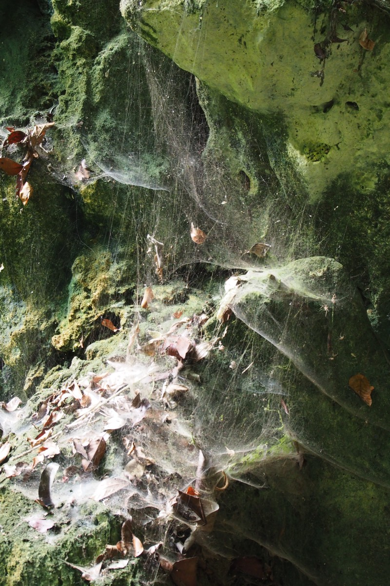

Angekommen in der Bemalten Höhle fanden wir die 40.000 Jahre alten Felsmalereien. Sie sind inzwischen etwas verblasst, aber eigentlich noch ganz gut zu erkennen. Als eine Archäologin die Höhle als erste fand, lagen hier ebenfalls Skelette, hübsch drappiert in kleinen Booten, bereit um abzulegen. Ein paar diese Boote lagen hier noch, aber wir hofften insgeheim, dass das nicht die Originale sind, denn bei dieser Luftfeuchtigkeit würden sie nicht lange konserviert bleiben.

Die Höhlen sind nicht allein interessant für Touristen sondern auch für Vogelnestsammler. Diese „ernten“ die Nester von Swiftlets (eine Art kleine Schwalbe), um daraus später Vogelnestsuppe zu kochen; scheinbar eine Delikatesse unter Chinesen. Urgh. Das Sammeln geschieht nicht ganz ohne Risikos, denn die Swiftlets bauen ihre Nester gerne an der Höhlendecke, also gerne mal in 50m Höhe. Anstelle von Leitern oder anderem modernen Schnickschnack benutzt man ineinander gesteckte Bambusrohre und klettert daran – natürlich ohne Sicherung – nach oben. Wir bleiben also lieber bei unseren Schreibtischjobs…

Das tolle am Regenwald ist, dass man jedes Mal, wenn man drinnen ist, wieder neue kleine und große Tiere entdecken kann. Auch dieses Mal kamen ein paar Äffchen, ein knallroter Vogel und diverse Insekten vorbei.

Am zweiten Tag in Miri wollten wir eigentlich tauchen gehen, aber die wilde See streute uns Salz in die Suppe. Stattdessen schlossen wir uns einem irischen Jungen aus dem Hostel an und wanderten mal wieder durch den Regenwald. Dieses Mal im Lambir Hill Nationalpark, wo ein paar Wasserfälle zum Schwimmen einladen. Das war bei der Hitze und unvorstellbar hohen Luftfeuchtigkeit auch herrlich erfrischend. Jedenfalls bis man den meterlangen Waran in der Nähe des Ufers schwimmen sieht. Hmm, doch mal lieber raus aus dem Wasser.

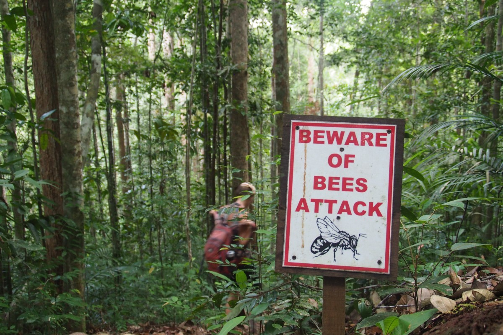

Man muss nebenbei erwähnen, dass die Nationalparks auf Borneo überraschend gut organisiert sind. Für wenig Eintrittsgeld kann man sich frei im Park über die gut markierten Wanderwege bewegen. Das haben wir in anderen asiatischen Ländern und anderen Kontinenten schon ganz anders erlebt.

\[caption id="attachment\_3439" align="aligncenter" width="900"\] Lambir Hills National Park\[/caption\]

### Fledermäuse

Eigentlich dachten wir, dass wir schon eine ganze Menge gesehen hatten, aber einer der Höhepunkte Borneos stand uns noch bevor: Der Mulu Nationalpark. Mitten im Urwald liegt dieses Stückchen grüne Natur mit der größten, tiefsten, längsten (und noch ein paar weiteren Superlativen) Höhle der Welt. Und dazu kommt, dass es ausschließlich per Propellerflugzeug zu erreichen ist. Aus der Luft bekamen wir noch einmal den Umfang der Palmölplantagen zu sehen. Auf einer Fläche von unzähligen Fußballfeldern stehen im gleichmäßigen Abstand Palmen neben Palmen, hübsch geordnet in langen Reihen. Die Grenze zum klitzekleinen Ölstaat Brunei ist von oben deutlich zu sehen: Eine unsichtbare Linie trennt die Plantagen vom unberührten, bruneiischen Regenwald. Wer nun voller Enthusiasmus den Naturschutzpreis an den Sultan von Brunei ausreichen möchte, sollte sich noch kurz fragen, was passieren würde, wenn Brunei nicht mehr soviel Geld mit ihrem Erdöl verdienen würde.

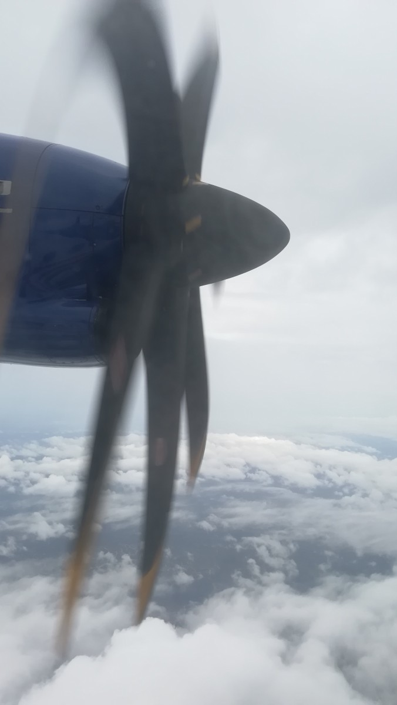

In Mulu war Malte leider den ganzen Tag mit Fieber ans Bett gebunden. Freke erkundete den Park erstmal alleine und fand dabei allerlei exotische Insekten: Wandelnde Äste, Gottesanbeterinnen, ein daumendicker Tausendfüßler. Über den Baumwipfeln war der Flügelschlag eines großen Vogels zu hören. Ein Nashornvogel? Die Vögel mit einer Art Horn oben auf dem Schnabel sind das Symbol Borneos.

Am darauf folgenden Tag ging es Malte schon wieder etwas besser, allerdings noch nicht gut genug die geplante intensive „Garden of Eden“ Wanderung zu machen. Stattdessen gingen wir zu den zwei Höhlen, Lang Cave und Deer Cave. Das waren immerhin auch noch 4km zu laufen. Kurz vor dem Ziel fanden wir jedoch unseren Weg durch einen kleinen Erdrutsch blockiert. Es hatte Mittags ordentlich gewittert mit viel Regen und Sturmböen. Ein Baum samt Böschung war auf den Boardwalk gefallen. Hier führt kein Weg dran vorbei. Oder doch? Doch, kostet zwar 1km Umweg, aber wir wollten ja schließlich zu den Höhlen.

Lang Cave hatte durchaus Ähnlichkeiten mit den Höhlen, die wir in Australien besichtigt hatten. Voll mit hübschen Tropfsteinformationen. Das eigentliche Ziel war jedoch Deer Cave: Die größte Höhle der Welt. Wer das Geld hat, kann hier seine 40 Boeings 747 parken. Wir würden es allerdings nicht empfehlen, denn die 2-3 Millionen Fledermäuse, die die Höhle ihr zu Hause nennen, produzieren ziemlich viel stinkenden Fledermauskot. Witzig an den Fledermäusen ist, dass sie pünktlich zum Sonnenuntergang alle zusammen und fast gleichzeitig nach draußen fliegen. Das was sie hier den „Fledermaus Exodus“ nennen, schaut man sich am besten von draußen vor dem Höhleneingang an. Dort versammeln sich die Fledermäuse in Gruppen bevor sie in unterschiedlichen Formationen (Donut, Drache oder chaotische Wurst) aufsteigen. In Formation zu fliegen hat übrigens den Zweck sich vor dem Fledermaushabicht zu schützen, der schlauerweise ebenfalls rund Sonnenuntergang bei der Höhle lauert.

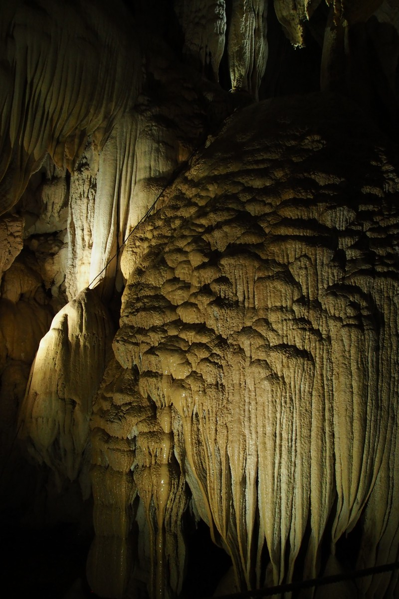

Auf dem Heimweg liefen wir nicht die alternative Route, sondern durften wir unser Glück versuchen, um im Dunkeln über und unter den gefallenen Baum zu klettern. So kamen wir doch noch zu unserer Kletterpartie. In der Nacht klingt so ein Dschungel komplett anders als tagsüber. Von überall her kommen glucksende, röhrende, bellende und zwitschernde Geräusche. Es schien sich um Vögel zu handeln, aber in Wirklichkeit war es ein Krötenorchester. Klassische grasgrüne Frösche mit großen Augen, Unken die klingen wie Hunde, Kröten die eine Party feiern (woop-woop!). Unvorstellbar.

Als wir danach wieder Abschied von Mulu nahmen, hatten wir so was wie Heimweh. Wir haben den Regenwald jedenfalls ins Herz geschlossen. Viel Zeit zum Schmollen hatten wir jedoch nicht, denn wir reisten direkt weiter ins zehnte Land unserer Reise: Das Sultanat Brunei oder offiziell _Negara Brunei Darussalam_ (Brunei, Heimat des Friedens). Na dann!
