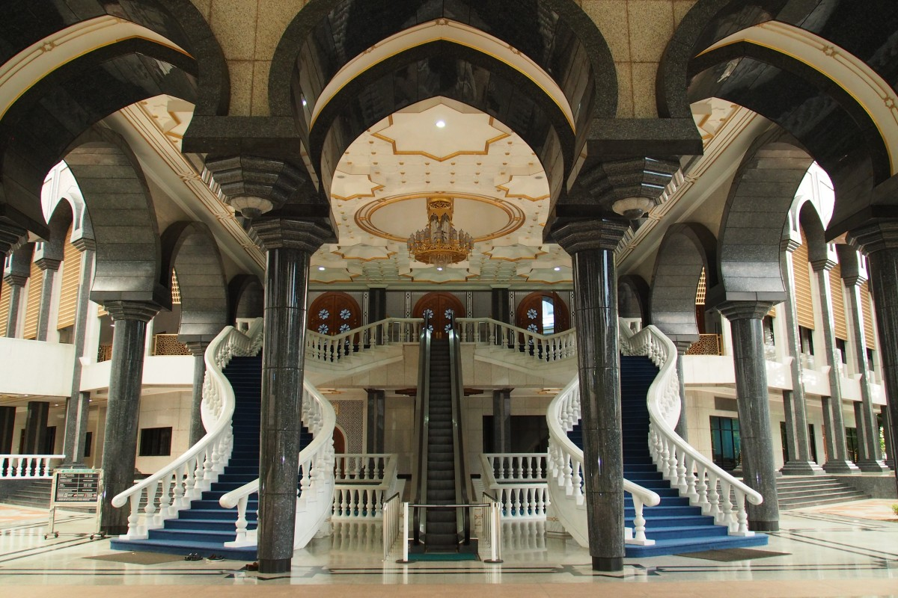
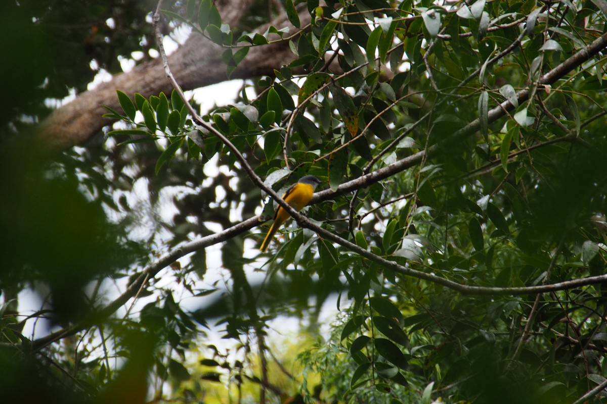
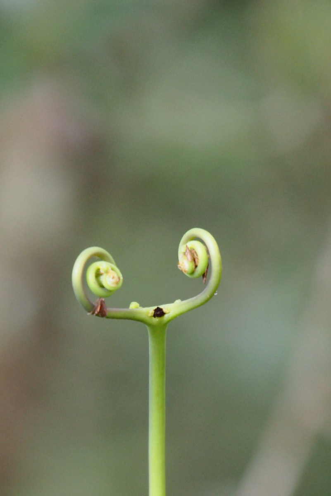

Für unser zehntes Land in zehn Monaten, sozusagen zum Rosenjubiläum unserer Reise, hatten wir uns etwas ganz besonderes vorgenommen: Brunei. Der klitzekleine Ölstaat auf Borneo schafft es den goldenen Prunk aus 1001 Nacht mit der bunten LED-Beleuchtung aus dem Disneyland zu verbinden und zur selben Zeit die Scharia als offizielles Gesetzbuch einzuführen. Nichts anderes würde man in der _Heimat des Friedens_ (so das offizielle Motto Bruneis) erwarten, oder?

Es dauerte gerade mal ein paar Minuten und wir erreichten den malaysischen Grenzposten. Kurz danach wurden die Straßen spürbar sanfter für unsere Popos und wir bekamen unseren Einreisestempel an der bruneiischen Grenze. In der Ferne sahen wir ein paar Öltürme, die mit meterhohen Flammen oben drauf wie Kerzen in der Landschaft standen. Als wir die Hauptstadt Bruneis, Bandar Seri Begawan, erreichten, war es bereits dunkel. Was wir von der Autobahn aus sahen, gab den Ton für den folgenden Tag an. Eine riesige Moschee mit etlichen Aladdin-Türmchen und goldenen Kuppeln zeichnete sich gegen den schwarzen Nachthimmel ab. Okay, hier beginnt also unsere Märchentour. Am nächsten Tag kamen wir zum Sonnenuntergang noch einmal zurück hier her. Da die Besucherzeiten etwas knapp bemessen waren, durften wir uns drinnen leider nicht umschauen, aber von draußen war es eigentlich auch spektakulär genug.

Nun kann man natürlich denken, dass es in einem so kleinen Land wie Brunei ausreichend sei, nur eine Moschee dieser Größenordnung zu bauen. Ist es aber nicht. In der Innenstadt steht auch noch die Omar Ali Saifuddien Moschee. Etwas kleiner ist sie zwar, aber dafür steht sie in der Mitte eines kleinen Sees mit zugehörigem zeremoniellen Schiff und hübschem Spiegelbild. Es wirkte alles zusammen ein bisschen übertrieben, aber auch diese fanden wir hübsch anzusehen.

Brunei wird von einem der reichsten Männer der Welt regiert, dem Sultan Hassanal Bolkiah (oder wie ihn seine Freunde nennen: Sultan Haji Hassanal Bolkiah Mu'izzaddin Waddaulah ibni Al-Marhum Sultan Haji Omar Ali Saifuddien Sa'adul Khairi Waddien Sultan und Yang Di-Pertuan von Brunei Darussalam). Den Reichtum hat Brunei und damit der Sultan einem relativ großem Erdölvorkommen zu verdanken. Aber was für ein Mensch ist der Sultan eigentlich? Diese Frage stellten wir uns ebenfalls und so liefen wir – noch völlig verzaubert von den Moscheen – zum Royal Regalia Museum. Hier werden nicht nur allerlei Geschenke und Andenken, die der Sultan in seinem Leben bekam, zur Schau gestellt, sondern auch über sein Leben insgesamt erzählt.

So lernten wir, dass er schon in seiner Kindheit äußerst strebsam und intelligent war und gegenüber seinen Mitschülern stets aufrichtig und ehrbar auftrat. Er studierte – wenig überraschend – in einer der besten Schulen Englands und wurde dort für seine exzellenten Leistungen sowohl in der Schulbank als auf dem Sportplatz geschätzt. Er machte viele Freunde unter den Studenten und Lehrern. Die Fotos zeigten ihn freundlich lachend in Freizeitkleidung beim Polospielen oder streng und düster in voller Militäruniform. Ein facettenreicher Mann. Eines der Höhepunkte der Regalia ist jedoch die goldene Armprothese, auf welche der Sultan während seiner Krönungszeremonie sein Kinn abstützen konnte. Daneben gab es diverse Staatsgeschenke zu sehen, meist goldene oder reich verzierte Modelle bekannter Sehenswürdigkeiten des jeweiligen Landes (z.B. Angkor Wat von Kambodscha oder die al-Haram-Moschee in Mekka, Saudi-Arabien). Die sparsamen Briten hielten es hingegen bei einem gläsernen Blumentopf in zeitlosem grün. Leider durften wir nur in der Lobby Fotos machen, wo unter anderem der Streitwagen zu sehen ist, in dem der Sultan anlässlich seines silbernen Thronjubiläums durch die Stadt fuhr.

Im normalen Leben dreht natürlich nicht alles um den Sultan oder Moscheen, auch wenn er das sicher gerne hätte. Der Staat hat viel Geld und basiert auf was wir sahen, scheint es den Bruneiern gar nicht so schlecht zu gehen. Die aufgeräumten Straßen und renovierten Häuser erinnerten uns eher an Singapur als Malaysia. Etwas rudimentärer geht es hingegen im sogenannten Wasserdorf zu. Dieser Stadtteil liegt buchstäblich im Fluss. Die Häuser stehen auf Stelzen gute 2-3m oberhalb der Wasseroberfläche und sind mit hölzernen Stegen und ein paar Steinbrücken miteinander verbunden. Es gibt eine Schule, eine Feuerwehr und natürlich eine Moschee. Auf der anderen Seite der Stadt suchten wir später einen Nachtmarkt auf, der uns ein leckeres Abendessen bescherte, während es draußen wie aus Eimern schüttete (die Unwetterwarnung erreichte uns erst später). Doch interessant noch eben eine andere Seite der Märchenstadt zu sehen.

### Die Stempelodyssee

Nach gerade mal zwei von 1001 Nächten (ups, verzählt) hatten wir auch wieder genug Gold gesehen. Wir machten uns per Bus auf die Reise nach Kota Kinabalu in Malaysia. Nun ist das keine gewöhnliche Busreise, soviel wussten wir schon vorab. Brunei besteht nämlich aus zwei Teilen mit ein bisschen Malaysia dazwischen. Das heißt, um aus der Hauptstadt von Brunei nach Kota Kinabalu im malaysischen Staat Sabah zu kommen, muss man zunächst wieder Malaysia einreisen, danach wieder Brunei, dann nochmal Malaysia und, weil das noch nicht genug ist, auch noch über die Grenze zwischen den zwei malaysischen Staaten Sarawak und Sabah (Sarawak hantiert aus uns unbegreiflichen Gründen eine eigene Immigrationsbürokratie). Und jedes Mal gibt es sowohl einen Ausreisestempel in den Reisepass als auch einen Einreisestempel. So füllt man in ein paar Stunden eine komplette Seite seines Passes mit insgesamt acht neuen Stempeln in verschiedenen Farben (immerhin setzen sie die Stempel platzsparend, das muss man ihnen lassen). Insgesamt haben wir jetzt (nach der endgültigen Ausreise aus Malaysia) 13 Stempel von Malaysia und Brunei zusammen. Die Kombination Chile/Argentinien kommt gerade mal auf läppische 12 ;) Beinahe Zeit für einen neuen Ausweis…

Als wir wieder malaysischen Boden erreicht hatten, schien Brunei lediglich eine Fata Morgana gewesen zu sein und wir waren nicht ganz sicher, ob es echt war oder nicht. Malaysia fühlte sich mehr als die „echte Realität“ an. Von Kota Kinabalu aus würden wir eine knappe Woche später nach Myanmar fliegen; das gab uns genug Zeit für Ausflüge und einen Kurztrip in den Osten Borneos. Wir hatten uns ein hübsches kleines Hostel ausgesucht, das zum Entspannen einlud und, nicht unwichtig, zum Kochen! Die strategische Lage direkt neben einem modernen Einkaufszentrum mit einem gut sortierten Supermarkt ermöglichte uns kulinarische Highlights wie Nudeln mit Tomatensoße zu zaubern. Endlich mal keine chinesischen Noodles oder Reis mit Hühnchen! Außerdem hing im Hostel eine gemütliche Atmosphäre mit einer Handvoll netter Backpackern in der Luft. Den Kontakt zu anderen vermissten wir in Borneo häufiger. Mit wenigen Ausnahmen, wie Mulu zum Beispiel, fanden wir kaum Hostels mit anderen Reisenden, wodurch wir die meiste Zeit zu zweit blieben. Nicht, dass wir uns gegenseitig besonders auf den Senkel gingen, aber ab und zu bevorzugen wir doch einen Abend im Gemeinschaftsraum mit ein paar Bierchen und anderen Reisenden zum Quatschen.

### Des einen Glück, des anderen Leid

Als unsere sozialen Bedürfnisse gestillt waren, gingen wir für drei Tage auf „Dschungelsafari“ auf dem Kinabatangan-Fluss im Osten Borneos. Der Dschungel rund um den Fluss ist ein Naturreservat und einer der wenigen übriggebliebenen Lebensräume diverser (vom Aussterben bedrohter) Tierarten. Es gibt Nasenaffen, Orang-Utans, Elefanten, Krokodile und allerlei bunte Vögel. Gerade weil das Gebiet in dem sie überhaupt noch leben können so kompakt geworden ist, sind die meisten Tiere relativ einfach zu finden. Des einen Glück, des anderen Leid…

Wir hatten das Programm ausnahmsweise mal aus den Händen gegeben und eine zwei-Nächte-drei-Tages-Tour gebucht. Auf mehreren Bootsfahrten und Wanderungen steuerten wir mit einem Guide auf der Suche nach Tieren verschiedene Orte in der Umgebung an. Schon aus dem Auto sahen wir den ersten Affen: Ein leicht erregter Schweinsaffe, der uns sein knallrotes Hinterteil entgegenstreckte. Charmant! Gleich nach Ankunft in der Lodge begann die erste Rundfahrt und die sollte es gleich in sich haben. Eine andere Gruppe habe Elefanten gefunden und wir könnten dort hinfahren. Ja, natürlich!

Und tatsächlich. Nach 20 Minuten zunächst über die Hauptader, dann über einen schmalen Seitenarm, sahen wir drei Boote am Ufer geparkt – alle Insassen gespannt Richtung Böschung starrend. Zuerst hörten wir nur Geraschel zwischen den Bäumen, dann tauchte ein großer Schatten zwischen den Stämmen auf. Ein Rüssel zeigte sich, danach ein großer Kopf mit grauen Flappohren. Da steht wirklich ein echter Elefant. Keine 30m vor uns! Die Kamera war schon heiß gelaufen als ein zweiter zwischen den Bäumen hervor kam. Yay, zwei Elefanten!

Und es wurden noch mehr! Als nächstes kam ein Babyelefant, der behaglich auf ein paar Grasbüscheln rumkaute. Mehr und mehr Elefanten, Männchen, Weibchen und Kinder, zeigten sich. Die Herde zog von links nach rechts entlang des Ufers und durch einen kleinen Bach, wo ein paar sich kurz abkühlten. Dann kamen die Trompeten. Ein tief beeindruckendes „Toröööö!“. Eigentlich drang es jetzt erst zu uns durch, wo wir uns befanden und was wir sahen. Die Herde durchquerte letztendlich den Fluss auf dem wir uns befanden. In kleinen Gruppen schwammen sie die 20m zur anderen Seite. Die kleineren Elefanten, die noch nicht schwimmen konnten, hielten sich am Schwanz der Mutter fest. Dann verschwanden sie wieder im Dickicht und ließen uns glücklich zurück.

Zu verschiedenen Zeiten machten weitere Fahrten in andere Teile des Flussgebiets. Früh morgens vor dem Frühstück gingen wir auf die Suche nach Orang-Utans (die wir leider nicht fanden), Nasenaffen (etliche), [silberne Haubenlanguren](https://de.wikipedia.org/wiki/Silberner_Haubenlangur) (ein paar) und Makaken (eine große Familie mit scheinbar frisch geschlüpften Babies, die das Klettern noch üben mussten und ab uns zu ins Wasser fielen). Nachmittags probierten wir Hornbills (auch Nashornvögel genannt) zu finden. Das sind meist bunte Vögel mit charakteristischen Doppelschnäbeln. Und auch bei diesen waren wir besonders erfolgreich. Wir sahen verschiedene Sorten, von schwarz-weißen bis rot-gelben. Wunderbare Tiere.

##### Affen und so:

##### Nashornvögel:

Nachts hielten wir vor allem nach Krokodilen (ein Baby-Krokodil von 30cm) und schlafenden Vögeln Ausschau. Ja, auch Vögel schlafen (darüber hatten wir eigentlich noch nie so wirklich nachgedacht) und dazu suchen sich einen Zweig nah am Wasser – außer Reichweite von Katzen (=Leoparden) – und rollen sie sich zu kleinen Federbällen zusammen. Ein anderes Tier, das sich einrollen kann, ist die Python. Unser Kapitän hörte ein paar Affen hoch oben im Baum kreischen: Ein Alarmsignal. Nach kurzer Suche fand seine Taschenlampe die dicke Schlange in einer Astgabel. Ob es ihr gelang ein Äffchen zum Abendessen zu schnappen, wissen wir allerdings nicht.

\[caption id="attachment\_3609" align="aligncenter" width="900"\] Sonnenuntergang auf dem Kinabatangan-Fluss\[/caption\]

Damit endete die, in unseren Augen, gelungene Safari. Zugleich mussten wir uns vom Borneoschen Regenwald verabschieden. In Kota Kinabalu war gerade noch genug Zeit für einen Tag lang tauchen. Während Malte einen Relax-Tag einlegte und sich von seiner Erkältung erholte, sprang Freke vor der Küste ins Meer. Das sonderbarste, das sie zu Gesicht bekam, war die große Menge Plastikmüll im Wasser. Die ersten beiden Tauchgänge fanden in einem von einer Insel abgeschirmten Gebiet ohne Plastik statt, der dritte hingegen mitten in der Plastiksuppe. Es war, linde gesagt, gewöhnungsbedürftig an der Wasseroberfläche zu schwimmen während kaputte Sandalen an einem vorbei treiben…

Und dann war die Zeit für Myanmar gekommen, dem letzten großen Ziel unserer Reise. Jedenfalls, sofern wir die Fluggesellschaft davon überzeugen können uns auch wirklich dort hin zu bringen… Aber davon später mehr.

\[caption id="attachment\_3611" align="aligncenter" width="300"\] Let's go to Myanmar!\[/caption\]
