Schmatz, Schmatz. Wir schauten uns verwundert um als wir in einer Seitenstraße in Yangon auf einmal Handküsse zugeworfen bekamen. Das dachten wir jedenfalls. Aber der burmesische Mann machte lediglich Kussgeräusche mit seinem Mund, und auch nicht zu uns, sondern zur Kellnerin. Das schmatzende Geräusch eines Kusses – das entdeckten wir schnell – ist hier eine ziemlich normale Art und Weise, um die Aufmerksamkeit von Kellnern oder anderem Servicepersonal zu erlangen. Küsschen aus Myanmar!

Eigentlich reicht es vollkommen aus in Myanmar einfach nur durch die Straßen zu laufen und los zu lassen. Winkende Schulkinder in grünen Röcken, bettelnde Mönche in dunkelroten Gewändern, lächelnde Marktfrauen in farbenfrohen Longyis – allesamt versüßen sie einem den Tag. Über dieses Land gibt es so viel zu erzählen, dass wir den Blog aufteilen mussten. Und trotzdem ist dieser Teil noch ziemlich lang geworden. Aber es lohnt sich. Versprochen!

In der Nähe von Mawlamyine, im Süden des Landes, standen wir in einem Tempel vor einem Stapel goldener Felsen. Der Stapel sieht aus als würde er jede Sekunde umfallen, ungefähr wie in der letzten Jenga-Runde kurz bevor der Turm mit viel Lärm zusammenstürzt. Den Goldstapel wird dieses Schicksal jedoch nicht ereilen, denn er wird von einem Haar Buddhas festgehalten. Für die Besichtigung selbst brauchten wir also nicht so wahnsinnig viel Zeit und darum schlossen wir uns bei einer Gruppe Burmesen zum Mittagessen an, die uns wild gestikulierend dazu einlud. In Myanmar schlägt man eine Einladung sowieso nicht einfach so ab. Niemand sprach Englisch, aber es wurde viel gelacht, verlegen gestarrt und jede Menge Selfies geschossen. Ein Guide, der mit einem japanischen Touristen unterwegs und dem Englischen mächtig war, erklärte uns, dass die Gruppe zum Tempel gekommen war, um den Mönchen Essen zu bringen. Ein Tagesausflug. Als erstes durften die Mönche essen, dann die spendable Familie selbst und alles was übrig blieb wurde von Herzen mit den zufällig Anwesenden geteilt – am liebsten mit Ausländern, so schien es.

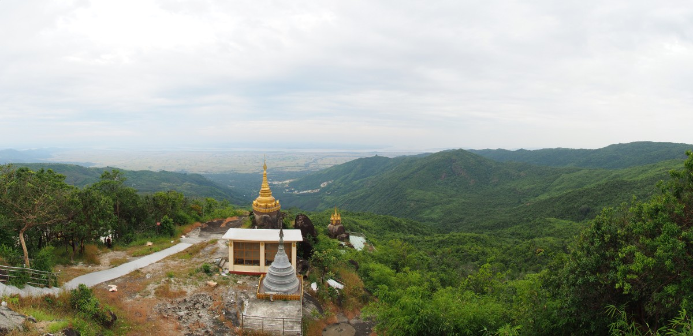

Nach dem Essen bekamen die Mönche noch einen Umschlag mit Geldspenden ausgehändigt und dann war endlich die Zeit für Fotos gekommen. Mehr und mehr Mönche und Familienmitglieder kamen zu uns, um in wechselnden Zusammenstellungen, verschiedenen Posen und unterschiedlichen Hintergründen Erinnerungsfotos zu schießen. Die Fremden, also wir, wurden stets prominent in die Mitte platziert, die Mönche in ihren rot-orangen Gewändern dahinter. In wie vielen Wohnzimmern wir so wohl landen werden… Das ist also das wunderbare Myanmar, von dem jeder erzählt.

\[caption id="attachment\_3672" align="aligncenter" width="900"\] Portrait\[/caption\]

### Bunte Magie

Myanmar ist ein bezauberndes Land, in dem alle immer lächeln, selbst wenn ihnen durch das ständige Kauen auf Betelnuss-Päckchen die meisten Zähne schon ausgefallen sind. Außerdem schmiert sich so ziemlich jeder – jung und alt, Frau und Mann – Thanaka ins Gesicht. Das ist eine beige Matschpaste, die aus Baumrinde gemacht wird und multifunktional als Make-Up, Sonnencreme, Mückenabwehr und Bleichmacher dient. Die Kleidung ist ebenfalls traditionell. Sowohl Frauen als auch Männer tragen Longyis, eine Art langer Faltrock, wobei die der Frauen meist etwas bunter sind.

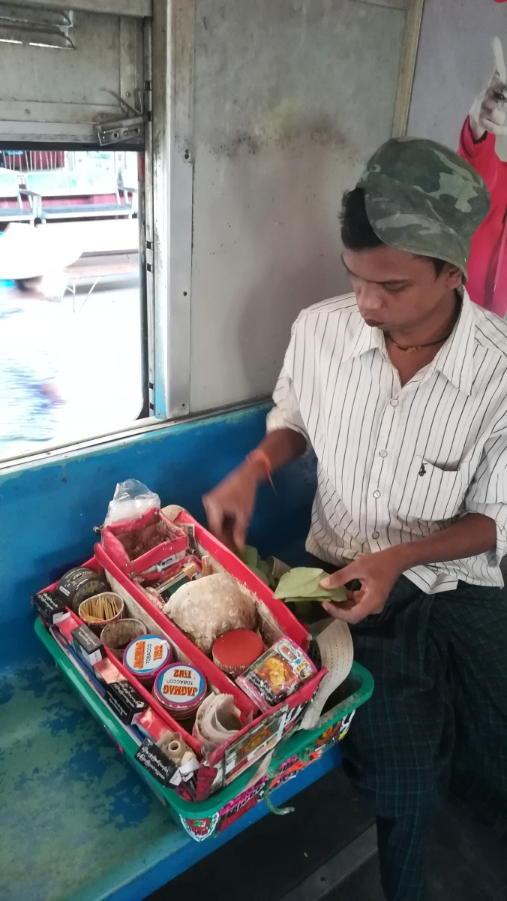

Aber die auffälligsten Erscheinungen im Straßenbild sind und bleiben die Mönche. Ihre rot-orangen Gewänder, die stilvoll über eine der zwei Schultern geschlagen werden, springen einem überall sofort ins Auge. Wenn die Sonne scheint, zücken sie ihre Schirme (man stelle sich diese Cocktailschirmchen im Großformat vor). Morgens laufen sie der Größe nach geordnet (ja, auch die kleinen 7-jährigen Mönchlein) durch die Straßen, um ihre Mahlzeiten zu „erbetteln“. Das klingt jetzt nicht so glamourös, aber in Myanmar sind Mönche sehr respektierte Menschen. Der buddhistische Glaube ist tief verwurzelt und wer den Mönchen hilft, bekommt dafür an einer anderen Stelle im Leben viel zurück. Und so füllen sich die großen, silbernen Spendentöpfe unter den Mönchsarmen in Nullkommanix mit Reis, Bananen und Süßigkeiten.

Übrigens gibt es auch weibliche Mönche. Die sind ebenso kahl rasiert wie die Männer und wären dadurch auf den ersten Blick schwierig zu unterscheiden, wären ihre Gewänder nicht aus rosa statt rotem Stoff gemacht. Die Mönchinnen gehen auf der Suche nach Spenden ebenfalls von Tür zu Tür, allerdings bekommen sie keine gekochten Dinge, sondern traditionell nur rohe Lebensmittel und Geld. Kochen müssen sie also noch selbst.

Entgegen unseres Vorurteils, besteht das Mönchleben nicht nur aus betteln und meditieren. Sie spielen wie alle anderen mit ihren Handys, scrollen durch Facebook und schießen Selfies mit hübschen Landschaften oder Tempeln. Sie reisen auch relativ viel und normalerweise mit den Öffentlichen. Wer in Myanmar mal probiert online ein Busticket zu buchen, kann bei „Passagier“ nicht nur zwischen Mann oder Frau wählen, sondern auch die Kategorie „Mönch“.

### Isolation

Myanmar war lange von der Außenwelt isoliert. Erst 2011 öffnete die damalige Militärregierung die Türen einen kleinen Spalt weit. Seit 2015 gibt es eine mehr oder weniger demokratische Regierung. Seitdem nimmt die Zahl der Touristen stetig zu, aber Massen-Tourismus wie in Thailand, Laos oder Kambodscha herrscht noch lange nicht.

Es war also nicht gerade verwunderlich, dass wir während der Fahrt mit unserem Motorroller durch die Reisfelder rundum Hpa-An (was – kein Witz – übersetzt „Froschkotze“ heißt) von allen Seiten wie Promis zugewunken wurden. Die Schulglocke hatte wohl gerade geklingelt und vom Schulgelände strömten unzählige Schüler in weißen Hemden und grünen Longyis. Dort sattelten sie ihre klapprigen Fahrräder oder stiegen auf die Ladefläche einer der wartenden Lieferwagen. Wenn sie uns sahen, riefen sie „Mingalabar!“ oder „Hello!“, für diejenigen, die ihr Englisch verbessern wollten. Im Hintergrund die untergehende Sonne, die die Felder in goldenes Licht hüllte: Beinahe kitschig und doch wundervoll.

\[caption id="attachment\_3704" align="aligncenter" width="900"\] Hpa-An\[/caption\]

Apropos Englisch. Sprachlich gab es zuweilen noch Probleme. Menschen, die häufiger mal mit Touristen in Kontakt kommen oder in einer entsprechenden Branche arbeiten, kriegen das nötigste schon kommuniziert. Aber wenn das Gespräch eine unerwartete Wendung nahm oder wir etwas mehr wissen wollten, erreichten wir schnell die Grenzen des Machbaren. Manchmal reichte das Betreten eines Ladens schon aus, die Angestellten in Verlegenheit zu bringen. Die junge Frau in einer Apotheke in Mandalay sah Freke reinkommen und schaute auf eine schüchterne Art und Weise, wie es nur die Burmesen können, um sich hin. Am Ende fand sie eine Kollegin, die diese schwierige Kundin übernehmen konnte. Ähnlich ging es in Pyin Oo Lwin zu, einem kühlen Zufluchtsort für die reiche Elite (früher die britischen Kolonisten, heutzutage die Familien der Generäle) in den Bergen nördlich von Mandalay. In einem kleinen lokalen Restaurant ohne Speisekarte konnten wir die Panik in die Augen der Kellnerin steigen sehen als wir uns setzten. Langsamen Schrittes näherte sie sich unserem Tisch, blieb kurz vor dem Ziel aber stehen und drehte sich dann erleichtert zu den einzigen anderen Gästen zu, um dort ein paar Teller zu verschieben.

In aller Regel kommt man aber natürlich auch mit Händen und Füßen zum Ziel. Manchmal kann man sogar ganze Gespräche führen, wie wir in einem Kloster in Mandalay feststellten. Nachdem wir die detaillierte Holzschnitzarbeit an einem Tempel bewundert hatten und wir unsere Schuhe wieder anziehen wollten, winkte uns eine alte Dame aus einer Türöffnung zu. Schaut doch auch hier mal rein, schien sie sagen zu wollen und wir gehorchten. Sie zeigte auf unsere Wasserflaschen und den Wasserspender neben der Tür, oder auch: Füllt eure Flaschen auf (solche Tanks stehen übrigens vor jeder zweiten Tür, weil es gut fürs Karma ist Vorbeigängern zu trinken anzubieten). Und als Malte sich hinterher am Fuß der Treppe seine Schuhe wieder anzog, zeigte sie lachend auf eine Bank beim Eingang: Du hättest auch ruhig hier sitzen können. Naja, so oder so ähnlich kann man sich bestens verständigen. Im Gegenzug zeigten wir erst auf unsere Kamera und dann auf die Frau: Ob wir ein Foto machen dürften? Ja, natürlich. Die meisten Menschen in Myanmar willigten bereitwillig ein für ein Foto zu posieren und waren auch immer gespannt auf das Resultat.

### Selfies

Wahrscheinlich sind wir auf einer ganzen Reihe Facebook-Timelines erschienen. Die Chancen sind jedenfalls groß durch all die Selfies, die junge Burmesen mit uns gemacht haben. Wir waren in erster Instanz überrascht so viele Smartphones zu sehen. Immerhin kamen wir auch durch etliche Dörfer ohne Strom und fließend Wasser. Aber genauer darüber nachgedacht ist es logisch, denn Myanmar hat – wie viele andere Dritte-Welt-Länder – die Nokia 3310-Ära natürlich übersprungen und ist direkt mit Smartphones und Facebook in die moderne Kommunikation eingestiegen. Facebook ist entsprechend populär und alles wird online dokumentiert – mit Vorliebe große, blonde Ausländer. Als Gegenleistung fragten wir meistens, wie in Malaysia auch schon, ebenfalls um ein Selfie mit ihnen. Nur in Nay Pyi Taw klappte das nicht. Dort wurde Malte von einer großen Gruppe Schulkinder so belagert, dass er es nicht schaffte sein Handy zu zücken.

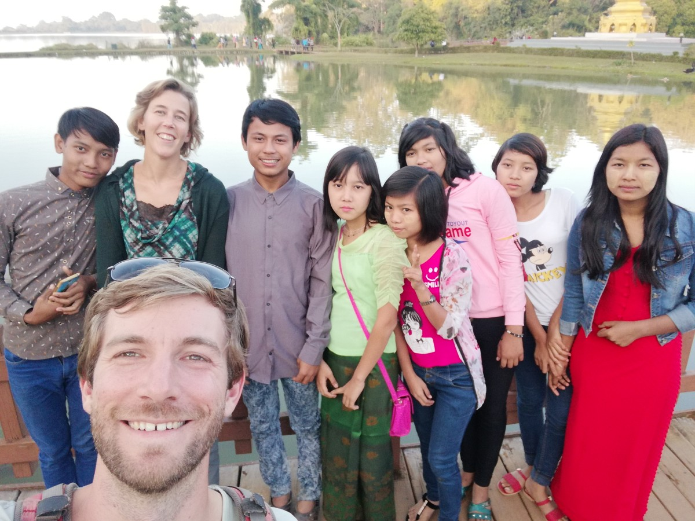

Ungeachtet dieser augenscheinlichen Modernität fällt in Yangon gefühlt alle halbe Stunde der Strom aus. Wer es sich leisten kann, hat einen Notstromgenerator vor der Tür stehen, der mit lautem Gepolter anspringt und das Licht wieder erleuchten lässt. In vielen abgelegeneren Regionen hat die Regierung überhaupt noch nicht für Strom gesorgt. Dort behilft man sich, wenn es geht, mit einer kleinen Sonnenzelle im Garten – umweltfreundlich, aber gerade mal genug für etwas Licht am Abend. Darüber hinaus hat ein Großteil der Bevölkerung keinen Zugang zu sauberem Trinkwasser (außer aus abgefüllten Plastikflaschen, aber vom Müllproblem berichten wir ein andern Mal).

Das schwerste Leben findet man in Myanmar in den ländlichen Gegenden, welche wir zuweilen mit dem Bus durchquerten. In Zentralmyanmar sahen wir wie Hirten ihre Ziegen entlang der Autobahn grasen ließen, Kühe auf der Suche nach ein paar spärlichen Grasbüscheln zwischen alten Tempeln, und Bauarbeiter (Frauen und Männer), die ohne jegliche Schutzkleidung neue Straßen anlegen. Letzteres geht ungefähr so: Die Frauen kriegen einen Korb voll Steine, welche sie möglichst gleichmäßig über den Weg verteilen. Das wird dann mit Harken „perfektioniert“, woraufhin zwei starke Männer ein Fass Teer darüber gießen, das sie zuvor über einem Holzfeuer am Straßenrand flüssig gemacht haben. Wie viele Meter sie am Tag auf diese Art und Weise schaffen, wollen wir uns gar nicht ausmalen.

\[caption id="attachment\_3719" align="aligncenter" width="900"\]Bauarbeiten\[/caption\]

### Yangon

Nagut, wir kehren kurz zurück zum Anfang. Unsere Reise durch das Land begann in Yangon. Yangon war lange Zeit die Hauptstadt, aber in 2006 enthüllte die Militärregierung von einem Tag auf den anderen eine komplett neue Hauptstadt, Nay Pyi Taw (hierüber später mehr). In Yangons Architektur ist das frühere britische Imperium einfach zu erkennen. Viele koloniale Gebäude sind allerdings lange verwahrlost worden und der Dschungel scheint sie langsam wieder zu übernehmen, aber mit dem Aufschwung der letzten Jahre haben auch viele Restaurationen begonnen. Das sorgt in vielen Straßen für ein kontrastreiches Bild zwischen alt und neu.

\[caption id="attachment\_3715" align="aligncenter" width="900"\]Altes und Neues\[/caption\]

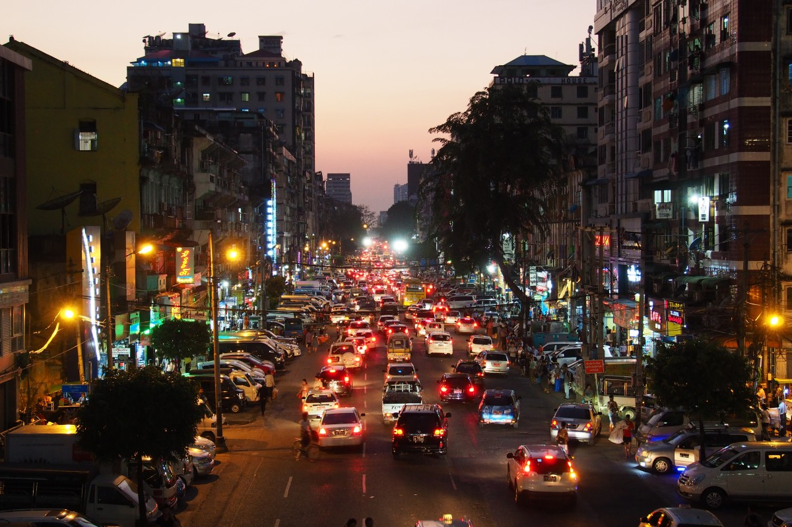

Eine schöne Möglichkeit eine andere Seite Yangons zu sehen ist mit der Ringbahn einmal die Stadt zu umrunden. Das klapprige Züglein mit offenen Türen und Fenstern sowie harten Bänken fährt mit guten 20 km/h eine laaange Runde vom Zentrum in die Außenbezirke und entlang der Reisfelder wieder zurück. Bahnschranken bestehen aus Absperrgittern, die manuell hin und her geschoben werden. Etwa auf halber Strecke kamen wir an einem Markt vorbei, wo die Verkäufer ihre Ware schnellstmöglich durchs Fenster werfen, wo sie von einer zweiten Person aufgefangen und verkauft werden. Zwischendurch laufen Männer mit kleinen mobilen Küchen auf der Schulter durch die Wagons, um vor Ort eine Portion Noodles für einen zuzubereiten. Von wegen überteuerter Speisewagen, in Myanmar kommt das Essen zu einem hin. Wir machten jedenfalls große Augen. Ungefähr so wie die burmesischen Passagiere (über uns).

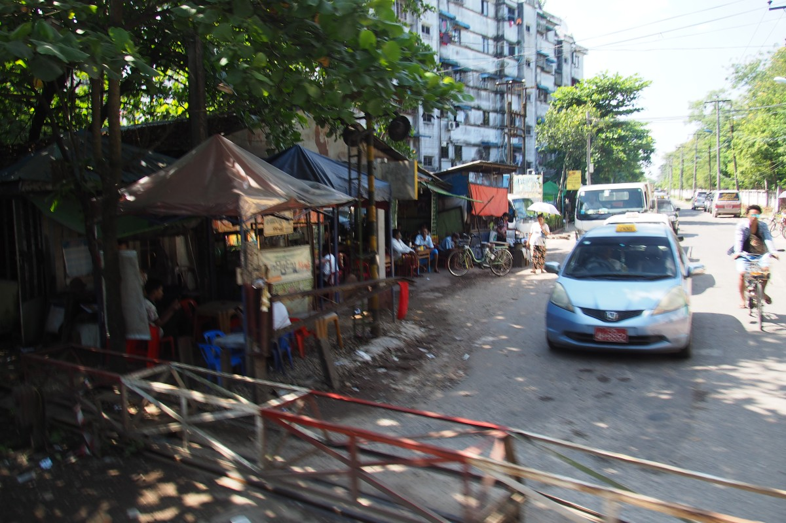

Myanmar ist eines der buddhistischsten Länder der Erde (wenn man das so sagen kann). Es gibt so viele Pagoden, Stupas und Tempel, dass man egal wo man ist, mindestens eine im Blickfeld hat. Eine der bedeutendsten Pagoden ist die Shwedagon-Pagode in Yangon. Dieses Exemplar ist nicht nur ausgesprochen groß, komplett golden und momentan von Gerüsten umgeben, es wird vor allem zum Sonnenuntergang auch besonders gut besucht. Zur „blauen Stunde“ setzt sich das goldene Stufendach schön vom dunkelblauen Himmel ab und die Burmesen, die nach der Arbeit zum Beten und Kerzen Anstecken vorbei kommen, sorgen für eine spezielle Atmosphäre. Als wir dort waren, war offensichtlich gerade Reinigungstag. Etliche schick angezogene Frauen und Männer wurden nebeneinander gestellt, mit einem Besen ausgestattet und dann zogen sie kehrend einige Runden durch den Tempel. Das ist scheinbar eine der vielen Arten Tribut an Buddha, den Tempel und seine Mönche zu zollen. Geben und Nehmen.

\[caption id="attachment\_3737" align="aligncenter" width="900"\] Shwedagon Pagoda, Yangon\[/caption\]

Wir bekamen im Übrigen relativ schnell die Vermutung, dass Myanmar Großabnehmer von LED-Weihnachtsbeleuchtung sein muss. Man findet sie vor allem bei Buddhastatuen, wo sie mit viel Geblinke und Farbeffekten eine Art Heiligenschein imitieren, aber auch kleinere Pagoden und Häuser werden großzügig mit bunten Lichterketten verziert.

\[caption id="attachment\_3767" align="aligncenter" width="281"\] Clock Tower Hpa-An\[/caption\]

### Kalksteinstreusel

Das oben schon mal erwähnte Städtchen _Froschkotze_ (Hpa-An) war unser nächstes Ziel. Das ist hübsch gelegen in einem Gebiet mit vielen Kalksteinbergen, die wie Streusel aus den endlos scheinenden Reisfeldern ragen. Nicht unerwartet findet man auf jedem dieser Berge mindestens eine Pagode. Okay, hier geht es also um die Landschaft und darum mieteten wir uns einen Motorroller und wagten uns zum ersten Mal in den burmesischen Straßenverkehr.

\[caption id="attachment\_3705" align="aligncenter" width="409"\] Huuuup\[/caption\]

Das ging überraschenderweise ziemlich gut. Im Vergleich zu einigen südamerikanischen Ländern geht es in Myanmar recht gesittet zu. Man fährt rechts, im Allgemeinen nicht zu schnell und kurz bevor man überholt wird kurz, aber freundlich gehupt. Außerdem fielen wir als Ausländer sofort auf, wodurch wir meistens etwas mehr Platz und Vorfahrt bekamen. Die Kombination Frau am Steuer mit Mann hinten drauf, fanden die Burmesen allerdings ein bisschen eigenartig. Wir ernteten viele überraschte und ungläubig lachende Blicke.

Mit unserem Zweirad fuhren wir an Pagoden, Höhlen mit alten und neuen Buddhastatuen, und Reisfeldern, die mit Ochsen umgegraben wurden, vorbei. Wir wohnten prachtvollen Sonnenuntergängen bei (und ja, der Himmel färbt sich wirklich so violett/rosa wie auf den Fotos zu sehen ist) und kletterten in der Morgenhitze auf den höchsten Berg in der Umgebung, von wo aus wir einen schönen, aber etwas diesigen Ausblick genießen konnten.

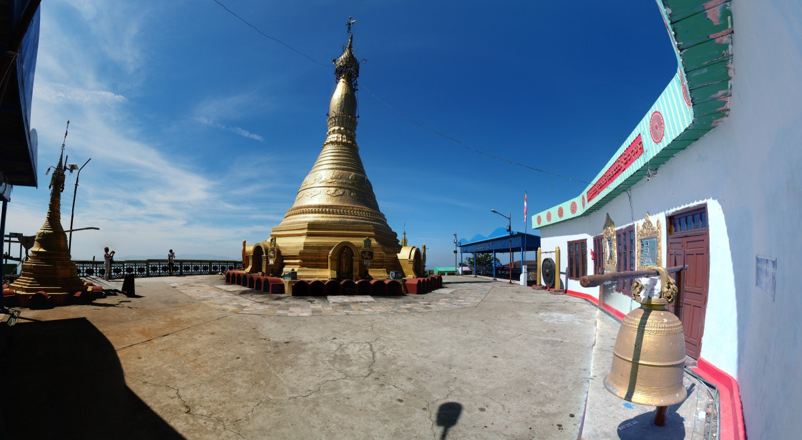

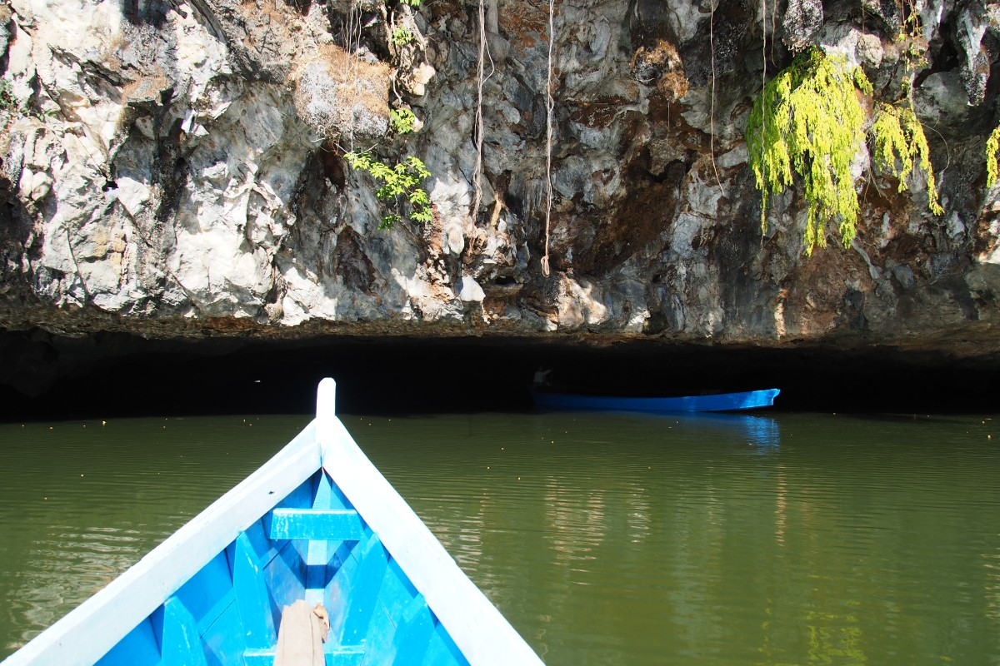

\[caption id="attachment\_3779" align="aligncenter" width="900"\][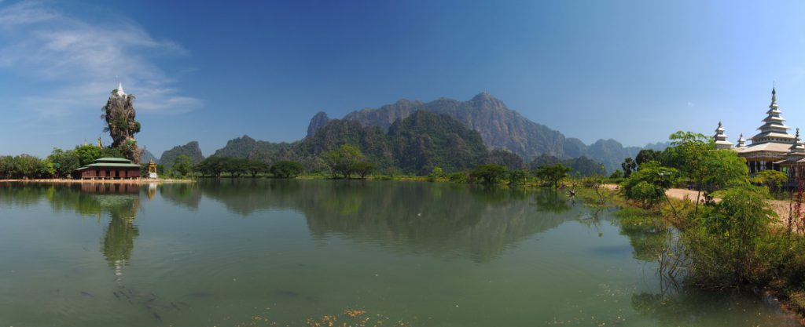](https://collectingbaggage.nl/wp-content/uploads/2018/12/PB051839-PB051843.jpg) Kyauk Kalat, Hpa-An\[/caption\]

Der Straßenverkehr war zwar ganz gut zu bewältigen, die Infrastruktur hingegen ließ hin und wieder zu Wünschen übrig. Die beiden Brücken zwischen Hpa-An und Mawlamyine verdienen einen Ehrenplatz. Bevor wir die langen, wackeligen Brücken mit unserem Bus überquerten, musste ein Teil der Passagiere aussteigen und in einem Pickup-Truck Platz nehmen. Wir leiteten davon ab (wir konnten leider niemanden auf Englisch fragen), dass der Bus mit allen Passagieren an Bord zu schwer gewesen wäre. Die Höchstgeschwindigkeit auf der Brücke war 16 km/h (ja, exakt 16) und alle hielten sich dran. Verdächtig! Nagut, zum Glück stellten die anderen Brücken in Myanmar weniger prekäre Situationen dar.

Und so kamen wir also zwei Stunden später sicher in Mawlamyine an, die Stadt mit den anfangs genannten goldenen Steinen. Hier vor der Küste liegt eine Insel, die vor allem von traditionellem Handwerk lebt. Man fertigt alles mögliche an, von Gummibändern aus Naturkautschuk, Schiefertafeln, Hüten aus Bambusblättern bis hin zu Fußabtretern aus Kokosbaumrinde. Und all das kommt aus klitzekleinen Werkstätten versteckt in Hinterhöfen und wird mit Maschinen aus dem Industriezeitalter verarbeitet. Der Webstuhl, an dem eine schlanke Dame mit gelbem Thanaka-Gesicht, gerade einen Longyi zusammenstrickte, erinnerte uns an die „Spinning Jenny“ aus dem 18. Jahrhundert, die die industrielle Revolution einläutete. Solche Dinge würde man bei uns im Deutschen Museum finden; in Myanmar ist es noch ein normaler Bestandteil der Textilindustrie.

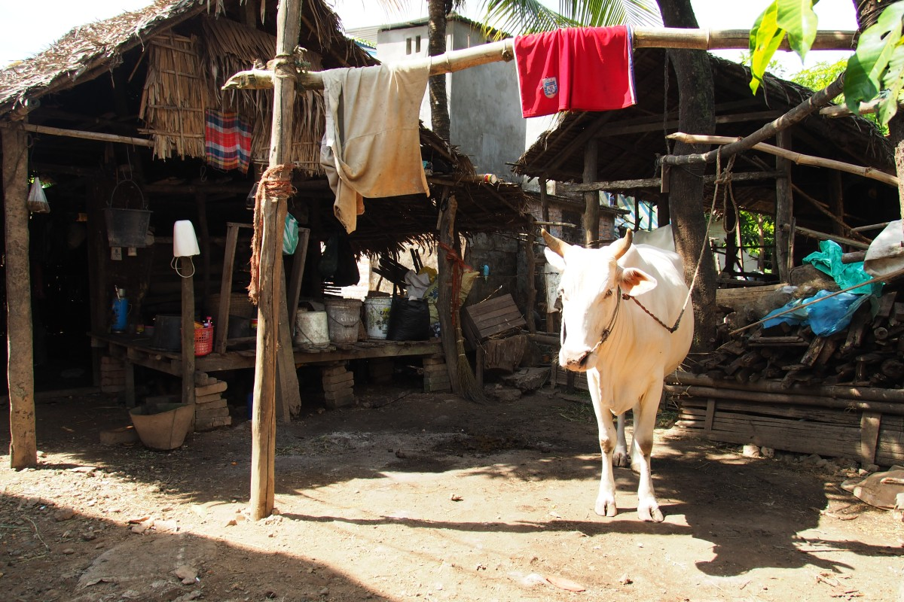

Wir staunten über zwei Frauen, die im hohen Tempo bunte Gummischläuche durch eine Schnittmaschine drückten, die von einem alten Treckermotor angetrieben wurde. Im monotonen, dumpfen Takt fielen die dünnen Gummibänder aus der Maschine. Acht Stunden pro Tag. Weil die Bänder noch aneinander kleben, werden sie von zwei andere Frauen auf dem Boden voneinander getrennt. Der Tageslohn? Etwa 5000 kyat (2,50€). Kein Wunder, dass viele Ehemänner in Thailand arbeiten und die Familie aus dem Ausland ernähren.

### Einsame Trillerpfeifen

Wo kein einziger Burmese freiwillig wohnen will, ist die Hauptstadt. Das ist also nicht mehr Yangon mit seinen 7,5 Millionen Einwohnern, sondern Nay Pyi Taw. Die Militärregierung enthüllte 2005 den geheimen Bau der Stadt und gab seinen Beamten zwei Monate Zeit umzuziehen. Man hat sich nicht lumpen lassen: 20-spurige Autobahnen durchkreuzen die Stadt und verbinden den Hotelstadtteil mit dem Parlamentsgebäude und dem Villenviertel der Funktionäre. Die Bürgersteige werden sorgfältig vom Unkraut befreit, es ist weit und breit kein Plastikmüll zu finden und der Asphalt gehört zu einem der glattesten in ganz Myanmar. Aber leider ist hier niemand…

\[caption id="attachment\_3827" align="aligncenter" width="900"\] Wo sind alle?\[/caption\]

Inzwischen haben wir ja schon ziemlich viel von der Welt gesehen, aber das hier übertraf einiges. Wir mieteten uns wieder ein kleines Motorrad, um die skurrile Geisterstadt zu besichtigen. Wir fuhren über die verlassene 20-spurige Autobahn (die wir erst gar nicht finden konnten, weil die Stadt so enorm groß ist) zum Parlamentsgebäude, wo wir sofort von Sicherheitsbeamten mit Trillerpfeifen wieder weggeschickt wurden. Das Gebäude selbst liegt auf der anderen Seite einer ebenso überdimensionierten Brücke, die hinter einem großen Tor anfängt und offensichtlich nicht gerne fotografiert wird. Jedenfalls, wenn man den Trillerpfeifen Glauben schenken möchte. Irgendwie fanden wir das sinnbildlich für den Status der Demokratie im Land.

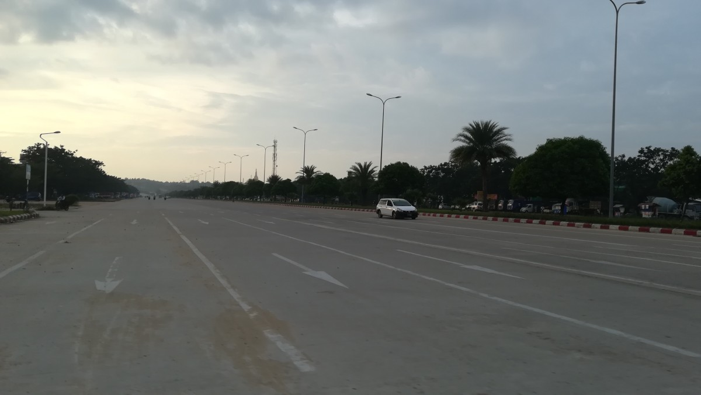

Nay Pyi Taw ist so aberwitzig groß angelegt, dass man beispielsweise mit dem Motorrad durch das Verteidigungsmuseum fahren muss, um alles anzuschauen. Gleich „daneben“ gibt es einen gigantischen Park in der Form von Myanmar mit allen wichtigen Sehenswürdigkeiten des Landes im Kleinformat. Das ist also eine Art Propaganda-Legoland. Das verrückteste ist, dass das echte Myanmar einfach um die Ecke liegt. Dort wo die seelenlosen Autobahnen aufhören, findet man die schlechten Straßen voller Menschen, Trubel, Imbissbuden und Geschäften, die wir inzwischen so gewöhnt waren.

\[caption id="attachment\_3822" align="aligncenter" width="900"\] Museum\[/caption\]

Nach einem Tag hatten wir auch schon genug gesehen und wir wollten schnell wieder weg. In eine lebendigere Ecke des Landes: Kalaw. Dafür mussten wir uns selbst auf die Suche nach einem Busticket machen. Und das in einem Land, in dem kaum Englisch gesprochen wird und man nicht mal die Schrift lesen kann. Die burmesische Schrift besteht nämlich aus einer Aneinanderreihung von Kreisen mit kleinen Ösen und Haken. Sie erinnert an einen Sehtest, bei dem man sagen muss, ob der Kreis links, recht, oben oder unten eine kleine Lücke hat. Das ist also nicht zu entziffern, geschweige denn zu lesen, wo ein bestimmter Bus hinfährt. Es blieb uns also nicht viel mehr übrig als unseren Zielort zu rufen, woraufhin uns irgendjemand nach links oder recht schickte („da lang“), ohne dass wir dann genau wussten, an welchem der 50 Schalter in dieser Richtung wir fragen mussten. Als wir dann endlich den richtigen Schalter gefunden hatten, war der Bus entweder schon voll oder fuhr erst am nächsten Tag. Das ganze wiederholte sich ein paar Mal (nicht ohne ständig wieder zurück geschickt zu werden, wo wir herkamen und schon gefragt hatten) bis wir endlich bei der letzten Möglichkeit einen Platz ergattern konnten. Puh…

### Durch die Provinz

Nach einem langen Ritt mit ein paar reisekranken Damen in der Reihe hinter uns und einem speziellen Toilettenbesuch stiegen wir von frischer Bergluft umgeben aus. Kalaw liegt nämlich auf rund 1000m Höhe. Nachts wurde es sogar ein klein bisschen kalt. Die meisten Touristen starten von hieraus die populäre Drei-Tages-Wanderung zum Inle-See. Der See selbst ist einer der beliebtesten touristischen Ziele Myanmars. Auch uns schien es eine schöne Idee zu sein, entlang „authentischer“ Dörfer zu wandern, wo Männer und Frauen noch ihre uralten Traditionen pflegen und Chili, Aubergine und Reis anbauen.

Wir verließen Kalaw morgens in Richtung runder Hügel. Hin und wieder gaben die dicken Tannenbäume den Blick aufs Tal frei. Wir konnten einen Flickenteppich von Landbaufeldern in verschiedenen Farben erkennen. Den Weg teilten wir uns mit Bäuerinnen, die für diese Region gebräuchliche Strohhüte trugen und ihre Wasserbüffel von einem Ort zum nächsten trieben. Unsere Gruppe bestand aus zehn Leuten und einem Guide: Fünf Franzosen, drei Spanier und wir. Wir merkten schnell, dass die gemeinsame Sprache nicht Englisch sein würde, sondern Spanisch. So konnten wir unser Spanisch mal wieder ein bisschen üben.

Der Weg führte durch kleine Dörfer, dessen Bewohner eigene Bevölkerungsgruppen bilden. Sie sprechen eine eigene Sprache und können manchmal nicht einmal die Bewohner des Nachbardorfes verstehen. Myanmar besteht dann halt auch aus mehr als 135 verschiedenen ethnischen Gruppen (die Rohingya zählen nicht dazu). Wir liefen querfeldein über Salatacker und durch gelbe Rapsblüten. Nach der Mittagspause kamen wir an einer kleinen Schule vorbei. Etwa zwanzig Schüler und zwei Lehrer waren gerade dabei, ein Musikstück mit traditionellem Tanz aufzuführen. Man feierte die Eröffnung eines neuen Klassenzimmers, dass netterweise durch die Rural Development Society aus der Schweiz gespendet wurde.

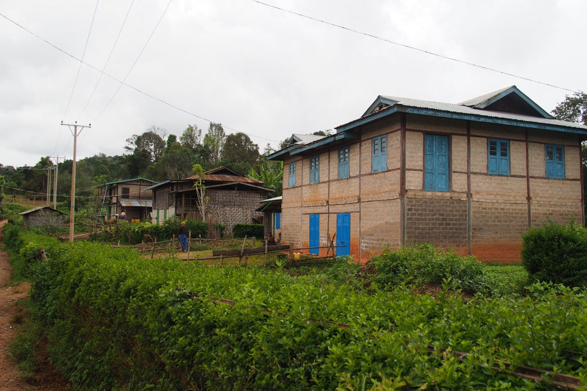

Die erste Nacht verbrachten wir zu Hause bei einer Familie. Unsere dünnen Schlafmatten mit dicken Hello-Kitty-Wolldecken waren in einem großen Zimmer ausgebreitet; im Raum daneben schlief die Familie. Die Küche war in einem separaten Haus untergebracht, wo man herrliche Currys und Salate für uns auf den Tisch zauberte. Als Dusche musste ein großes Betonfass draußen herhalten, aus der man sich mittels einer Kelle Wasser über den Leib gießen konnte. Als Sichtschutz hatte man ein langes Segel gespannt; allerdings leider auf burmesische Höhe, nicht auf holländische, das war also nur mäßig sinnvoll.

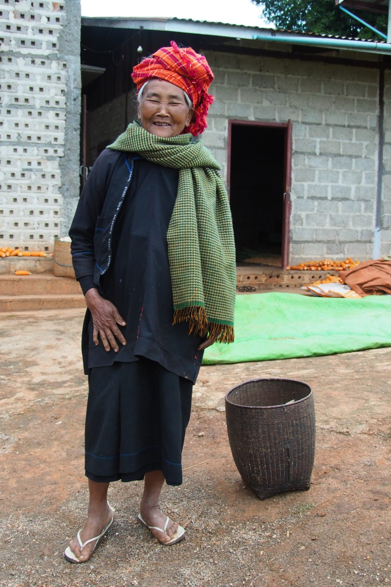

Am nächsten Morgen wurden wir durch das halbe Dorf verabschiedet und liefen dann den Berg wieder hinunter. Das vor uns liegende Tal war noch zur Hälfte im mysteriösen Morgennebel verschwunden. Dieser wurde jedoch in kürzester Zeit durch die gleißende Sonne aufgelöst, wodurch die Landschaft anschließend ein bisschen an die Toskana erinnerte. Lediglich die Menschen des Pah-O-Stammes mit ihren orangen Turbanen verrieten, wo wir uns wirklich befanden.

\[caption id="attachment\_3873" align="aligncenter" width="900"\] Siedler von Catan\[/caption\]

Auch heute erwartete uns nach der Mittagspause wieder eine besondere Erfahrung. Wir waren gerade gestartet als uns all die hübsch gekleideten Leute auf dem zum Kloster auffielen. Aus übersteuerten, kratzigen Lautsprechern ertönte das Gebet eines Mönches, der ab und zu spontane Erleuchtung zu erlangen schien („aahaaaaaaa“ erklang dann). Es war wieder so ein besonderer Tag im buddhistischen Kalender, an dem alle Dorfbewohner Spenden und Essen brachten. Auf anderen Teilen unserer Wanderroute waren die Bewohner schon ein bisschen an die wandernden Ausländer gewöhnt, hier allerdings nicht. Und schon gar nicht an eine ganze Gruppe, die wie sie selbst gerade frisches Thanaka ins Gesicht geschmiert bekommen hatten.

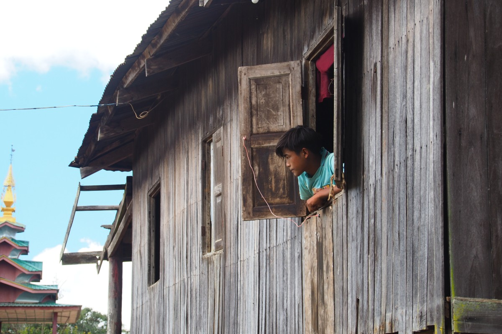

Im Licht der untergehenden Sonne erreichten wir endlich das Kloster, in dem wir die Nacht verbringen würden. Hier kamen mehrere Gruppen zusammen, aber der große Schlafsaal bot genügend Platz für alle. Lediglich bei der „Dusche“ (wiederum ein großer Bottich mit Kelle) war kurz warten angesagt. Hinter den Bettlaken, die als Trennwände des provisorischen Schlafzimmers aufgehängt waren, erschienen um Punkt 18 Uhr eine Reihe kleiner Mönche (ab ungefähr 8 Jahren) für die tägliche Predigt eines älteren Mönchs. Danach waren noch Hausaufgaben angesagt: Mantras lernen. Und schön alle gleichzeitig durcheinander.

Am letzten Tag mussten wir noch ein paar Meter absteigen, bevor wir den See erreichten. Am Ende wartete die Belohnung in Form einer Bootstour über den See zum Endziel _Nyaung Shwe_. Dort wird durch den lokalen Intha-Stamm mit einer ganz besonderen Methode gefischt: Auf einem Bein balancieren sie auf der Spitze des Kanus, das andere Bein um das Ruder gewickelt. So können sie gleichzeitig rudern und das Netz auswerfen. Wenn‘s mal nicht klappt mit dem Gleichgewicht, kann man auch auf Tomaten umsteigen, denn die werden ebenfalls auf dem Wasser angebaut. Wir schauten uns das alles ganz gespannt an, als wir plötzlich von einem Wolkenbruch überrascht wurden. Zum Glück war es der letzte Tag, denn hinterher waren wir bis auf die Unterhose durchgeweicht. Zwar trocknete alles durch die warmen Temperaturen innerhalb einer halben Stunde, aber als wir im Hostel ankamen sprangen wir trotzdem gleich unter die Dusche (eine echte mit Brause und fließendem Wasser).

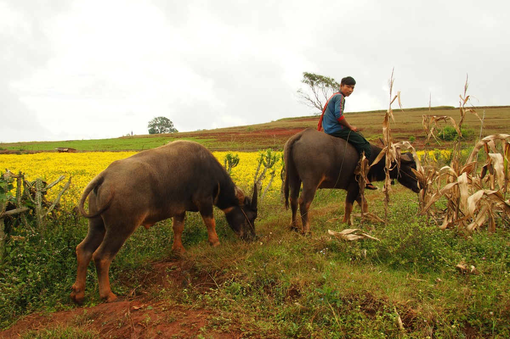

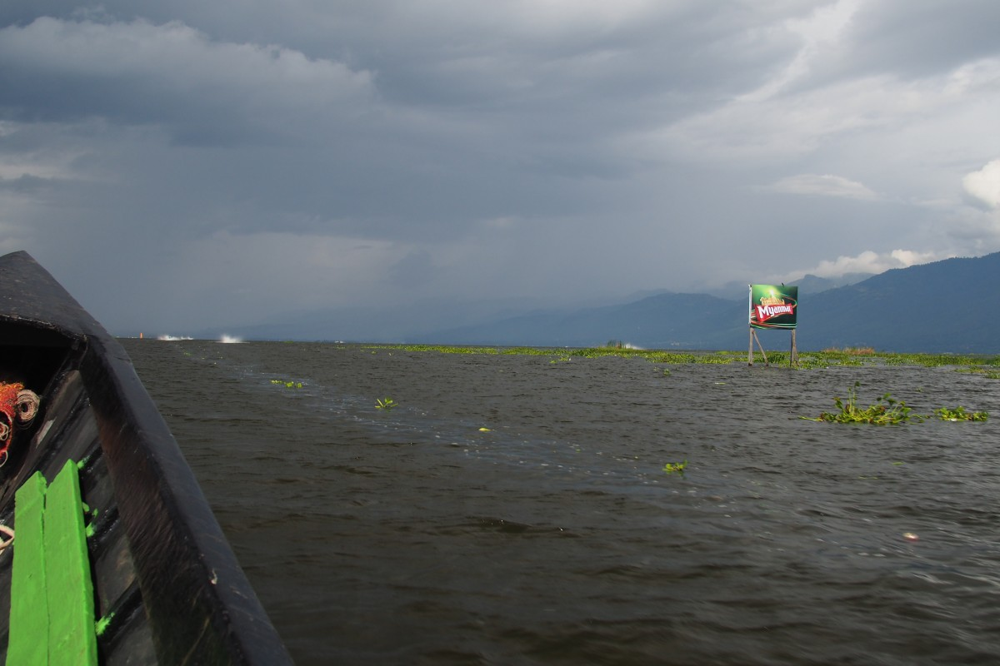

\[caption id="attachment\_3913" align="aligncenter" width="900"\] Stay tuned...\[/caption\]
