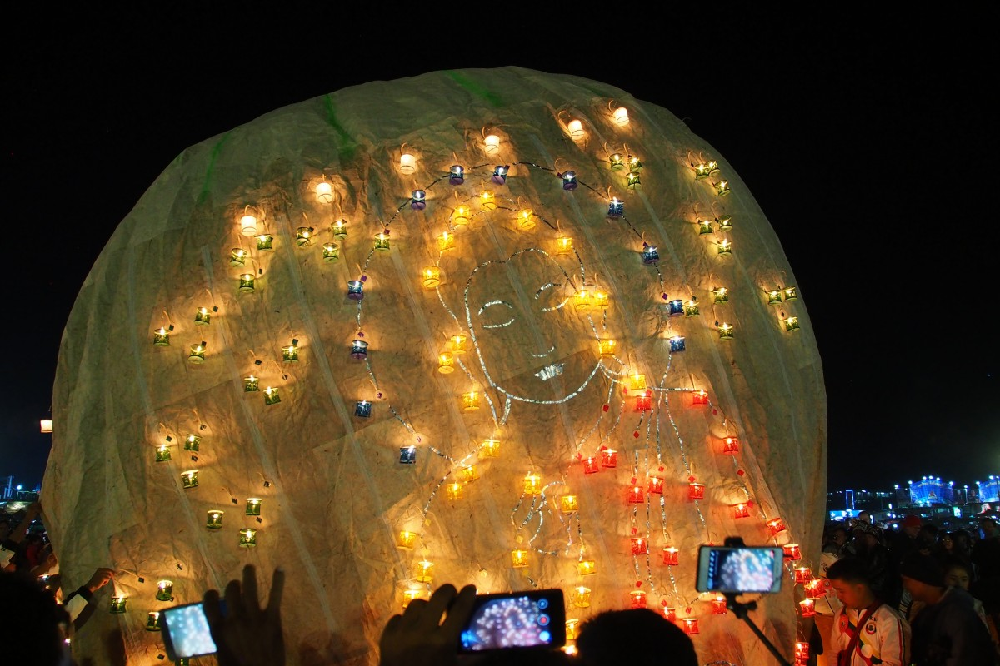
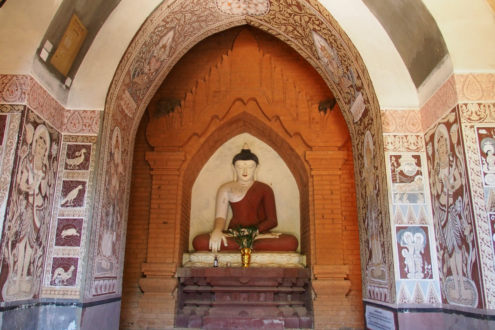
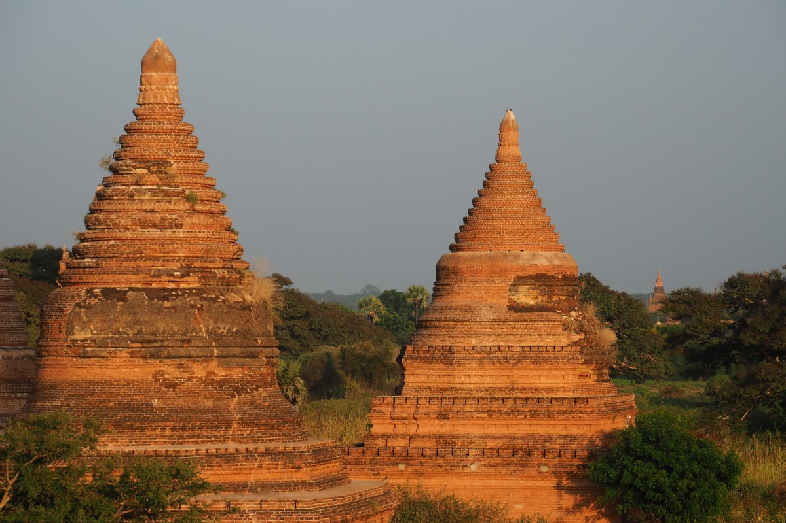
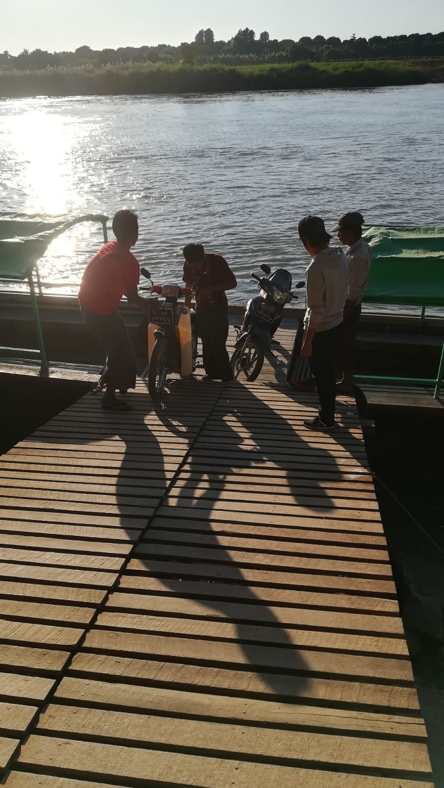
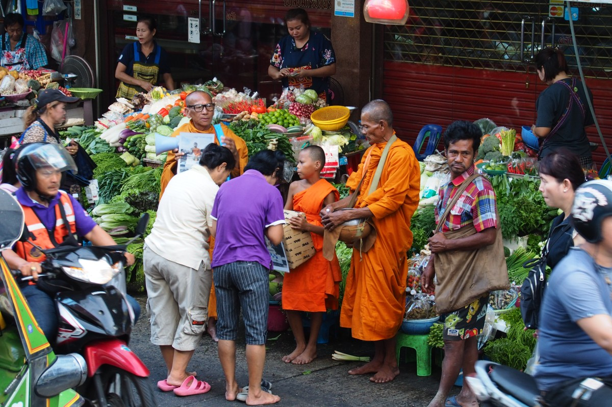
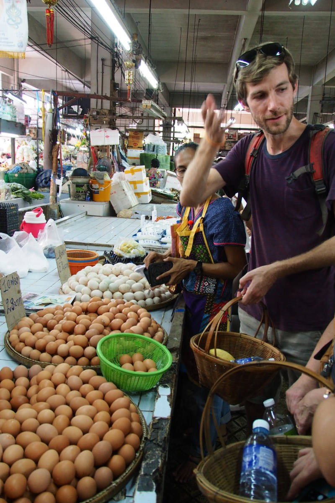

Het was niet helemaal toevallig dat we midden november aankwamen bij het Inlemeer, na de driedaagse trek door het platteland. Van tevoren hadden we namelijk gelezen over het festival van Taunggyi, een van de grootste van Myanmar, waar de Birmezen het einde van het regenseizoen en de terugkeer van het licht vieren. We zagen al voor ons hoe duizenden kleine lampionnetjes met kaarsjes erin allemaal tegelijk de lucht in werden gestuurd. Dat moet wel tof zijn.

Dat was tenminste onze voorstelling van dit festival. Kort gezegd: dat klopte niet. “Heb je dichte schoenen aan, voor het geval je moet wegrennen? Ga altijd uit de windrichting staan zodat de ballon niet over je heen waait”, zo waarschuwden hostelmedewerkers ons toen we de deur uitgingen. Eenmaal onderweg met een groepje gasten en een medewerker werd ons steeds duidelijker hoe de vork eigenlijk in elkaar steekt. Het gaat niet om kleine, schattige lampionnetjes, zoals we die thuis ook kennen van Oud en Nieuw, maar om levensgrote heteluchtballonnen. Tientallen teams verdedigen de eer van hun dorp in de strijd om de mooiste, hoogste of meest spectaculaire ballon. Een deel wordt versierd met honderden theelichtjes die samen een figuur vormen, anderen krijgen een lading vuurwerk onder gehangen (waarbij het altijd de vraag is of dat allemaal goed gaat).

\[caption id="attachment\_3931" align="aligncenter" width="900"\] Ballonverkoper, Taunggyi Festival\[/caption\]

Het ballonterrein waar het zich allemaal – open en bloot, zonder afzettingen – afspeelde, werd omringd door een groot kermisterrein. We sjokten de eerste uren langs stands waar je ouderwets met ballen een paar blikjes omver kon gooien, langs bingotenten (goed om de Birmese getallen te leren) en langs een handgedreven reuzenrad. Dat laatste ging zo: de gasten zaten in een schommelbakje, waarna een paar jongens het reuzenrad omhoog klommen. Daar gingen ze zo aan de balken hangen dat hun gewicht het geheel uiteindelijk aan het draaien bracht. En dat ging zeker niet langzaam. Wij sloegen deze attractie desondanks liever over...

Toen was het tijd voor de eerste ballon. In een kleine optocht met feestelijk geklede dames voorop werd het geval het festivalterrein opgereden. Tientallen jongens en meisjes bouwden, onder leiding van een oudere man die we Obi-Wan doopten, samen de ballon op. De papieren stof werd uit elkaar gevouwen en boven een vuurtje gehangen. De warme lucht blies de ballon langzaam op. Ondertussen waren talrijke handen bezig vliegensvlug honderden, kleurrijke kaarsjes aan te steken om ze, terwijl de ballon groter en groter werd, zo snel mogelijk op te hangen aan de buitenkant van de ballon. Het kostte ze duidelijk moeite ervoor te zorgen dat de ballon zelf geen vlam vatte.

Met elke minuut werd het figuur duidelijker: een boeddha in lotuszit. Toen de ballon bijna de lucht in ging, werd er nog snel een bamboestellage onder gehangen met kaarsjes die samen de naam van het deelnemende groep spelden. Er werd gefloten, gejuicht en geklapt toen het hele geval succesvol opsteeg en langzaam de donkere hemel in dreef.

Ondertussen was de tweede groep in een andere hoek van het terrein alweer begonnen om hun ballon op te bouwen. Het was er een met vuurwerk, getuige een grote stellage met ontelbaar veel vuurwerkpijlen erop. Oké, dit was dus zo’n ballon waar je iets meer afstand van moest houden. Op dezelfde manier als bij de eerste ballon werd ook deze uitgevouwen en langzaam opgeblazen. De stellage vol vuurwerk werd angstvallig weggehouden van de ballon, om te voorkomen dat het vuurwerk te vroeg de lucht in ging. Op het laatste moment werd het eraan gehangen, aangestoken en weggestuurd. Op zo’n twintig meter boven de grond begon het spektakel: klassieke vuurpijlen, vuurwerk dat naar beneden leek te druppelen, en papieren vliegtuigen die rondjes maakten in de lucht voordat ze afgingen.

So far, so good. Maar zoveel vuur, papier en explosieven in Myanmar, dat kan natuurlijk niet goed gaan. Bij een van de ballonnen met kaarsjes brandde er al snel een gat in de ballon, waardoor die geen hoogte kon krijgen. Bijna leek het geval de restaurantjes in te vliegen, maar de verantwoordelijke groep rende er achteraan, greep hem vast en trok hem naar beneden. Op dat moment vatte de hele ballon vlam: woesh. In luttele seconden was het hele ding verdwenen. De parate brandweer rende er met getrokken spuiten op af en bluste het snel. Wij stonden nog op adem te komen van dit ongeluk, terwijl er naast ons al verder werd gefeest rondom de volgende ballon. Bizar!

Tien ballonnen verder leken de statistieken toch aan de betere hand. Nog slechts één andere ballon was als een indrukwekkende vuurbal in een tegenoverliggende heuvel gecrasht. Het was inmiddels half één dus keken we elkaar aan en zeiden: oké, nog eentje dan.

Het was een ballon met vuurwerk. Het duurde en het duurde. De ballon bleek te zwaar, ging de lucht niet in en dus werden er een paar kilo’s vuurwerk afgehaald. Dat herhaalde zich een paar keer tot het toch eindelijk leek op te stijgen. Onze groep had zich tegen die tijd al strategisch opgesteld bij een kleine laadwagen, want dit kon alleen maar mis gaan… En dat deed het ook. Toen de ballon krap drie meter boven de lucht zweefde, ging het vuurwerk in al z’n omvang af. Het vuur spoot alle kanten op, naar boven, naar onderen, naar de zijkant. We doken achter de vrachtwagen en vele Birmezen volgden ons voorbeeld. De mensen in de laadwagen sprongen er snel uit, op de vlucht voor de brandende vlokken die op ons neer vielen. Het duurde al met al misschien een halve minuut, maar het was een van de spannendste momenten van onze reis.

Zoals het de Birmezen betaamt, stond het verantwoordelijke team meteen alweer te joelen en te dansen met hun vlaggen om zoveel spektakel. Wij keken elkaar aan en zeiden: okay, let’s go home.

Deze samenvatting ervaar je beter _met geluid_:

\[video width="720" height="576" mp4="https://collectingbaggage.nl/wp-content/uploads/2019/01/taunggyi\_sd\_android.mp4"\]\[/video\]

### Stilte op het Inlemeer

Een paar dagen later kozen we voor een wat rustigere dagbesteding: een dagtocht over het Inlemeer. ‘s Ochtends vroeg, voor zonsopgang, stapten we in een kleine, lange boot, die ons naar het midden van het meer bracht. Terwijl de zon achter de bergen verscheen, kregen wij ons ontbijt. We smulden van de rijst met samosa’s terwijl de eerste vissers, met hun roeispaan in het ene been, balancerend op de andere, de eerste netten van die dag het water in wierpen. Met onze boot gleden we langs de dagelijkse taferelen op dit bijzondere meer: vrouwen die vanaf hun smalle boot bloemen verkopen om te offeren, meisjes die zich wassen in het water, of een vader met zoontje die vanuit hun huis op palen de voorbijvarende toeristen toezwaaien. We bezochten een tempel met meer dan duizend pagodes, workshops waar ze stoffen van lotuszijde of sieraden van lokaal gewonnen zilver maken, en een drijvende markt vol souvenirs. We sloten de dag af met een wijntje op een terras middenin de wijngaarden (Myanmar maakt dus ook wijn, wie had dat gedacht!).

### Indiana Jones op z’n Birmees

Hierna verlieten we het Inlemeer en trokken richting Bagan. Wat Machu Picchu is voor Peru, of de Piramiden van Gizeh voor Egypte, dat is Bagan voor Myanmar. In en om Bagan staan de overblijfselen van het oude koninkrijk van Bagan. Die Gouden Eeuwen (11e tot 13e eeuw) waren zo gouden dat de heersers steeds meer geld en land belastingvrij aan de kloosters en monniken gaven voor de bouw van tempels en nog meer tempels. Daarbij vergaten ze ergens nog een potje over te houden voor belangrijke infrastructuur en richtten zo het rijk uiteindelijk ten gronde (de kleinzoon van Dzjengis Khan die met zijn Mongolische leger binnenviel, had er ook nog wat mee te doen).

In ieder geval bestaat er geen koninkrijk van Bagan meer, maar van de, naar schatting, ooit 10.000 tempels en pagodes zijn er nog zo’n 2.000 over. Vandaag de dag zijn de ronde daken van de pagodes favoriete plekken om de zon achter de in nevelen gehulde tempels onder te zien gaan en op te zien komen. Omdat veel pagodes over een enorm gebied verdeeld zijn, heb je, in ieder geval in theorie, de kans om eentje daarvan helemaal voor jezelf te hebben. Tenminste, als je ‘s ochtends in het donker op je e-scooter niet volledig in het grote veld verdwaalt.

\[caption id="attachment\_3932" align="aligncenter" width="900"\] Zonsopgang in Bagan\[/caption\]

De dagelijkse zoektocht naar het perfecte plekje voor zonsopgang heeft zich onder backpackers ontwikkeld tot een zeer populaire sport. Op internet vind je talrijke blogs met de ‘meeste geheime’ pagodes van Bagan en op de navigatieapp maps.me kan men door alle markeringen de kaart nauwelijks nog lezen. Maar toegegeven, je voelt je nog steeds een moderne Indiana Jones als je ‘s ochtends vroeg om 4 uur over de zandpaden langs oeroude stenen slingert. In de hoop die ene, tot nu toe onontdekte tempel te vinden. In de werkelijkheid bleek het vrijwel onmogelijk een verlaten tempel te vinden. En eigenlijk maakt dat ook niet uit. Het uitzicht wordt er niet minder om als je die met een paar mensen deelt.

\[caption id="attachment\_3933" align="aligncenter" width="900"\] Maanopkomst in Bagan\[/caption\]

In de vijf dagen dat wij in Bagan waren, stonden we daarom vier keer ‘s ochtends vroeg om 4 uur op, liepen naar de andere kant van de straat om daar voor 4 euro een e-scooter te huren, en stoven geluidloos weg naar de verschillende pagodes. Een paar keer sloten we ons bij een groep van ons hostel aan, maar meestal probeerden we het op eigen houtje. En elke morgen vonden we weer een heerlijke plekje om de zon en de heteluchtballonnen te aanschouwen.

\[caption id="attachment\_3934" align="aligncenter" width="900"\] Heteluchtballonnen in Bagan\[/caption\]

Oh ja, de heteluchtballonnen spelen hier ook weer een belangrijke rol. Kort voor zonsopgang gaan er hier namelijk 21 (ja, we hebben geteld) heteluchtballonnen de lucht in en zweven met goedbetalende toeristen heel sereen over de tempeldaken. Het zicht van boven schijnt net zo adembenemend te zijn als dat van onderen waar het genieten is van de combinatie van mistige velden, tempels, ballonnen en de rijzende zon.

Ongeveer zo ziet dat er uit:

\[video width="640" height="360" mp4="https://collectingbaggage.nl/wp-content/uploads/2019/01/bagan\_balloons\_sd.mp4"\]\[/video\]

Terug in het hostel was er dan ontbijt en deden we yoga op het dakterras. Om ons weer een beetje te rekken en te strekken voelde aan de ene kant erg goed, aan de andere kant bezorgde de spierpijn ons een slecht geweten. Voor de reis hadden we ons nog zo voorgenomen regelmatig te sporten, om op z’n minst af en toe te hardlopen. Dat is Malte welgeteld één keer gelukt, bij Freke twee keer. Tja, dat wreekte zich nu.

Na een klein dutje brachten we de rest van de dag door met het bekijken van de tempels bij daglicht. De laatste jaren zijn veel van de grotere tempelcomplexen gerestaureerd, zodat je een beetje een indruk krijgt hoe het er vroeger uit heeft gezien. Interessant genoeg nemen de Birmezen het niet zo nauw wat betreft restaureren naar originele staat. Kapotte muren worden hersteld, maar hier en daar zetten ze er gerust een nieuw ornament of nog een paar extra torentjes bij. Tenslotte zijn tempels in Myanmar geen museumstukken maar levendige, religieuze plaatsen. Mensen komen er om te bidden en niet om zich in het verleden te verliezen. Een pietepeuterige monumentenwacht zou hier nog iets van kunnen leren.

‘s Avonds herhaalde het hele schouwspel van de ochtend zich weer, maar dan in omgekeerde volgorde. Met de e-scooter door de velden sjezen, van de zonsondergang genieten (‘s avonds zonder ballonnen) en aansluitend de weg in het donker terugvinden. Dan weer naar het dakterras en met een paar koele biertjes en goed gezelschap de avond tot een goed einde brengen. Geen slecht leven. Hadden we de tijd gehad, dan had het nog wekenlang zo door kunnen gaan.

### Bruggen slaan

Maar we wilden nog een paar andere hoeken van Myanmar zien. Na de twee toeristische hoogtepunten, Inlemeer en Bagan, hadden we zin in wat minder gebaande paden. We besloten Mandalay vooralsnog links te laten liggen en direct verder de bergen in te trekken. We stopten eerst in Pyin Oo Lwin, dat net als de Cameron Highlands in Maleisië ([weten jullie nog?](https://collectingbaggage.nl/2018/10/met-seniorenkorting-door-maleisie/)) een retraite was voor de welgestelde elite. Op ongeveer 1000 meter hoogte is de warmte er beduidend beter uit te houden als in de plakkerige steden op de laagvlaktes.

Pyin Oo Lwin is ook mooi groen, met veel bomen, kloven en watervallen. Bij een van die watervallen troffen we een familie – zij uit Nederland, hij uit Myanmar – met twee kinderen. De avond ervoor hadden we ze al in het restaurant gezien en daarom kwamen we snel in gesprek. Ze stonden op het punt in het zuiden van Myanmar een restaurant te openen, aan de ene kant om op een duurzame manier toerisme te trekken naar een regio die tot nu toe weinig profiteert van het toerisme, en aan de andere kant om hun familie uit Myanmar een kans te bieden te leren en te werken. Freke vond het zo’n mooi verhaal dat ze er, terug in Nederland, een [krantenartikel](https://www.gelderlander.nl/s-hertogenbosch/bosch-gezin-is-met-restaurant-het-toerisme-voor-in-myanmar~adf0ce2e/) over geschreven heeft.

Ten noorden van Pyin Oo Lwin ligt Hsipaw, wederom een wandelgebied met hoge aantrekkingskracht op reizigers, en beiden plaatsen zijn via rails met elkaar verbonden. Ideale voorwaarden voor een treinreis dus. De route geldt als een van de mooiste in Zuidoost-Azië, beroemd gemaakt door Paul Theroux in zijn The Great Railway Bazaar, en voert over diepe kloven, langs gele koolzaadvelden en door schattige dorpjes waar de wegen nog met handmatige slagbomen worden afgesloten en de trein met een groene vlag verteld wordt dat ze veilig kan doorrijden. Een van de hoogtepunten is het Goteik-viaduct, bijna 700 meter lang, dat al sinds 1900 een 100 meter diepe kloof overbrugt. “A monster of silver geometry in all the ragged rock and jungle, its presence was bizarre”, zo omschreef Theroux de brug. Nou, daar slaat hij de spijker op z’n kop. Best spannend om daar overheen te puffen (stapvoets, dat wel; sneller vertrouwen zelfs Birmezen het niet).

Wij bleven echter niet zitten tot Hsipaw, want we hadden geen tijd meer om te wandelen. We stapten een uur eerder uit, in een klein stadje genaamd Kyaukme. Als enigen. We wilden ons buiten de platgestampte paden wagen en zo was het precies. We vonden snel een onderkomen voor de nacht. De eigenaar en zijn zonen waren duidelijk erg blij dat er weer iemand voorbijkwam. Dat we toch liever de goedkope kamer hadden, en niet de aangeboden ‘honeymoon-suite’, accepteerden ze ook nog graag. We vroegen of we ergens een scooter konden huren voor de rest van de dag, maar dat verzoek kwam nog onverwachter dan dat ze überhaupt gasten kregen. Na een paar telefoontjes was er echter eentje gevonden en dus ging ons plan voor een rondje door de omliggende dorpen toch nog door.

We kregen een paar tips waar we naartoe konden en waar we in het dorp benzine konden vinden. Nou ja, dat laatste bleek al snel makkelijker gezegd dan gedaan. Op de een of andere manier kon niemand zich herinneren waar ze zelf altijd tanken. We reden een aantal keer tevergeefs door het dorp tot we uiteindelijk besloten het bij de uitvalswegen te proberen. Toen we daar ook niets leken te vinden, stopten we voor een huis om het nogmaals te vragen.

Dat bleek toevalligerwijs een ‘tankstation’. Het verblufte meisje schepte uit een emmer in de hoek een liter gele vloeistof en gooide dat door een trechter in onze scooter. Zo gaat dat dus! Op de weg naar buiten kwamen we vervolgens nog minstens vijf andere tankstationnetjes tegen…

\[caption id="attachment\_3935" align="aligncenter" width="900"\] Kyauk Me\[/caption\]

### En dan nu met z’n allen: “Ommmm”

We wilden een stuk door de bergen rijden waar je mooie uitzichten kon vinden. Maar zo ver kwamen we niet. Al in het volgende dorp had zich een groep mensen verzameld. Hier leek wat aan de hand. Een paar mensen met traditionele muziekinstrumenten begeleidden de dans van twee bonte figuren (een geitenbok, een stier? We wisten het niet precies). We stopten kort om het wat beter te kunnen bekijken. Andere toeschouwers kwamen al snel op ons toegerend, om ons waterflessen, rijst in plastic zakjes en allerhande zoetigheden in de hand te drukken. Huh? Oké…

We reden verder. Ver kwamen we wederom niet. Aan de voet van de berg herhaalde zich dit schouwspel. Een groep van zo’n dertig personen, twee dansende geitenbokken en een paar trommels stonden aan weerszijden van de smalle straat. We stopten weer en kregen weer hartelijk waterflesjes, rijstzakjes en drinkyoghurts toegestopt. Wat is hier nou aan de hand??? We konden er niet naar vragen; niemand sprak Engels. Nou ja, als het zo doorgaat, hoeven we ons over het avondeten geen zorgen te maken. We dronken onze yoghurt en bekeken de verklede geiten. Helemaal gehypnotiseerd door de eentonige muziek en de geitendans merkten we de vrouw met haar dochtertje bijna niet op. Hoppa, daar hadden we opeens een klein meisje in onze armen en werden we snel op de foto gezet.

Door alle haltes onderweg was het veel later geworden en de zon ging al langzaam onder. We reden nog een paar kilometer door de bergen, maar van een uitzichtpunt ontbrak ieder spoor. In de schaduw van de bergen werd het bovendien fris en toen onze scooter het ook nog bijna leek te begeven, draaiden we maar om. Glimlachend en zwaaiend kwamen we nogmaals aan de laatste groep voorbij, reden door langs kleine groepjes mensen die met vlaggetjes langs de weg aan het wachten waren op… Tja, op wie? Op de plek waar we de eerste dansende bok gezien hadden, voor de deur van het klooster, hadden zich inmiddels drommen mensen verzameld. Nieuwsgierig mengden we ons tussen de mensen. Wij – blank, blond en lang – vielen natuurlijk nogal op. Het duurde niet lang voordat we nog meer eten en drinken aangereikt kregen. We hadden al snel door dat ze een belangrijk persoon verwachtten. Spannend, misschien komt de Dalai Lama wel voorbij?

De Dalai Lama was het niet, maar deze monnik kreeg wel een vergelijkbare ontvangst. Toen de dikke SUV’s naderden, viel iedereen zonder uitzondering op de knieën. Wij werden vriendelijk doch dwingend aangegeven hetzelfde te doen. Oei, dat voelt wel bijzonder. Collectieve gehoorzaamheid is niet zo ons ding. Maar goed, het duurde daarna nog even voordat de monnik zich ook op het podium liet zien. Hij begon meteen zijn mantra's voor te lezen. Na bepaalde passages stemde het publiek in koor in: ommm. Kippenvel. Af en toe viel het geluid van de monnik weg, als hij, meer geïnteresseerd in de mensen naast hem, zich afkeerde van de microfoon. Het enorme publiek voor z’n neus leek hem niet zoveel te doen. Wij verstonden hem toch niet; wie weet zei hij allemaal hele belangrijke dingen. Wij stonden daarom na een paar minuten maar weer op en vertrokken.

(Dit ervaar je beter met geluid!)

\[video width="720" height="576" mp4="https://collectingbaggage.nl/wp-content/uploads/2019/01/kyaukme\_sd\_android.mp4"\]\[/video\]

### Mandalay

Al vroeg de volgende ochtend stonden we voor het kleine bureau van de busmaatschappij waarmee we naar Mandalay zouden rijden. Het was nog donker en – uiteraard – waren we de enige buitenlanders. We waren bijna een jaar onderweg en hadden intussen al enige kilometers in de bus doorgebracht – comfortabel en wat minder comfortabel – maar na deze rit waren we blij dat het onze laatste was. Deze keer kwam alles samen. ‘s Ochtends vroeg in de bergen was het sowieso nog koud, maar de airconditioning draaide desalniettemin op volle toeren. Een vrouw naast ons vond het nog niet koud genoeg en zette ook nog een raam open. De ijzige wind waaide ons om de neus, terwijl op de televisie de beste boeddhistische mantra's voorbijkwamen – in een eindeloze loop. Deze sfeer vol bezinning werd alleen onderbroken door kotsende geluiden van medereizigers die het slachtoffer werden van de slangenbochten. Terwijl wij ons in onze warme hammamdoeken wikkelden, herhaalden wij ons eigen mantra: ‘alleen deze rit nog, alléén deze rit nog…” Ommm.

De laatste dagen in Myanmar brachten wij door in Mandalay. Na vier weken in het land waren we een beetje ‘uitgetempeld’, dus vielen we niet meer van onze stoel van de meeste pagodes rondom Mandalay. Uitgezonderd één tempel die eigenlijk middenin de stad ligt, maar desondanks weinig bezocht wordt. Het hoofdgebouw is volledig van teakhout gemaakt en gedecoreerd met indrukwekkend, gedetailleerd houtsnijwerk. Hier troffen wij ook de oude dame met wie wij, zonder een echt woord te wisselen, een gesprek hadden, zoals we in het [vorige blog](https://collectingbaggage.nl/2018/12/kusjes-uit-myanmar/) vertelden.

Daarnaast bezochten we een van Myanmars antieke hoofdsteden, gelegen op een soort schiereiland waar je met de boot naartoe moest. Men verzekerde ons dat we onze scooter mee mochten nemen; we waren blij dat we die niet zelf op het kleine, wankelende bootje manoeuvreren moesten.

Met tranen in de ogen verlieten we uiteindelijk Myanmar. We hadden ons visum tot op de laatste dag gebruikt, wat de douanebeambte ons bij vertrek ook met een knipoog mededeelde. En we hebben hier van elke dag genoten. We zijn blij dat we Myanmar voor het einde bewaard hebben, maar we maken ons ook een beetje zorgen dat we het voor de andere landen in Zuidoost-Azië nu verpest hebben. Die moeten zich voortaan aan Myanmar meten. Een zware tegenstander…

### Bangkok

Voor de lange terugvlucht naar Europa hadden we nog een korte trip naar Bangkok voor de boeg, maar we merkten aan onszelf dat de koek inmiddels wel een beetje op was. We hadden vooral weinig zin in de toeristische drukte van de metropool en dus besloten we een fietstocht te maken door de smalle straatjes en langs de vele kanalen van Bangkok. De middag voor vertrek volgden we nog een kookcursus, waar we een paar lekkere Thaise gerechten mochten wokken. Een genot en een mooie afsluiting van onze laatste dagen van de wereldreis.

En toen was de tijd plotseling op. Laat in de avond gingen we op weg naar het vliegveld, waar onze vlucht pas om 2 uur ‘s nachts zou vertrekken. Ergens was het moeilijk te begrijpen dat we terug naar Nederland vlogen. We keken uit naar huis, naar familie en vrienden, naar de kerstdagen en naar onze tour door Duitsland. We keken niet zo uit naar de temperaturen rondom het vriespunt en de motregen.

Maar na de superontvangst op Schiphol waren we alle bezwaren ook snel vergeten…

